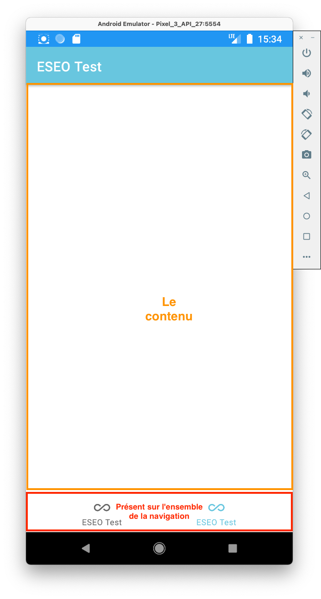

# Android : Les bases 2

Par [Valentin Brosseau](https://github.com/c4software) / [Playmoweb](https://www.playmoweb.com)

---

## Les animations

---

Intégré dans Android / Android Studio

---

<iframe src="https://giphy.com/embed/S1Ap7GTcjToZy" width="480" height="480" frameBorder="0" class="giphy-embed" allowFullScreen></iframe>

---

### 4 façons de faire

- Les animations automatiques `animationLayoutChange`.
- Les Gifs.
- Lottie
- Les « transitions programmées ».
- Les Motion Layout

---

### Les animations automatiques

- Très simple ! C'est un argument à ajouter dans votre layout.
- Simpliste, simple transition.

---

### Les GIF

- Simple (en utilisant [GifView](https://github.com/Cutta/GifView))
- Attention au poids…
- Mauvaise qualité…

---

### Lottie

- Qualitatif [Lottiefiles](https://lottiefiles.com/).
- Simple (en utilisant [AirBnBLottie](http://airbnb.io/lottie/#/)).
- Moderne.

### Les transitions programmées

- Animation d'un point A -> B.
- Piloté par le code
- Maintenance difficile ?

```kotlin
votreImageId.animate().translationYBy(450F).setDuration(1500).start();
```

---

### Les Motion Layout

- Similaire aux « transitions programmées »
- Intégré dans Android Studio
- « Complexe » / « Habitude à prendre » / Concept d'animations
- Qualitatifs
- [Documentation](https://developer.android.com/training/constraint-layout/motionlayout/examples)

---

### Comment choisir?

Et bien ça dépend…

---

## Étendre Kotlin

---

### Ajouter des méthodes dans des objets existants

---

- [Simplifie le partage de code](http://kotlinextensions.com/)
- Simplifie la lecture

---

### On test ?

---

## Les fragments

Découper vos vues

---

L'objectif :

- Découper votre vue en élément réutilisable.
- Exemple « Bottom Bar Navigation »

---

- Une activité racine « contient les fragments »
- N fragments en fonctions des cas.

---



---

### Avantages

- Découpage
- Réutilisation

---

### Inconvénient

- Complexité (relative)

---

## « Nécessite » une Lib

```gradle
    implementation "androidx.fragment:fragment-ktx:1.2.5"
    implementation "androidx.navigation:navigation-fragment-ktx:2.3.2"
    implementation "androidx.navigation:navigation-ui-ktx:2.3.2"
```

<small>En réalité pas vraiment… mais parlons en !</small>

---

## La théorie

```kotlin
supportFragmentManager.commit {
    replace(R.id.frame, fragment)
}
```

---

## Easy Peasy 👌

<iframe src="https://giphy.com/embed/wcW0qeayf7bfW" width="480" height="480" frameBorder="0" class="giphy-embed" allowFullScreen></iframe>

---

C'est là où l'organisation sera importante 🚀

---

- Une `activity` « racine ».
- Des fragments (autant que de tabs par exemple).

---

### La théorie « À la main »

#### Gestion à l'ancienne

---

[Quelques fichiers](https://gist.github.com/c4software/aebb8f467c229e186d88a04b13a3f406)

- Gestion manuelle
- Back stack difficile
- Pas visuel

---

Comment ça fonctionne ?

- Les menus sont déclarés dans `bottom_navigation_menu.xml`.
- Lors du click, on charge le bon fragment (préalablement déclaré).

---

## Voilà à quoi ça va ressembler


---

## On test ! C'est parti 🚀

---

## Android JetPack pour nous sauver

---

## Navigation Components

Nouveau 🚀 − [Documentation officielle](https://developer.android.com/guide/navigation/navigation-getting-started)

---

### La version « moderne » / Navigation Graph

---

[Quelques fichiers](https://gist.github.com/c4software/6eb4bfca2d82bc04962b0818f676d8df)

- Gestion via des XML
- Back stack fonctionnel
- Visuel

---


---

Ça fonctionne comment ? (pas de magie)

- Les menus sont déclarés dans `bottom_navigation_menu.xml`.
- On déclare notre graph de navigation `mobile_navigation.xml` (ensemble des pages accessibles, **id correspondant au menu**)
- On attache la navigation au `NavHostFragment`:

```kotlin
    val navHostFragment = supportFragmentManager.findFragmentById(R.id.nav_host_fragment) as NavHostFragment?
    NavigationUI.setupWithNavController(bottom_navigation, navHostFragment!!.navController)
```

---

## On pratique…

### Oui c'est « compliqué » je sais…

---

## JetPack Compose

Dans un avenir proche

---

<video autoplay controls loop class="block">
    <source src="https://developer.android.com/jetpack/videos/jetpack-compose-preview.mp4" type="video/mp4">
</video>

---

Actuellement en Alpha

---

[LES APPELS RÉSEAU](/cours/android_http.html)

---

## Le MVVM

---


---

## Le Boilerplate

---

## SharedPreferences ?

[Sauvegarder des données entre chaque lancement](/tp/android/android-base2-tp.html#la-classe-localpreferences)
