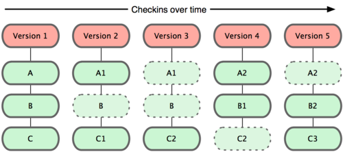
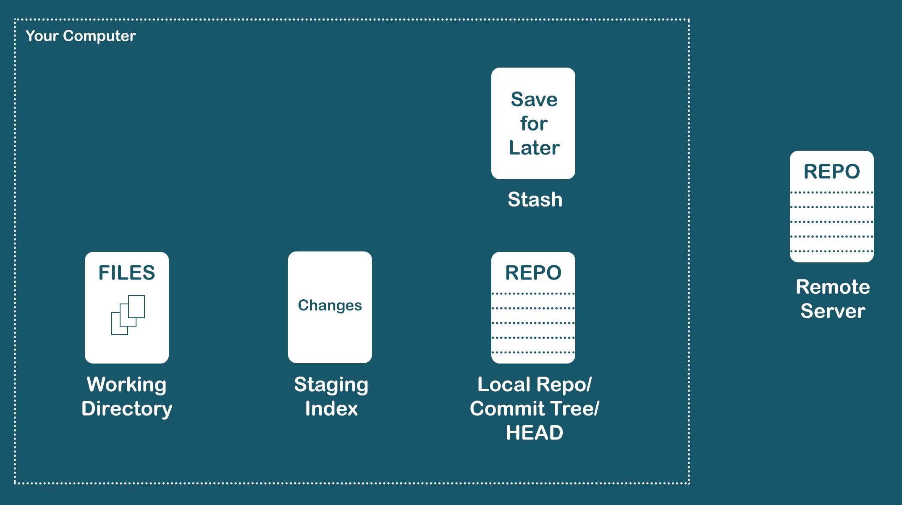
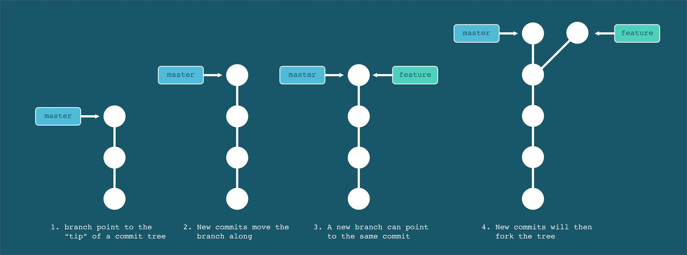
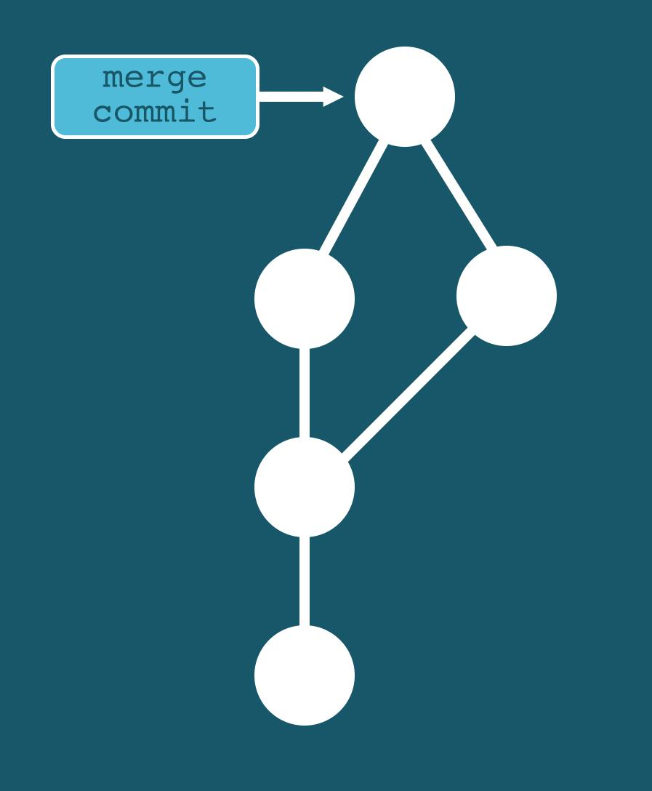
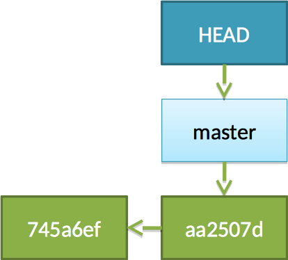
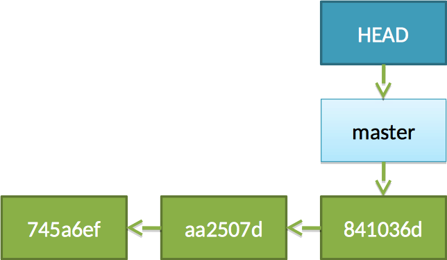
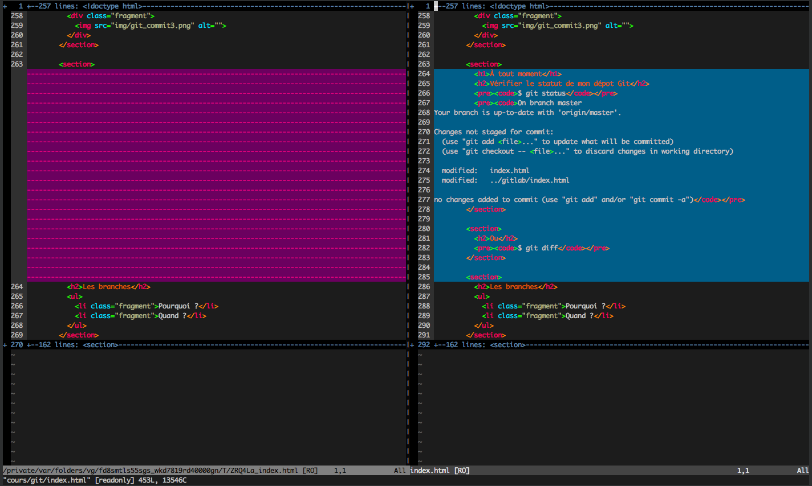
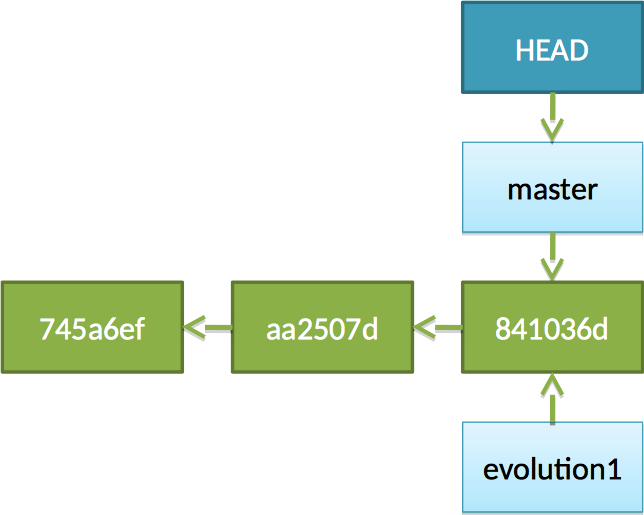
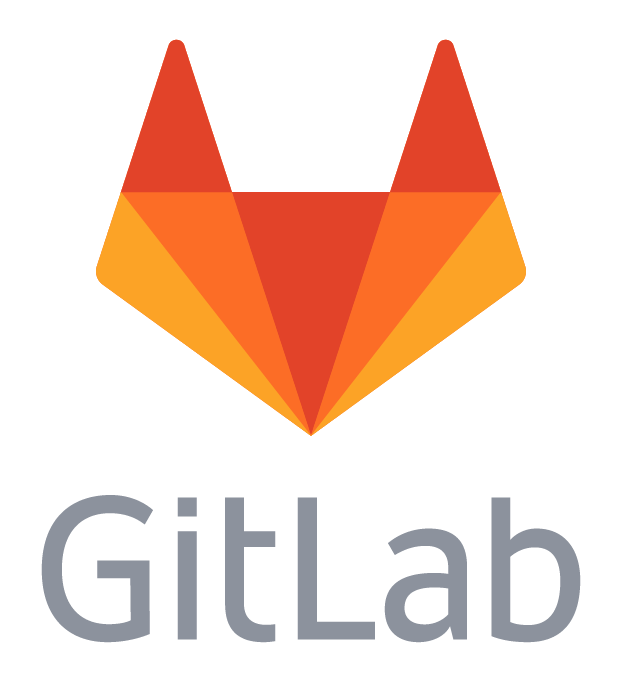

# Git

## Introduction à GIT / Gestionnaire de version

Par [Valentin Brosseau](https://github.com/c4software) / [@c4software](http://twitter.com/c4software)

---

## Pour vous qu'est-ce qu'un gestionnaire de version ?

---

## Quand utiliser un gestionnaire de version ?

- À votre avis ?

---

## Dès que l'on code !

---

## Définition

Un logiciel de gestion de versions ou VCS (Version Control System) est un logiciel qui permet de stocker un ensemble de fichiers en conservant la chronologie de toutes les modifications qui ont été effectuées dessus.

Un logiciel de gestion de versions agit sur une arborescence de fichiers afin de conserver toutes les versions des fichiers.

---

## Git en quelques mots

GIT est développé par Linus Torvalds (créateur du noyau Linux) depuis 2005.

C’est un **SCM** (Source Code Management), un gestionnaire de versions de fichiers comme CVS ou SVN à la différence prêt qu’il est décentralisé.

Les dépôts GIT d’un projet sont donc «distribués» (aucun dépôt n’est prioritaire sur les autres).

---

## Un peu d'histoire…

### Noyau Linux

- 150Mo de source
- Des milliers de développeurs
- Stable

---

## Maintenu pendant des années par des patchs…

## … par emails


---


---

- Linux Torvald utilise BitKeeper
- BitKeeper devient payant
- Il programme/code donc le sien

---

## GIT

### (2005, récent donc)

---

## Historique (avant GIT)

- FTP (à votre avis?)
- Index1, Index2, … (À votre avis?)
- Email (à votre avis?)
- CVS
- SVN
- Git

---

## Les points clés de Git

- Distribué.
- Rapide (différences entre les versions).
- Très très fiable (Hash SHA).
- Ligne de commande très évoluée.
- Est capable de gérer des projets de toutes tailles.

---


---

## RAPIDE


---

## Pourquoi

### Le principe des snapshots / et des diffs



---

## Connaissez-vous d'autres systèmes utilisant le même principe ?

- Quels sont les autres avantages de fonctionner avec des « diffs »?

---

## Les points clés

- Traçabilité
- La gestion des branches
- La fusion de code efficace (Merge)
- Rapidité
- La ligne de commande
- Réécriture de l'histoire impossible

---

### Avant de commencer

### Terminologie

---

### Repository

Vos sources + un dossier « caché » le « .git ».

Le .git, est le dossier qui contient **l'historique de votre projet.** (et plus encore)

---

### Diff (ou patch)

Différences entre 2 versions d'un fichier.

---

### Commiter

Action d'enregistrer les modifications d'un ou des fichiers. Création d'une version.

### Commit

Le résultat d'une action de commit, représenté par un hash SHA-1.

---

### Branche

Une lignée de développement. Par défaut tout le développement se fait dans la branche nommée « master ».

---

### tag

Un identifiant symbolique pour un commit.

« C'est une étiquette ou un raccourci vers une version »

---



---


---

## Les branches



---

## Le Merge



---

## Quelques chiffres

Nombre de commits par semaine chez Facebook ?

- ~10 000

---

## Exemple

### Vous allez voir c'est simple…

(Enfin presque…, mais c'est puissant !)


---

## Qui suis-je ?

```sh
$ git config --global user.name "Valentin Brosseau"
```

```sh
$ git config --global user.email "c4software@gmail.com"
```

---

## Initialisation

```sh
$ cd mon_projet
$ git init
```

Création d'un nouveau « repository » **vide**.

---

## Premier commit

```sh
$ vim mon_fichier.js
$ git add mon_fichier.js
```

---

## Premier commit

```sh
$ git commit -m "Mon premier commit"

[master 745a6ef] Mon premier commit
 1 files changed, 1 insertions(+), 0 deletions(-)
 create mode 100644 mon_fichier.js
```


---

## Voilà !


---

## Que mettre dans le commentaire de commit ?

- Le numéro de ticket
- Le nom de la fonctionnalité

---

## Des conventions existent :

- [Conventional Commits](https://www.conventionalcommits.org/fr/v1.0.0/)
- [Gitmoji](https://gitmoji.dev/)

---

## Exemples de commits

```sh
$ git commit -m "feat: Ajout de la fonctionnalité de connexion"
$ git commit -m "fix: Correction du bug de connexion"
$ git commit -m "docs: Ajout de la documentation"
```

---

```sh
$ git add fichier1.js fichier2.js
```

```sh
$ git commit -m "Mon 2nd commit"
```

```sh
[master aa2507d] Mon 2nd commit
 2 files changed, 2 insertions(+), 0 deletions(-)
 create mode 100644 fichier1.js
 create mode 100644 fichier2.js
```



---

```sh
$ vim fichier.js
```

```sh
$ git commit -am "Changement dans le fichier"
```

```sh
[master 841036d] Changement dans le fichier
 1 files changed, 28 insertions(+), 0 deletions(-)
```



---

## À tout moment

### Vérifier le statut de mon dépôt Git

```sh
$ git status

On branch master
Your branch is up-to-date with 'origin/master'.

Changes not staged for commit:
  (use "git add <file>..." to update what will be committed)
  (use "git checkout -- <file>..." to discard changes in working directory)

  modified:   index.html
  modified:   ../gitlab/index.html

no changes added to commit (use "git add" and/or "git commit -a")
```

---

## Via un Diff

Afficher les changements dans votre dépôt.

```sh
$ git config --global diff.tool vimdiff
$ git difftool
```



---

## Figer une version

```sh
git tag V1.0
```

---

## Est-ce que tout doit être commité ?

- Oui
- Non ?
- La réponse D ?

---

## Non bien évidemment

Filtrer les données sensibles (ou inutiles)

- Les mots de passe
- Les fichiers générés
- …

---

## Le .gitignore

```sh
$ cat .gitignore

lib.so
conf/
*.yml
.pyc
```

[Générer un gitignore](http://gitignore.io)

---

## Les branches

- Pourquoi ?
- Quand ?

---

## Les branches

```sh
$ git branch evolution1
```



---


---

```bash
$ git checkout evolution1
Switched to branch 'evolution1'
```


---

```sh
$ vim fichier2.js
```

```sh
$ git commit -am "Ajout de l’évolution"
```

```sh
[evolution1 54d9dde] Ajout de l’évolution
 1 files changed, 208 insertions(+), 10 deletions(-)
```


---

## À votre avis que faut-il faire maintenant ?

---

### « Merger » les branches

```sh
$ git checkout master
```

```sh
$ git merge evolution1
```

---

## Que vient-il de se passer ?

- Qui fusionne le code ?
- Fusion du code ?
- Conflit ?
- Et la branche ? On la coupe ?

---


---

## Suppression de la branche

```sh
$ git branch -d evolution1
```

---

## Allez plus loin

- Voir l'historique.
- « Tagger » une version.
- « Signer » un commit.

---

## J'ai un BUG en prod !

---

## Aucun souci !

- Les branches
- Git Stash

---

## Les différentes façons d’utiliser Git

- Individuel/localement
- Individuel avec un dépôt de référence
- Collectif : Avec dépôt de référence
- Collectif : Avec dépôt de référence et Manager(s) d’intégration(s)
- Collectif : Avec dépôt de référence et Propriétaire(s) du dépôt (GitLab, Github, …)

---

## En résumé

---


---

## La zone de staging

Afficher le statut

```sh
$ git status
```

Ajout en staging

```sh
$ git add monFichier
```

Suppression de la zone de staging

```sh
$ git rm --cached
# or
$ git checkout --
```

---

## En résumé : Le statut des fichiers

### La routine Git


---

## La gestion du code inutile

### Comment procédez-vous ?

- Je le commente ?
- J'ajoute un « return false »
- Je le supprime il est dans Git…

---

## Je le supprime il est dans Git

---

## Ok la ligne de commande c'est bien, mais…

- [VSCode](https://code.visualstudio.com/docs/sourcecontrol/overview)
- [SourceTree](https://www.sourcetreeapp.com/)
- [GitKraken](https://www.gitkraken.com/)
- [Fork](https://git-fork.com/)

---

## C'est bien, mais moi je ne suis pas seul

---

## Et donc à plusieurs ?

---

## Pas de protocol « git »

- file://
- http(s)://
- ssh://
- rsync://
- …
- Bittorent

---

### Git à plusieurs

- GitLab
- GitHub
- Gogs

---


