# Introduction CSS

Par [Valentin Brosseau](https://github.com/c4software) / [@c4software](http://twitter.com/c4software)

---

## Séparer le fond et la forme avec HTML et CSS

---

## La CSS

Décris la présentation de vos pages Internet

---

## CSS signifie

- **`C`** => Cascading
- **`S`** => Style
- **`S`** => Sheet

---

_En français :_ Une feuille de style

---

- CSS1 1996
- CSS2 1998 (amélioration de CSS1)
- CSS3 la version courant (amélioration et fonction type bord arrondi, animation, etc.)

---

CSS a donc été développé par « niveaux ».

---

## Sur un principe de version

CSS1 est développé pour être un sous-ensemble de CSS2, qui est lui-même développé pour être un sous-ensemble de CSS3.

---

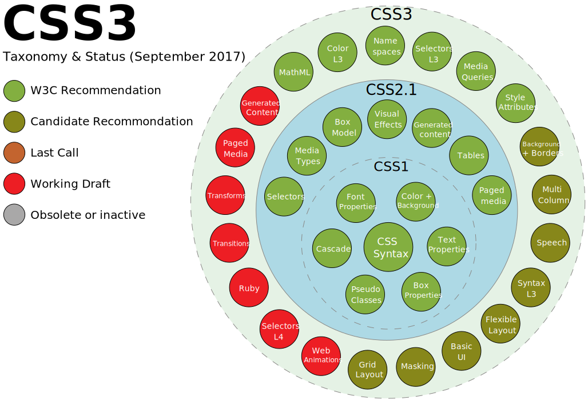

---

## Oui… et concrètement ? 🤔

## Plus le navigateur est ancien…

# moins ils ne connaissent de propriétés CSS

---

## ✋

Nous devons donc vérifier le support.

[Can I Use](https://www.caniuse.com/)

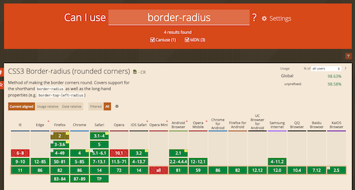

---

## Le fonctionnement des « Rules CSS »

### 2 parties

- Le sélecteur : L'élément à viser « `table`, `div`, `#id`, `.class` ».
- La déclaration : Le style en lui-même. Écrit sous la forme de `propriété: valeur`.

---

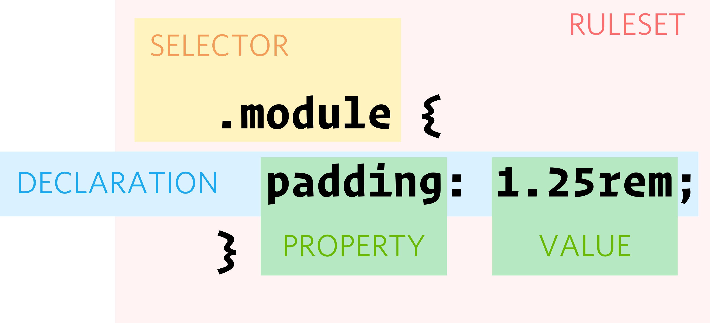

---

## Un exemple

Comment le lire ?

<div class="colContainer">
    <div class="col">
        <iframe src='/demo/css/index.html'></iframe>
    </div>
    <div class="col">
        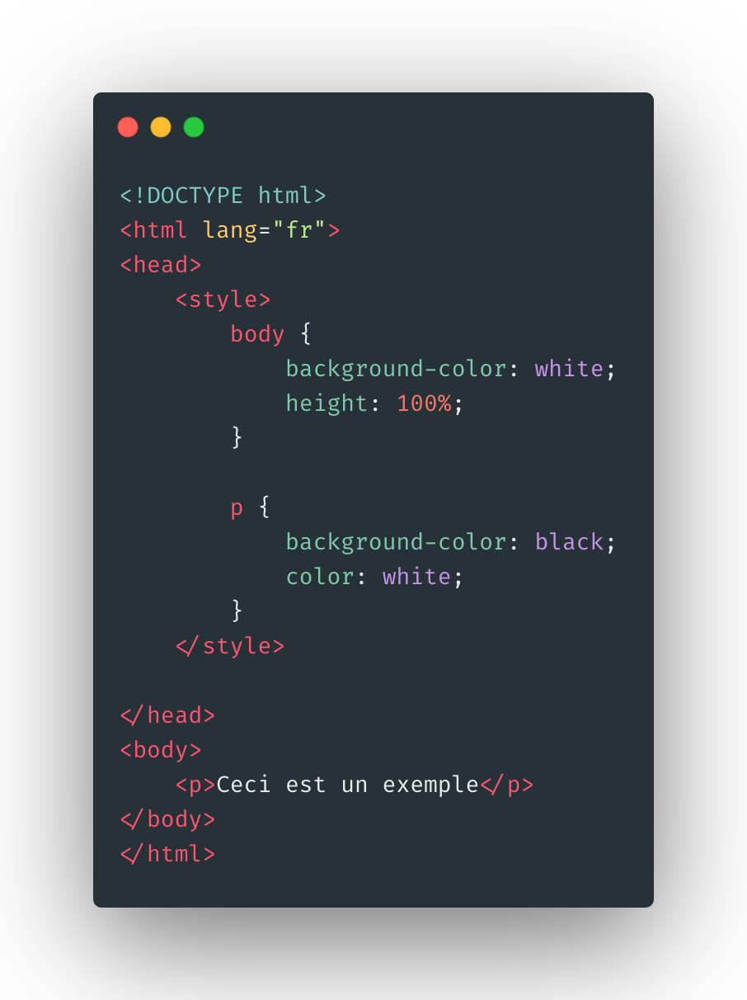
    </div>
</div>

---

## Les sélecteurs

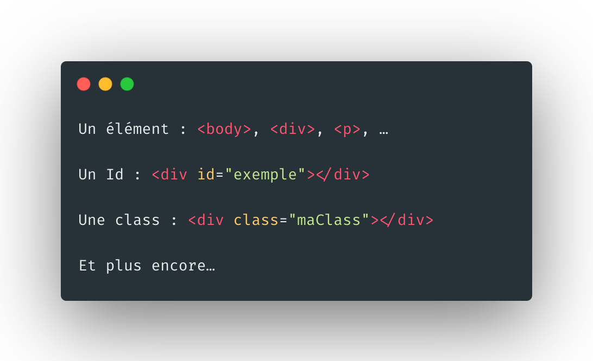

---

## Les sélecteurs

```html
<p>Exemple <i>suite…</i> !</p>

<style>
  p {
    font-weight: bold;
  }

  p > i {
    color: red;
  }
</style>
```

---

## Les sélecteurs

```html
<h1>Titre</h1>
<p>Exemple <i>suite…</i> !</p>

<style>
  p,
  h1 {
    color: red;
  }
</style>
```

---

## Les sélecteurs

```html
<p id="contenu">Exemple <span class="suite">suite…</span> !</p>

<style>
  #contenu {
    background: red;
  }

  .suite {
    background: white;
  }
</style>
```

---

## En résumé

| Selecteur | Cible                               |
| --------- | ----------------------------------- |
| #item     | Élément avec id `item`              |
| .item     | Élément(s) avec class `item`        |
| p         | Élément(s) de type `p`              |
| div, p    | Élément(s) de type `div`, `p`       |
| p > i     | Élément(s) de type `i` dans `p`     |
| .item > i | Élément(s) de type `i` dans `.item` |

Consulter [une liste plus complète ici](https://www.w3.org/Style/css3-selectors-updates/WD-css3-selectors-20010126.fr.html#selectors)

---

## Ou déclarer la feuille de style ?

- Dans un fichier externe `monfichier.css`. (👍)
- Dans le document `<style>p {color.red}</style>`.
- Dans l'élément via l'attribut `style=''` `<p style='color: red'>Ceci est rouge</p>`. (🙅‍♂️)

---

## Pourquoi choisir la CSS Externe ?

### Permets de partager la CSS entre plusieurs pages.

---

## Cascading ? Vous vous souvenez ?

Il y a donc un ordre d'application de la CSS

- Style du navigateur.
- CSS externe.
- Balises styles dans le document.
- Attribut style.

---

## Mais

S’il le faut…

```css
color: red !important;
```

---

## Mise en pratique

[Découverte de la CSS](./tp2.html)

---

## Espacement

### Reproduire un design

---

## Padding

Espacement à l'intérieur de l'élément

---

## Margin

Espacement à l'extérieure de l'élément

---

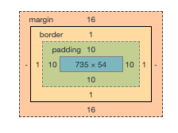

---

## Fond et couleurs

Bien évidemment en CSS nous pouvons personnaliser les fonds (couleurs et images)

---

## Les couleurs

### 3 notations

---

## En anglais

- blue
- red
- …

Assez rapidement limité. [Seulement 140 couleurs](https://www.w3schools.com/cssref/css_colors.asp)

---

## En hexadécimal

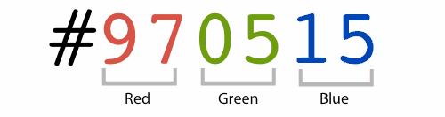

Notation connue et utilisée partout.

---

## RGB

```css
rgb(246, 243, 242);
```

Identique à la notation en hexadécimal.

---

## Comment choisir ?

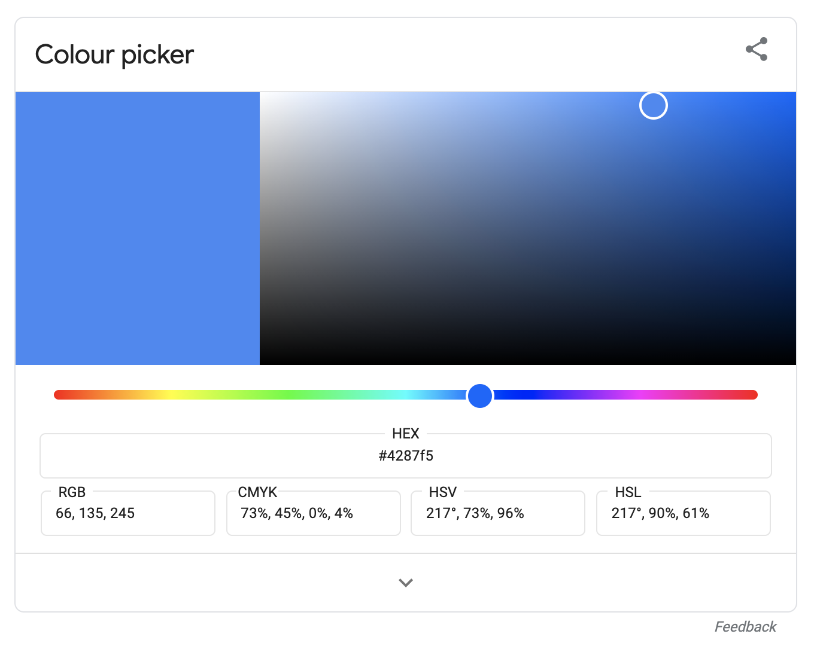

---

- Gimp
- Photoshop
- [Ou en ligne](https://www.webfx.com/web-design/color-picker/)
- [Directement sur Google](https://www.google.com/search?q=colorpicker&oq=colorpicker)

---

## Utilisation

- Couleur du texte.
- Couleur du fond.
- Les bordures
- …

---

```css
.maClass {
  /* Couleur de fond */
  background-color: #fafafa;
}

.maClass {
  /* Couleur du texte */
  color: #fafafa;
}

.maClass {
  /* Couleur du bordure */
  border: 1px solid #fafafa;
}
```

---

```css
body {
  background: black;
  color: white;
}
```

Que va-t-il s'afficher ?

---

## Les images

Les images ne sont pas limitées à la balise ``

---

## C'est possible en CSS

### Et partout

```css
body {
  background-image: url("greta.png");
}
```

---


---

## C'est moche hein ?

---

## Vous pouvez compléter avec :

| Propriété             | Valeurs                                      |
| --------------------- | -------------------------------------------- |
| background-attachment | fixed, scroll                                |
| background-repeat     | no-repeat, repeat-x, repeat-y, repeat        |
| background-position   | en pixel, ou top, bottom, left, right center |

---

```css
body {
  background-image: url("greta.png");
  background-attachment: fixed; /* Le Logo sera fixe */
  background-repeat: no-repeat; /* Le logo ne sera pas répété */
  background-position: center; /* Le logo sera centré */
}
```

---


---

## Le propriété background est « combinable »

### Ce qui donne

```css
background: url("greta.png") fixed no-repeat center;
```

---

## Formater du texte

- Gras, Italic, Souligné
- Font-Style
- Font-Family
- Taille du texte (em, rem, px)
- Les alignements (lef, right, center)

---

[Voir le support de cours](/tp/html_css/support.html)

---

## Placer les éléments

- Absolute ?
- Relative ?
- Flottant ?

---

## Absolute

### Point d'origine « la fenêtre entière »

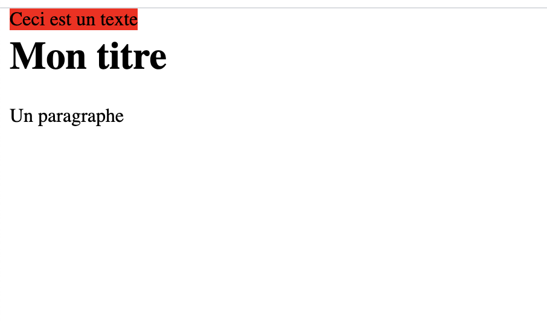

---

## Relative

### Point d'origine le parent


---

## Flotant

```html
<html>
  <body>
    <h1>Mon titre</h1>
    <p>
      
      L’accueil de tous les publics : les formations du GRETA-CFA 49 concernent
      les salariés d’entreprises, les jeunes en insertion professionnelle et les
      demandeurs d’emploi, mais aussi toute personne qui souhaite se former à
      titre individuel.
    </p>

    <style>
      .float {
        float: left;
      }
    </style>
  </body>
</html>
```

---

## Flotant


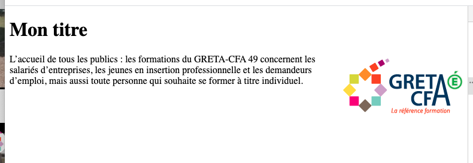

---

## Décoration / Mise en forme

### Se passer des images pour le style

---

- Box-shadow
- border
- border-radius

---


---

```css
box-shadow: 10px 10px 5px 0px rgba(0, 0, 0, 0.75);
```

[Générateur en ligne](https://cssgenerator.org/box-shadow-css-generator.html)

---

```css
border: 1px solid red;
border-radius: 10px;
```

---

## Interactivité

### Les pseudo-classes

---

Les pseudo-classes permettent d'appliquer un style à un élément non seulement en fonction de son contenu dans l'arbre du document, mais aussi en fonction de facteurs externes (l'historique de navigation par exemple avec :visited ; le statut du contenu avec :checked ; la position de la souris :hover).

---

- :hover
- :active
- :visited

---

<iframe src="/demo/css/survol/index.html" />

---

## Les ressources d'exemples

- CodePen
- S'inspirer c'est « progresser »

---

## Analyser / Copier

- Vous avez pour ça « l'inspecteur d'élément ».
- Aide & Code source

---

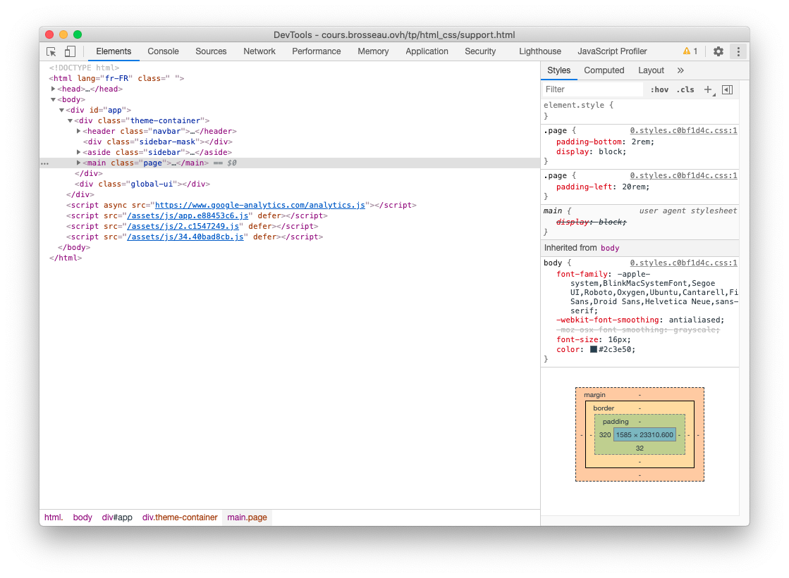

---

## Le CSS « avancés »

- Les variables CSS
- Les animations
- Le responsive
- Grid & Flex

---

[Voir le support de cours](/tp/html_css/support.html#le-css-«-plus-plus-»)

---

## Mise en pratique

[Mise en pratique](./tp3.html)
