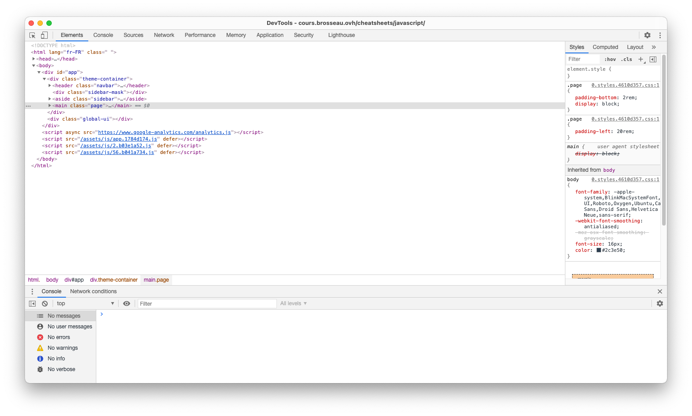
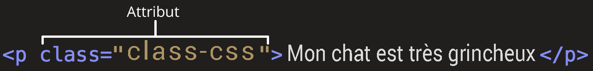

# Introduction JavaScript

## Côté Client

Par [Valentin Brosseau](https://github.com/c4software) / [@c4software](http://twitter.com/c4software)

---

## Rendre dynamiques vos pages statiques

---

## ENCORE ?

---

## Oui !

### Mais cette fois-ci directement dans le navigateur

---

Le JavaScript vous connaissez ?

---

## Mais je n’aime pas le web moi

---


---

## Désolé, mais le JavaScript est partout

---

## Bonne nouvelle ! Ce n'est pas que pour le web.

---


---

## Plusieurs types de JavaScript

---

- Navigateur (Chrome, Firefox, Safari …)
- Serveur (NodeJS)
- Application (Électron, Cordova …)

---

## Toujours le même langage

Nous allons nous concentrer sur le Web…

Mais ce que vous apprendrez ici est également valide sur les autres plateformes.

---

## Nous avons plusieurs types de JavaScript

### Vous en connaissez ?

---

JavaScript -> EcmaScript…

- ES4
- ES6
- ES2020
- …

---

Mais encore…

- Chrome
- NodeJS
- Firefox
- IE6 (LOL)

---

<iframe src="https://giphy.com/embed/l4Epf0KwYUQY5DcGc" width="480" height="270" frameBorder="0" class="giphy-embed" allowFullScreen></iframe>

---

## Votre navigateur bouge, évolue

---

Beaucoup de différences… Donc attention au support !

---

[caniuse.com](https://caniuse.com/)

---

## Comment coder alors ?

---

Trois écoles :

- VanillaJS (c'est-à-dire sans aucune librairie)
- Avec [jQuery](https://jquery.com/)
- Avec un framework ([VueJS](https://vuejs.org/), [React](https://reactjs.org/), [Svelte](https://svelte.dev/))

---

## Comment choisir ?

---

## Et si on souhaite utiliser des librairies ?

---

## C'est simple !

```html
<script src="https://ajax.googleapis.com/ajax/libs/jquery/3.5.1/jquery.min.js"></script>
```

---

## Pourquoi JavaScript

- Validation de saisie
- Interactivité
- Librairies ou non ? (état des lieux)
- Le cas des animations…

---

## D'ailleurs… Vous le rangez où le JavaScript ?

- Dans le HTML
- Dans des fichiers « externes »

---

Un conseil de vieux… Créer des librairies / externaliser vos JS.

---

## Des plateformes, des langages…

- CoffeeScript, syntaxe plus concise très utilisée par les utilisateurs de Ruby.
- TypeScript, très populaire, il permet principalement de typer « fortement les données. Il permet de créer du code propre même dans le cas de gros projets complexes. Il est développé par Microsoft. (Très intéressant).
- Kotlin, Kotlin le langage utilisé par la plateforme Android de Google. Le compilateur permet de créer également du code JS à partir de fichier .kt.

---

## Les indispensables pour coder

- [Les outils](/tp/javascript/support.html#les-outils-du-developpeur)
- [La console](/tp/javascript/support.html#la-console)
- [L'IDE](/tp/javascript/support.html#les-ide)

---

## Mettre en pratique

[Hello World](/tp/javascript/support.html#votre-premier-hello-world)
[TP1](/tp/javascript/tp1.html)

---

## Le JavaScript est donc…

### Un langage de programmation…

---

<iframe src="https://giphy.com/embed/3ov9k01Y5IKizNmC7S" width="480" height="380" frameBorder="0" class="giphy-embed" allowFullScreen></iframe>

---

Un langage oui…

Mais faiblement typé !

(voir pas du tout… Enfin, si, mais non)

---

<iframe src="https://giphy.com/embed/3ov9k23FIDV1WzpiEw" width="480" height="409" frameBorder="0" class="giphy-embed" allowFullScreen></iframe>

---

## Ça va bien se passer !

### Ne vous inquiétez pas

---

C'est « un langage » donc…

Quelques rappels

---

## Chaque ligne se termine par un `;`

---

## Les commentaires

```js
/**
 * Commentaire multignes
 * Par exemple en début de fichier pour détailler le contenu
 */

// Commenter une ligne.
console.log("Ceci est un exemple");

console.log("Ceci est un exemple 2"); // Peux également être placé en fin de ligne.
```

---

## Déclarer des variables

```js
var maVariable;
let maVariable;
const maVariable;
```

---

- `let` est similaire à `var`, c'est la façon moderne de déclarer une variable.
- `const` est une variable « constante » (impossible donc d'écraser la valeur après déclaration)

---

```html
<script>
  let entier = 42; //nombre entier
  let reel = 0.42; // nombre réel
  let texte = "texte"; // chaîne de caractères
  let booleen = true; // Un booléen
  let tab = [1, "deux", "trois"]; // tableau
  let obj = { clef1: "valeur", clef2: "Valentin" }; // Tableau associatif (clef => valeur, également appelé objet en JavaScript)
</script>
```

---

## Attention danger

```js
let entier = 42; //nombre entier
entier = "test";
```

En JavaScript c'est possible

---

## Attention danger 2

```javascript
let nom = "Valentin";
nom = "Thomas"; // Pas de problème

let nom = "Romain"; // Erreur.
// VM1498:4 Uncaught SyntaxError: Identifier 'nom' has already been declared
```

---

## Les constantes

```javascript
const age_du_capitaine = 84;
age_du_capitaine = 33;

// !! ERREUR !!
// VM1583:2 Uncaught TypeError: Assignment to constant variable.
```

---

## Cas concret

```javascript
const IN_PROGRESS = "200";
const DONE = "400";
const FAILED = "1000";
```

```javascript
if (order.status == DONE) {
  alert("Commande finalisée");
}

if (order.status == 400) {
  alert("Commande finalisée");
}
```

---

| Type      | Contenu                                 | Type d'opération                | Usage                                                                               |
| --------- | --------------------------------------- | ------------------------------- | ----------------------------------------------------------------------------------- |
| `string`  | "Une chaine de caractère"               | Gestion du texte, concaténation | Permets de stocker du texte (saisie utilisateur par exemple).                       |
| `int`     | 42                                      | Opération mathématique          | Comme en mathématique                                                               |
| `boolean` | `True` ou `False`                       | Opération logique               | Permets de faire des actions logiques. C'est un type très important en informatique |
| `float`   | 10.3                                    | Opération mathématique          | Comme en mathématique. Attention la notation du chiffre à virgule est avec un `.`.  |
| `array`   | ["a", "b", "c"]                         |                                 | Contiens des listes de « quelques choses »                                          |
| `object`  | `{nom: "Brosseau", prenom: "Valentin"}` |                                 | Structure de données                                                                |

---

## Un instant

### L'inspecteur d'éléments

---



---

## Testons « des bidouilleries » en JavaScript

### Directement dans la console

---

- console.log();
- console.table();
- alert();
- Les points d'arrêts
- …

---

## Les fonctions

---

```html
<script>
  // Déclarer / créer une fonction
  function maFonction() {
    alert("test");
  }

  // Déclarer / créer une fonction
  function maFonctionQuiRetourne42() {
    return 42;
  }
</script>
```

---

```html
<script>
  function addition(a, b) {
    return a + b;
  }

  // L'appeler
  maFonction();
  console.log(maFonctionQuiRetourne42()); // Affiche dans la console 42
  alert(addition(40, 2)); // Affiche une alert avec le résultat de l'addition 40 + 2 => 42
</script>
```

---

## Testons dans la console

---

## Les conditions

```html
<script>
  // Exemple 1
  let age = 18;
  if (age > 18) {
    alert("Je suis majeur");
  } else {
    alert("Je suis mineur");
  }

  // Exemple 2
  let estMajeur = true;
  if (estMajeur) {
    // Est équivalent à estMajeur == true
    alert("La personne est majeur");
  }

  // Exemple 3
  if (maFonctionDeTest() == true) {
    alert(
      "la fonction est appelée, et si celle-ci « return » true l'alert est affiché"
    );
  }
</script>
```

---

## Testons dans la console

---

## Les boucles

---

À l'ancienne

```html
<script>
  while (true) {
    console.log("Votre première boucle infinie");
  }

  for (let i = 0; i < 3; i++) {
    alert(i);
  }
<script>
```

---

Moderne

```html
<script>
  const arr = [1, 2, 3, 4];

  // Parcours l'ensemble du tableau
  arr.forEach((i) => {
    alert(i);
  });

  // Transforme le tableau
  arrModif = arr.map((i) => {
    return i * 2;
  }); // arrModif contiendra => [2, 4, 6, 8];
</script>
```

---

## J'attire votre attention sur le côté « Moderne »

- Présent également dans d'autres langages.
- Préférable
- Même si sur Internet vous trouverez « des anciennes versions »

---

## En parlant de moderne…

### Filtrer rapidement un tableau

---

```js
const arr = [1, 2, 3, 4];

arr.filter((curr) => curr > 2); // --> Retourne un tableau avec seulement les valeurs supérieures à 2
```

---

## Testons dans la console

- Les boucles (ancienne et nouvelles)
- Le filtrage
- …

---

<iframe src="https://giphy.com/embed/ypHEH8VjThGPS" width="480" height="370" frameBorder="0" class="giphy-embed" allowFullScreen></iframe>

---

## Le DOM

### Vous connaissez ?

---

Repose sur un arbre appelé

DOM (**D**ocument **O**bject **M**odel).

Nous parlerons donc d'un Arbre HTML.

[La DOM](/tp/javascript/support.html#le-dom)

---


---


---



---

## Regardons les devs tools à nouveau

(Vous avez compris que c'était important ?)

---

## Et le JS dans tout ça ?

---

## Manipulation via des sélecteurs (comme en CSS)

| Sélecteur | Usage                                         |
| --------- | --------------------------------------------- |
| #item     | Élément unique dans votre page                |
| .rouge    | Class réutilisable (multiple) dans votre code |
| p         | L'ensemble des balises de type `<p>`          |

- `class="rouge"` => `.rouge`
- `id="monId"` => `#monId`

---

## Deux façons de faire…

- VanillaJS
- jQuery

---

## VanillaJS « À l'ancienne »

```javascript
document.getElementById("elementId");
document.getElementsByClassName("maClass");

document.getElementsByTagName("div");
```

---

## VanillaJS « Moderne »

```javascript
// Retourne la liste (array) des éléments
document.querySelectorAll("#elementId");
document.querySelectorAll(".maClass");
document.querySelectorAll("div");

// Retourn le premier élément trouvé
document.querySelector("#elementId");
document.querySelector(".maClass");
document.querySelector("div");

// Exemples d'utilisations
document.querySelector("#elementId").innerHTML = "Voilà valeur";

document.querySelectorAll("div").forEach((it) => {
  it.innerHTML = "Parcours chaque div et remplace le contenu par <=";
});
```

---

## jQuery

```javascript
$("#elementId");
$(".maClass");
$("div");
```

---

## Créer des éléments dans la page

[Créer des éléments](/tp/javascript/support.html#creer-des-elements-dans-la-page)

---

## Créer des éléments dans la page (bis)

[Encore pus simple](/tp/javascript/support.html#exemple-de-creation-d-elements-version-alternative)

---

⚠️ Cette solution peut sembler tentante… ⚠️

Mais attention, si la valeur ajoutée contient une saisie utilisateur, vous risquez une XSS sur votre site Internet.

Donc méfiance.

---

## Manipuler les apparences

---

Ici aussi plusieurs façons :

- le `style`.
- les `class`.

---

```js
// Le style
let element = document.getElementById("monId");
element.style.display = "none";

// La class
let element = document.getElementById("monId");
element.classList.add("maClass");

// Avec jQuery
$("div").hide();
$("div").css("background-color", "yellow");
$("div").addClass("maClass");
```

---

## Assez parlé… Mise en pratique 🚀

[Manipulation du DOM](/tp/javascript/tp1.2.html)

---

## Un peu de CSS, de HTML… Et de JavaScript

[TP − Le Générateur de punition](/tp/javascript/tp1.2.html)

---

## Les évènements

<iframe src="https://giphy.com/embed/YMGnCZyNvfQ8b6CnZc" width="480" height="325" frameBorder="0" class="giphy-embed" allowFullScreen></iframe>

---

## Réagir aux interactions de l'utilisateur… Mais pas que !

---

- Au click.
- Au submit (form).
- Au resize (du navigateur)
- Au NFC
- Au GPS

---

## Deux façons d'attacher les events:

- Dans le dom
- En JavaScript

---

## Dans le DOM

<input type="button" onclick="maFonction" value="Click ! " />

---

## En JavaScript

```html
<input type="button" id="btn" value="Click ! " />

<script>
  // Pure JS
  document.getElementById("btn").addEventListener("click", maFonction, true);

  // jQuery
  $("#btn").click(maFonction);
</script>
```

---

Simple ? Compliqué ?

En réalité, comme beaucoup de choses du WEB la pratique vous donnera l'habitude de manipuler le JS. Il deviendra pour vous une véritable seconde nature.

---

C'était un simple exemple… [La liste des évènements possibles bien plus longue !](https://developer.mozilla.org/fr/docs/Web/Events)

---

## Mise en pratique

[Mettre en pratique la gestion d'évènements](/tp/javascript/tp3.html)

---

## L'Ajax

---

### Incontournable

---

# Incontournable

---

## Repose sur du code asynchrone

Pouvez-vous me dire à quoi ça correspond ?

---

```javascript
var resultat = "";

ajax("http://api/getRandom", (randomValue) => {
  resultat = randomValue;
});

console.log(resultat);
```

- Pouvez-vous me dire ce que va afficher le `console.log()` ?

---

|  |
| :------------------------------: |
|         Source Wikipédia         |

---

Deux façons de faire :

- VanillaJS (`fetch`, `Promise`)
- jQuery (`$.get`, `$.post`)

---

Les promises


---

L'Ajax c'est un gros morceau, tellement gros, qui serait possible d'y passer des heures et des heures tellement le sujet est vaste.

Nous allons donc réaliser [une première expérimentation](./tp4.md)

---

## Allons plus loin

- VueJS
- ReactJS
- Svelte

[Allons plus loin](/tp/javascript/support.html#allons-un-peu-plus-loin)
