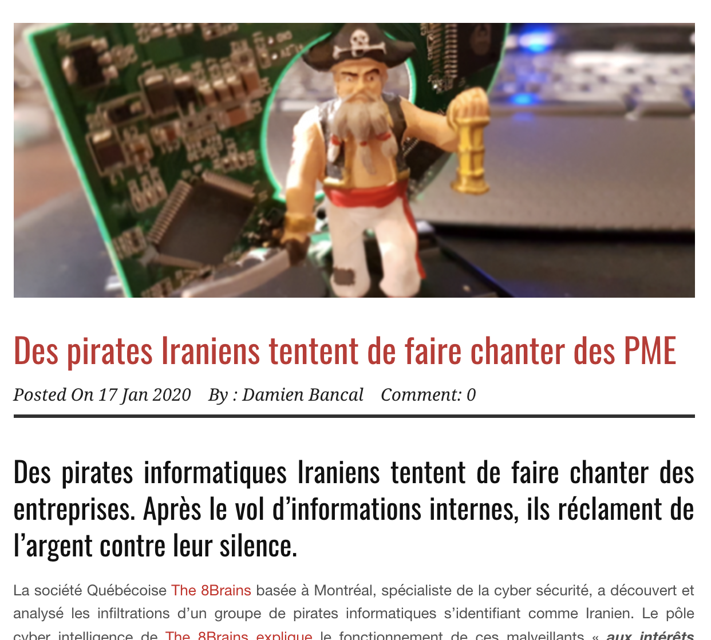
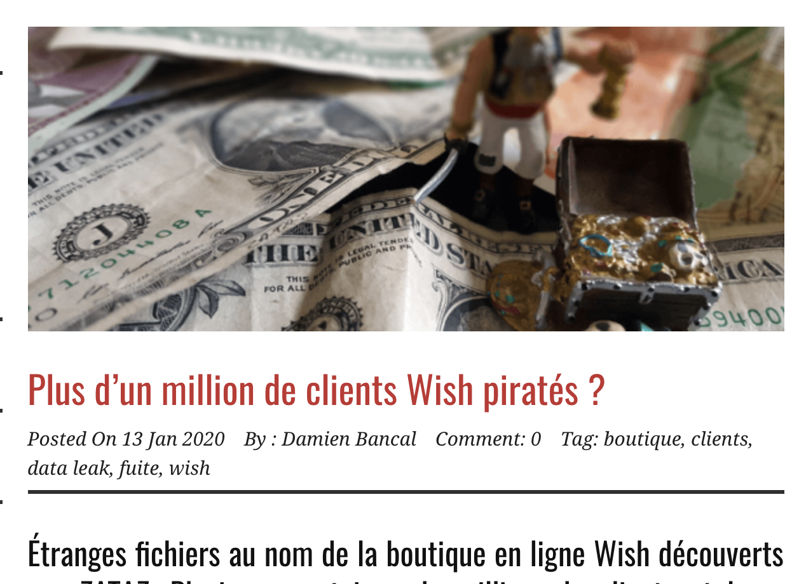
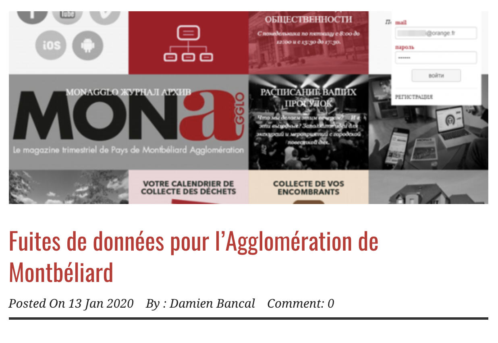
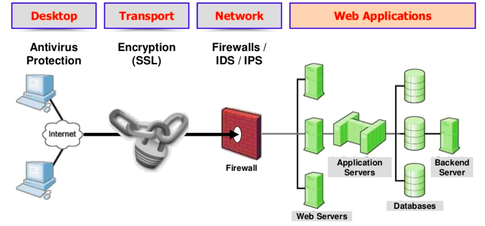
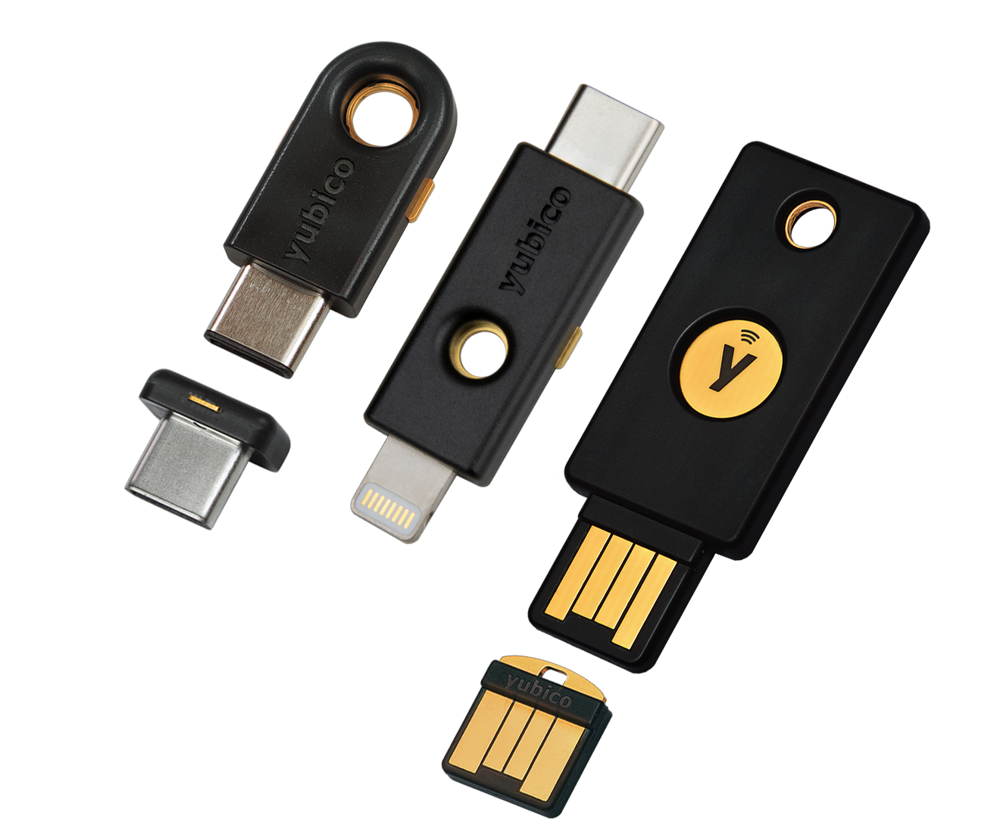

# Sécurité des applications WEB

## Risques et menaces

---

### Pour vous, la sécurité c’est quoi ?

---

## Des découvertes de failles tous les jours !

---

### Des exemples en tête ?

---



---


---



---



---

### Comment se tenir à jour ?

#### Prévenir plutôt que guérir…

---

### Des sites à surveiller

- [US CERT](https://www.us-cert.gov/)
- [The Hacker News](http://thehackernews.com/)
- Zataz
- [Reddit NetSec](https://www.reddit.com/r/netsec/)
- Next INpact (~Payant)

---

### Les impacts liés à la sécurité

#### La sécurité informatique dans une application c’est un « équilibre »

---

### Le prix de la sécurité

- Impact fonctionnel
- Limitation de l’experience utilisateur (UX)
- Impact financier

---

### Les facteurs d’expositions


---

### L’insécurité a également un coût

## 2.86 Millions d’euros

Estimation des coûts pour une entreprise à chaque incident de vol de données en France
Source: Cost Of Data Breach - Symantec

---

### Mais, une faille c’est quoi ?


---

### Les type de failles

- L’humain (Social Engineering)
- Applicatif (Hack)
- L’argent (Jusqu’à quel montant une personne donne l’information ?)

---

### Et si je ne fais rien !?

- Volontaire !
- Involontaire ?

---

### Intégrer la sécurité à toutes les étapes

La sécurité, c’est un état d’esprit à intégrer.

C’est le métier des :

- Admin Réseau / Système.
- Développeur.

---

### Améliorer la sécurité

- Dès la conception
- Comprendre et avoir en tête les règles

---

### Open Web Application Security Project (OWASP)

#### Les dix risques par ordre de dangerosité

---

### The Injection

Correspond au risque d’injection de commande (Système, SQL, Shellcode, ...). In

---

### The Injection

```sql
SELECT * FROM client WHERE id='" . $_GET["id"] . "'
```

```raw
http://exemple.com/liste?id='or '1'='1
```

---

### Broken Authentication

Correspond au risque de casser ou de contourner la gestion de l’authentification et de la session. Comprend notamment le vol de session ou la récupération de mots de passe.

---

### Broken Authentication

```raw
http://exemple.com/?jsessionid=A2938298D293
```

---

### Sensitive Data Exposure

Correspond aux failles de sécurité exposant des données sensibles comme les mots de passe, les numéros de carte de paiement ou encore les données personnelles et la nécessité de chiffrer ces données.

---

### Sensitive Data Exposure

- Espace client sans SSL
- Mot de passe en clair (ou en MD5) dans la base de données

---

### XML External Entities (XXE)

Many older or poorly configured XML processors evaluate external entity references within XML documents. External entities can be used to disclose internal files using the file URI handler, internal file shares, internal port scanning, remote code execution, and denial of service attacks.
Broken Access Control. Restrictions on what authenticated users are allowed to do are often not properly enforced. Attackers can exploit these flaws to access unauthorized functionality and/or data, such as access other users' accounts, view sensitive files, modify other users' data, change access rights, etc.

---

### Security Misconfiguration

Correspond aux failles liées à une mauvaise configuration des serveurs Web, applications, base de données ou framework.

---

### Security Misconfiguration

- Console d’administration disponible sans authentification en ligne
- Listage des repertoires ([Exemple](https://www.google.fr/search?dcr=0&q=-inurl%3A%28htm%7Chtml%7Cphp%29+intitle%3A))
- Exemples de code non supprimés

---

### Cross-Site Scripting XSS

Correspond à la non validation d'une entrée saisie par l'utilisateur. Permet notamment le vol de session.

---

### Cross-Site Scripting XSS

Éxecution de code Javascript sans validation

```html
Votre Nom : <input type="text" name="nom" value="" />
```

```js
alert("Bonjour " + $_POST["nom"]);
```

---

### Insecure Deserialization

Correspond à une désérialisation non sécurisée, elle conduit souvent à l’exécution de code à distance.

---

### Using Components with Known Vulnerabilities

Correspond aux failles liées à l’utilisation de composants tiers vulnérables.

---

### Using Components with Known Vulnerabilities

- CMS non à jour.
- Apache / Tomcat non patchés.
- Librairies XYZ non à jour.

---

### Insufficient Logging & Monitoring

Une journalisation et une surveillance insuffisantes, couplées à une réponse inefficace aux incidents, permettent aux attaquants d’attaquer davantage les systèmes.

---

### Les outils autour d’OWASP

- WebGoat (Formation)
- WebScarab (Audit)
- OWASP Testing Guide (Guide pour voir le niveau de sécu)
- OWASP Code Review Guide (Méthode d’audit)

---

#### Avec OWASP on parle de

### Vulnérabilité, et non de risque

---

### Sécurité à tous les niveaux

---



---

- IDS (Intrusion Detection System)
- IPS (Intrusion Prevension System)

---

### IPS

- Ils bloquent tout ce qui parait infectieux à leurs yeux, mais n'étant pas fiable à 100 %, ils peuvent donc bloquer malencontreusement des applications ou des trafics légitimes.
- Ils laissent parfois passer certaines attaques sans les repérer.
- Peu discrets et peuvent être découverts lors de l'attaque d'un pirate qui une fois qu'il aura découvert l'IPS s'empressera de trouver une faille dans ce dernier pour le détourner et arriver à son but.

---

### IDS

Un système de détection d'intrusion (Intrusion Detection System) est un mécanisme destiné à repérer des activités anormales ou suspectes sur la cible analysée


---

### Comment réduire le risque ?

---

- Sensibilisations / Formations.
- Revue de code (GIT).
- Tests d’intrusions (audit).
- Sécurité lors du recrutement.
- Sécurité dès la conception du projet.
- Suivi des bonnes pratiques (ex: OWASP).

---

### Pourquoi il faut se battre en entreprise ?

- Résistance au changement.
- ERP / CMS.
- La sécurité est vue comme un frein, pas une fonctionnalité.
- Déni de la réalité.
- Développement externe (prestations, stagiaires, …)

---

### Se former

#### En continu

- Conférence physique ou en ligne.
- Internet
- Appliquer les bonnes pratiques tout le temps !

---

### Se proteger



---

### Des questions ?
