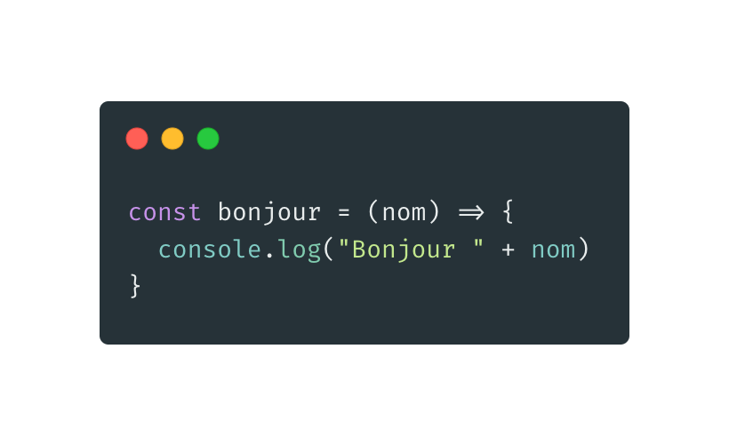
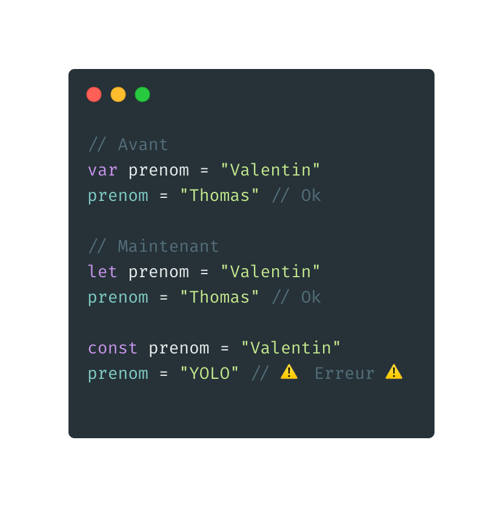
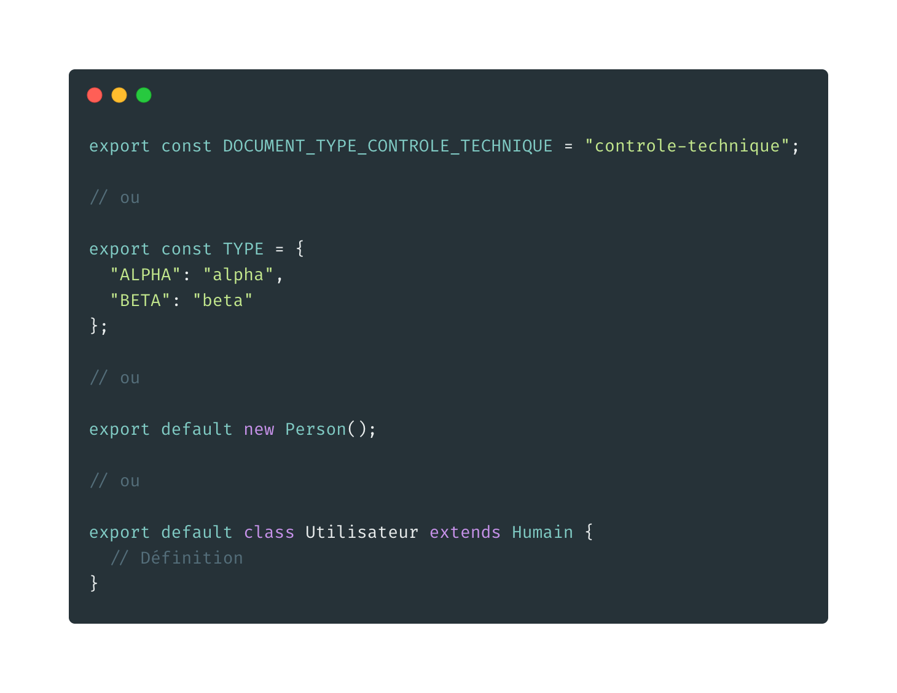
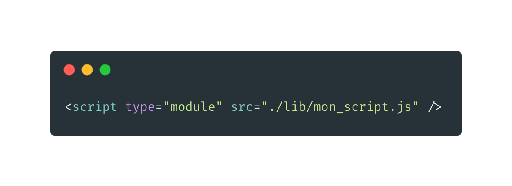
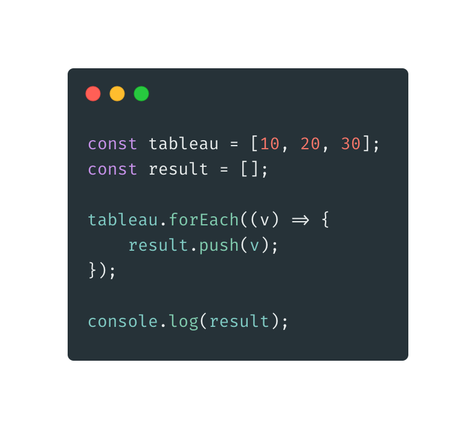
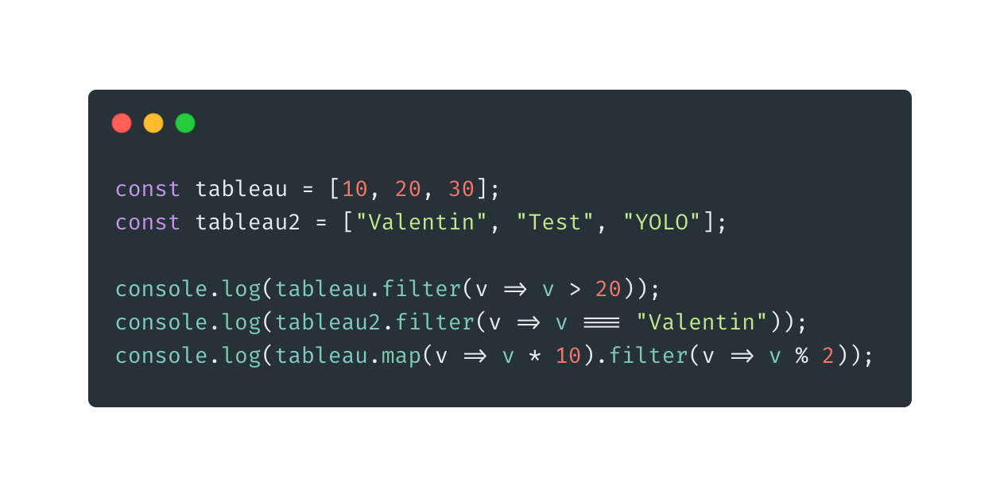
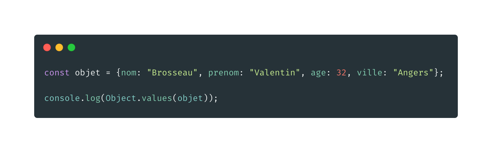
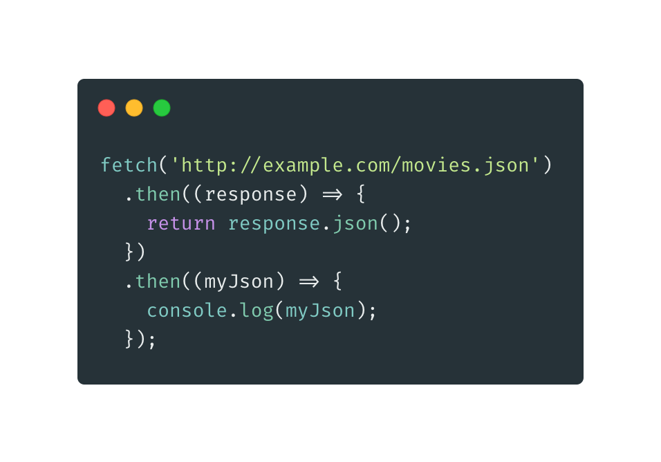

# Le Javascript

## Au-delà de IE6 😅

Par [Valentin Brosseau](https://github.com/c4software) / [@c4software](http://twitter.com/c4software)

---

<!-- .slide: data-background="./img/sad.gif" data-auto-animate -->

## Mais je n’aime pas le web moi

---

<!-- .slide: data-background="./img/sad.gif" data-auto-animate -->

## Désolé, mais le JavaScript est partout

---

<!-- .slide: data-background="./img/happy.gif" data-auto-animate -->

## Bonne nouvelle ! Ce n'est pas que pour le web.

---

<!-- .slide: data-background="./img/bg.jpg" -->


---

- Le Web : HTML / CSS / JavaScript (navigateur)
- Les applications : Electron / React Native / …
- Les serveurs : NodeJS / Deno / BunJS

---

<!-- .slide: data-background-iframe="https://www.google.com/maps" -->

<div class="frame-cover">
  <h2>Google Maps</h2>
  <p>100% en JS</p>
</div>

---

<!-- .slide: data-background-iframe="https://www.twitter.com" -->

<div class="frame-cover">
  <h2>Twitter</h2>
  <p>Utilise le JS pour charger le flux</p>
</div>

---

<!-- .slide: data-background-iframe="https://reactnative.dev/showcase" -->

<div class="frame-cover">
  <h2>ReactNative</h2>
  <p>Le JS pour réaliser des applications</p>
</div>

---

<!-- .slide: data-background-iframe="https://expressjs.com/" -->

<div class="frame-cover">
  <h2>ExpressJS</h2>
  <p>Réaliser un serveur en JS</p>
</div>

---

## JavaScript -> ECMAScript (201X, 2017, 2020, …)

---

<!-- .slide: data-background="./img/78Mz.gif" -->

## Votre navigateur bouge, évolue

---

Beaucoup de différences… Donc attention au support !

---

<!-- .slide: data-background-iframe="https://caniuse.com/" data-background-interactive -->

<div class="frame-cover">
  <h2>Can I Use</h2>
  <p>Pour connaître la compatibilité</p>
</div>

---

## L'Asynchrone

Pouvez-vous me dire à quoi ça correspond ?

---

```javascript [1|3|7|4]
var resultat = "";

ajax("http://api/getRandom", (randomValue) => {
  resultat = randomValue;
});

console.log(resultat);
```

- Pouvez-vous me dire ce que va afficher le `console.log()` ?

---

## Les nouveautés

- Votre navigateur / la console / `les dev tools`
- Global
- Les Arrays (Tableau)
- Les Objets
- L'Ajax (Fetch)
- Les Promises (Promesses)
- Async / Await

---

### Votre navigateur

Votre navigateur est puissant ! Découvrons quelques-unes des fonctionnalités.

---

### Global

---

- Fonctions anonymes (λ) / fléchées
- let / const
- string template
- export

---

#### Fonctions anonymes



---


---

### let / const



---

### String template


Le but : Rendre le code plus lisible.

---

### Export



---

### « Activer » les exports dans le navigateur

« De base », cette notation est ignorée par le navigateur, mais l'activation est simple.

---



---

### Les Arrays (Tableau)

---

La manipulation des tableaux est maintenant simplifiée et performante.

---

### map


---


Est-ce valide ?

---

### NON… Enfin Oui…

Mais non, le mieux pour ça, on utilise un `forEach`

---

### forEach



Quelle est l'autre écriture du `forEach` ?

---

### includes


---

### filter



---

- Rendre la syntaxe plus lisible et concise.
- Tout est « chainable ».
- L'utiliser tout le temps (disponible depuis très longtemps).
- [Polyfill](https://polyfill.io/)

---

### Les Objets

---

Comme les tableaux, les objets sont maintenant manipulables plus simplement.

---

### Rappel

- Le mot-clé `new` existe.
- Vous pouvez créer des `class`.
- Vous pouvez créer des `méthodes`.

---

### Object.keys()


---

### Object.values()



---

### L'Ajax

---

Une « librairie / fonction / méthode » simple permettant de faire de l'Ajax intégrée

---

# Fetch



---

[Allez plus loin](https://developer.mozilla.org/en-US/docs/Web/API/Fetch_API/Using_Fetch)

---


---

# wretch (lib)

[lib](https://elbywan.github.io/wretch/)

---

# Hey! `then`?


---

### Les Promises (Promesses)

L'objet Promise (pour « promesse ») est utilisé pour réaliser des traitements de façon asynchrone. Une promesse représente une valeur qui peut être disponible maintenant, dans le futur voire jamais.

---

Pour faire « simple », ça remplace les `callback` et évite les `callback hell`.

---

[Exemple](https://developer.mozilla.org/fr/docs/Web/JavaScript/Guide/Utiliser_les_promesses)

---

### then

Éxécuté en cas de réussite.

---

### catch

Éxécuté en cas d'échec (Erreur, Throw, …).

---

### Promise.all

Promise.all() outil de composition qui permet de mener des opérations asynchrones en parallèle.

```javascript
Promise
    .all([promesse1(), promesse2(), promesse3()])
    .then(([resultat1, resultat2, resultat3] => {
        // Code
    });
```

---

### finally

Appelée dans tous les cas de terminaison.

⚠️ Attention ne fonctionne pas partout ⚠️

---

### Async / Await

Le but des fonctions async/await est de simplifier l'utilisation synchrone des promesses et d'opérer sur des groupes de promesses. De la même façon que les promesses sont semblables à des callbacks structurés, async/await est semblable à la combinaison des générateurs et des promesses.

---

### Simplifier… Mais…

Async / Await permet de rendre « synchrone » du code asynchrone.

- Attendre le retour d'une requête Ajax avant de continuer.
- À votre avis, quels sont les risques ?
- Catch.
- Bloquage de l'interface.

---

### Compiler - Distribuer

---

### Compiler ?

---

- Les bundler (Webpack)

---

Mais maintenant… nous avons [ViteJS](https://vitejs.dev/) 🎉

---

## Conclusion

---

## Des questions ?
