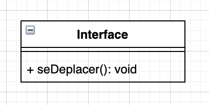

# Les Interfaces

Par [Valentin Brosseau](https://github.com/c4software) / [@c4software](http://twitter.com/c4software)

---

Les Interfaces sont des sortes de `class`

---

Mais celles-ci sont `abstraites`

Elles ne sont donc pas **instantiables**

---

## Donc pas de `new MonInterface()`

---

Une `class` abstraite qui va :

- Va d'écrire un comportement.
- Définir les signatures des méthodes et propriétés
- Garantir au code qui fait l'appel que la méthode existera.

---

C'est donc un contrat que la `class` **doit respecter** si elle implémente l'interface.

---

Interfaces ≠ Héritage

<iframe src="https://giphy.com/embed/WrgAGkGrh0MD1Z2gkO" width="480" height="270" frameBorder="0" class="giphy-embed" allowFullScreen></iframe>

---

Une interface indique juste des signatures exemple :

- `seDeplacer()`

---



---

Deux objets de types très différents peuvent **l'implémenter** exemple :

- Une personne
- Une voiture
- Un animal

---

**La différence sera :**

- Dans le code écrit dans la classe (marcher, rouler, galoper)

**Et non pas :**

- Dans la signature des méthodes

---

## Exemple

---

```php
<?php
interface Deplacement{
  public function seDeplacer($vers);
}

class Personne implements Deplacement {
    public function seDeplacer($vers){
        // Logique à écrire
    }
}

class Voiture implements Deplacement {
    public function seDeplacer($vers){
        // Logique à écrire
    }
}

class Animal implements Deplacement {
    public function seDeplacer($vers){
        // Logique à écrire
    }
}
```

---

```php
class Animal implements Deplacement
```

La partie importante est « **implements** »

---

✋ Une classe peu implémenter plusieurs Interfaces évidement

<iframe src="https://giphy.com/embed/KfO2j3bhYTXNYORzX4" width="480" height="270" frameBorder="0" class="giphy-embed" allowFullScreen></iframe>

---

```php
interface DeplacementInterface{
    public function seDeplacer();
    public function recharger();
}

interface SpeciesInterface{
    public function getName();
    public function getAge();
}
```

---

```php
class Cheval implements SpeciesInterface, DeplacementInterface{
    public function getName(){
        echo "Epona";
    }

    public function getAge(){
        echo 10;
    }

    public function seDeplacer(){
        echo "Galoper";
    }

    public function recharger(){
        echo "Manger";
    }
}
```

---

## Autre exemple : l'interface countable

- Explication [http://php.net/manual/fr/class.countable.php](class.countable.php)
- Utilisation [http://php.net/manual/en/class.arrayobject.php](class.arrayobject.php)

---

## Autre exemple : l'interface Serializable

- Explication [https://www.php.net/manual/en/class.serializable.php](class.serializable.php)
- Utilisation [http://php.net/manual/en/class.arrayobject.php](class.arrayobject.php)

---

Existe dans tous les langages-objets (c'est un des fondements)

## La notation varie, mais la logique est là même

---

## Exemples d'utilisations

- Définir un moyen de communiquer entre deux classes « via une Interface partagée ».
- Attendre un objet sans en connaitre le type, mais en s'assurant que celui-ci aura bien la méthode attendue.

---

## Très utilisé dans …


---

## Exemple un Click Listener

```kotlin
class ExampleActivity : Activity(), OnClickListener {

    protected fun onCreate(savedValues: Bundle) {
        val button: Button = findViewById(R.id.corky)
        button.setOnClickListener(this)
    }

    // Implement the OnClickListener callback
    fun onClick(v: View) {
        // do something when the button is clicked
    }
}
```

[La documentation](https://developer.android.com/guide/topics/ui/ui-events#kotlin)

---

## Exemple un appel réseau

« Vous allez aimer les interfaces ;) »

---

```kotlin
interface ApiService {

    @GET("/status")
    suspend fun readStatus(@Query("identifier") identifier: String): LedStatus

    @POST("/status")
    suspend fun writeStatus(@Body status: LedStatus): LedStatus

    companion object {
        /**
         * Création d'un singleton pour la simplicité, mais normalement nous utilisons plutôt un
         * injecteur de dépendances.
         */
        val instance = build()

        /**
         * Création de l'objet qui nous permettra de faire les appels d'API
         */
        private fun build(): ApiService {
            val gson = GsonBuilder().create() // JSON deserializer/serializer

            // Create the OkHttp Instance
            val okHttpClient = OkHttpClient.Builder()
                .readTimeout(30, TimeUnit.SECONDS)
                .writeTimeout(30, TimeUnit.SECONDS)
                .addInterceptor(HttpLoggingInterceptor().setLevel(if (BuildConfig.DEBUG) HttpLoggingInterceptor.Level.BODY else HttpLoggingInterceptor.Level.NONE))
                .addInterceptor(Interceptor { chain: Interceptor.Chain ->
                    val request = chain.request().newBuilder().addHeader("Accept", "application/json").build()
                    chain.proceed(request)
                })
                .build()

            return Retrofit.Builder()
                .baseUrl("http://le.serveur") // Mieux -> BuildConfig.URI_REMOTE_SERVER
                .client(okHttpClient)
                .addConverterFactory(GsonConverterFactory.create(gson))
                .build()
                .create(ApiService::class.java)
        }
    }
}
```

---

## Des questions ?
