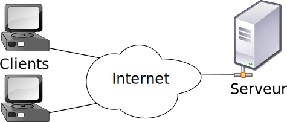
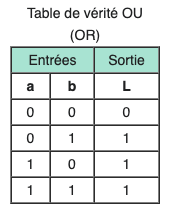

# PHP

Par [Valentin Brosseau](https://github.com/c4software) / [@c4software](http://twitter.com/c4software)

---

## Rendre dynamique votre code statique

---

- Largement utilisé
- Gratuit
- Ah oui… Largement utilisé ! (Facebook, Wordpress…)

---

## Création en 1994

_Au début PHP_ => **P**ersonal **H**ome **P**age
_Maintenant PHP_ => **H**ypertext **P**reprocessor

---

## Le PHP est un langage **serveur**

---

<iframe src="https://giphy.com/embed/nuuS1IlKqd2dq" width="480" height="264" frameBorder="0" class="giphy-embed" allowFullScreen/>

---

- Vous écrivez des fichiers `.php`
- Le fichier pourra contenir : du PHP, mais également HTML, CSS, JS.
- Le code est traité sur le serveur : **uniquement** le résultat arrive sur votre navigateur.

---

## Nous avons donc _2 acteurs_

- Un Client (un navigateur, un téléphone …)
- Un Serveur (Linux, Windows, Raspberry Pi…)

---



---

## ✋

Internet ≠ Chrome

---

## Sur Internet deux écoles

- Statique
- Dynamique

---

## L'entredeux existe aussi

Le statique dynamique

=

Le site généré en cas de changement

---

## Bon et le PHP dans tout ça

---

- Génère des pages dynamiques. (À trou)
- Collecte des données / saisie utilisateurs (formulaire).
- Lire, écrire, modifier des données « côté serveur ».
- Gestion de session de connexion (SESSION & Cookie).
- Accès à des bases de données.

---

## Pourquoi PHP ?

- Gratuit.
- Multiplateforme.
- Très bien documentés ([php.net](https://php.net)).
- Simple à apprendre.
- Largement utilisé.
- Accès aux bases de données « intégré »
- Installable en dev' simplement

---

## Les outils du développeur

[Wamp](https://www.wampserver.com/), [Mamp](https://www.mamp.info/en/mamp/mac/), [Xampp](https://www.apachefriends.org/)

---

Toujours la même « base »

- Apache
- MySQL (SQL)
- PHP

---

## Les bases de PHP

Votre HTML est un texte à trou. Le PHP peut-être _inséré_ n'importe où.

- Le script PHP commence par `<?php`.
- Et ce termine par `?>`.
- Chaque instruction PHP (ligne) ce termine par un `;`.
- Un fichier `.php` n'est même pas obligé de contenir du PHP (🤔)

---

## Exemple

```php
<?php
    // Votre code
?>
```

⚠️ Ne fonctionne que ⚠️<br><br>
<strong>dans les fichiers de type `.php`</strong>

---

```html
<!DOCTYPE html>
<html lang="en">
  <head>
    <title>Exemple PHP</title>
  </head>
  <body>
    <h1>Bonjour vous</h1>
    <p>
      Nous sommes le
      <?php echo date("d/m/Y"); ?>
    </p>
  </body>
</html>
```

---

## C'est à vous

Installons ensemble votre environnement de développement.

---

## C'est à vous suite

[Votre première page PHP](/tp/php/tp1.html)

---

## Les bases du PHP

---

## Les variables

---

Permets de mémoriser le temps d'une exécution une valeur.

---

### En PHP

- Commence toujours par un `$`.
- Est créé automatiquement lors de l'assignation.
- Utilisable dans votre code PHP (affichage, conditions, etc)

---

```php
$nom = "valentin";
```

---

### Afficher une variable

```php
// Simplement
echo $nom;

// Dans un texte
echo "Bonjour je suis $nom";
```

---

### Echo ?

`echo` va nous permettre d'afficher du texte sur la page.

---

### Une variable == Un Type

En PHP, mais également quelques soit le langage.

---

| Type      | Contenu                   | Type d'opération                |
| --------- | ------------------------- | ------------------------------- |
| `string`  | "Une chaine de caractère" | Gestion du texte, concaténation |
| `int`     | 42                        | Opération mathématique          |
| `boolean` | `True` ou `False`         | Opération logique               |
| `float`   | 10.3                      | Opération mathématique          |
| `array`   | ["a", "b", "c"]           |                                 |

---

Nous écrirons le code au maximum en Anglais !

Vos noms de variables doivent rester simples.

Limité vous à la liste suivante :

`abcdefghijklmnopqrstuvwxyz1234567890\_-`

---

## C'est à vous

Ajouter dans le TP1 la création et l'utilisation d'une variable d'une variable.

<iframe src="https://giphy.com/embed/ZVik7pBtu9dNS" width="480" height="268" frameBorder="0" class="giphy-embed" allowFullScreen></iframe>

---

## Les opérations

---

### String

Concaténation

```php
$prenom = "valentin";
$nom = "brosseau";

echo $nom . " " . $prenom;
```

Affichera : `valentin brosseau`

---

### Int Ou Float

Comme en mathématique :

`+`, `-`, `/`, `*`, `%`…

---

### Boolean

Opération logique




---

## Les « Super-Globales »

Variables « automatiquement remplies », et ça dès le début de votre script.

---

[Liste des variables](/tp/php/support.html#les-super-globales)

---

## C'est à vous

Ajouter dans votre code :

```php
echo "<pre>".print_r($_SERVER, true)."</pre>";
```

<iframe src="https://giphy.com/embed/ZVik7pBtu9dNS" width="480" height="268" frameBorder="0" class="giphy-embed" allowFullScreen></iframe>

---

## C'est à vous

Ajouter dans votre code :

```php
echo "Bonjour " . $_GET['nom'];
echo "Bonjour " . $_GET['prenom'];
```

Appeler la page en ajoutant dans le lien :

`?nom=Brosseau&prenom=Valentin`

<iframe src="https://giphy.com/embed/ZVik7pBtu9dNS" width="480" height="268" frameBorder="0" class="giphy-embed" allowFullScreen></iframe>

---

```php
// Exemple $_GET Contiendra
array(
    "prenom" => "valentin",
    "nom" => "brosseau",
);

echo $_GET['nom']; // Affichera brosseau
echo $_GET['prenom']; // Affichera valentin

echo $_GET['nom'] . " " . $_GET['prenom']; // Affichera brosseau valentin
```

---

ATTENTION

Petit aparté sur la sécurité informatique. Nous verrons plus tard les failles de sécurités, ce que vous venez de faire en est une (c'est une XSS).

---

## Les tableaux

### Array

---

### Très important

- Ce sont des conteneurs de données :
  - Liste de `string`
  - Liste de `int`
  - …
- Variables habituellement terminées par un `s` exemple `$ages = array()`
- Sont de deux types en PHP

---

## Numérotés

- Les plus simples.
- Identifiant numérique.
- Identifiant automatique (0, 1 … N).

---

| Indice (clé) | valeurs   |
| :----------: | --------- |
|      0       | Élément 1 |
|      1       | Élément 2 |
|      2       | Élément 3 |

---

```php
$valeurs = array('élément 1', 'élément 2', 'élément 3');

// ou via un ajout automatique à la fin du tableau

$valeur[] = 'élément 1';
$valeur[] = 'élément 2';
$valeur[] = 'élément 3';

// ou via un ajout à une position donnée

$valeurs[0] = 'élément 1';
$valeurs[1] = 'élément 2';
$valeurs[2] = 'élément 3';
```

---

## Associatifs

- Identique à un tableau numéroté.
- La clé ne sera pas un `chiffre` mais un `string`.
- Gagne en clarté.
- permet de structurer vos données.

---

```php
$student = array(
    "nom" => "Brosseau",
    "prenom" => "Valentin",
    "ordinateur" => true,
    "age" => 33,
);
```

---

## Associatifs et Numérotés ?

### Oui c'est possible

Exemple retour de base de données

---

```php
$students = array(
    array(
        "nom" => "Brosseau",
        "prenom" => "Valentin",
        "ordinateur" => true,
        "age" => 33,
    ),
    array(
        "nom" => "Doe",
        "prenom" => "John",
        "ordinateur" => false,
        "age" => 87,
    )
)
```

---

## La force de PHP

### Les fonctions fournies de base

[Voir la liste](https://www.php.net/manual/en/ref.array.php)

---

## C'est à vous

- Ajouter dans votre code une variable de type tableau.
- Puis affiché là comme nous l'avons fait pour la variable `$_SERVER`.

<iframe src="https://giphy.com/embed/ZVik7pBtu9dNS" width="480" height="268" frameBorder="0" class="giphy-embed" allowFullScreen></iframe>

---

## Les conditions

### Le coeur de la programmation

Question posé à l'ordinateur

---

- IF (en français SI)
- IF / ELSE (en Français SI / SINON)
- IF / ELSE-IF / ELSE (en Français SI / ALORS-SI / SINON)

---


---

Une condition va nous permettre d'exécuter certaines parties du code en fonction de la valeur des variables

---

### Comment poser la question ?

La question est « mathématique » / « Logique »

| Symbole | Signification                |
| :-----: | ---------------------------- |
|   ==    | Est égale à                  |
|   !=    | Est différent de             |
|    >    | Est strictement supérieure à |
|    <    | Est strictement inférieure à |
|   >=    | Est supérieure ou égale à    |
|   <=    | Est inférieure ou égale à    |

---

### Condition IF

```php
$age = 22;

if($age >= 18) {
    echo "Vous pouvez passer le permis";
}
```

---

### Condition IF/ELSE

```php
$age = 22;

if($age >= 18) {
    echo "Vous pouvez passer le permis";
} else {
    echo "Encore un peu de patience… Pour le permis c'est à 18ans";
}
```

---

### Condition IF/ELSE IF/ELSE

```php
$age = 22;

if($age >= 14) {
    echo "Vous pouvez passer le permis 2 roues.";
} else if ($age >= 18) {
    echo "Vous pouvez passer le permis voiture";
} else {
    echo "Encore un peu de patience… Pour le permis 2 roues c'est à 14ans";
}
```

---

### Condition Booléene

```php
<?php
$estMajeur = true;
if($estMajeur == true) {
    echo "Vous pouvez passer le permis";
}
```

```php
<?php
$estMajeur = true;
if($estMajeur) {
    echo "Vous pouvez passer le permis";
}
```

---

### Le Switch Case

[Autre façon de conditionner](/tp/php/support.html#une-autre-facon-de-conditionner)

---

### Allons plus loin…

[🤓 La ternaire](/tp/php/support.html#allons-plus-loin)

---

## C'est à vous

Le plus simple pour comprendre le fonctionnement. C'est de pratiquer. Je vous laisse écrire des conditions dans votre fichier PHP de test.

- Une condition simple.
- Une condition avec plusieurs if / else-if / else.
- Une ternaire.
- Un Switch.

<iframe src="https://giphy.com/embed/ZVik7pBtu9dNS" width="480" height="268" frameBorder="0" class="giphy-embed" allowFullScreen></iframe>

---

## Les boucles

La répétition… La force de l'ordinateur

---


Comme Bart, simplifiez-vous la recopie d'une punition.

10… 20… 10 000. Votre ordinateur ne fatigue jamais !

---

### La boucle While

La boucle while est la plus simple de tout, elle ne s'arrête que quand la condition de sortie est `false`.

---


---

```php
$var = true;
while ($var == true)
{
    // Bravo, ceci est votre première boucle infinie 🎉
}
```

---

Ou avec l'exemple de Bart

```php
$ligne_a_ecrire = 1000;
$ecrite = 0;

while($ecrite < $ligne_a_ecrire){
    echo "Je n'utiliserai plus un algorithme pour faire mes punitions";
    $ecrite = $ecrite + 1; // ou $ecrite++;
}
```

---

### La boucle For

Comme le while sauf qu'elle repose sur des données.

---

```php
$ligne_a_ecrire = 1000;

for ($ecrite = 0; $ecrite <= $ligne_a_ecrire; $ecrite++){
    echo "Je n'utiliserai plus un algorithme pour faire mes punitions";
}
```

---

Vraiment utile avec l'usage de tableau

```php
$etudiants = array(
    array('nom' => 'Brosseau'),
    array('nom' => 'Doe')
);

for($i = 0; $i < count($etudiants); ++$i) {
    echo $people[$i]['nom'];
}
```

---

### La boucle ForEach

Écrire moins… Pour gagner plus !

---

Comme le `for` mais en plus lisible

```php
$etudiants = array(
    array('nom' => 'Brosseau'),
    array('nom' => 'Doe')
);

foreach ($etudiants as $etudiant) {
    echo $etudiant['nom'];
}
```

---

## Un peu de pratique

Les tableaux sont un gros morceau.

[La suite dans le TP 1.1 - Le générateur de Bart](/tp/php/tp1.1.html)

<iframe src="https://giphy.com/embed/ZVik7pBtu9dNS" width="480" height="268" frameBorder="0" class="giphy-embed" allowFullScreen></iframe>

---

## Les fonctions

- Rendre le code réutilisable.
- Standardiser un fonctionnement.
- Ne pas Copier / Coller du code identique.

---

## Un exemple ?

Le gateau au chocolat de Mamie Huguette

---

```
3 Oeufs.
100g de sucre.
50g de farines.
100g de beurre.
200g de chocolat. On mélange et on enfourne 20 minutes.
```

---

Transformé en « Code »

```php
$oeuf = 3;
$sucre = 100;
$farine = 50;
$beurre = 100;
$chocolat = 200;

$melange = $oeuf + $sucre + $farine + $beurre+ $chocolat;
echo "Cuire 20minutes le mélange de $melange gramme.";
```

Ça fait beaucoup de ligne ? Nous n'allons pas le copier…

---

## Une fonction == Une boite noire

Vous n'avez pas besoin de connaitre le fonctionnement.

---

- La fonction possède un `nom`.
- Avec des paramètres (ou pas).

---

```php
echo gateauHuguette();
```

Si nous exécutons le code :

```
Cuire 20minutes le mélange => 453 grammes.
```

---

### Nous avons numérisé Mamie Huguette

Partout dans votre code vous allez pouvoir l'appeler, et dans tous les cas vous aurez votre gâteau au chocolat.

---

### Et les paramètres ?

Permets de personnaliser le traitement interne de la fonction.

---

```php
// Moelleux
echo gateauHugette(15);

// ou trop cuit
echo gateauHugette(30);
```

```
Cuire 15minutes le mélange => 453 grammes.

Cuire 30minutes le mélange => 453 grammes.
```

---

### Écrire sa propre fonction

L'intérieure de la boite noire

```php
function gateauHugette($duree){
    $oeuf = 3;
    $sucre = 100;
    $farine = 50;
    $beurre = 100;
    $chocolat = 200;

    $melange = $oeuf + $sucre + $farine + $beurre+ $chocolat;

    return "Cuire $duree minutes le mélange de $melange gramme.";
}
```

---

### Un instant !

Une fonction c'est une instruction classique

```php
// La variable $mon_gateau contiendra le résultat de la fonction.
$mon_gateau = gateauHugette(20);

// Des gateaux à l'infinie
while(true){
    echo gateauHugette(20);
}
```

---

### Les fonctions intégrées

La liste est très longue, mais ça passe de :

- L'envoi d'email.
- Afficher la date (comme au début vous vous rappelez ?).
- La manipulation des tableaux.
- La transformation d'images…

L'ensemble de ces fonctions sont écrites dans la documentation officielle. [À voir ici](http://fr.php.net/manual/fr/funcref.php)

---

## C'est à vous

Maintenant que nous savons faire une fonction!

Je vous propose de transformer le code de [« Bart » (TP 1.1)](/tp/php/tp1.1.html)

Mettre la partie `while` (ou `for`) dans une fonction afin de l'utiliser là où vous souhaitez afficher vos phrases.

<iframe src="https://giphy.com/embed/ZVik7pBtu9dNS" width="480" height="268" frameBorder="0" class="giphy-embed" allowFullScreen></iframe>

---

## Les includes

- L'organisation de la page.
- Le découpage du code, afin par exemple de sortir les fonctions.

---

## Un complément à la sémantique

Séparer physiquement `header`, `footer`, `nav`… Et _surtout_ éviter le copier / coller de code identique.

---

## L'objectif

- Éviter la duplication de code.
- Simplifier la modification de code.
- Correction plus simple, car code présent à un seul endroit

---


Certaines parties sont présentes sur l'ensemble des pages

---

- Le Header
- Le Footer
- Le Nav

---

La puissance de PHP la fonction `include`. Elle va nous permettre d'insérer le contenu d'un autre fichier.

```php
<?php
include('monfichier.php');
?>
```

---


---

Nous découpons donc notre HTML dans X fichiers PHP.

[Concrètement ça donne](/tp/php/support.html#le-code)

---


---

### Les Include pour d'organisation du code

[Voir le support](/tp/php/support.html#les-includes-pour-organiser-votre-code-php)

---

## À faire

Maintenant que nous savons découper notre code. Je vous propose de réaliser le [TP suivant](/tp/php/tp1.2.html)

<iframe src="https://giphy.com/embed/ZVik7pBtu9dNS" width="480" height="268" frameBorder="0" class="giphy-embed" allowFullScreen></iframe>

---

## À faire

Maintenant que nous savons découper notre code. Je vous laisse retourner dans le [TP Bart](/tp/php/tp1.1.html) afin de :

- Sortir votre fonction dans un autre fichier.
- include le fichier.

<iframe src="https://giphy.com/embed/ZVik7pBtu9dNS" width="480" height="268" frameBorder="0" class="giphy-embed" allowFullScreen></iframe>

---

## Les formulaires

Communication entre le HTML et le PHP

---


---

Communication entre le **Client** et le **Serveur**

- GET ($\_GET en PHP)
- POST ($\_POST en PHP)

---

- GET : Visible simplement.
- POST : Visible mais plus difficilement

✋ Quand il s'agit d'un formulaire, je vous conseille vivement de **toujours** passer par un POST.

---

## Le HTML

- Comme une `div`, `p`…
- Balise `form` avec un attribut `action` destination du formulaire.

---

Déroulement en 3 étapes :


---

```html
<form method="post" action="destination.php">
  <input type="text" name="nom" placeholder="Votre Nom" value="" />
  <input type="text" name="prenom" placeholder="Votre Prenom" value="" />
  <input type="submit" value="Envoyer" />
</form>
```

---

[La suite dans le support de cours](/tp/php/support.html#le-code-html)

---

## Mise en pratique 2

Nous avons vu beaucoup de nouvelles choses. Nous allons les mettre en pratique avec le TP 2

[La suite ici](/tp/php/tp2.html)

---

## La persistance

Sauvegarder des variables entre chaque chargement de pages

---

- La Session
- Les Cookies

---

### La session

- Sauvegarde pour une durée courte (quelques minutes).
- Sauvegarder **sur** le serveur.
- La durée dépend de l'activité de l'utilisateur.
- Propre au « domaine ».
- Différente pour chaque utilisateur.
- Tableau associatif

---

En PHP, elle est non démarrée par défaut

```php
<?php
session_start();
?>
```

⚠️ Le `session_start()` doit être la _première ligne_ de votre script PHP.

---

```php
<?php
// Enregistrer la variable
$_SESSION["ma_variable"] = "ceci est une valeur de session";


// La lire
echo $_SESSION["ma_variable"];
?>
```

Et … C'est tout !

---

### Les cookies

Comme la Session… Mais sauvegardé sur le poste client

---


---

### Poste client == Danger

Par défaut les valeurs enregistrées dans le cookie sont éditables par le client, donc il n'y a aucune garantie de ce que vous allez récupérer. Attention au XSS donc.

---

À réserver **aux données non sensibles**

- Paramètre d'affichage.
- Sauvegarde « de choix utilisateur ».
- Tracker un utilisateur (c'est ce que fait Google ou Facebook par exemple)

---

```php
// Enregistre une valeur
$value = 'Valeur de test';
setcookie("monCookie", $value);
setcookie("monCookie", $value, time()+3600);  /* expire dans 1 heure */

// Récupération d'un cookie
echo $_COOKIE["monCookie"];
```

---

## La structure

### J'organise mon code

---

C'est un gros morceau. L'include sera notre « sauveur ».

Fini les projets « en bordel ».

---

- Fonctionner avec un « Entry Point unique ».
- Utiliser un Routeur.
- Éviter de plus en plus le mélange HTML / PHP.

---

[La suite dans le support](/tp/php/support.html#la-structure)

---

[Gérer une authentification](/tp/php/support.html#utiliser-la-session-pour-gerer-un-espace-d-administration)

---

## Mise en pratique 4

### Organiser son code

L'organisation étant un point important, je vous propose de la mettre [en pratique immédiatement dans le TP 4](/tp/php/tp3.html).

---

## Mise en pratique 4

### Pratiquer les SESSIONS & Cookies

Nous avons maintenant organisé notre code afin que celui-ci soit moins « brouillon », [je vous propose de pratiquer un peu la partie session](/tp/php/tp4.html)
