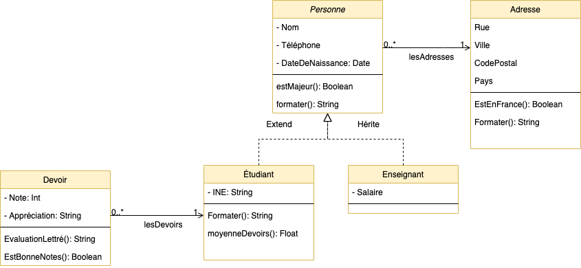

# POO

## La Programmation Orientée Objet

Par [Valentin Brosseau](https://github.com/c4software) / [@c4software](http://twitter.com/c4software)

---

Pourquoi la Programmation Orientée Objet ?

En groupe de 2 ou 3

- Que vous souvenez-vous ?
- Où faites-vous déjà de la POO ? Quels sont les avantages ?

---

## La POO c'est 3 concepts

---

**Concept de modélisation** à travers la notion de classe et d’instanciation de ces classes.

---

**Concept d’action** à travers la notion d’envoi de messages et de méthodes à l’intérieur des objets.

---

**Concept de construction** par réutilisation et amélioration par l’utilisation de la notion d’héritage.

---

### Mais surtout

Ça permet de représenter **informatiquement** quelque chose du monde réel.

---

### Deux notions

- Les classes
- Les objets

---

### Les classes

Représente une définition d'une problématique réelle.

- « Qu'est-ce que je souhaite représenter ? »
- « Comment déterminer ce que je souhaite représenter »
  - Spécifications client.
  - Mes connaissances du problème / de ce que je souhaite représenter

---

Serviront de moule pour créer des objets.

---

Une classe étant **une définition**, elle nous servira plus tard à créer **des objets**.

---

### Une classe est composée de :

- D'attributs (variable d'instance ou propriété).
- De méthodes (actions / opération au niveau de la classe).

---

### Nous avons donc deux types membres dans la classe

- Des **propriétés** (le données de l'objet) **avec une visibilité**
- Des **méthodes** (les actions possibles : accélérer, freiner, etc.) **avec une visibilité**

---

### La visibilité ?

- Privée : accessible que dans l'objet.
- Public : accessible hors de l'objet.
- Protected : **non accessible** aux enfants (héritage)

---


---

### Les méthodes

- Comme une fonction, mais **encapsulé** dans la classe.
- Possède une visibilité.
- Possède des paramètres.
- Surcharge: plusieurs **méthodes** peuvent avoir le même nom et des paramètres différents (type et/ou ordre).

---

### Les type de méthodes

- Le constructeur.
- Les méthodes d'actions.
- Les méthodes accesseurs / mutateurs.

---

### Un exemple


---

```php
class Personne
{

    // Attribut
    public $nom;
    public $prenom;
    private $dateNaissance;
    private $salaire;
    public $nbEnfant;


    // Constructeur
    function __construct($nom, $prenom, $dateNaissance, $nbEnfant = 0)
    {
        $this->nom = $nom;
        $this->prenom = $prenom;
        $this->dateNaissance = $dateNaissance;
        $this->nbEnfant = $nbEnfant;
    }

    // Mutateurs
    public function setSalaire($valeur)
    {
        $this->salaire = $valeur;
    }

    // Accesseur
    public function getSalaire($valeur)
    {
        return $this->salaire;
    }


    // Méthode
    public function identite(){
        return $this->nom . " " . $this->prenom;
    }

    // Méthode
    public function age()
    {
        $date = new DateTime($this->dateNaissance);
        $now = new DateTime();
        $interval = $now->diff($date);
        return $interval->y;
    }

    // Méthode
    public function argentPoche()
    {
        return $this->salaire / $this->nbEnfant;
    }
}
```

---

### Surcharges

```php

<?php
class SimpleClass
{
    // déclaration d'une propriété
    public $var = 'une valeur par défaut';
    public $var2 = 'une valeur par défaut';

    // Constructeur
    function __construct($var, $var2)
    {
        $this->var = $var;
        $this->var2 = $var2;
    }

    // déclaration des méthodes
    public function displayVar() {
        echo $this->var;
    }

    public function setVar($var){
        $this->var = $var;
    }

    public function setVar($var, $var2){
        $this->var = $var;
        $this->var2 = $var2;
    }
}
?>

```

---

### Ce qu'il faut retenir

- Les classes sont instanciables (création d'objets, `new Personne(…)`).
- Les propriétés sont les « variables » de l'objet.
- Les méthodes sont les « actions » de l'objet.
- Les méthodes **et** les propriétés _**ont des visiblités**_.
- Les méthodes peuvent être surchargées.

---

### Les objets

Chaque objet représente un objet du monde réel

exemple :

- une personne **précise**
- une voiture **spécifique**
- Un élément de menu.

---

⚠️ Utilise les classes précédemment définies ⚠️

```php
$personne1 = new Personne("Valentin", "Brosseau", "28/02/1987", 0);
$personne2 = new Personne("John", "Doe", "01/01/1970", 12);
```

👀 Créer un objet == Instancier 👀

---

### À faire

Nous souhaitons modéliser la problématique d'un vendeur de voitures.

---

Supposons que chaque Voiture possède :

- les « paramètres » suivant :
  - Une vitesse.
  - Un nombre de km.
  - Une année de fabrication.
- Les actions suivantes :
  - Calcul du nombre de km moyen par an depuis la fabrication.
  - Accélérer.

C'est à vous 🤓

---

_Une solution possible_


---

Aide mémoire écriture

[Aide mémoire POO](/cheatsheets/poo/)

---

## Les collections d'objets

---

Regrouper plusieurs objets « dans une liste »

---

Exemple, comment gérer le cas de :

« Une entreprise contient des personnes »

---


```php
$personne1 = new Personne("Valentin", "Brosseau", "28/02/1987", 0);
$personne2 = new Personne("John", "Doe", "01/01/1970", 12);
```

---

TODO SCHEMA UML

---

_Définition_ : Une collection est un ensemble d'objets qui sont
regroupés ensemble sous un même nom.

---

PHP

```php
$lesPersonnes = [];
```

---

### Ajouter en liste

```php
$unePersonne = new Personne("Doe", "John", "01/01/1970", 10);

array_push($lesPersonnes, new Personne("Brosseau", "Valentin", "28/02/1987", 0));
array_push($lesPersonnes, $unePersonne);
```

---

### Vider la liste

```php
$lesPersonnes = [];
```

---

### Mais également

```php
sizeof($lesPersonnes);
```

---

### En résumé

Un parallèle intéressant.

---


PHP

---


Java

---

### Parcourir une collection

---

En PHP :

```php
foreach($lesPersonne as $laPersonne){
    // $laPersonne contient « un pointeur » vers une des personne de la liste
    // À chaque tour de boucle nous avons la personne suivante.
}
```

---

En Java :

```java
// Version moderne
lesPersonnes.forEach(laPersonne -> {
    // laPersonne contient « un pointeur » vers une des personne de la liste
    // À chaque tour de boucle nous avons la personne suivante.
});

// Version « à l'ancienne »
for (Personne laPersonne : lesPersonnes) {
    // laPersonne contient « un pointeur » vers une des personne de la liste
    // À chaque tour de boucle nous avons la personne suivante.
}
```

---

Aide mémoire écriture et comparaison

[Aide mémoire POO](/cheatsheets/poo/)

---

### La modélisation



---

## L'héritage

- Extends
- Hérite
- Redéfinition (comme la surcharge, mais entre la fille et la mère)

---

## Les classes Static

- Méthode & Propriété accessible **sans besoin d'un new**
- Permets d'encapsuler une logique.

---

## Les classes abstraites

Classe dont l'implémentation n'est pas complète et qui **n'est pas instanciable**.

- Elle sert de base à d'autres classes dérivées (héritées).

---

```php
abstract class AbstractClass
{
    // Force les classes filles à définir cette méthode
    abstract protected function getValue();
    abstract protected function prefixValue($prefix);

    // méthode commune
    public function printOut() {
        print $this->getValue();
   }
}

class ConcreteClass1 extends AbstractClass
{
     protected function getValue() {
       return "ConcreteClass1";
     }

     public function prefixValue($prefix) {
       return "{$prefix}ConcreteClass1";
    }
}

```

---

## Les interfaces

Une interface ressemble à une classe abstraite dans laquelle aucune méthode ne serait implémentée.

- Les méthodes y sont seulement déclarées.
- C'est **un contrat de service**. Oblige une implémentation spécifique.
- Définition d'un attendu sans se soucier de l'implémentation.

---

```php
// Declaration de l'interface 'Template'
interface Template
{
    public function setVariable($name, $var);
    public function getHtml($template);
}

// Implémentation de l'interface
// Ceci va fonctionner
class WorkingTemplate implements Template
{
    private $vars = [];

    public function setVariable($name, $var)
    {
        $this->vars[$name] = $var;
    }

    public function getHtml($template)
    {
        foreach($this->vars as $name => $value) {
            $template = str_replace('{' . $name . '}', $value, $template);
        }

        return $template;
    }
}
```

---

## Classe abstraite ou Interface ?

Classes abstraites et interfaces ont chacune une fonction bien distincte :

- les classes abstraites servent à factoriser du code.
- Tandis que les interfaces servent à définir des contrats de service.
