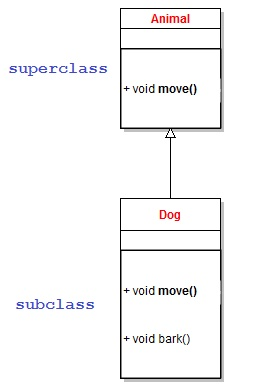

# Redéfinition & Polymorphisme

Par [Valentin Brosseau](https://github.com/c4software) / [@c4software](http://twitter.com/c4software)

---

## La redéfinition

---



- Qu'observez-vous ?

---


- Que va-t-il se passer ?

---

<iframe src="https://giphy.com/embed/f3GoWhH08FxtUeeu0B" width="480" height="273" frameBorder="0" class="giphy-embed" allowFullScreen></iframe>

---

```java
class Animal{
    public void move(){
        // Implémentation du déplacement
    }
}

class Dog extends Animal {
    @Override
    public void move(){
        // Implémentation du déplacement différente du parent
    }

    public void bark(){
        // Le chien fait ouaf.
    }
}
```

- Que constatez-vous ?

---

## Pratique! Mais…

### Si on souhaite spécialiser et pas remplacer ?

---

```java
class Animal{
  public void bruit(){
    System.out.print("BRUUUUIIIITTTT");
  }
}

class Humain extends Animal {
  @Override
  public void bruit(){
    super.bruit()
    System.out.print(" (Oui mais compréhensible)");
  }
}
```

- Quel élément est important ?

---

Que va afficher le programme suivant ?

```java
$humain = new Humain();
$humain.bruit();
```

---

```java
abstract class Animal{
  abstract void bruit();
}

class Humain extends Animal {
  @Override
  public void bruit(){
    super.bruit()
    System.out.print(" (Oui mais compréhensible)");
  }
}
```

- Est-ce possible ? Pourquoi ?

---

## Un instant… Mais ce n’est pas de la surcharge ?

<iframe src="https://giphy.com/embed/Y8hzdgPnZ6Hwk" width="480" height="379" frameBorder="0" class="giphy-embed" allowFullScreen></iframe>

---

Non !

Surcharge **≠** Redéfinition

<iframe src="https://giphy.com/embed/WrgAGkGrh0MD1Z2gkO" width="480" height="270" frameBorder="0" class="giphy-embed" allowFullScreen></iframe>

---

[Exercice de mise en application](https://cours.brosseau.ovh/cours/exercices/poo/redefinition.html)

---

<fieldset>
  <legend>En résumer, la redéfinition…</legend>
    <li>Ne s'applique que dans l'héritage.</li>
    <li>La signature des méthodes <u>doit-être identique</u>.</li>
    <li>L'appel au parent est possible.</li>
    <li>Surcharge ≠ Redéfinition</li>
</fieldset>

---

## Le Polymorphisme

---

- Poly
- Morphisme

---

- Poly = **Plusieurs**
- Morphisme = **Forme**

---

- Classe B **"EST-UN"** Classe A.
- Toutes les méthodes de la classe A peuvent donc être appelées sur la classe B.

---


- Donnez-moi un exemple de **EST-UN**.

---

```java
Animal monLapin = new Lapin();
```

- Est-ce valide ?
- Notre objet sera…
  - Un lapin ?
  - Un Animal ?

---


- Que constatez-vous ?

---

<fieldset>
  <legend>Le polymorphisme</legend>
    <li>Est possible grâce à l'héritage.</li>
    <li>Manipuler un objet sans en connaitre le type précis.</li>
    <li>Des listes d'objets de type différent.</li>
</fieldset>

---

[Exercice de mise en application](https://cours.brosseau.ovh/cours/exercices/poo/polymorphisme.html)

---

## Des questions ?
