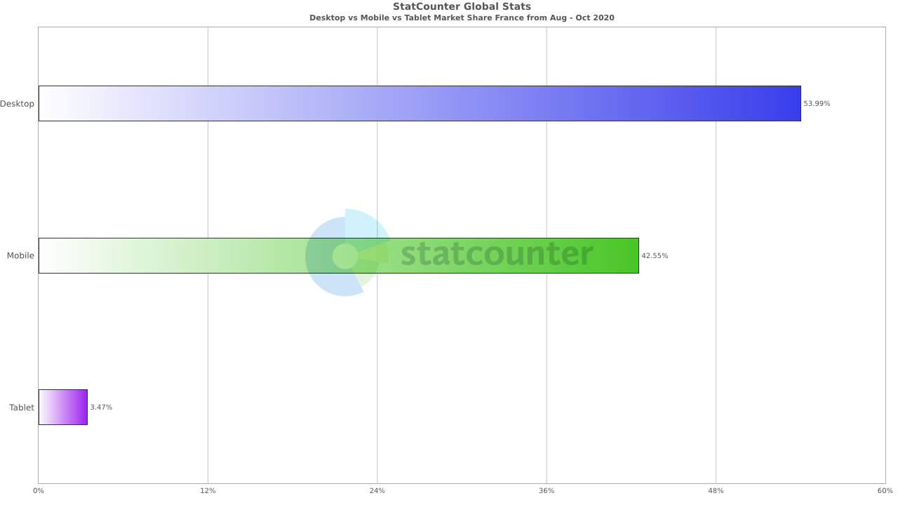

# Site web Responsive

Par [Valentin Brosseau](https://github.com/c4software) / [@c4software](http://twitter.com/c4software)

---

## Le Web c'est aussi du mobile

### De + en + de mobile même

---



Source : [statcounter.com](https://gs.statcounter.com/platform-market-share/desktop-mobile-tablet/france/#monthly-202008-202010-bar)

---

## Vous devez donc travailler sur le sujet

---

## Mobile First ?

### Ou

## Desktop First ?

---

Mon choix… Mobile first.

- Massivement utilisé
- Contrainte plus forte
- Adaptation plus simple

---

## Comment ça fonctionne ?

---

## Repose sur deux choses

---

## Une meta

```html

```

---

## Des media Queries

```css

```
