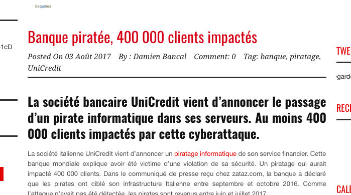
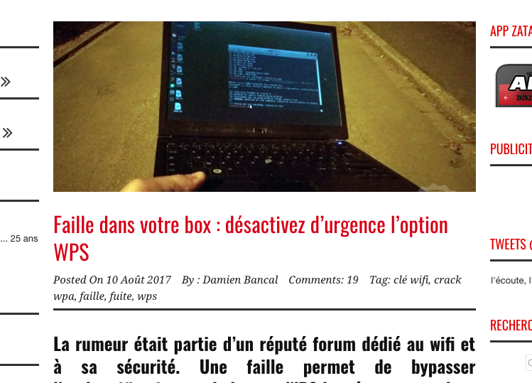
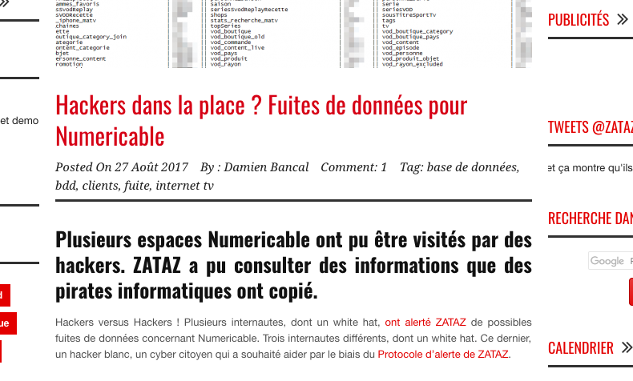
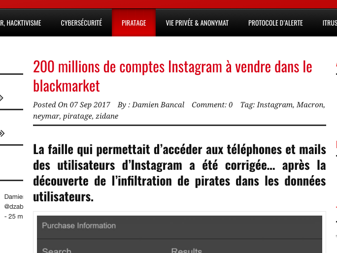
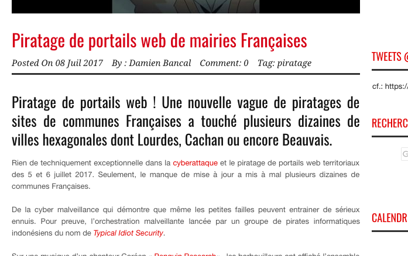
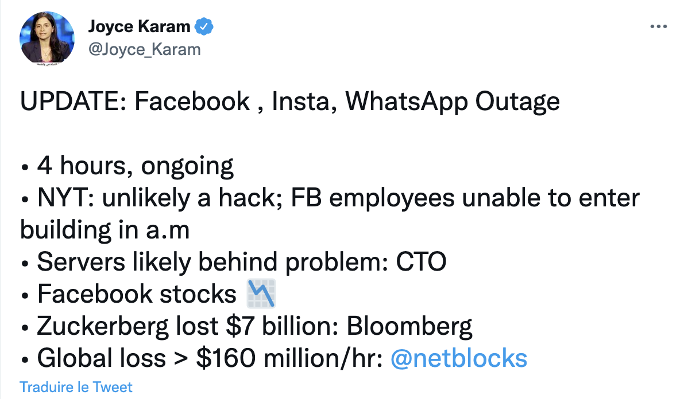
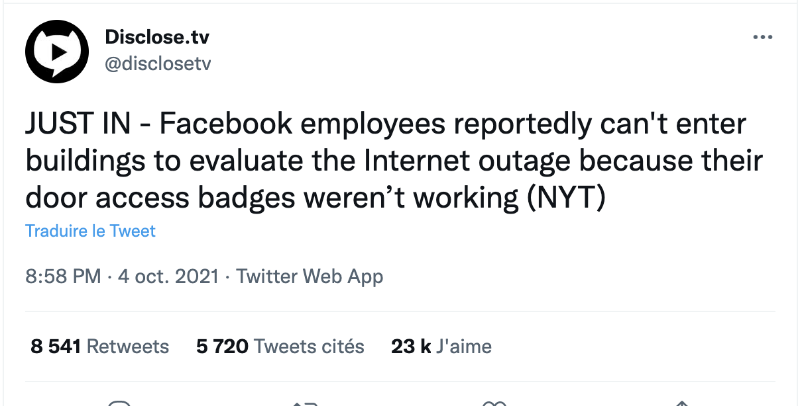
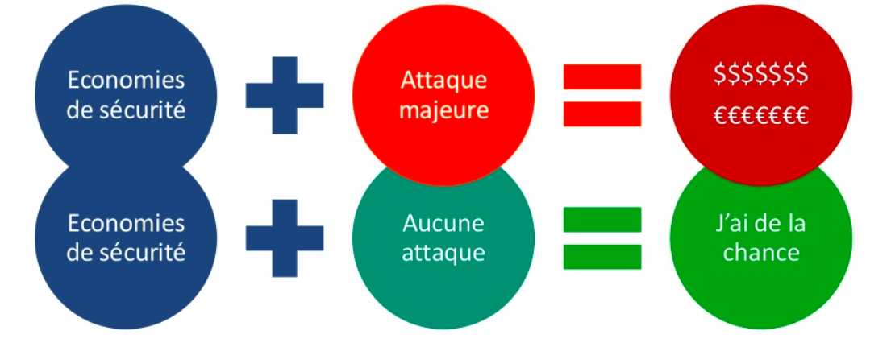
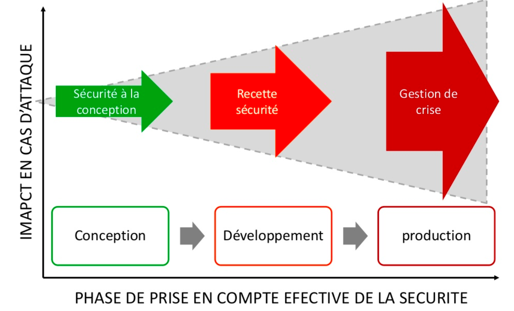
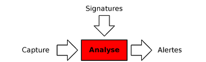

# Sécurité des applications WEB

## Risques et menaces

Par [Valentin Brosseau](https://github.com/c4software) / [@c4software](http://twitter.com/c4software)

---

## En groupe

### Pour vous, la sécurité c’est quoi ?

---

## Des découvertes de failles tous les jours !

---

### Des exemples en tête ?

---


---



---



---



---



---


---



---


---

[Top50 du nombre de vulnérabilités par le nombre de produits des marques](https://www.cvedetails.com/top-50-vendors.php)

---

### Comment se tenir à jour ?

#### Prévenir plutôt que guérir…

---

### Des sites à surveiller

#### Vous êtes la première ligne d’informations

- [US CERT (LA SOURCE)](https://www.us-cert.gov/)
- [The Hacker News](http://thehackernews.com/)
- Zataz
- [Reddit NetSec](https://www.reddit.com/r/netsec/)
- Next INpact (~Payant)
- Google Actu

Vous en avez d’autres en tête ?

---

### Les impacts liés à la sécurité

#### La sécurité informatique dans une application c’est un « équilibre »

---

### Le prix de la sécurité

- Impact fonctionnel
- Limitation de l’expérience utilisateur (UX)
- Impact financier

---

### Les facteurs d’expositions


---

### L’insécurité à également un coût

À votre avis ?

---

# 2.86 Millions d’euros

Estimation des coûts pour une entreprise à chaque incident de vol de données en France

Source: Cost Of Data Breach \- Symantec

---

### Un exemple… Facebook

---



---



---

### Un impact qui peut-être globalisé

[https://twitter.com/awlnx/status/1445073290708533258?s=09](https://twitter.com/awlnx/status/1445073290708533258?s=09)

---

### Et si je ne fais rien !?

- Volontaire !
- Involontaire ?

---



---

### Une petite histoire…

---

### Intégrer la sécurité à toutes les étapes

La sécurité c’est un état d’esprit à intégrer.

C’est aussi votre métier

- Réseau ?
- Développeur ?
- À votre avis ? Qui doit travailler la sécurité ?

---

### Les deux!

---



---

### Améliorer la sécurité

- Dès la conception
- Comprendre et avoir en tête les règles

---

### Open Web Application Security Project (OWASP)

#### Les dix risques par ordre de dangerosité

---

### Le Top10 Web

---

### The Injection

Corresponds au risque d’injection SQL, Shell...

---

### Broken Authentication and Session Management

Corresponds au risque de casser la gestion de l’authentification et de la session. Comprends notamment le vol de session ou la récupération de mots de passe.

---

### Cross-Site Scripting

Corresponds au XSS soit l’injection de contenu dans une page, ce qui provoque des actions non désirées sur une page Web. Les failles XSS sont particulièrement répandues parmi les failles de sécurités Web.

---

### Insecure Direct Object References

Corresponds aux failles de sécurités des ID de données visualisées. Nécessite de mettre en place un contrôle d’accès aux données.

---

### Security Misconfiguration

Corresponds aux failles de configuration liées aux serveurs Web, applications, base de données ou frameworks.

---

### Sensitive Data Exposure

Corresponds aux failles de sécurités liées aux données sensibles comme les mots de passe, les numéros de carte de paiement ou encore les données personnelles et la nécessité de chiffrer ces données.

---

### Missing Function Level Access Control

Failles de sécurités liées aux accès de fonctionnalité.

---

### Cross-Site Request Forgery (CSRF)

Failles liées à l’exécution de requêtes à l’insu de l’utilisateur.

---

### Using Components with Known Vulnerabilities

Failles liées à l’utilisation de composants tiers.

---

### Unvalidated Redirects and Forwards

Failles liées aux redirects et forwards génériques des applications.

---

### Les outils autour d’OWASP

- 
- WebGoat (Formation, Java)
- WebScarab (Audit)
- OWASP Testing guide (Guide pour voir le niveau de sécu)
- OWASP Code Review guide (Méthode d’audit)

---

#### Avec OWASP on parle de

### Vulnérabilité, et non de risque

---

### On connait les failles

#### Comment on les corrige ?

---


---

- IDS (Intrusion Detection Systeme)
- IPS (Intrusion Prevension Systeme)

---

### IPS

- Ils bloquent tout ce qui parait infectieux à leurs yeux, mais n'étant pas fiable à 100 % ils peuvent donc bloquer malencontreusement des applications ou des trafics légitimes.
- Ils laissent parfois passer certaines attaques sans les repérer.
- Peu discrets et peuvent être découverts lors de l'attaque d'un pirate qui une fois qu'il aura découvert l'IPS s'empressera de trouver une faille dans ce dernier pour le détourner et arriver à son but.

---

### IDS

Un système de détection d'intrusion (Intrusion Detection System) est un mécanisme destiné à repérer des activités anormales ou suspectes sur la cible analysée



---

### Mais, une faille c’est quoi ?


---

### Les types de failles

- L’humain (Social Engineering)
- D'accès (physique)
- Applicatif (Hack)
- L’argent (jusqu’à quel montant une personne donne l’information ?)

---

### Le Social Enineering

Les gens sont souvent trop confiants.

[Exemple SECTF à la DefCon](https://www.youtube.com/watch?v=-FSLaHKoCNE)

---

### OWASP un classement qui évolue


[Source](https://owasp.org/www-project-top-ten/)

---

#### Comprendre le TOP 10

### Pour éviter d’être vulnérable

---

### L’injection

```sql
SELECT * FROM client WHERE id='" . $_GET["id"] . "'
```

```
http://exemple.com/liste?id='or '1'='1
```

---

### Violation de gestion d'authentification et de session

```
http://exemple.com/?jsessionid=A2938298D293
```

---

### XSS

Exécution de code JavaScript sans validation

```html
Votre Nom : <input type="text" name="nom" value="" />
```

```js
alert("Bonjour " + $_POST["nom"]);
```

---

### Référence directe non sécurisée à un objet

```
http://exemple.com/liste?mode=client
```

Si je change client par … admin ?

---

```sql
SELECT * FROM client where mode=?
```

```php
$stmt->bindParam(1, $mode);
```

---

### Mauvaise configuration sécurisée

- Console d’administration disponible sans authentification en ligne
- Listage des répertoires ([Exemple](https://www.google.fr/search?dcr=0&q=intitle%3A%22Index%20of%22))
- Exemples de code non supprimés

---

### Exposition de données sensibles

- Espace client sans SSL
- Mot de passe en claire (ou en MD5) dans la base de données

---

### Manque de contrôle d'accès au niveau fonctionnel

- Page d’admin accessible avec un compte utilisateur
- Mode non filtré (similaire à l’exemple mode={client,admin})

---

### CSRF: Falsification des requêtes

- Rejeu de requête déjà joué

---

#### Comment le bloquer ?

Ajouter un identifiant/jeton dans la requête, unique et non réutilisable

---

### Utilisation de composants avec des vulnérabilités connues

- CMS non à jour
- Apache / Tomcat non patchés
- Librairies XYZ non à jour

---

### Redirections et renvois non validés

- Utilisation de votre site comme « masque » dans du phishing

---

### Comment réduire le risque ?

---

- Sensibilisations / Formations
- Revue de code
- Tests d’intrusions
- Sécurité lors du recrutement
- Sécurité dès la conception du projet
- Suivi des bonnes pratiques (ex: OWASP)

---

### Pourquoi il faut se battre (en interne) ?

- Résistance au changement
- ERP / CMS
- La sécurité est vue comme un frein, pas une fonctionnalité
- Déni de la réalité
- Multitude de librairies
- Développement externe (presta, stagiaires …)

---

### Se former

#### En continu

- Nuit du Hack / Hack In Paris
- Internet
- Appliquer les bonnes pratiques tout le temps !


---

### Des questions ?
