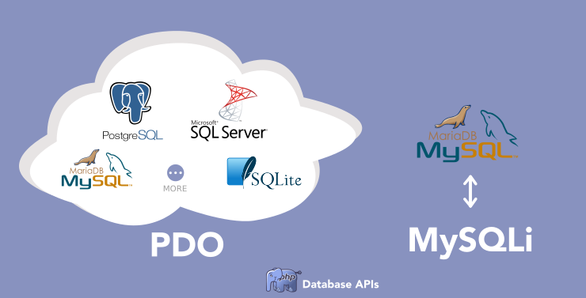

# Introduction aux bases de données avec PHP

Par [Valentin Brosseau](https://github.com/c4software) / [@c4software](http://twitter.com/c4software)

---

La base de données est un vaste sujet. Nous avons ici une introduction à ce qu'il faut connaitre **au minimum** pour avancer dans nos différents projets.

---

Les premières bases de données (en Anglais database) sont apparues en **1960**

---

## Coeur de l'informatique moderne.

---

## On stocke de plus en plus d'informations.

Chaque jour, **2,5 quintillions de bytes** de données sont générés.

---

## Attention dangers

Objet de toutes les convoitises

- Hack.
- Faille de sécurité.
- Injectin SQL.

---

## Plusieurs types de bases de données

- Relationnelles: SQL (MariaDB, MySQL, Postgresql, Oracle…)
- Non Relationnelles: NoSQL (MongoDB, Firestore, Redis… )

---

## Relationnelles

- SQL
- Intégré à Xampp, Wamp, … (MariaDB)
- Ensemble cohérent de données, avec des relations, contraintes entre les données
- Absence de redondances (découpage, clé, etc.)

---

## Non Relationnelles

- NoSQL (Not Only SQL)
- Gère de très gros volumes
- Ensemble de documents sans forcément avoir de structure identique.
- Redondances possibles (voire encouragés)

---

## Qu'est-ce qu'une base de données ?

---

- Ensemble de tables
- Qui contiendra des données structurées :
  - Type de données
  - Organisé en colonnes (nom, prénom …)
  - Avec des relations entre les tables (contraintes)

---


---

## Dans l'ensemble des cas (SQL _ou_ NoSQL)

### La Modélisation

---

## MCD

### **M**odèle **C**onceptuel de **D**onnées

Le minimum à connaitre, c'est une représentation universelle.

---

Technique pour représenter une base de données.

⚠️ Étape très importante, c'est la base de notre projet. ⚠️

---

- Structure de la base de données:
  - Nom des tables.
  - Nom des colonnes
  - Type de données.
- Contraintes relationnelles :
  - Contraintes entre les tables (nombre).
  - Jointure

---

## Concrètement un MCD c'est :

- Des rectangles avec des noms en haut
- Des traits entre les rectangles

---

| Table                     |
| ------------------------- |
| <u>#identifiant (int)</u> |
| nom (varchar)             |
| prénom (int)              |

- Un rectangle.
- En titre le nom de la table.
- En dessous la liste des champs avec le type de la donnée.
  - L'élément souligné est une clé (également préfixé par un `#`)

---

## Une clé ?

- Presque obligatoire.
- Représente une valeur unique dans la base.
- Effectuer des opérations sur la table (UPDATE, DELETE, …).
- Permettre la jointure entre les tables.

⚠️ Vous devez **toujours** avoir une clé ⚠️

---

## Votre premier MCD

- Des Utilisateurs (Identifiant, Nom, Prénom, Date de naissance, Sexe, Code Pays).
- Des pays (Code Pays, Nom).

---

## Comment faire ?

Pour réaliser le MCD nous avons plusieurs solutions :

- Avec un papier et un crayon.
- [DBDiagram](https://dbdiagram.io/home)
- [draw.io](http://draw.io/)

🤓 J'aime bien l'approche papier et un crayon.

Pourquoi ? Tout simplement pour ne pas être polluer par l'outil 👋.

---

## C'est à vous

```text
Des Utilisateurs (Identifiant, Nom, Prénom, Date de naissance, Sexe, Code Pays).
Des pays (Code Pays, Nom).
```

<iframe src="https://giphy.com/embed/ZVik7pBtu9dNS" width="480" height="268" frameBorder="0" class="giphy-embed" allowFullScreen></iframe>

---

## Ma version


---

Compliqué? Pas d'inquiétude, nous allons en refaire plusieurs.

---

## Gérer la base de données

### PHPMyAdmin

---


---

- Écrit en PHP.
- Gratuit.
- Visuel.
- S'utilise sans connaissance de SQL.

---

## Faisons le tour ensemble de l'interface

---

PHPMyAdmin est très complet et permet de tout faire. **Mais ce n'est pas le seul outil** qui permet d'administrer une base de données.

Nous avons également :

- [MySQLWorkbench (gratuit)](https://www.mysql.com/fr/products/workbench/)
- [DataGrip (payant)](https://www.jetbrains.com/datagrip/features/)
- [DBeaver (gratuit)](https://dbeaver.io/)

---

Je vous propose de tester DBeaver

---

## SQL : Le langage de requêtage

---

Nous avons un langage « universel » pour accéder / manipuler une base de données. Ce langage est découpé en 4 grandes catégories.

| Catégorie             | Mot-clé                                         | Usage                |
| --------------------- | ----------------------------------------------- | -------------------- |
| Définition d'une base | `CREATE`, `ALTER`, `TRUNCATE`, `DROP`, `RENAME` | Structure de la base |

---

| Catégorie                | Mot-clé                               | Usage                       |
| ------------------------ | ------------------------------------- | --------------------------- |
| Manipulation des données | `INSERT`, `UPDATE`, `DELETE`, `MERGE` | Gestion des données en base |

---

| Catégorie   | Mot-clé              | Usage                   |
| ----------- | -------------------- | ----------------------- |
| Transaction | `COMMIT`, `ROLLBACK` | Groupement d'opérations |

---

| Catégorie        | Mot-clé           | Usage                     |
| ---------------- | ----------------- | ------------------------- |
| Contrôle d'accès | `GRANT`, `REVOKE` | Droit d'accès aux données |

---

| Catégorie         | Mot-clé  | Usage                                      |
| ----------------- | -------- | ------------------------------------------ |
| Accès aux données | `SELECT` | Récupération d'enregistrements de table(s) |

---

## Obtenir des données

---

L'obtention de données se réalise avec la commande.

```sql
SELECT
```

---

**Toujours** formée de la même manière à savoir :

```sql
SELECT quoi FROM votreTable WHERE condition(s);
```

---

- `quoi` : Ce que vous souhaitez obtenir, `*` pour l'ensemble, sinon `nom_colonne` séparé par des virgules.
- `table` : La table que vous souhaitez requêter.
- `condition(s)` : La ou les condition(s) que vous souhaitez appliquer à votre récupération de données.

---

Exemple de table

| #id | nom      | prenom   | age | pays |
| --- | -------- | -------- | --- | ---- |
| 1   | Brosseau | Valentin | 33  | FR   |
| 2   | Doe      | John     | 14  | US   |
| 3   | Bernard  | Michel   | 56  | FR   |

---

```sql
-- Récupère l'ensemble des utilisateurs
SELECT * FROM utilisateurs;

-- Utilisateur de plus de 18ans
SELECT * FROM utilisateurs WHERE age > 18;

-- Utilisateurs de plus de 18ans et de France
SELECT * FROM utilisateurs WHERE age > 18 AND pays = "FR";

-- Nom et Prénom des Utilisateurs
SELECT nom, prenom FROM utilisateurs;
```

---

| Liste des opérateurs de conditions |                       |
| ---------------------------------- | --------------------- |
| =                                  | Égal à                |
| >                                  | Supérieur à           |
| <                                  | Inférieur à           |
| =>                                 | Strictement supérieur |
| >=                                 | Strictement inférieur |
| !=                                 | Différent de          |

---

| Liste des opérateurs de conditions |                                                   |
| ---------------------------------- | ------------------------------------------------- |
| BETWEEN                            | Entre deux valeurs `WHERE age BETWEEN 30 AND 50;` |
| LIKE                               | Recherche `WHERE nom LIKE 'val%';`                |
| IN                                 | Plusieurs valeurs `WHERE pays IN ('FRA','USA');`  |

---

## C'est à vous

- Nous allons maintenant créer notre première `base de données` et notre première `table` grâce à PHPMyAdmin.
- Insérer un jeu de données fictif.
- Réaliser des requêtes pour s'entrainer.

<iframe src="https://giphy.com/embed/ZVik7pBtu9dNS" width="480" height="268" frameBorder="0" class="giphy-embed" allowFullScreen></iframe>

---

## Pagination


---

```sql
-- Première page (0 à 10)
SELECT * FROM utilisateurs LIMIT 10 OFFSET 0;

-- Seconde page (10 à 20)
SELECT * FROM utilisateurs LIMIT 10 OFFSET 10;

--- …
```

---

## Ordre de récupération

Trier les résultat

```sql
-- Trier page age croissante
SELECT * FROM utilisateurs ORDER BY age ASC;

-- Trier page age décroissante
SELECT * FROM utilisateurs ORDER BY age DESC;
```

---

## Obtenir de données de plusieurs tables

Éviter la redondance / doublons vous vous souvenez ?

---

## Les jointures

Cette opération en SQL est appelée une `jointure`. Nous avons plusieurs façons de joindre les données.

---


---

Le choix dépend des données et des opérations que vous souhaitez faire.

Mais sachez que dans 90% du temps ce que vous souhaitez faire c'est un **LEFT JOIN**.

---

## C'est à vous

- Créer une seconde table (`pays`) elle contiendra la liste des pays en lien avec la table `utilisateurs` créés précédemment.
- Insérer une liste de pays suffisamment importante
- Créer la requête qui permet d'afficher les informations du pays en plus de l'utilisateur

---

| #code | nom       | iso_code |
| ----- | --------- | -------- |
| FR    | France    | FRA      |
| DE    | Allemagne | DEU      |
| IT    | Italie    | ITA      |

<iframe src="https://giphy.com/embed/ZVik7pBtu9dNS" width="480" height="268" frameBorder="0" class="giphy-embed" allowFullScreen></iframe>

---

## Ajouter des données

Autrement que via PHPMyAdmin, tel que vous allez le faire en PHP.

Via la commande `INSERT`

```sql
-- Ajout de certains champs
insert into utilisateurs (nom, prenom, age) values (1, 'Test'), (2, 'Insert'), (3, 22);

-- Tous les champs
INSERT INTO utilisateurs VALUES (99,'Test','Insert',12, 'IT');
```

---

## Modifier des données

Via la commande `UPDATE`

```sql
UPDATE utilisateurs SET name = 'valentin' WHERE name = 'Valentin-Update';
UPDATE utilisateurs SET name = 'Valentine' WHERE id = 1;
```

---

## Supprimer une donnée

```sql
DELETE FROM utilisateurs WHERE id = 1;
```

---

**Attention !!!** si vous oubliez le **WHERE** vous allez vider l'ensemble de la table. (Et aucun retour en arrière possible)

---

## C'est à vous

Testons ensemble.

<iframe src="https://giphy.com/embed/ZVik7pBtu9dNS" width="480" height="268" frameBorder="0" class="giphy-embed" allowFullScreen></iframe>

---

## MySQL et PHP

- Intégré
- Sécurisé
- Simple
- Documenté

---

## Plusieurs connecteurs SQL (API).

- mysql\_\* (déprécié, n'existe plus, mais vous trouverez encore peut-être des exemples en ligne **à éviter**)
- MySQLi (le remplacement de mysql\_\*)
- PDO (PDO_MySQL)

---

À mon avis **PDO** est doit-être votre choix par défaut dans le cas d'un nouveau projet.

---



---

## Travailler intelligemment

- Des includes
- Des variables
- Organisation

---

## Au minimum

- l'IP du serveur de base de données.
- Le login.
- Le mot de passe.
- Le nom de la base de données

---

## Créer une « librairie »

Le code suivant pourra vous servir dans l'ensemble de vos projets

---

`utils/db.php`:

```php
// Cette partie est à customiser
$server = "localhost";
$db = "bart";
$user = "root";
$passwd = "";
// Fin de la partie customisable

// Cette partie est générique à l'ensemble de vos projets utilisant une base de données.
$dsn = "mysql:host=$server;dbname=$db";
$pdo = new PDO($dsn, $user, $passwd);
```

---

## Pour l'utiliser ?

- inclure `utils/db.php` dans les pages ou c'est nécessaire.

---

## Mise en pratique

- [Persister Bart en Base de données](/tp/php/sql/tp5.md)
- [Greta TV personnalisable](/tp/php/sql/tp6.md)
