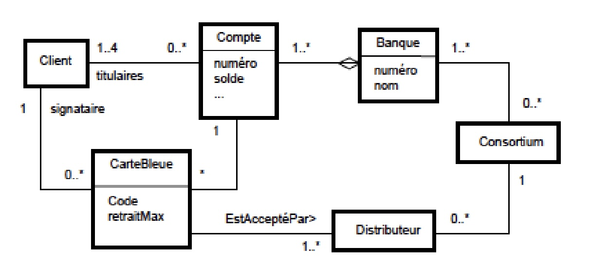
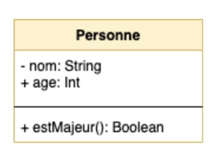
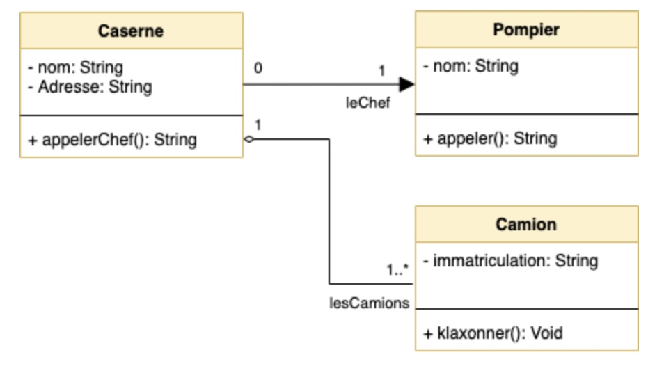

# Les diagrammes de classe

## Représenter les classes

Par [Valentin Brosseau](https://github.com/c4software) / [@c4software](http://twitter.com/c4software)

---

## Abstraction d’un ensemble d’objets

_[Image empruntée à J.-M. Jezequel]_

---

### Un diagramme de classes est un graphe :

- Nœud du graphe = Classe.
- Le lien = Relation entre des classes.

---

### Les multiplicités

---

### La navigabilité 1/2

Par défaut :

- Navigabilité dans les deux sens
- C1 a un attribut de type C2 et C2 a un attribut de type C1

---

### La navigabilité 2/2

Spécification de la navigabilité :

- Orientation de l’association
- C1 a un attribut du type de C2, mais pas l’inverse

---

### Attributs et des opérations au sein d'une classe

---

### Un cas simple

---

#### Deux classes

---

### Un peu plus complexe

---

### Un cas complet

