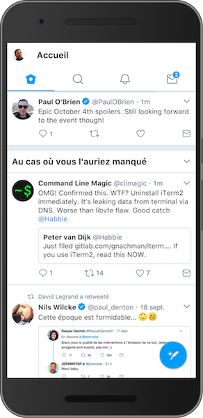
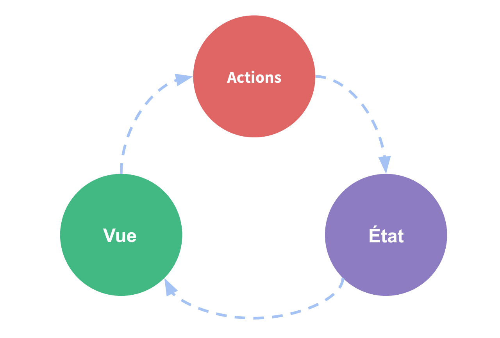
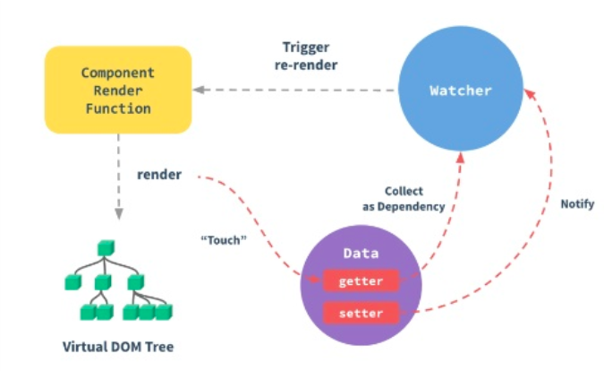
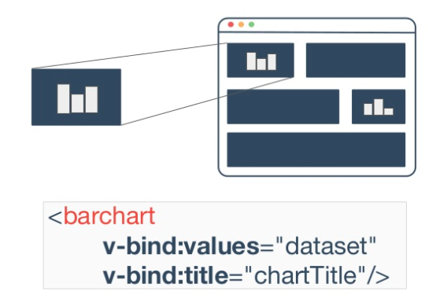
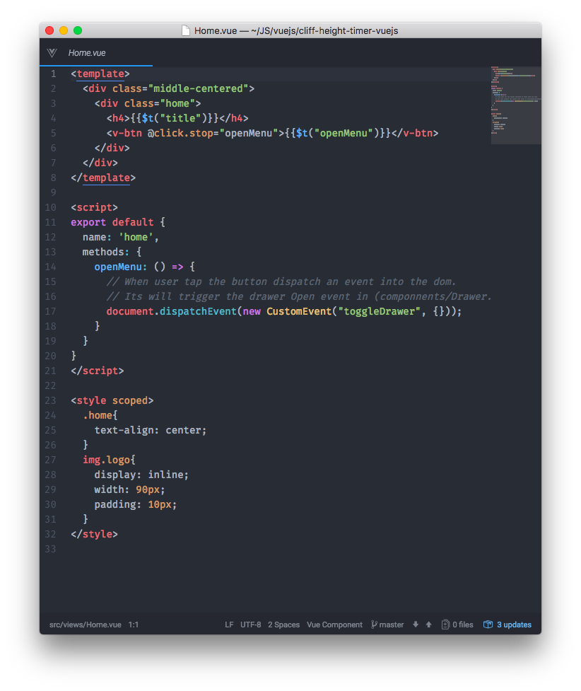
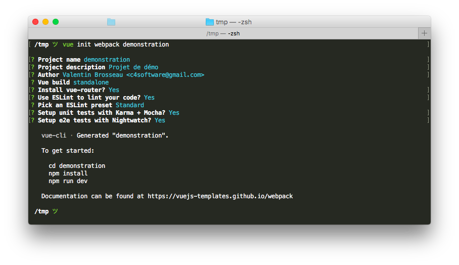
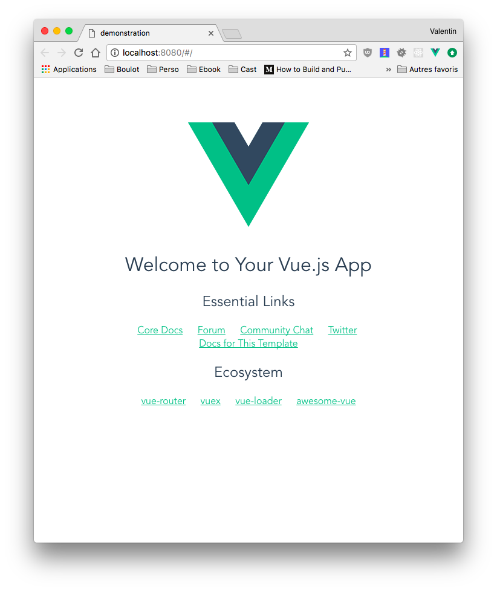
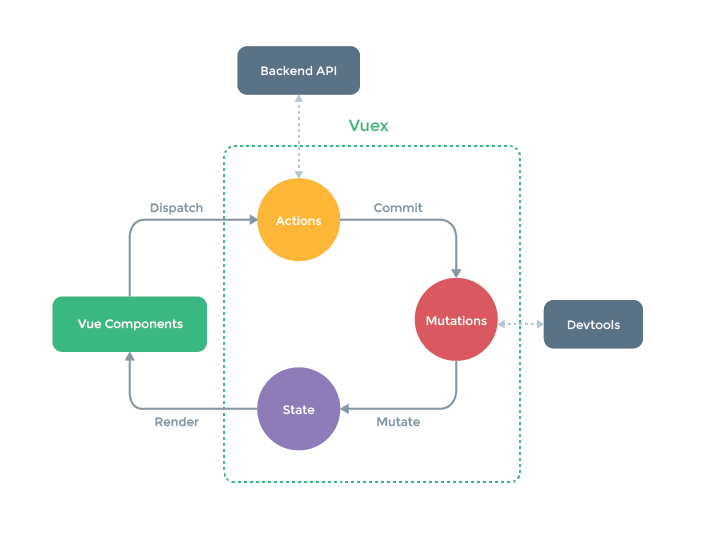

# VueJS

## Progressive JavaScript framework

Par [Valentin Brosseau](https://github.com/c4software) / [@c4software](http://twitter.com/c4software)

---

### Progressive

Qui se passe ou se développe progressivement ou par étapes.

### PWA

Progressive Web Apps

---

### Le monde de demain sera Web

#### Exemple de PWA

- <https://appsco.pe/> (Liste d'exemples)
- <https://pwa.rocks/> (Liste d’exemples)
- <https://mobile.twitter.com>
- <https://m.facebook.com> (volontairement bridé)

---



---

Bluffant n’est-ce pas ? (psst c’est du ReactJS)

---

### Concretement une PWA c’est quoi


---

- Pour tous, quelques soit le navigateur
- Responsive
- Indépendant du réseau (via des services Workers, fonctionne hors-ligne ou en ligne)
- App-like
- Toujours à jour
- Sûre (HTTPS)
- Découvrable et identifié comme application grâce au fichier manifest
- Notifications, envoyer de l’informations
- Installable
- Partageable (oui, c’est « juste » un lien)

---

### Les points clefs

- Le manifest ([Lien](https://developer.mozilla.org/fr/docs/Web/Manifest))
- Les services Workers ([Lien](https://developer.mozilla.org/fr/docs/Web/API/Service_Worker_API/Using_Service_Workers))

---

### Les acteurs

- Google
- Firefox
- Microsoft
- …

---

### Repose sur le HTML5

Attention au support des navigateurs

- [Can I Use : Connaitre le support d’une fonctionnalitée](https://caniuse.com)
- [MDM Webdoc](https://developer.mozilla.org/)

---

### VueJS, pourquoi faire…

Faire des PWA simplement (il y en a d'autres bien évidement, en connaissez-vous ?)

---

### Le créateur

- Evan You
- Ancien de chez Google
- Depuis 2016 à temps plein pour Vue.JS

---

### Historique

- Création : **2013**
- Première version « stable » **Fevrier 2014**
- **V1.0** Octobre 2015
- La version **3** arrive. Stable mais reste en version `@next`.
- La version **2** toujours distribué sur les CDN.

---

### Pourquoi VueJS

Et pas ReactJS ou Angular…

- VueJS est « plus simple »
- Le site de VueJS est plus clair ?
- La fondation Apache ne veut pas des projets ReactJS ([C’est un signe…](https://www.theregister.co.uk/2017/07/17/apache_says_no_to_facebook_code_libraries/))
- Mais… Facebook à annoncer un changement dans les licences (très récemment)

---

### VueJS en quelques mots

- Flexible
- Performant
- Apprentissage très simple
- Orienté composants

---

### Quelques stats

[Nous sommes à un click de la réponse](https://hasvuepassedreactyet.surge.sh/)

---

### Qui utilise VueJS

- GitLab
- Weex (Alibaba)
- Baidu
- …

---

## Comment VueJS fonctionne

- Virtual DOM (ne « re-dessine » que les zones modifiées)
- Fonctionnement en composant
- Des « .Vue » / Monofichier
- Un cycle de vie complet pour chaque composant

---



---



---

### L’objet VueJS

```js
var vm = new Vue({
  // Options
});
```

---

- Constructeur de l’objet
- Propriétés et méthodes (mounted, et _VOS_ méthodes)
- Cycle de vie

---

[](./img/component-lifecycle.png)

---

```js
var vm = new Vue({
  el: "#demo",
  data() {
    return { compteur: 1 };
  },
  mounted() {
    console.log("Le compteur est : " + this.compteur);
  },
});
```

---

## Un « vrai » exemple

[Démo](https://cours.brosseau.ovh/cours/demo/vuejs/demo1.html)

---

### Les directives (Dans le template)

Les directives sont des attributs html propre à VueJS

- v-on (ou plus simplement `@`)
- v-bind
- v-model
- v-html
- v-show (masque un élément avec la propriété display: css)
- v-if
- v-else
- v-else-if
- v-for

---

### Les méthodes

Code utilisable dans votre objets. « Votre code », accessible via le `this` :

```js
var vm = new Vue({
  el: "#demo",
  data() {
    return { compteur: 1 };
  },
  methods: {
    message() {
      alert(`La valeur du compteur est ${this.compteur}`);
    },
  },
});
```

---

```js
this.message();
```

---

### Gestion des évènements

Exemple d'objet :

```js
    var vm = new Vue({
        el: "#demo"
        data(){
          return { compteur: 0 }
        },
        methods: {
            message(message){
                alert(message)
            }
        }
    });
```

---

```html
<div id="demo">
  <button @click="message('yolo')">Yolo</button>
  <button v-on:click="compteur += 1"></button>
  <p>Vous avez cliqué : {{compteur}}</p>
</div>
```

---

### Les conditions d’affichage

---

```html
<div v-if="chaine === 'TEST'">1</div>
<div v-else-if="chaine === 'TEST1'">2</div>
<div v-else>Non 1 non 2</div>
```

---

### Les listes / Boucles

```html
<ul>
  <li v-for="(item, index) in items">{{item.message}}</li>
</ul>
```

---

### À votre avis comment doit-être la structure de la données ?

---

```js
data: {
  items: [
    { message: "Message 1" },
    { message: "Message 2" },
    { message: "Message 3" },
  ];
}
```

---

### Les évènements HTML / Les touches de modifications

```html
<!-- Arrêt de la propagation de l’évènement -->
<a @click.stop="clickEvent"></a>

<!--
  Le « submit » est intercepté, et le navigateur ne rechargera plus la page
-->
<form @submit.prevent="onSubmit"></form>

<!-- Il est possible de les chainer -->
<a @click.stop.prevent="clickMessage"></a>

<!-- Également disponible tab, delete, esc, space, ... -->
<input @keyup.enter="submit" />
```

---

### Les « Watchers »

Observation des « Data », pour réagir en code aux modifications de l'état de votre objet.

```js
var vm = new Vue({
  el: "#demo",
  data() {
    return { compteur: 1 };
  },
  watch: {
    compteur() {
      console.log(`La valeur est maintenant de ${this.compteur}`);
    },
  },
});
```

---

## Etc…

VueJS c'est simple et très complet. La suite en pratique et sur [le site de VueJS](https://vuejs.org/v2/guide/)

---

### VueJS « Deux modes » de fonctionnement

- J’ajoute VueJS dans un développement (classique) existant (**sans** Webpack)
- Je crée une « application » JavaScript (**avec** Webpack)

---

### Premier usage, dans une « page web »

- Librairie externe à ajouter au projet (« vuejs.js »).
- S'utilise un peu comme jquery.
- Le but rendre « réactif » un développement basique
- C'est puissant, et très simple. Un exemple.

---

### Cas pratique

---

### Créer une page Web comme… une application

- Pour vous, qu'est-ce que cela veux dire ?

---

On est vraiment loin d’une page Web dans la conception

- Gestion avec des imports
- Gestion des dépendances
- Similaire à une gestion classique (Comme Java, .Net…)

---

### Les dépendances

---

#### Le package.json

- Des dépendances pour la phase de développement.
- Des dépendances utiles pendant le fonctionnement de l’application.
- Gestion fine des versions (très important, pourquoi ?)
- Les dépendances ont également des dépendances, etc.

---

## Un composant

---

### La force des VueJS

---

### Mais c’est quoi

- Un élément réutilisable
- Code générique



---

### Puissant car …

Un composant ce n'est pas que du javascript.

```html
<template> […] </template>

<script>
  export default {
    name: "exemple",
  };
</script>

<style scopped>
  […]
</style>
```

---

C'est possible grâce à la puissance de **webpack**.

---

## Webpack


---

## Webpack…

C'est deux éléments importants

---

## Webpack-dev-server

- Utilisé pendant la phase de développement.
- Serveur integré
- Surveille les changements (et recharge automatiquement)
- Hot reload

---

### Le « Module Bundler »

- Assemble les « modules JavaScript ».
- Concatenation « intelligente »
- Découpe les JS pour la distribution
- Assemble aussi des modules « css » (jusqu’aux images incluses)

---

### Et pour VueJS


---

### Le composant c’est

---

## Un fichier


- Le template
- Une CSS « scopée » / qui ne s’applique que pour le module
- Gestion des pré-processeur (Babel, Stylus, Sass, …)

---

### C’est possible grâce à Webpack

- Rechargement automatique
- Sans perdre le contexte grâce au « Hot Reload »



---

### Quelques différences avec les précédents exemples…

```js
var vm = new Vue({
  el: "#demo",
});
```

```js
export default {
  data: () => {
    return { demo: 1 };
  },
};
```

---

### Sauf que …

#### Webpack c’est « compliqué » à mettre en place

---

### Chez VueJS ils ont créé vue-cli

- Template de projet.
- Rapide.
- Étendable (plugin).
- Mise à jour simple.

---

### Sorcellerie


---

### Comment fait-on ?

---

```sh
$ npm install -g @vue/cli
… Installation …
```

---

```sh
vue create demonstration
```

---



---

### Le projet est « initialisé »

Psss: Chez VueJS ils sont sympas ils ont init le projet git pour vous.

---

### Et c'est tout

---

### Vue UI. Une GUI de gestion


---

### Démo

C’est toujours mieux en vrai…

---

### Lancement du code en Dev

```sh
$ npm run dev
… Lancement du serveur intégré …
```




---

### La force de VueCLI c'est une gestion des plugins

```sh
$ vue add router
… Modification AUTOMATIQUE du projet …
$ vue add vuex
… Modification AUTOMATIQUE du projet …
```

---

### Le router

- Gestion des « routes »
- Gestion des paramètres
- Assemblage

[Documentation](https://router.vuejs.org/fr/)

---

### Les devs tools

- Intégration dans le processus de développement
- Permets de voir les « vue »
- L’état de vue
- Le « store »

---

### Démo Dev Tools


[Démo](https://cours.brosseau.ovh/cours/demo/vuejs/demo1.html)

---

### Communication entre les .Vue

- Événements natif
- Store
- Des composants Fils

---

### Le « store »


---

### Le store : Vuex

- Gestionnaire d'état
- Bibliothèque (optionel) à VueJS
- Zone de stockage de données centralisée pour tous les composants dans une application
- S'assurer que l'état reste « cohérent »
- Visualisation de l’état grace au dev-tools

---

### Fonctionnement



---

### Quand utiliser un « store »

- Application multi-vues
- Besoin de synchronisation entre les vues
- Évènement globaux entre les vues

---

### Démo store

[Exemple simple](https://vuex.vuejs.org/fr/getting-started.html)

---

### L’affichage

### Mais je ne suis pas un graphiste


---

### La solution Vuetify

- Ensemble de composants pour l’interface
- Respect Material Design
- Responsive
- Générique


---

### Mais c’est génial


[La documentation](https://vuetifyjs.com/)

[Démo](https://github.com/c4software/Cliff-Height-Timer-VueJS)

---

## Un aperçu du futur

- Pourquoi utiliser un bundler (Webpack) ?
- Et pourquoi ne plus utiliser de bundler ?
- La solution PikaPKG / Snowpack
- [Une autre solution par le créateur de vue : « Vite »](https://github.com/vitejs/vite)

---

## VueJS 3.0

- Réécriture.
- Fonctionnement très similaire.
- TypeScript intégré.
- Simplifier l'écriture de « gros composants ».

---

## Gros changement l'observation des données

- La méthode `data()` (à l'ancienne)
- La méthode `setup()` (nouveau)

---

## L'API de composition

- Définition des données à observer.
- Partager du code « d'initialisation » / « d'observation ».
- Partager des méthodes « à ajouter a votre objet Vue ».

---

### Deux exemples

---

```typescript
setup: () => {
  // Déclaration d'une variable « observé » de type Int
  const count = ref(0);

  // Déclaration d'une seconde variable « observé » de type String
  const title = ref("Ceci est un titre");

  // Ne pas oublier de retourner les observations afin que VueJS réagisse au changement des variables en question.
  return { count, title };
};
```

---

_En utilisant [vueuse](https://github.com/vueuse/vueuse)_

```typescript
import { useMouse, usePreferredDark, useLocalStorage } from '@vueuse/core'

export default {
  setup() {
    // tracks mouse position
    const { x, y } = useMouse()

    // is user prefers dark theme
    const isDark = usePreferredDark()

    // persist state in localStorage
    const store = useLocalStorage(
      'my-storage',
      {
        name: 'Apple',
        color: 'red',
      },
    )

    return { x, y, isDark, store }
  }
})
```

---

## TypeScript ?

- Permets de typer nos variables.
- Complètement optionnel (mais je vous le conseille).

---

## ViteJS

- Permets la création de projets
- Rapide
- Simple
- Ne fonctionnera que sur les navigateurs « récents »

---

## Mettre en pratique

[VueJS 3.0 + Vite](/tp/vuejs3/vite.md)

---

### Des questions

(Il doit y en avoir beaucoup)
