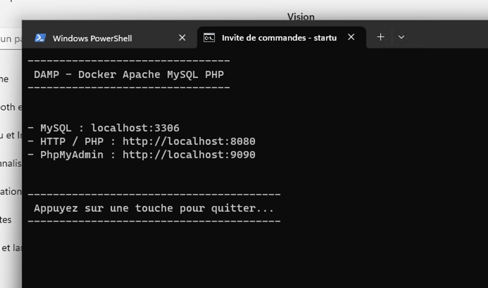
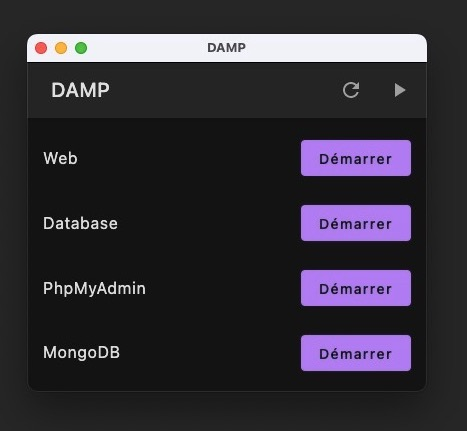

# DAMP : Docker Apache MySQL PHP

Document présentant l'installation de Docker, Apache, MySQL et PHP.

::: details Sommaire
[[toc]]
:::

## Introduction

DAMP est un acronyme pour Docker Apache MySQL PHP. Il s'agit d'un environnement de développement pour les applications web. Il repose sur Docker et permet de créer un environnement de développement en quelques minutes.

### Que contient DAMP ?

DAMP contient les éléments suivants :

- PHP 8.2.7
- MariaDB 10.9
- PHPMyAdmin (dernière version)
- MongoDB (dernière version)
- MailHog (dernière version, serveur SMTP pour le développement)

### DAMP c'est deux choses

- Un stack via Docker Compose pour créer un environnement de développement.
- Une interface graphique pour gérer les conteneurs (Démarrer, arrêter, etc.).

::: tip L'interface graphique

L'interface graphique est optionnelle, vous pouvez très bien utiliser DAMP sans l'interface graphique en utilisant uniquement le script `startup.sh`.

👋 Je vous conseille vivement, d'utiliser l'interface en ligne de commande, elle est plus simple à utiliser et plus rapide à démarrer.

:::

## Prérequis

Pour fonctionner, vous devez avoir installé Docker et Docker Compose sur votre machine. Pour cela, il vous suffit d'installer Docker Desktop :

- [Installer Docker](https://docs.docker.com/get-docker/)

::: tip Docker Desktop

Il est possible que Docker Desktop vous demande de créer un compte. Vous pouvez le faire, mais ce n'est pas obligatoire.

Il est également possible que Docker Desktop vous demande de mettre à jour votre WSL. Pour cela, il vous suffit de suivre les instructions :

- Ouvrir un terminal (cmd, powershell, etc.)
- Exécuter la commande suivante : `wsl --update`

::::

## Installation & Lancement

L'interface graphique n'est pas pré-compilée pour Linux et MacOS. Vous pouvez [la compiler vous même](https://github.com/c4software/DAMP), mais je vous conseille d'utiliser la version en ligne de commande :

- 1. [Télécharger la stack docker](https://github.com/c4software/DAMP-docker-stack/archive/refs/tags/1.1.zip).
- 2. Lancer Docker.
- 2. Éxraire l'archive de DAMP.
- 3. Plusieurs solutions s'offrent à vous :
  - Sous Windows : `startup.bat` (lancement sans gestion des ports dynamiques) **RECOMMANDÉ**
  - Sous Windows : `startup.ps1` (lancement avec gestion des ports dynamiques)
  - Sous Linux / MacOS : `startup.sh` (lancement avec gestion des ports dynamiques)

::: tip Première utilisation

Lors de la première utilisation, les images sont téléchargées et préparées. Cela peut prendre plusieurs minutes. Vous pouvez suivre l'avancement dans le terminal.

:::

::: details Installation GUI (Windows uniquement, non recommandé)

Pour installer DAMP, il suffit de :

- 1. [Télécharger DAMP](https://github.com/c4software/DAMP/raw/master/distribuable/win-1.0.zip)
- 2. Décompresser l'archive.
- 3. Lancer le `damp.exe`.

Le premier démarrage peut prendre plusieurs minutes, le temps de télécharger les images Docker. Vous pouvez utiliser le bouton `Refresh` pour actualiser l'état. Vous pouvez également ouvrir la feneêtre de Docker Desktop pour suivre l'avancement (dans la partie Conteneurs).

:::

## Utilisation

_Démo interface en ligne de commande :_

<iframe width="560" height="315" src="https://www.youtube.com/embed/n3xNIprTFMU" frameborder="0" allow="accelerometer; autoplay; clipboard-write; encrypted-media; gyroscope; picture-in-picture" allowfullscreen></iframe>

::: details Utilisation GUI (Windows uniquement, non recommandé)

_Démo interface graphique :_

<iframe width="560" height="315" src="https://www.youtube.com/embed/5KvGDLrcasw" frameborder="0" allow="accelerometer; autoplay; clipboard-write; encrypted-media; gyroscope; picture-in-picture" allowfullscreen></iframe>

:::

## Configuration

La configuration de DAMP se fait en modifiant les fichiers :

- `docker-compose.yml` : Contient la configuration des conteneurs
- `dockerfiles/php.dockerfile` : Contient la configuration de PHP (extensions, etc.)

La configuration de l'interface graphique se fait en modifiant le fichier `configuration.yaml` :

- `home` : Chemin **absolu** vers le dossier contenant le fichier `docker-compose.yml`.
- `dockerStackHome`: Chemin **absolu** ou **relatif** vers les dossiers qui seront montés dans les conteneurs. (vous pouvez laisser `./`, cela correspond au dossier contenant le fichier `docker-compose.yml`)
- `services` : Liste des services à afficher dans l'interface graphique.

## Où sont les fichiers ?

Vos fichiers Web doivent être placés dans le dossier `data/htdocs`. Ce dossier est monté dans le conteneur Apache.

Ils seront ensuite accessibles via l'adresse spécifiée dans la configuration de l'interface graphique ou dans le terminal.

Vous avez de base un fichier `index.php` qui affiche le `phpinfo()`.

## FAQ

### Comment accéder à PHPMyAdmin ?

PHPMyAdmin est accessible à l'adresse suivante : [http://localhost:9090](http://localhost:9090). Cette information est également disponible dans l'interface graphique ou dans le terminal.

### Comment accéder à MongoDB ?

MongoDB est accessible à l'adresse suivante : [http://localhost:27017](http://localhost:27017). Cette information est également disponible dans l'interface graphique ou dans le terminal.

🚨 MongoDB n'est pas démarré par défaut, il faut le démarrer dans l'interface graphique ou dans le terminal. 🚨

### Comment accéder à MariaDB ?

MariaDB est accessible via le port `3306` sur l'adresse `localhost`. Si vous souhaitez utiliser un client graphique, vous pouvez utiliser [DBeaver](https://dbeaver.io/) ou PHPMyAdmin disponible à l'adresse suivante : [http://localhost:9090](http://localhost:9090).

### Comment accéder à PHP ?

PHP est accessible à l'adresse suivante : [http://localhost:8080](http://localhost:8080). Cette information est également disponible dans l'interface graphique ou dans le terminal.

⚠️ Les sources sont à mettre dans `data/htdocs`. ⚠️

### Comment accéder à MailHog ?

MailHog est accessible à l'adresse suivante : [http://localhost:8025](http://localhost:8025). Cette information est également disponible dans l'interface graphique ou dans le terminal.

MailHog expose également un serveur SMTP sur le port `1025` de l'adresse `localhost`.

### Est-ce Open Source ?

Oui DAMP est Open Source, vous pouvez retrouver le code source sur GitHub :

- [L'interface graphique](https://github.com/c4software/DAMP)
- [La Stack Docker (et le script de démarrage)](https://github.com/c4software/DAMP-docker-stack)

### Comment puis-je contribuer ?

Vous pouvez contribuer de plusieurs manières :

- En utilisant DAMP et en remontant les bugs.
- En remontant les bugs sur GitHub.
- En proposant des améliorations sur GitHub.
- En proposant des améliorations sur le Slack de la classe.

### Comment puis-je vous contacter ?

Vous pouvez me contacter via :

- [Twitter](https://twitter.com/c4software)
