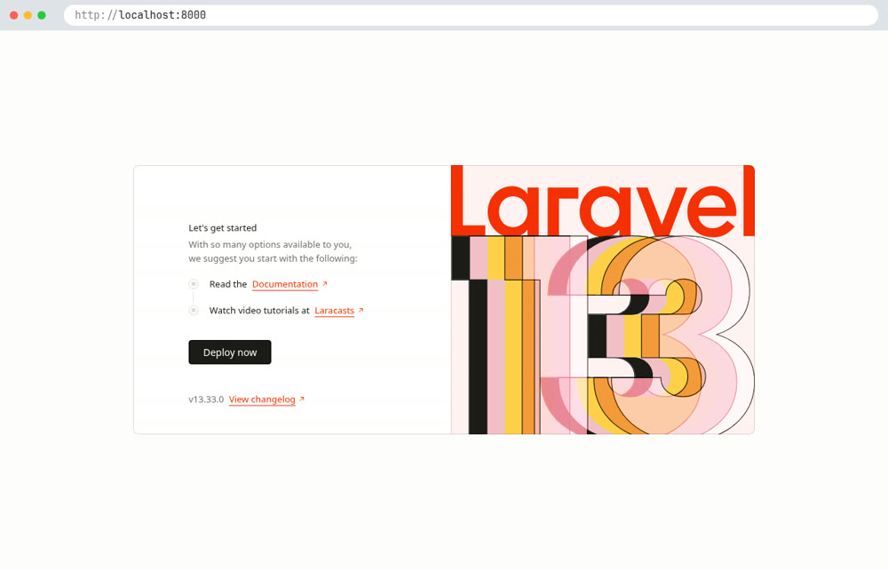

# La dev-box : votre environnement de développement dans Docker

Document présentant l'installation et l'utilisation de la dev-box, l'environnement de développement qui remplace DAMP.

::: details Sommaire
[[toc]]
:::

## Introduction

La dev-box est un environnement de développement complet qui tourne dans **un seul conteneur Docker**. À l'intérieur, vous avez une vraie machine Linux (Arch Linux) dans laquelle vous installez, en une commande, les langages dont vous avez besoin : PHP, Laravel, Python, Node.js, Java, etc.

Vous ne « lancez » pas la dev-box comme un logiciel : vous vous y **connectez en SSH**, exactement comme vous le feriez sur un serveur. Vos fichiers, eux, restent visibles sur votre ordinateur : vous pouvez coder dans le terminal de la dev-box (avec Neovim, déjà configuré) ou avec votre éditeur habituel (VSCode, PhpStorm, etc.).

::: tip Conteneur ou machine virtuelle ?

Un conteneur n'est pas une machine virtuelle : il partage le noyau de votre machine, il est donc beaucoup plus léger. Si la notion est encore floue, l'[aide-mémoire Docker](/cheatsheets/docker/) est un bon point de départ.

:::

### Que contient la dev-box ?

La dev-box contient les éléments suivants :

- Des environnements de développement à installer en une commande (`devbox dev-env`) : PHP et Composer, Laravel, Symfony, Node.js, Python, Java, Go, Rust, .NET, Flutter, etc.
- Des bases de données à la demande (`devbox dbs`) : MariaDB, MySQL, PostgreSQL, Redis, MongoDB.
- Docker dans la dev-box : `docker run` et `docker compose` fonctionnent à l'intérieur (grâce à Podman).
- Un terminal prêt à l'emploi : zsh, tmux, Neovim (LazyVim), lazygit, yazi (gestionnaire de fichiers), fzf, etc.
- Un catalogue d'outils en ligne de commande à installer au besoin (`devbox tui`) : btop, lazydocker, pgcli, etc.
- Les agents de code en ligne de commande (Claude Code, Codex, opencode, etc.).

### Pourquoi c'est intéressant ?

- **Le même environnement pour tout le monde.** Fini le « chez moi ça marche » : toute la classe a les mêmes versions.
- **Rien à installer sur votre machine**, à part Docker. Vous voulez tout supprimer ? Un dossier à effacer, et c'est tout.
- **Vous installez uniquement ce dont vous avez besoin.** Un menu, vous cochez Laravel et Python, c'est prêt.
- **Vos données survivent.** Votre dossier personnel et vos projets sont stockés dans des volumes : mettre à jour la dev-box ne supprime rien.
- **Vous travaillez comme sur un vrai serveur Linux.** SSH, terminal, services : les réflexes que vous prenez ici sont ceux que vous utiliserez en production (voir par exemple [Installer Docker sur une Debian](/cheatsheets/serveur/debian-docker.md)).
- **Une seule commande à retenir : `devbox`.** Elle liste tout ce que la dev-box sait faire, avec un menu.
- **Rien ne se met à jour dans votre dos.** La dev-box vous prévient quand une mise à jour est disponible, c'est vous qui décidez quand l'appliquer.

::: tip Et DAMP ?

La dev-box remplace DAMP. DAMP fonctionne toujours (le code reste disponible sur [GitHub](https://github.com/c4software/DAMP-docker-stack)), mais il n'évolue plus : PHP n'y est plus à jour et MailHog n'est plus maintenu. Si vous démarrez, partez directement sur la dev-box.

:::

## Prérequis

Pour fonctionner, vous devez avoir installé Docker et Docker Compose sur votre machine. Pour cela, il vous suffit d'installer Docker Desktop :

- [Installer Docker](https://docs.docker.com/get-docker/)
- Sous Debian (ou un serveur Linux), suivez plutôt l'aide-mémoire [Installer Docker sur une Debian](/cheatsheets/serveur/debian-docker.md).

::: tip Docker Desktop

Il est possible que Docker Desktop vous demande de créer un compte. Vous pouvez le faire, mais ce n'est pas obligatoire.

Il est également possible que Docker Desktop vous demande de mettre à jour votre WSL. Pour cela, il vous suffit de suivre les instructions :

- Ouvrir un terminal (cmd, powershell, etc.)
- Exécuter la commande suivante : `wsl --update`

:::

Vous avez également besoin d'une **clé SSH** : c'est elle qui vous permet d'entrer dans la dev-box, sans mot de passe. Si vous n'en avez pas encore, suivez l'aide-mémoire [La clé SSH](/cheatsheets/ssh-key/) (une seule commande : `ssh-keygen -t ed25519`).

## Installation & Lancement

_Démo, de zéro à la première connexion :_

<video controls preload="metadata" poster="./res/dev-box-creation.jpg" src="./res/dev-box-creation.mp4" style="width: 100%; border-radius: 8px;"></video>

Cinq étapes, quelques minutes (le plus long est le premier téléchargement de l'image).

**1. Récupérer la dev-box**

```bash
git clone https://github.com/c4software/dev-box.git
cd dev-box
cp .env.example .env
```

Pas de Git sur votre machine ? Vous pouvez aussi [télécharger l'archive](https://github.com/c4software/dev-box/archive/refs/heads/main.zip) et l'extraire.

**2. Modifier trois lignes du fichier `.env`**

Ouvrez le fichier `.env` avec l'éditeur de votre choix (Neovim dans la vidéo, mais le Bloc-notes ou VSCode font très bien l'affaire) et modifiez les lignes suivantes :

```bash
# Utiliser l'image déjà construite (pas de compilation sur votre machine)
DEVBOX_IMAGE=ghcr.io/c4software/dev-box:latest

# Connexion SSH classique (sans Tailscale)
TS_DISABLE=true

# Votre clé publique (le contenu de ~/.ssh/id_ed25519.pub)
SSH_AUTHORIZED_KEYS="ssh-ed25519 AAAA... vous@votre-pc"
```

Pour afficher votre clé publique : `cat ~/.ssh/id_ed25519.pub` (fonctionne aussi dans PowerShell). Copiez **toute** la ligne.

**3. Rendre le port 8000 accessible depuis votre navigateur**

Créez un fichier `compose.override.yaml` à côté de `compose.yaml` :

```yaml
services:
  dev-box:
    ports:
      - "127.0.0.1:8000:8000"
```

Cette ligne redirige le port `8000` de votre machine vers le port `8000` de la dev-box : c'est exactement le même principe que dans l'aide-mémoire [Installer Docker sur une Debian](/cheatsheets/serveur/debian-docker.md#heberger-un-site-php).

**4. Démarrer**

```bash
docker compose up -d
```

Vous pouvez suivre le démarrage avec `docker compose logs -f` (`Ctrl + C` pour quitter les logs, la dev-box continue de tourner).

**5. Se connecter**

```bash
ssh -p 2222 dev@localhost
```

À la première connexion, SSH vous demande si vous faites confiance à cette machine : répondez `yes`. Et voilà, vous êtes dans la dev-box 🎉

::: tip Première utilisation

Lors de la première utilisation, l'image (environ 2 Go) est téléchargée, puis la dev-box prépare votre dossier personnel et installe ses outils en tâche de fond. Cela peut prendre plusieurs minutes.

À la première connexion, la dev-box vous propose une visite guidée de deux minutes. Je vous conseille de l'accepter ; vous pourrez la relancer plus tard avec `devbox tour`.

:::

### Accéder à la dev-box depuis n'importe où (optionnel)

Par défaut, la dev-box est pensée pour [Tailscale](https://tailscale.com/) : un réseau privé entre vos machines. Avec Tailscale, vous pouvez vous connecter à votre dev-box depuis n'importe quel appareil (un autre PC, une tablette, etc.) sans ouvrir de port sur votre box Internet.

Pour l'utiliser, laissez `TS_DISABLE=false` dans le `.env`, démarrez la dev-box, puis ouvrez l'adresse affichée dans `docker compose logs -f` pour ajouter la machine à votre réseau Tailscale. Vous vous connectez ensuite avec :

```bash
ssh dev@dev-box
```

Tout est détaillé dans le [README du projet](https://github.com/c4software/dev-box#quick-start).

## Installer vos environnements

La dev-box démarre légère : c'est à vous d'installer les langages dont vous avez besoin. Une seule commande :

```bash
devbox dev-env
```

Un menu s'ouvre : choisissez « Install environments », cochez les environnements avec `x`, puis validez avec `Entrée`. Par exemple, pour les TP de cette année : `laravel` (qui installe aussi PHP, Composer et Node.js) et `python`.

Vous préférez sans menu ? C'est la même chose en une ligne :

```bash
devbox dev-env laravel python
```

Quelques commandes utiles :

- `devbox dev-env --list` : la liste des environnements disponibles, ceux installés sont marqués d'une étoile.
- `devbox dev-env --info laravel` : ce que l'environnement installe (et ce qu'une suppression laisse en place).
- `devbox dev-env --remove python` : supprime un environnement (vos projets ne sont jamais touchés).

::: details Que se passe-t-il derrière ?

Les environnements sont installés avec [mise](https://mise.jdx.dev/), un gestionnaire de versions : chaque outil est déclaré dans `~/.config/mise/config.toml`, dans votre dossier personnel. C'est pour cette raison qu'ils survivent à une mise à jour de la dev-box.

PHP fait exception : le compiler prendrait plusieurs minutes, il est donc déjà intégré à l'image (avec Composer, Xdebug et les extensions habituelles). `devbox dev-env php` vérifie simplement qu'il est prêt.

Vous voulez que certains environnements soient toujours installés, même sur une dev-box toute neuve ? Ajoutez-les dans le `.env` : `DEV_ENVS="laravel python"`.

:::

## Utilisation

_Démo, un projet Laravel (comme dans le TP [Introduction à Laravel](/tp/laravel/introduction.md)) puis Python :_

<video controls preload="metadata" poster="./res/dev-box-utilisation.jpg" src="./res/dev-box-utilisation.mp4" style="width: 100%; border-radius: 8px;"></video>

Dans cette vidéo, je :

1. installe Laravel et Python avec le menu `devbox dev-env` ;
2. crée un projet Laravel avec `composer create-project`, comme dans le TP ;
3. ouvre un second panneau tmux (`Ctrl + Espace` puis `v`) pour lancer le serveur avec `php artisan serve --host=0.0.0.0` ;
4. affiche le site dans le navigateur, sur [http://localhost:8000](http://localhost:8000) ;
5. ajoute une route `/ping` dans `routes/web.php` avec Neovim, puis la teste avec `curl` et dans le navigateur ;
6. crée un petit script Python, toujours avec Neovim, et l'exécute.

Le résultat dans le navigateur de votre machine :



::: tip Pourquoi --host=0.0.0.0 ?

Par défaut, `php artisan serve` (comme `php -S`) n'écoute que sur `127.0.0.1`, c'est-à-dire **à l'intérieur** de la dev-box. Avec `--host=0.0.0.0`, le serveur accepte aussi les connexions qui arrivent de l'extérieur du conteneur, donc de votre navigateur.

:::

Les commandes à retenir :

| Commande                   | Ce qu'elle fait                                             |
| -------------------------- | ----------------------------------------------------------- |
| `devbox`                   | Menu avec toutes les commandes de la dev-box                |
| `devbox dev-env`           | Installe ou supprime des environnements (menu)              |
| `devbox dbs mariadb`       | Démarre MariaDB (voir [les bases de données](#les-bases-de-donnees)) |
| `devbox tui`               | Installe des outils en ligne de commande (btop, etc.)       |
| `devbox status`            | État de la dev-box (outils, bases, mises à jour)            |
| `devbox update`            | Met à jour les outils, quand vous le décidez                |
| `devbox tour`              | Relance la visite guidée                                    |

### Le terminal : tmux et Neovim

En vous connectant, vous arrivez dans une session [tmux](https://github.com/tmux/tmux/wiki) : si votre connexion SSH coupe, vos commandes (un serveur par exemple) continuent de tourner, et vous les retrouvez à la connexion suivante. Tous les raccourcis tmux commencent par `Ctrl + Espace`, puis :

- `v` : coupe l'écran en deux, un panneau à droite ;
- `o` : passe d'un panneau à l'autre ;
- `z` : met le panneau courant en plein écran (et inversement) ;
- `c` : ouvre une nouvelle fenêtre, `n` et `p` pour passer à la suivante ou à la précédente.

L'éditeur de la dev-box est [Neovim](https://neovim.io/), configuré avec [LazyVim](https://www.lazyvim.org/) : coloration, autocomplétion et analyse du code (PHP, Python, etc.) sont déjà en place. Au tout premier lancement, Neovim télécharge ses extensions : laissez-le travailler une minute.

Vous n'êtes pas à l'aise avec Neovim ? Pas de panique : vos projets sont aussi sur votre machine (voir [Où sont les fichiers ?](#ou-sont-les-fichiers)), vous pouvez donc les ouvrir dans VSCode et garder la dev-box pour les commandes.

### Les bases de données

`devbox dbs` démarre une base de données dans un conteneur, **à l'intérieur** de la dev-box. Pour cela, il faut autoriser la dev-box à lancer ses propres conteneurs. Complétez votre `compose.override.yaml` :

```yaml
services:
  dev-box:
    ports:
      - "127.0.0.1:8000:8000"
    devices:
      - /dev/net/tun
      - /dev/fuse
    security_opt:
      - seccomp=unconfined
      - systempaths=unconfined
      - apparmor=unconfined
```

Puis dans le fichier `.env`, passez `PODMAN_ENABLE` à `true` et relancez avec `docker compose up -d`. Ensuite, dans la dev-box :

```bash
devbox dbs mariadb
```

MariaDB est alors disponible sur `127.0.0.1:3306`, avec l'utilisateur `root` et un mot de passe vide :

```php
$pdo = new PDO("mysql:host=127.0.0.1;dbname=ma-base", "root", "");
```

::: details Que se passe-t-il derrière ?

La dev-box est elle-même un conteneur. Pour lancer MariaDB, elle démarre un conteneur **dans** son conteneur, grâce à [Podman](https://podman.io/) (un équivalent de Docker, qui accepte d'ailleurs les mêmes commandes `docker run`, `docker compose`, etc.).

Pour que ça fonctionne, il faut assouplir certaines protections du conteneur (`security_opt`). C'est sans risque pour un environnement de développement sur votre machine, mais c'est pour cette raison que l'option est désactivée par défaut.

:::

## Au-delà de PHP

La dev-box ne se limite pas au développement web en PHP. Voici ce que vous pouvez faire d'autre, sans rien installer sur votre machine.

### D'autres langages

Python, Java, Go, Rust, .NET, Node.js, Bun, Deno, Flutter, Ruby, Elixir, etc. : tout passe par `devbox dev-env`. La démo ci-dessus installe Python à côté de Laravel, et les deux cohabitent sans problème. Pour Python, l'outil [uv](https://docs.astral.sh/uv/) est installé en même temps : il gère vos dépendances et vos environnements virtuels.

### Docker dans la dev-box

Une fois Podman activé (voir [les bases de données](#les-bases-de-donnees)), vous pouvez utiliser les commandes Docker habituelles dans la dev-box : `docker run`, `docker build`, `docker compose up`. C'est idéal pour tester le `docker-compose.yml` d'un projet ou suivre l'[aide-mémoire Docker](/cheatsheets/docker/). La commande `devbox tui lazydocker` vous installe même une interface pour gérer vos conteneurs.

### Des outils en ligne de commande

Certains outils sont déjà là : `lazygit` (Git en mode visuel), `yazi` (un gestionnaire de fichiers, avec aperçu des images), `fzf` (recherche floue), etc. D'autres s'installent à la demande avec `devbox tui` : `btop` (moniteur système), `pgcli` (client PostgreSQL), `atac` (client d'API, un équivalent de Postman), etc.

Besoin d'un paquet Arch Linux qui n'est pas dans le catalogue ? `devbox pkg add <paquet>` l'installe et le réinstalle automatiquement après chaque mise à jour de la dev-box.

### Les agents de code

Claude Code, Codex, opencode et d'autres agents sont disponibles directement dans le terminal. `devbox agent` permet de choisir votre agent par défaut, de le lancer dans le dossier courant et de suivre votre consommation.

### Travailler depuis n'importe où

Avec Tailscale (voir [Accéder à la dev-box depuis n'importe où](#acceder-a-la-dev-box-depuis-n-importe-ou-optionnel)), votre dev-box vous suit : vous pouvez vous connecter depuis un autre ordinateur, partager un site en cours de développement avec `devbox serve 8000`, ou envoyer un fichier vers une autre de vos machines avec `devbox tailscale send`.

## Configuration

La configuration de la dev-box se fait en modifiant les fichiers :

- `.env` : contient les réglages de la dev-box (utilisateur, SSH, Tailscale, bases de données, etc.)
- `compose.override.yaml` : contient vos réglages propres à votre machine (ports supplémentaires, dossiers partagés, limites de mémoire, etc.)

Les principales variables du `.env` :

- `DEVBOX_IMAGE` : l'image à utiliser. Vide, l'image est construite sur votre machine (plus long).
- `TS_DISABLE` : `true` pour se connecter en SSH classique, `false` pour passer par Tailscale.
- `SSH_AUTHORIZED_KEYS` : la ou les clés publiques autorisées à se connecter (une par ligne).
- `SSH_PORT` : le port SSH sur votre machine (`2222` par défaut).
- `PROJECTS_DIR` : le dossier de votre machine qui contient vos projets (`./data/projets` par défaut).
- `PODMAN_ENABLE` : `true` pour pouvoir lancer des conteneurs (et donc des bases de données) dans la dev-box.
- `DEV_ENVS` : les environnements à installer automatiquement au démarrage, par exemple `DEV_ENVS="laravel python"`.

Après chaque modification, relancez la dev-box avec `docker compose up -d`.

## Où sont les fichiers ?

Vos projets doivent être placés dans le dossier `~/projets` de la dev-box. Ce dossier correspond au dossier `data/projets` sur votre machine : c'est **le même dossier**, vu des deux côtés.

Vous pouvez donc ouvrir `data/projets` dans VSCode sur votre machine, et lancer vos commandes (`php`, `composer`, `npm`, `python`, etc.) dans la dev-box.

Votre dossier personnel (configuration, historique, outils installés) est dans `data/home`. Ces deux dossiers survivent aux mises à jour de la dev-box.

::: danger Attention

Le dossier `data` contient tout votre travail. Ne le supprimez pas, et pensez à versionner vos projets avec Git (voir l'[aide-mémoire Git](/cheatsheets/git/)).

:::

## FAQ

### Comment voir mon site dans le navigateur ?

Dans la dev-box, lancez le serveur en écoutant sur toutes les interfaces :

```bash
php artisan serve --host=0.0.0.0   # Laravel
php -S 0.0.0.0:8000                # PHP « classique »
```

Votre site est alors accessible à l'adresse suivante : [http://localhost:8000](http://localhost:8000).

⚠️ Il faut avoir créé le `compose.override.yaml` avec la ligne `ports` (étape 3 de l'installation). ⚠️

Besoin d'un autre port (par exemple `5173` pour Vite) ? Ajoutez une ligne `- "127.0.0.1:5173:5173"` sous `ports`, puis relancez avec `docker compose up -d`.

### Comment accéder à MariaDB depuis mon PC ?

Si vous souhaitez utiliser un client graphique sur votre machine, comme [DBeaver](https://dbeaver.io/), ouvrez d'abord un tunnel SSH, puis connectez-vous sur `localhost:3306` :

```bash
ssh -p 2222 -L 3306:127.0.0.1:3306 dev@localhost
```

🚨 Les bases ne redémarrent pas toutes seules. Après un redémarrage de votre machine, relancez `devbox dbs mariadb` : vos données sont conservées. 🚨

### Et MySQL, PostgreSQL, MongoDB ?

Même principe : `devbox dbs mysql`, `devbox dbs postgres`, `devbox dbs mongodb`, etc. La commande `devbox dbs --list` affiche l'image, le port et l'état de chaque base. Pour MongoDB, l'utilisateur est `admin` et le mot de passe `admin123`.

### Où est PHPMyAdmin ?

Il n'y en a pas, volontairement. Je vous conseille [DBeaver](https://dbeaver.io/) avec le tunnel SSH ci-dessus : il fonctionne avec toutes les bases de données, pas seulement MySQL.

### Comment tester l'envoi de mails ?

La dev-box ne contient pas de serveur mail, mais vous pouvez démarrer [Mailpit](https://mailpit.axllent.org/) (l'équivalent moderne de MailHog) en une commande, une fois Podman activé :

```bash
docker run -d --name mailpit -p 8025:8025 -p 1025:1025 axllent/mailpit
```

Le serveur SMTP est alors disponible sur le port `1025` de l'adresse `127.0.0.1`, et l'interface web sur le port `8025` (à ajouter dans `ports` du `compose.override.yaml` pour l'ouvrir dans votre navigateur).

### Comment arrêter la dev-box ?

Depuis le dossier `dev-box` de votre machine :

```bash
docker compose stop   # Arrête la dev-box
docker compose start  # La redémarre
```

`docker compose down` supprime le conteneur, mais pas vos fichiers : ils sont dans le dossier `data`.

### Comment mettre à jour ?

Deux niveaux de mise à jour :

- Les outils (environnements, Neovim, agents, etc.) : `devbox update` dans la dev-box.
- L'image elle-même (Arch Linux, PHP, etc.) : `docker compose pull && docker compose up -d` sur votre machine.

La dev-box vous indique à la connexion quand une mise à jour est disponible.

### Est-ce Open Source ?

Oui la dev-box est Open Source, vous pouvez retrouver le code source sur GitHub :

- [La dev-box](https://github.com/c4software/dev-box) (le README détaille toutes les options)
- [La configuration du terminal (dotarchy)](https://github.com/c4software/dotarchy)

### Comment puis-je contribuer ?

Vous pouvez contribuer de plusieurs manières :

- En utilisant la dev-box et en remontant les bugs.
- En remontant les bugs sur GitHub.
- En proposant des améliorations sur GitHub.
- En proposant des améliorations sur le Slack de la classe.

👋 Si vous avez des questions, n'hésitez pas.

### Comment puis-je vous contacter ?

Vous pouvez me contacter via :

- [Twitter](https://twitter.com/c4software)
