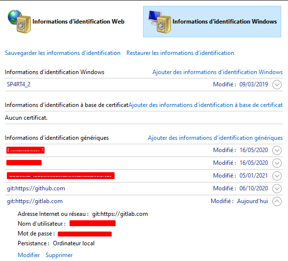

# Aide mémoire GIT

::: details Table des matières
[[toc]]
:::

## Personnaliser

Définir son identité :

```sh
git config --global user.email "email@example.com"
git config --global user.name "Valentin Brosseau"
```

Voir la configuration :

```sh
git config --list
```

## Créer

Créer un nouveau dépôt local (dans le dossier courant) :

```sh
git init
```

Cloner un dépot existant :

```sh
git clone ssh://user@domain.com/repo.git
```

Créer un fichier « .gitignore » :

```sh
# Création du fichier
vim .gitignore
# …
git add .gitignore
git commit -m "Ajout gitignore"
```

Créer un fichier « .gitignore » en utilisant un template « Windows »:

```sh
curl -s https://www.gitignore.io/api/windows > .gitignore
git add .gitignore
git commit -m "Ajout gitignore"
```

Créer un fichier « .gitignore » en utilisant un template « MacOS »:

```sh
curl -s https://www.gitignore.io/api/osx > .gitignore
git add .gitignore
git commit -m "Ajout gitignore"
```

## Modifications locales

Fichiers modifiés dans votre répertoire de travail :

```sh
git status
```

Modifications sur les fichiers suivis :

```sh
git diff
```

Ajouter tous les changements actuels au prochain commit :

```sh
git add
```

Ajouter tous les changements de toute l’arborescence :

```sh
git add --all
```

Commiter tous les changements locaux des fichiers suivis :

```sh
git commit -a
```

Commiter les modifications en attente :

```sh
git commit -m 'Votre message'
```

Modifier le commit précédent :

```sh
git commit --amend
# ou
git commit --am
```

## Historique de Commit

Afficher tous les commits :

```sh
git log
```

Afficher tous les commits (uniquement l’identifiant et le texte) :

```sh
git log --oneline
```

Afficher l’historique d’un utilisateur uniquement :

```sh
git log --author="utilisateur"
```

Afficher l’historique des modifications pour un fichier uniquement :

```sh
git log -p <fichier>
```

Affiche les changements (en détails) dans le fichier :

```sh
git blame <file>
```

## Branches & Tags

Lister toutes les branches :

```sh
git branch
```

Changer de branche :

```sh
git checkout <votre-branche>
```

Créer une nouvelle branche en se basant sur le HEAD :

```sh
git branch <votre-branche>
```

Créer une nouvelle branche de suivi, basée sur une branche distante :

```sh
git branch --track <nouvelle-branche> <branche-distante>
```

Supprimer une branche :

```sh
git branch -d <votre-branche>
```

Marquer le commit courant avec un tag :

```sh
git tag <non-du-tag>
```

## Merge & Rebase

Fusionner la branche `<votre-branche>` avec la master :

```sh
git checkout master
git merge <votre-branche>
```

⚠️ Attention ⚠️

Jouer avec l’historique est toujours dangereux surtout si vous travaillez à plusieurs !

Mettre à jour votre branche avec le code de la master :

```sh
git checkout <votre-branch>
git rebase master
```

Annuler un rebase en cours :

```sh
git rebase --abort
```

Continuer un rebase après avoir résolu des conflits :

```sh
git rebase --continue
```

## Travailler avec un dépots distant

Lister tous les dépôts distants configurés :

```sh
git remote -v
```

Monter les informations d'un dépôt distant :

```sh
git remote show origin
```

Ajouter un nouveau dépôt distant, nommé &lt;remote&gt; :

```sh
git remote add <remote> <url>
```

Synchroniser la branche « origin » avec la master. Et indiquer origin comme le dépôt distant par défaut.

```sh
git push -u origin master
```

Télécharger toutes les modifications d'un dépôt distant nommé &lt;remote&gt;, sans les fusionner :

```sh
git fetch <remote>
```

Télécharger les modifications et les fusionner directement dans le HEAD :

```sh
git remote pull <remote> <url>
```

Fusionner les modifications de la `master` distante sur la branche courante :

```sh
git pull origin master
```

Récupérer toutes les modifications du HEAD dans le dépôt local :

```sh
git pull
# ou
git pull origin
```

Publier les modifications locales sur un dépôt distant :

```sh
git push
ou
git push remote <remote> <branch>
```

Publier les tags :

```sh
git push --tags
```

## Annulation

Annuler le dernier `git add` :

```sh
git reset HEAD
```

Annuler les modifications locales d'un fichier spécifique :

```sh
git checkout HEAD <file>
```

Annuler un commit (création d’un commit avec les modifications inverses) :

```sh
git revert <commit>
```

Placer le pointeur du HEAD sur un commit précédent.
Conserve toutes les modifications effectuées depuis :

```sh
git reset <commit>
```

⚠️ Annuler toutes les modifications dans le répertoire de travail :

```sh
git reset --hard HEAD
```

⚠️ Placer le pointeur du HEAD sur un commit précédent.
Annule toutes les modifications effectuées depuis :

```sh
git reset --hard <commit>
```

## HTTPS et Identifiant sauvegardé sous Windows

Si vous avez cloné votre repository en HTTPS il se peut que vous rencontriez une erreur du type « error git remote ». Vous avez certainement du faire une erreur dans votre mot de passe (erreur de saisie ou autre). Malheureusement Windows sauvegarde l'information dans le système, cependant il est possible de corriger le problème via :

> "Si vous travaillez avec le système d'exploitation Windows, il existe une autre solution pour changer les paramètres d'authentification. Il faut pour cela accéder au gestionnaire d'informations d'identification. Dans la zone de recherche de la barre des tâches, tapez "Gestionnaire d'informations d'identification". Ouvrez ensuite le menu "Informations d'identification Windows". Dépliez le menu consacré à Git et cliquez sur "Modifier" pour pouvoir changer le mot de passe."



[Plus de détail sur l'erreur](https://www.journaldunet.fr/web-tech/developpement/1441077-gitlab-comment-corriger-l-e[…]rreur-remote-http-basic-access-denied-fatal-authentication/)
