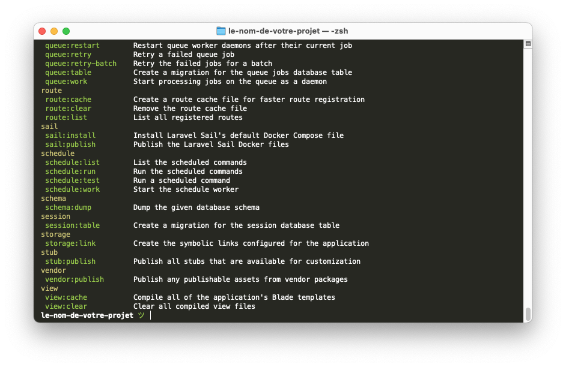
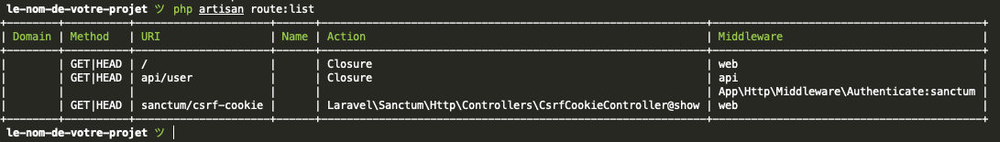
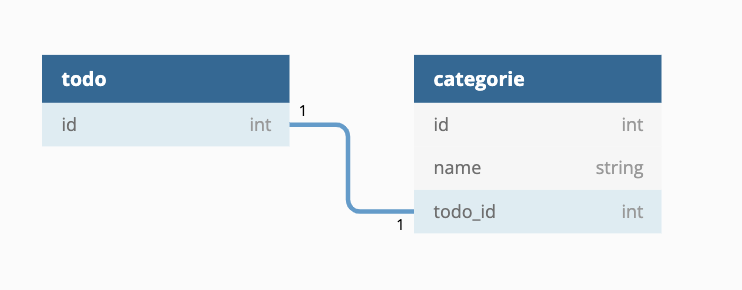

# Laravel

Cet aide mémoire n’est pas exhaustif, elle contient les connaissances minimums pour réaliser un site avec Laravel.

::: details Sommaire
[[toc]]
:::

Vous cherchez une synthèse des commandes / fonctions de Laravel ? [Cliquez ici](./quick.md)

## Architecture MVC


- **Model**: La base de données (ORM: Éloquent).
- **Vue**: Gestion du HTML (Moteur de template : Blade).
- **Controller**: Gestion des requêtes et génère le contenu.

::: danger Nous allons le voir…
C’est du MVC oui ! Mais avec un bonus… un ORM (Object–Relational Mapping) pour accéder aux objets. Vous allez le voir… Ça change tout !

L’idée d’un ORM, c’est de remplacer l’écriture des requêtes SQL par de la manipulation d’objet.

:::

## Créer un projet

Dans la documentation de Laravel, vous trouverez plusieurs façons de créer un projet. Je vous conseille de passer par la version « [Composer](https://getcomposer.org/download/) » qui fonctionnera, quelle que soit la plateforme.

```sh
composer create-project laravel/laravel le-nom-de-votre-projet
```

::: danger ATTENTION
Le projet va être crée dans mon exemple dans un dossier nommé `le-nom-de-votre-projet` (dans le dossier courant). Attention à ne pas être n’importe où.
:::

## Réinstaller un projet

Si vous changez de machine ou si vous récupérez le code source depuis Git il sera nécessaire de réinstaller les dépendances. Pour ça :

```sh
composer install
```

Après cette étape, il faudra remettre également en place le fichier `.env` de votre projet. Pour le contenu du fichier il faut reprendre le contenu du `.env.example`.

::: tip Pourquoi le .env est perdu ?

Le `.env` contient vos identifiants de connexion à la base de données **et les différentes clés secrètes**, c'est pour ça que celui-ci est présent de base dans le .gitignore.

:::

## Gérer l’application

Une fois le projet créé vous pouvez (**dans le dossier du projet**) avec la ligne de commande réaliser diverses opérations. Celles-ci sont consultables avec

```sh
php artisan
```



Nous allons le voir, cette commande nous sera utile pour diverses actions (créer les modèles, créer les contrôleurs, lister les routes).

Nous pouvons par exemple lister les routes de notre application « fraichement initialisée » :

```sh
php artisan route:list
```



## Tinker

Laravel Tinker est une console interactive REPL (Read-Eval-Print Loop) qui vous permet d'interagir avec votre application Laravel directement depuis la ligne de commande. C'est un outil très puissant pour tester du code, manipuler des données ou déboguer sans avoir à créer de routes ou de contrôleurs temporaires.

Pour le lancer :

```sh
php artisan tinker
```

Une fois dans Tinker, vous pouvez exécuter n'importe quel code PHP comme si vous étiez dans votre application. Par exemple, pour créer un nouvel utilisateur :

```php
// $ php artisan tinker

// Créer un nouvel utilisateur
>>> $user = new App\Models\User;
=> App\Models\User {#4429}
>>> $user->name = "Test";
=> "Test"
>>> $user->email = "test@test.com";
=> "test@test.com"
>>> $user->password = bcrypt('password');
=> "$2y$10$92IXUNpkjO0rOQ5byMi.Ye4oKoEa3Ro9llC/.og/at2.uheWG/igi"
>>> $user->save();
=> true

// Récupérer un utilisateur
>>> App\Models\User::find(1);

// Quitter tinker
>>> exit
```

## Lancer votre site

Pour visualiser votre site, Laravel intègre une commande permettant de lancer « un serveur web » intégré le temps du développement. Il suffit de :

```sh
php artisan serve
```

```txt
Starting Laravel development server: http://127.0.0.1:8000
[Tue Nov 2 17:27:22 2021] PHP 7.4.25 Development Server (http://127.0.0.1:8000) started
```

## Les routes

L’ensemble des routes sont dans **3 fichiers** :

- `routes/web.php`: Gestion des urls pour les clients (web)
- `routes/api.php`: Gestion des urls pour les échanges « technique » API.
- `routes/console.php`: Gestion des commandes pour la console Laravel.

### Définir une route simple

Dans le fichier `web.php` il suffira par exemple de :

```php
Route::get('/', function () {
  return "Bonjour Monde";
});
```

Nous déclarons ici **une route**, accessible sur le **`/`** (c’est-à-dire `http://localhost:8000/`), elle affichera `Bonjour Monde`.

### Définir une route bis

L’avantage d’un framework, c’est la simplicité. Si vous souhaitez déclarer une route `http://localhost:8000/demo/3` il suffira d'indiquer dans le `web.php` le contenu suivant :

```php
Route::get('/demo/{id}', [DemoController::class, "voir"]);
```

Qu’avons nous ici ?

| Le code                           | L’action                                                                                                   |
| :-------------------------------- | :--------------------------------------------------------------------------------------------------------- |
| `/demo/{id}`                      | Le lien d’accès avec une variable `{id}`                                                                   |
| `[DemoController::class, "voir"]` | La méthode à appeler dans le contrôleur (en l’occurence la méthode `voir` dans la classe `DemoController`) |

### Et en POST ?

C’est simple :

```php
Route::post('/demo/{id}', [DemoController::class, "voir"]);
```

::: danger Un instant ✋

En PHP objet il y a la notion de namespace, Laravel utilise de base les namespace, ça veut dire que nous allons avoir à utiliser le mot clé `use` pour importer (include). Quand vous voulez utiliser une classe qui n'est pas dans le même fichier, il faudra déclarer l'emplacement via un `use`. Exemple, pour que `DemoController` soit accessible depuis le router il faudra :

```php
use App\Http\Controllers\DemoController;

Route::post('/demo/{id}', [DemoController::class, "voir"]);
```

- ⚠️ Si vous utilisez **PHPStorm** cet import sera automatique.
- ⚠️ Si vous utilisez **VSCode** il faudra passer par une extension [Disponible ici](https://marketplace.visualstudio.com/items?itemName=MehediDracula.php-namespace-resolver)

Pour **PHPStorm**, **alt+entrée** permettra de déclencher l'ajout du use.

Pour **VSCode** je vous laisse regarder l'usage de l'extension :


:::

## Les contrôleurs

Le contrôleur va contenir la logique « métier » pour traiter les demandes du clients.

```sh
php artisan make:controller DemoController
```

Cette action va créer le squelette d’un contrôleur à l’emplacement suivant `app/Http/Controllers/DemoController.php`. Le contenu est minimaliste :

```php
<?php

namespace App\Http\Controllers;

use Illuminate\Http\Request;

class DemoController extends Controller
{
    //
}
```

### Déclarer une action

Nous avons précédemment déclaré une action dans notre routeur `voir`, si nous souhaitons l’ajouter dans notre contrôleur :

```php
namespace App\Http\Controllers;

use Illuminate\Http\Request;

class DemoController extends Controller
{
    public function voir($id)
    {
        // Pour l’instant pas de vue, nous verrons ça plus tard.
        return "Vous avez demandé l’id : " . $id;
    }
}
```

Il suffit donc de créer une méthode, les paramètres seront automatiquement remplis lors de l’appel du client `$id` contiendra la valeur présente à la place de `{id}`.

::: tip C’est aussi simple oui

Ne reflichissez pas trop… C’est vraiment aussi simple que ça.

:::

### Lire les données d'un formulaire

Dans la méthode du contrôleur, vous pouvez récupérer les données d'un formulaire de plusieurs manières :

```php
// Via la $request
function votreMethode(Request $request){
    // Récupérer toutes les données du formulaire
    $request->all(); // Récupère un tableau associatif de toutes les données du formulaire (clé => valeur)

    // Récupérer une donnée du formulaire
    $request->input('name'); // Récupère la valeur de la donnée "name" du formulaire

    // Récupérer une donnée du formulaire avec une valeur par défaut
    $request->input('name', 'John'); // Récupère la valeur de la donnée "name" du formulaire. Si la donnée n'existe pas, la valeur par défaut est "John"

    // Paramètres de requête www.demo.html?name=mike
    request()->input('nom'); //mike

    // Données du formulaire (ou valeur par défaut)
    request()->input('email', 'no@email.com');

    // Récupérer toutes les données du formulaire
    request()->all();
}

// Via le mapping des paramètres de la méthode
function votreMethode($name, $email){
    // Récupérer une donnée du formulaire
    $name; // Récupère la valeur de la donnée "name" du formulaire
    $email; // Récupère la valeur de la donnée "email" du formulaire
}
```

### Les retours possible d'une méthode

```php
// Retourne une vue
return view('view.name', ['name' => 'John']);

// Retourne une vue avec un message flash (session)
return redirect('/home')->with('status', 'Task was successful!');

// Retourn une redirection vers une route nommée
return redirect()->route('profile');

// Retourne une redirection vers une route nommée avec des paramètres
return redirect()->route('profile', ['id' => 1]);

// Retourne une redirection vers une route nommée avec des paramètres et un message flash
return redirect()->route('profile', ['id' => 1])->with('status', 'Task was successful!');

// Retourner une réponse JSON
$user = App\Models\User::find(1);
return response()->json($user);
```

[En savoir plus](https://laravel.com/docs/10.x/requests#retrieving-input)

## Éloquent « l’ORM »

### La migration

Une migration c’est ce qui va nous permettre d’initialiser la base de données directement depuis Laravel. Bien que cette partie _est optionnelle_ je vous conseille vivement de l’utiliser (c’est un standard en entreprise.)

```php
php artisan make:migration le_nom_de_votre_migration --create=leNomDeVotreTableEnBase
```

Une migration, est juste une classe qui va contenir la définition de votre table, les champs, les types, la structure. Le contenu de base sera le suivant :

```php
<?php

use Illuminate\Database\Migrations\Migration;
use Illuminate\Database\Schema\Blueprint;
use Illuminate\Support\Facades\Schema;

class LeNomDeVotreMigration extends Migration
{
    /**
     * Run the migrations.
     *
     * @return void
     */
    public function up()
    {
        Schema::create('leNomDeVotreTableEnBase', function (Blueprint $table) {
            $table->id();
            $table->timestamps();
        });
    }

    /**
     * Reverse the migrations.
     *
     * @return void
     */
    public function down()
    {
        Schema::dropIfExists('leNomDeVotreTableEnBase');
    }
}
```

Par exemple, si vous souhaitez ajouter dans votre table deux champs (un `texte` et un `booléen`), il faudra ajouter dans la méthode `up` :

```php
$table->string('texte');
$table->boolean('termine');
```

Lancer la migration, c’est-à-dire appliquer l’ensemble des modifications en attente en BDD :

```sh
php artisan migrate
```

[Plus d’information](https://laravel.com/docs/12.x/migrations)

### Le modèle

Le modèle est l’objet qui nous permettra de faire « nos requêtes SQL », l’accès à nos données.

La grande force de Laravel, son Framework [Eloquent](https://laravel.com/docs/12.x/eloquent). Laravel intègre une commande pour créer un modèle vide :

```sh
php artisan make:model LeNomDeVotreTableEnBase
```

Cette action va créer un squelette de modèle à l’emplacement suivant : `app/Models/LeNomDeVotreTableEnBase.php`. Le contenu sera le minimum :

```php
<?php

namespace App\Models;

use Illuminate\Database\Eloquent\Factories\HasFactory;
use Illuminate\Database\Eloquent\Model;

class LeNomDeVotreTableEnBase extends Model
{
    use HasFactory;
}
```

::: danger Le nom de la classe sera le nom de votre table

De base le nome de la classe sera le nom de votre table. Si vous souhaitez changer le comportement, il vous suffit de :

```php
<?php

namespace App\Models;

use Illuminate\Database\Eloquent\Factories\HasFactory;
use Illuminate\Database\Eloquent\Model;

class LeNomDeVotreTableEnBase extends Model
{
    protected $table = "CECI_EST_LE_NOM_DE_MA_TABLE";

    use HasFactory;
}
```

:::

### Accéder aux données

```php
// Tout obtenir
$todos = LeNomDeVotreTableEnBase::all();

// Ou pour l’enregistrement avec l’identifiant « 42 »
$todo = LeNomDeVotreTableEnBase::find(42);

// Obtenir, mais filtrer et ordonné et avec une limite
$todos = LeNomDeVotreTableEnBase::where('termine', 1)->orderBy('id', 'desc')->take(10)->get();

// Ou avec un where
$users = User::where('votes', '>', 100)->get();
```

::: danger Un instant ✋

En PHP objet il y a la notion de namespace, Laravel utilise de base les namespace, ça veut dire que nous allons avoir à utiliser le mot clé `use` pour importer (include). Quand vous voulez utiliser une classe qui n'est pas dans le même fichier, il faudra déclarer l'emplacement via un `use`. Exemple, pour que `LeNomDeVotreTableEnBase` soit accessible depuis le contrôleur il faudra :

```php
use App\Models\LeNomDeVotreTableEnBase;
```

- ⚠️ Si vous utilisez **PHPStorm** cet import sera automatique.
- ⚠️ Si vous utilisez **VSCode** il faudra passer par une extension [Disponible ici](https://marketplace.visualstudio.com/items?itemName=MehediDracula.php-namespace-resolver)

Pour **PHPStorm**, alt+entrée permettra de déclencher l'ajout du use.

Pour **VSCode** je vous laisse regarder l'usage de l'extension :


:::

### Créer un enregistrement

```php
// Création d’une nouvelle entrée en BDD (équivalent d’un INSERT INTO)
LeNomDeVotreTableEnBase::create(array(
    'texte'     => 'Super Cool',
    'termine'   => false
));
```

### Mettre à jour un enregistrement

```php
// Rechercher celui avec l’id 1
$todo = App\LeNomDeVotreTableEnBase::find(1);

// Le passer à terminer
$todo->termine = true;

// Le sauvegarder en base de données
$todo->save();
```

### Supprimer un enregistrement

Plusieurs façon :

```php
// Façon 1
// Rechercher celui avec l’id 1
$todo = App\LeNomDeVotreTableEnBase::find(1);
$todo->delete(); // Le supprimer

// Façon 2
// Le supprimer directement
App\LeNomDeVotreTableEnBase::destroy(1);

// Façon 3
// En supprimer plusieurs directement
App\LeNomDeVotreTableEnBase::destroy(1,2,3);

// Façon 4
// Supprimer avec une condition
App\LeNomDeVotreTableEnBase::where('termine', '=', 1)->delete();
```

### Les jointures

Les jointures sont à définir directement dans le modèle. Elles seront des méthodes accessibles via l’objet de votre modèle.

#### One To One



```php
class Todo extends Model {

  // Dans le modèle
  public function categorie()
  {
      return $this->hasOne(Categorie::class);
  }

}
```

::: tip
Éloquent supposera que dans le modèle Catégorie contiendra une colonne todo_id.
:::

#### One To Many


```php
class Post extends Model {

  // Dans le modèle
  public function comments()
  {
      return $this->hasMany(Comment::class);
  }

}
```

::: tip
Éloquent supposera que la colonne de clé étrangère sur le modèle Comment est post_id.
:::

#### L’inverse du One To Many : le « Belong To »


```php
class Comment extends Model
{
    public function post()
    {
        return $this->belongsTo(Post::class);
    }
}
```

::: tip

- Éloquent tentera de trouver un modèle Post dont l’identifiant correspond à la colonne post_id du modèle Comment.
- Éloquent supposera que la clé étrangère du modèle Post sur la table des commentaires est post_id.

:::

#### Many To Many


```php
class User extends Model
{
    /**
     * The roles that belong to the user.
     */
    public function roles()
    {
        return $this->belongsToMany(Role::class);
    }
}

class Role extends Model
{
    /**
     * The users that belong to the role.
     */
    public function users()
    {
        return $this->belongsToMany(User::class);
    }
}
```

### Générer les modèles

Il est également possible de générer les modèles à partir de la base de données. Cette fonctionnalitée n'est pas disponible de base dans Laravel, il faut donc installer une dépendance supplémentaire :

```sh
composer require reliese/laravel --dev
php artisan vendor:publish --tag=reliese-models
php artisan config:clear
```

Le plugin en question [Reliese Laravel Model Generator](https://github.com/reliese/laravel). Je vous laisse regarder la documentation pour plus d'informations.

::: tip Attention

Autoriser les factories.

Pour permettre à votre Modèle d'être « rempli », vous devez vérifier que la classe possède bien les use suivants (à mettre dans la classe du modèle) :

```php
use HasApiTokens, HasFactory, Notifiable;
```

::: details Exemple

```php
<?php

namespace App\Models;

use Illuminate\Database\Eloquent\Factories\HasFactory;
use Illuminate\Database\Eloquent\Model;
use Illuminate\Notifications\Notifiable;
use Laravel\Sanctum\HasApiTokens;

class Client extends Model
{
    use HasApiTokens, HasFactory, Notifiable;

    // ... le reste du code
}
```

:::

### Requêter les données

Nous avons vu comment définir les relations, mais comment les utiliser ? C’est très simple, vous pouvez utiliser les méthodes de relations comme si elles étaient des méthodes de modèle.

```php
// Récupérer les commentaires d’un post
$comments = App\Post::find(1)->comments()->get();

// Récupérer les commentaires d’un post et les ordonner par date
$comments = App\Post::find(1)->comments()->orderBy('created_at', 'desc')->get();

// Récupérer les commentaires d’un post et les ordonner par date et avec une limite
$comments = App\Post::find(1)->comments()->orderBy('created_at', 'desc')->take(10)->get();

// Utiliser le with pour récupérer les données en une seule requête
// Ici on récupère les posts avec leurs commentaires
$posts = App\Post::with('comments')->get();

// Obtenir les articles d’un utilisateur
$articles = App\User::find(1)->articles()->get();

// Réaliser plusieurs jointures avec le with
// Ici on récupère les utilisateurs avec leurs rôles et leurs articles
$users = App\User::with('roles', 'posts')->get();

// Jointure conditionnelle obtenir les articles d’un utilisateur dont le titre contient « Laravel »
$articles = App\User::find(1)->articles()->where('title', 'like', '%Laravel%')->get();

// Obtenir un utilisateurs avec les posts et les commentaires via le with
$users = App\User::with('posts.comments')->get();
```

::: tip `with()`

Le `with()` permet de récupérer les données d'une autre table. Vous pouvez également déclarer le `with()` dans le modèle. 

Exemple, **dans le modèle `Commande`** :

```php
$with = ['produit'];
```

En indiquant le `$with` dans le modèle, votre jointure sera automatiquement effectuée. Vous n'aurez plus besoin de passer par le `with()` dans le contrôleur. Pratique pour automatiser les jointures.

:::

### Mettre à jour les données d'une relation 

```php
// Ajouter un commentaire à un post
$comment = new App\Comment(['message' => 'A new comment.']);
$post = App\Post::find(1);
$post->comments()->save($comment);

// Ajouter un commentaire à un post avec un utilisateur
$comment = new App\Comment(['message' => 'A new comment.']);
$user = App\User::find(1);
$post = App\Post::find(1);
$post->comments()->save($comment, ['user_id' => $user->id]);

// Attacher un rôle à un utilisateur
$user = App\User::find(1);
$user->roles()->attach($roleId);

// Attacher des roles à un utilisateur nouvellement créé
$user = App\User::create($attributes);
$user->roles()->attach([1, 2, 3]);

// Syncroniser les rôles d'un utilisateur (remplace les rôles existants)
$user->roles()->sync([1, 2, 3]);
```

### En savoir plus

Nous avons effleuré ici les types de requêtes… [Pour en savoir plus](./quick.md#l-orm)

## La vue

Laravel utilise l’excellent moteur de template « [Blade](https://laravel.com/docs/12.x/blade) ». À la fois souple et puissant il améliorera très grandement la qualité de vos projets.

- Moteur de template
- Performant
- Héritage et redéfinition
- Les fichiers Blade sont des fichiers PHP
- Contrairement à beaucoup d’autres moteurs de template, le mix PHP + HTML est possible (mais personnellement je ne trouve pas que ça soit une bonne idée…)

### Retourner une vue simple

Dans votre routeur :

```php
Route::get('/', function () {
    return view('votrePage', ['name' => 'Valentin 👋']);
});
```

Dans votre fichier `resources/views/votrePage.blade.php` :

```php
Bonjour, {{ $name }}.
```

::: warning La sécurité est de base
Ici pas besoin de faire un `htmlspecialchars`… **C’est automatique**
:::

### Retourner une vue bis

Depuis un contrôleur l’approche est là même :

Votre contrôleur :

```php
namespace App\Http\Controllers;

use Illuminate\Http\Request;

class DemoController extends Controller
{
    public function voir($id)
    {
        return view('votrePage', ['id' => $id]);
    }
}
```

Dans votre fichier `resources/views/votrePage.blade.php` :

```php
<h1>Vous avez demandé l’id {{ $id }}</h1>
```

### Les directives

Les directives sont une syntaxe particulière permettant de conditionner, répéter, ajuster l’affichage en fonctions des données

#### LES CONDITIONS

`@if, @elseif, @else et @endif`

`@switch, @case, @break, @default et @endswitch`

#### LES BOUCLES

`@for, @endfor`

`@foreach, @endforeach`

`@forelse, @empty, @endforelse <= Permet d’afficher autre chose si pas de données dans la boucle`

#### L’HÉRITAGE

`@include('view.name') <= Inclusion d’une autre vue`

`@includeWhen($boolean, 'view.name') <= Inclusion conditionnelle`

#### Les droits d’accès

`@auth, @guest`

#### Quelques exemples en vrac

```php
// ++++
// Les conditions
// ++++

@if (count($records) === 1)
    I have one record!
@elseif (count($records) > 1)
    I have multiple records!
@else
    No records!
@endif

@auth
    // The user is authenticated...
@endauth

@guest
    // The user is not authenticated...
@endguest

@isset($records)
    // $records is defined and is not null...
@endisset

@empty($records)
    // $records is "empty"...
@endempty

// ++++
// Les boucles
// ++++

@for ($i = 0; $i < 10; $i++)
    The current value is {{ $i }}
@endfor

@foreach ($users as $user)
    <p>This is user {{ $user->id }}</p>
@endforeach

@forelse ($users as $user)
    <li>{{ $user->name }}</li>
@empty
    <p>No users</p>
@endforelse

@while (true)
    <p>I'm looping forever.</p>
@endwhile
```

### L’héritage de template

Organiser le code en parent et en enfants :


- `Le parent` est la **structure** de notre page.
- `L’enfant` est le **contenu** page désirée

Le parent :

```php
<!-- Sauvegardé dans resources/views/layouts/app.blade.php -->

<html>
  <head>
    <title>Site Exemple - @yield('titre')</title>
  </head>
  <body>
    <div class="container">@yield('content')</div>
  </body>
</html>
```

L’enfant (une de vos pages) :

```php
<!-- Sauvegardé dans resources/views/child.blade.php -->

@extends('layouts.app') // indique que nous allons utiliser le parent « app ».

@section('titre', 'Page enfant') // Titre de la page

// Contenu de votre page
@section('content')
  <p>Contenu de la page enfant.</p>
@endsection
```

::: tip C’est une notion importante

Je ne le répèterai jamais assez, mais l’organisation est la clé de la réussite. Même si ce découpage vous semble « complèxe » à première vue, c’est quelque chose de courant et de pratiquer dans beaucoup (toutes ?) les entreprises.

:::

### Les composants

Blade intègre également un système de composant permettant de découper son travail.

```html
<VotreComposant nom="Valentin">
  Vous pouvez ici avoir des enfants.
</VotreComposant>
```

Pour créer un composant :

```sh
php artisan make:component VotreComposant
```

Cette commande va créer le squelette de votre composant :

- `app/View/Components/VotreComposant.php` : Le composant en lui-même (la logique, les données, etc)
- `resources/views/components/votre-composant.blade.php` : La vue du composant (le contenu, le HTML en lui-même)

Si vous souhaitez que votre composant puisse avoir du code enfant, il faudra ajouter dans la vue du composant :

```php
<!-- resources/views/components/votre-composant.blade.php -->
{{ $slot }}
```

- `$slot` contiendra le contenu de l’enfant (c'est à dire le contenu entre les balises du composant).

Si vous souhaitez que votre composant puisse avoir des attributs, il faudra modifier le code du composant. Par exemple, si vous souhaitez que votre composant puisse avoir un attribut `nom` :

```php
// app/View/Components/VotreComposant.php
public function __construct(public string $nom)
{
}
```

Puis dans la vue du composant :

```php
<!-- resources/views/components/votre-composant.blade.php -->

<!-- Attribut nom, récupéré depuis les attributs -->
{{ $nom }}

<!-- Données enfants -->
<div>
    {{ $slot }}
</div>
```

Il sera ensuite possible d’utiliser votre composant dans vos vues :

```php
<x-votre-composant nom="Valentin">
    Vous pouvez ici avoir des enfants.
</x-votre-composant>
```

- [Documentation des composants](https://laravel.com/docs/10.x/blade#components)
- [Utiliser les composants pour définir son affichage](https://laravel.com/docs/10.x/blade#layouts-using-components)

::: tip C'est nouveau

Les composants sont une nouvelle approche dans la conception d'interface. Ils sont très utilisés notamment en JavaScript, en Laravel vous avez le choix « Héritage » ou « Composant » il n'y a pas de meilleure façon de faire. Seulement deux approches complémentaires.

PS: J'ai mon petit faible pour les composants :wink:.

:::
