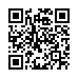

# La méthode OWASP

::: details Table des matières
[[toc]]
:::

## Comment se tenir à jour ?

Prévenir plutôt que guérir… Quelques sites à surveiller :

- [US CERT (LA SOURCE)](https://www.us-cert.gov/)
- [The Hacker News](http://thehackernews.com/)
- [Zataz](https://www.zataz.com/)
- [Reddit NetSec](https://www.reddit.com/r/netsec/)
- [Next INpact](https://www.nextinpact.com/) (~payant)
- Google Actu

::: tip Important
Vous êtes la première ligne d’informations !
:::

## Les grandes catégories à connaître

- Les mots de passe (multi-facteurs, complexité, hashage).
- Les failles dans le code (injections, XSS, CSRF, etc.).
- Les failles dans les configurations (serveur, application, etc.).
- Le social engineering (le maillon faible, l'humain).

::: danger Le risque ?

Le risque est la multiplication des failles. Plus vous avez de failles, plus vous avez de risques. C'est là que la sécurité devient un enjeu majeur. Car plus le nombre de failles est importantes plus **la surface d'attaque** est grande.

:::

## La surface d'attaque

La surface d'attaque est l'ensemble des points d'entrée d'un système qui peuvent être exploités par un attaquant pour compromettre la sécurité de ce système.

Plus la surface d'attaque est grande, plus le système est vulnérable.

### Exemple

Une application Web avec un ensemble de failles (injection SQL, XSS, CSRF, etc.) a une grande surface d'attaque. Un attaquant peut exploiter ces failles pour compromettre la sécurité de l'application.

Un serveur mal configuré (ports ouverts, services non sécurisés, etc.) a une grande surface d'attaque. Un attaquant peut exploiter ces failles pour compromettre la sécurité du serveur.

Réduire la surface d'attaque est un enjeu majeur en sécurité informatique. Réduire la surface d'attaque implique de minimiser les points d'entrée.

## L'authentication

Il est possible de sécuriser l'authentification de plusieurs manières :

- **Mots de passe** : Complexité, hachage, salage.
- **Authentification à plusieurs facteurs** : Double authentification, biométrie, OTP.
- **Sécurisation des mots de passe** : Bcrypt, Argon2, Scrypt.
- **Sécurisation des sessions** : JWT, Cookies sécurisés.
- **Authentification unique** : OAuth, OpenID (SSO, Single Sign-On).

## Les mots de passe

Zoom sur les mots de passe :

- Un mot de passe ne doit jamais être stocké en claire.
- Un mot de passe doit être haché (non réversible).
- Un mot de passe doit être salé (ajout d’une chaîne aléatoire).
- Un mot de passe seul n'est souvent pas suffisant (Double authentification).

## Les risques du SSO

Le SSO (Single Sign-On) est une méthode d'authentification qui permet à un utilisateur de se connecter avec un seul identifiant et un seul mot de passe pour accéder à plusieurs applications. C'est une méthode très pratique, mais qui peut être dangereuse en cas de compromission (du mot de passe, de l'identifiant, de la session).

En effet, si un attaquant compromet un compte, il peut accéder à toutes les applications liées à ce compte.

Il est donc important de sécuriser le SSO avec des méthodes d'authentification à plusieurs facteurs (2FA, MFA).

### Principes de base

Avoir un mot de passe hashé ne suffit pas. Il faut aussi le saler.


Le salage est une technique qui permet d’ajouter une chaîne aléatoire au mot de passe avant (ou après) de le hacher. Idéalement le sel est différent par utilisateur, cela permet de rendre le mot de passe unique pour chaque utilisateur.

### Des algorithmes : Le bcrypt

Le bcrypt est un algorithme de hachage qui :

- Intègre le sel.
- Intègre un coût (nombre d’itération). Plus le coût est élevé, plus le hachage est long (et donc plus sécurisé).
- Intègre un hachage (SHA-256).

## Résumé :

Les mots de passe :

- Un mot de passe ne doit jamais être stocké en claire. Il doit être haché (non réversible) et salé (ajout d’une chaîne aléatoire).
- Le sel peut-être différent pour chaque utilisateur ou global pour tous les utilisateurs. Celui-ci doit être placé avant ou après le mot de passe, il sera utilisé également pour vérifier le mot de passe.
- Le bcrypt est un algorithme de hachage qui intègre le sel, le coût et le hachage (SHA-256).

## Authentification à plusieurs facteurs

3 formes d'authentification :

- Mémorielle qui représente une chose que l'intéressé connaît (un secret),
- Matérielle qui se réfère à quelque chose qu'il possède (un objet),
- Corporelle qui utilise un trait physique de l'utilisateur (une biométrie).

Des **outils** :

- **Mot de passe :** Un mot de passe avec un niveau de sécurité suffisant (longueur, caractères spéciaux, majuscules, minuscules, chiffres).
- **Application :** OTP (One Time Password) : SMS, Google Authenticator, Authy, Yubikey.
- **Objet physique :** U2F (Universal 2nd Factor) : Clé USB, Yubikey.
- **Biométrie :** Empreinte digitale, Reconnaissance faciale.

Mais surtout c'est :

- Permets de sécuriser les mots de passe en ajoutant une couche de sécurité supplémentaire.
- Via un secret partagé entre la personne **physique** et le site.

### Les impacts liés à la sécurité

La sécurité informatique dans une application c’est un « équilibre »

- Impact fonctionnel
- Limitation de l’expérience utilisateur (UX)
- Impact financier


### Les types de failles

- L’humain (Social Engineering)
- D'accès (physique)
- Applicatif (Hack)
- L’argent (jusqu’à quel montant une personne donne l’information ?)

### Le Social Engineering

Les gens sont souvent trop confiants. Il faut donc les former régulièrement à la sécurité.

Deux exemples en vidéo :

|                                            |                                                         |
| :----------------------------------------------------------------------: | :-----------------------------------------------------------------------------------------: |
| [Exemple SECTF à la DefCon](https://www.youtube.com/watch?v=-FSLaHKoCNE) | [Call Recreation (@5min, @11min30)](https://share.vidyard.com/watch/i46XF6N6rpR9KMaorihFQw) |

## Intégrer la sécurité à toutes les étapes

La sécurité c’est un état d’esprit à intégrer.

C’est **votre métier**


## L'observabilité

L'observabilité est un concept qui permet de mesurer et d'analyser le comportement d'un système. On parlera de traçabilité, de logs, de monitoring, de métriques, etc.

La traçabilité est un élément clé de la sécurité. Elle permet de savoir qui a fait quoi, quand et comment.

### Assurer la qualité

S'assurer d'une qualité continue du code avec :

- Des règles à connaître (OWASP).
- Des tests unitaires.
- Une analyse automatique du code (SonarQube).

### Open Web Application Security Project (OWASP)

> Open Web Application Security Project (OWASP) est une communauté en ligne travaillant sur la sécurité des applications Web. Sa philosophie est d'être à la fois libre et ouverte à tous. Elle a pour vocation de publier des recommandations de sécurisation Web et de proposer aux internautes, administrateurs et entreprises des méthodes et outils de référence permettant de contrôler le niveau de sécurisation de ses applications Web.

> _Source: Wikipédia_

[Site de Owasp](https://owasp.org/)

OWASP liste 10 grandes catégories de failles **à connaître** :

- **Injection** : Les attaques par injection surviennent lorsque des données non fiables sont envoyées à un interpréteur en tant que commande ou requête. Cela peut se produire avec les injections SQL, les injections OS, etc.
- **Violation de Gestion d’Authentification et de Session** : Cela se produit lorsque les attaquants exploitent des vulnérabilités dans les mécanismes d'authentification, comme les sessions mal gérées, les mots de passe faibles ou les identifiants exposés.
- **Défaillances cryptographiques** : Les données en transit et au repos (telles que les mots de passe, numéros de carte bleue, dossiers médicaux, informations personnelles et secrets commerciaux) requièrent une protection supplémentaire compte tenu des défaillances cryptographiques possibles (et donc à l’exposition de données sensibles). Cela est particulièrement vrai dans le cas où ces données relèvent de dispositifs réglementés comme le RGPD, le CCPA, etc. Exemple, mot de passe non chiffré en base de données
- **Conception non sécurisée / Exposition de données sensibles** : La « conception non sécurisée » est un terme assez large qui regroupe diverses failles et désigne l’absence ou la faiblesse de la conception des contrôles. Exemple d’accès direct à une ressource sans contrôle, manque de contrôle dans un système de routeur Web, Manque de contrôle de saisie.
- **Mauvaise configuration de la sécurité** : Manque de validation des types de paramètres, accès trop facile aux ressources non accessibles au public (cloud), configuration incomplète ou trop permissive, messages d’erreurs trop détaillés, contenant des informations sensibles, manque de contrôle sur les données en entrée (filtrage non présent type filter_input, strip_tags, htmlspecialchars etc.)
- **Utilisation de composants avec des vulnérabilités connues** : L'utilisation de logiciels ou de composants obsolètes et vulnérables peut exposer l'application à des attaques connues. Il est essentiel de maintenir une liste des composants utilisés et de surveiller les vulnérabilités associées. Ancienne version de Laravel, ancienne version de PHP, MySQL non à jour, etc.
- **Identification et authentification de mauvaise qualité** : Lorsque les applications n’exécutent pas de manière correcte les fonctions liées à la gestion des sessions ou à l’authentification des utilisateurs, des intrus peuvent compromettre les mots de passe, clés de sécurité ou jetons de sessions et usurper, de manière temporaire ou permanente, les identités et donc les autorisations d’autres utilisateurs. Exemple, absence d’authentification multifacteur, absence de règle de mot de passe, utilisateur par défaut type root / root sur un système, utilisation d’id dans un lien.
- **Manque d’intégrité des données et du logiciel** : Cette catégorie englobe les codes et infrastructures qui ne sont pas protégés contre les violations d’intégrité. Exemple, mise à jour sans contrôle, absence de signature numérique, présence de XSS dans un système, aucune protection anti-rejeux (brute force, CSRF)
- **Absence de logs serveur et de surveillance** : Permettre un cas d’incident d’avoir de la traçabilité.
- **Falsification de requête côté serveur** : Elle permet à un hacker d’inciter l’application côté serveur à envoyer des requêtes à un endroit non prévu. Le serveur est donc capable de faire des requêtes à des endroits non prévus (depuis le coeur de l'application).

### Top 10 : Simplifié

Le nouveau TOP 10 est très intéressant, car il met en lumière le croisement entre les failles et les risques. Mais il est plus complexe à mémoriser. Il est donc également possible de classer les failles de manière brute :

- **Injection** : Injection SQL, Shell...
- **Violation de Gestion d’Authentification et de Session** : Risque de casser / usurper une authentification ou une session.
- **Cross-Site Scripting (XSS)** : Risque d'injection de contenu dans une page pour but de provoquer des actions non désirées dans celle-ci.
- **Références directes non sécurisées à un objet** : Accès à de la donnée en spécifiant un `id` directement par un paramètre non filtré.
- **Mauvaise configuration Sécurité** : Failles liées aux serveurs Web, applications, base de données ou frameworks.
- **Exposition de données sensibles** : Exposition de données sensibles comme les mots de passe, les numéros de carte de paiement ou encore les données personnelles et la nécessité de chiffrer ces données.
- **Manque de contrôle d’accès au niveau fonctionnel** : Failles liées aux contrôles d'accès de fonctionnalité.
- **Falsification de requête intersite (CSRF)** : Failles liées à l’exécution de requêtes à l’insu de l’utilisateur.
- **Utilisation de composants avec des vulnérabilités connues** : Failles liées à l’utilisation de composants tiers vulnérables.
- **Redirections et Renvois non validés** : Les redirections et les renvois non validés sont une vulnérabilité profitant d’une faiblesse dans le code et dont l’objectif est de rediriger l’utilisateur sur une page malveillante.

Ce classement est plus simple à mémoriser et permet de se rappeler des failles les plus courantes.

::: tip Je ne l'invente pas
Ce classement est en fait la version antérieure du TOP 10 (avant 2020). Il est donc toujours complètement valable.
:::

### Les failles

Le TOP 10 OWASP nous donne les grandes catégories de failles à connaître. Pour entrer dans le détail, voici les failles les plus courantes :

### Les Injections

Injection SQL, Shell...

Souvent la plus connue et la plus rencontrée :

```sql
SELECT * FROM client WHERE id='" . $_GET["id"] . "'
```

```
http://exemple.com/liste?id='or '1'='1
```

::: tip C'est la base de la sécurité

Vous trouverez cet exemple un peu partout. C'est le mauvais exemple en termes de sécurité !

Au passage, si vous écrivez :

```php
$id = $_GET['id'];
$maRequete = "SELECT * FROM client WHERE id='{$id}'"
```

⚠️ C'est aussi une faille, celle-ci est identique à la précédente.

:::

#### Comment corriger ?

- Toujours utiliser des requêtes préparées.
- Ou utiliser des ORM (Object Relational Mapping) qui font la même chose.

```php
$maRequete = $pdo->prepare("SELECT * FROM client WHERE id=:id");
$maRequete->execute(['id' => $_GET['id']]);
```

### Violation de Gestion d’Authentification et de Session

Risque de casser / usurper une authentification ou une session. Comprends notamment le vol de session ou la récupération de mots de passe.

Une session en paramètre GET == ⚠️. Si vous partagez le lien, n'importe qui pourra obtenir votre accès !

```
http://exemple.com/?jsessionid=A2938298D293
```

#### Comment corriger ?

- Toujours utiliser des sessions cryptées.
- Toujours utiliser des sessions avec un identifiant unique.
- Toujours utiliser des sessions avec un TTL (Time To Live).

### Cross-Site Scripting (XSS)

Risque d'injection de contenu dans une page pour but de provoquer des actions non désirées dans celle-ci.

Les failles XSS sont particulièrement répandues parmi les failles de sécurités Web.

Exécution de code JavaScript sans validation. Le risque ici est qu'il est possible de changer le comportement initialement attendu pour en détourner le sens.

```html
Votre Nom : <input type="text" name="nom" value="" />
```

```js
echo "Bonjour " . $_POST['nom'];
```

::: danger Attention

Avec ce code, il est possible d'exécuter du code JavaScript. Exemple, si l'utilisateur entre :

```html
<script>alert('Hello')</script>
```

Le code sera exécuté dans le navigateur de l'utilisateur lors de l'affichage de la page.

:::

Deux types sont à connaître :

- XSS Persistant (stocké en base de données, dans un logs, et exécuté à chaque affichage de la page)
- XSS Reflété (via un lien)

#### Comment corriger ?

- Toujours valider les entrées utilisateurs.

```php
$nom = filter_input(INPUT_POST, 'nom', FILTER_SANITIZE_STRING);
// ou
$nom = strip_tags($_POST['nom']);
// ou
$nom = htmlspecialchars($_POST['nom']);
```

### Références directes non sécurisées à un objet

Accès à de la donnée en spécifiant un `id` directement par un paramètre non filtré.

C'est également quelque chose de très courant. Si vous attendez en paramètre un mode / un id, veillez à toujours contrôler si la ressource chargée correspond aux droits de l'utilisateur.

Si je change client par … admin ?

```
http://exemple.com/liste?mode=client
```

```sql
SELECT * FROM client where mode=?
```

```php
$stmt->bindParam(1, $mode);
```

::: tip Requête préparée

Vous noterez ici que nous avons une requête « préparé » ça n'empêche pas le danger…

:::

#### Comment corriger ?

- Toujours valider les entrées utilisateurs.
- Toujours vérifier les droits de l'utilisateur.

```php
if ($_SESSION['mode'] == 'client') {
    // On peut charger la ressource
} else if ($_SESSION['mode'] == 'admin') {
    // On peut charger la ressource
} else {
    // On ne peut pas charger la ressource
}
```

### Mauvaise configuration Sécurité

Corresponds aux failles de configuration liées aux serveurs Web, applications, base de données ou frameworks.

- Console d’administration disponible sans authentification en ligne.
- Listage des répertoires ([Exemple](https://www.google.fr/search?dcr=0&q=intitle%3A%22Index%20of%22))
- Exemples de code non supprimés.
- Application en debug.

#### Comment corriger ?

- Toujours supprimer les exemples de code.
- Toujours supprimer les répertoires de débug.
- Lire la documentation.

### Exposition de données sensibles

Exposition de données sensibles comme les mots de passe, les numéros de carte de paiement ou encore les données personnelles et la nécessité de chiffrer ces données.

- Espace client sans SSL.
- Mot de passe en clair (ou en MD5) dans la base de données.
- Sauvegarde de données inutiles.
- Données sensibles dans les logs.
- Données sensibles en clair dans la base de données.

#### Comment corriger ?

- Toujours utiliser le HTTPS.
- Toujours utiliser des mots de passe chiffrés (hashés + sel).
- Toujours supprimer les données inutiles.
- Toujours supprimer les données sensibles des logs.
- Protéger les données sensibles dans la base de données (chiffrement).

### Manque de contrôle d’accès au niveau fonctionnel

Failles liées aux contrôles d'accès de fonctionnalité.

- Page d’admin accessible avec un compte utilisateur.
- Mode non filtré (similaire à l’exemple mode={client,admin}).

#### Comment corriger ?

- Toujours vérifier les droits de l'utilisateur.

```php
if ($_SESSION['mode'] == 'client') {
    // On peut charger la ressource
} else if ($_SESSION['mode'] == 'admin') {
    // On peut charger la ressource
} else {
    // On ne peut pas charger la ressource
}
```

### Falsification de requête intersite (CSRF)

Failles liées à l’exécution de requêtes à l’insu de l’utilisateur.

- Rejeu de requête déjà joué.
- Attaque de type brute force.
- Exécution de requête à l’insu de l’utilisateur (exemple : déconnexion / connexion sur un site tierce).

::: tip Comment le bloquer ?

Ajoutez un identifiant/jeton dans la requête, unique et non réutilisable. Intégré de base dans Laravel.

:::

#### Comment corriger ?

- Ajouter un jeton unique dans les formulaires.

```php
<input type="hidden" name="_token" value="{{ csrf_token() }}">

// Côté PHP
if (isset($_POST['_token']) && $_POST['_token'] == $_SESSION['_token']) {
    // On peut traiter la requête
} else {
    die();
}
```

### Utilisation de composants avec des vulnérabilités connues

Failles liées à l’utilisation de composants tiers vulnérables.

- CMS non à jour.
- Apache / Tomcat non patchés.
- Librairies XYZ non à jour.
- Version de PHP non à jour.
- Framework non à jour.

#### Comment corriger ?

- Toujours mettre à jour les composants tiers.
- Ne pas utiliser de vieux frameworks (exemple PHP 4, ou Symfony 1.4)

### Redirections et Renvois non validés

Les redirections et les renvois non validés sont une vulnérabilité profitant d’une faiblesse dans le code et dont l’objectif est de rediriger l’utilisateur sur une page malveillante

- Utilisation de votre site comme « masque » dans du phishing

_Exemple :_

```
http://www.shop-vdt.com/login.php?goto=evil.com/login
```

#### Comment corriger ?

- Toujours valider les entrées utilisateurs.
- Filtrer les liens possibles.

```php
// Autorise uniquement les redirections vers le site
if (preg_match('/^https?:\/\/shop-vdt\.com\//', $_GET['goto'])) {
    header('Location: ' . $_GET['goto']);
} else {
    die();
}
```

### Mais, une faille c’est quoi ?


L'idée d'OWASP, c'est de former pour comprendre les failles afin de ne plus les produire involontairement… Et surtout avec OWASP on parle de **vulnérabilité, et non de risque**.

## Les outils OWASP

- [OWASP Juice Shop (Formation, JavaScript)](https://owasp.org/www-project-juice-shop/)
- WebGoat (Formation, Java)
- WebScarab (Audit)
- OWASP Testing guide (Guide pour voir le niveau de sécu)
- OWASP Code Review guide (Méthode d’audit)

## La formation

En cybersécurité, il est important de rappeler que la formation des employés est primordiale. Cette formation doit être :

- Régulière (tous les ans).
- Adaptée à l'entreprise (pas de formation générique).
- Prendre plusieurs formes (phishing fictif, formation en ligne, formation en présentiel).

La formation prend également la forme de **sensibilisation** :

- Affichage de consignes de sécurité.
- Sensibilisation aux risques.
- Formation aux bonnes pratiques.
- Formation sur les mots de passe.
- Chocoblast (technique pour rappeler aux utilisateurs l'importance de verrouiller leur session).

## Synthèse OWASP

