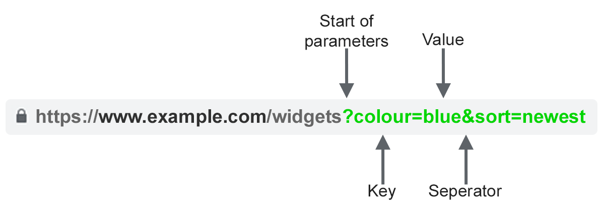

# Aide mémoire PHP

Aide mémoire sur les structures PHP. Vous retrouverez dans cet aide mémoire les éléments que nous avons vus ensemble.

::: warning
Cet aide mémoire n'est pas exhaustif, elle ne contient que le minimum à connaitre pour débuter sereinement.  
:::

::: details Table des matières
[[toc]]
:::

## Structure

Pour être exécuté votre code doit-être dans un fichier nommé `quelqueschoses.php` et doit être mis tel que :

```php
<?php
// Votre code
?>
```

## Afficher des données

```php
<h1><?php echo "Ceci est un titre"; ?></h1>

// Ou

<?php echo "Ceci est un <i>titre</i>"; ?>

// Ou

<?php
    $test = "Ceci est une variable";
    echo "Vous allez voir le contenu de la variable : $test";
?>
```

## Passer des paramètres à la page



Pour envoyer le paramètre `param` à la page `index.php` :

- `http://localhost/index.php?param=abc`

Pour envoyer le paramètre `param` & `nb` à la page `index.php` :

- `http://localhost/index.php?param=abc&nb=10`

## Inclure un fichier dans un autre

```php
<?php
    include('monfichier.php');
?>
```

## Les variables

```php
$var1 = 1; // Valeur numérique
$var2 = "Démonstration"; // Valeur texte
$var3 = true; // Valeur Booléene
$var4 = Array("a","b","c"); // Tableau
```

| Type      | Contenu                   | Type d'opération                | Usage                                                                                                               |
| --------- | ------------------------- | ------------------------------- | ------------------------------------------------------------------------------------------------------------------- |
| `string`  | "Une chaine de caractère" | Gestion du texte, concaténation | Permets de stocker du texte (saisie utilisateur par exemple). La valeur doit être entourée de « `"` » ou de « `'` » |
| `int`     | 42                        | Opération mathématique          | Comme en mathématique                                                                                               |
| `boolean` | `True` ou `False`         | Opération logique               | Permets de faire des actions logiques. C'est un type très important en informatique                                 |
| `float`   | 10.3                      | Opération mathématique          | Comme en mathématique. Attention la notation du chiffre à virgule est avec un `.`.                                  |
| `array`   | ["a", "b", "c"]           |                                 | Contiens des listes de « quelques choses »                                                                          |

::: tip

Pour concaténer / fusionner deux variables en PHP nous utiliseront le caractère `.` exemple :

```php
echo "=> " . $var1 . "<=";
```

:::

### Les superglobales

| Variables   | Usage                                                                                                               |
| ----------- | ------------------------------------------------------------------------------------------------------------------- |
| `$_SERVER`  | Contiens les informations « technique » de la connexion. Adresse IP du client, etc.                                 |
| `$_GET`     | Contiens les paramètres envoyés dans l'URL.                                                                         |
|             | `index.php?prenom=valentin`, `prenom` est donc un paramètre et `valentin` la valeur.                                |
|             | Vous pouvez avoir plusieurs paramètres avec le caractère `&`. <br> Ex. `index.php?nom=brosseau&prenom=valentin`     |
| `$_POST`    | Contiens les paramètres envoyés dans le corps de la requête (on y reviendra)                                        |
| `$_FILES`   | Contiens les fichiers envoyés à votre serveur (nous y reviendrons)                                                  |
| `$_SESSION` | Permets de sauvegarder des valeurs pour quelques minutes des valeurs le temps de la navigation (nous y reviendrons) |
| `$_COOKIES` | Permets de sauvegarder des valeurs pour un temps plus long (mais pas illimité, nous y reviendrons)                  |

## Les conditions

```php
$age = 22;
if($var3 === 22){
    echo "Je suis affiché si $age est === 22";
}


if($age >= 18) {
    echo "Vous pouvez passer le permis";
} else {
    echo "Encore un peu de patience… Pour le permis c'est à 18ans";
}
```

Vérifier si une variable existe :

```php
if(isset($_GET['param'])){
    // ici la variable $_GET['param'] est présente
}
```

## Les boucles

_La boucle while_ :

```php
$i = 0;
$max = 100;
while($i < $max){
    echo "Je serais affiché 100x";
    $i = $i + 1; // équivalent à $i++;
}
```

_La boucle for_ :

```php
$max = 100;

for ($i = 0; $ecrite <= $max; $i++){
    echo "Je vais m'afficher 100x";
}
```

```php
$etudiants = array(
    array('nom' => 'Brosseau'),
    array('nom' => 'Doe')
);

// Je vais afficher l'ensemble des étudiants présent dans le tableau.
for($i = 0; $i < count($etudiants); ++$i) {
    echo $etudiants[$i]['nom'];
}
```

_La boucle foreach_ :

Identique à la boucle `for` mais plus concise

```php
$etudiants = array(
    array('nom' => 'Brosseau'),
    array('nom' => 'Doe')
);

// Je vais afficher l'ensemble des étudiants présent dans le tableau.
foreach ($etudiants as $current) {
    echo $current['nom'];
}
```

## Boucle for pour afficher des données

### Solution 1 : Via un echo

```php
<?php
foreach ($elements as $element){
    echo "
        <tr>
            <td> " . $element["id"] . "</td>
            <td> " . $element["phrase"] . "</td>
            <td> " . $element["nombre"] . "</td>
            <td> " . $element["date"] . "</td>
            <td> " . $element["ip"] . "</td>
        </tr>
    ";
}
?>
```

### Solution 2 : Sans echo

```php
<?php
foreach ($elements as $element){
?>
    <tr>
        <td><?php echo $element["id"] ?></td>
        <td><?php echo $element["phrase"] ?></td>
        <td><?php echo $element["nombre"] ?></td>
        <td><?php echo $element["date"] ?></td>
        <td><?php echo $element["ip"] ?></td>
    </tr>
<?php
}
?>
```

## Les fonctions

Déclarer une fonction

```php
function gateauHugette($duree){
    $oeuf = 3;
    $sucre = 100;
    $farine = 50;
    $beurre = 100;
    $chocolat = 200;

    $melange = $oeuf + $sucre + $farine + $beurre+ $chocolat;

    return "Cuire $duree minutes le mélange de $melange gramme.";
}
```

utiliser la fonction :

```php
echo gateauHugette(50);
// Je vais afficher à l'écran "Cuire 50 minutes le mélange de 453 gramme.";
```

## Redirection d'un utilisateur

En PHP vous pouvez rediriger l'utilisateur d'une page à l'autre assez simplement.

```php
    <?php
        // Redirection vers Google
        header('location: https://www.google.com');
        die();
    ?>

    <?php
        // Redirection vers une page de votre site
        header('location: ./connexion.php');
        die();
    ?>

    <?php
        // Redirection vers une page de votre site avec des paramètres.
        header('location: index.php?page=connexion');
        die();
    ?>
```

::: tip die ?
La fonction `die()` permet d'arrête l'exécution de la suite du script. Dans le cadre d'une redirection ça permet d'être certains que la suite du code ne sera pas exécutée.
:::

## Exemple simple

Exemple de fichier PHP avec traitement, accessible via un lien du type :

- `http://localhost/index.php`
- `http://localhost/index.php?nb=10`
- `http://localhost/index.php?nb=100&phrase=Ceci est un test`

```php
$nb_lignes = 25; // Nombre de phrases à écrire par défaut
$phrase = 0; // Nombre de phrases actuellement écrites
$a_ecrire = "Ceci est ma phrase par défaut"; // phrase par défaut

// Test si le paramètre nb est passé dans la barre d'adresse.
if(isset($_GET['nb'])){
    // on redéfinie nb_ligne par rapport à ce qui est dans la barre
    $nb_lignes = $_GET['nb'];
}

// Test si phrase est passé en paramètre
if(isset($_GET['phrase'])){
    $a_ecrire = $_GET['phrase'];
}

// Traitement
// Boucle qui affiche les phrases.
while($phrase < $nb_lignes){
    echo "<p>" . $a_ecrire . "</p>";
    $phrase = $phrase + 1; // équivalent à $phrase++;
}
```

## Page de traitement

Une page de traitement est une page « avec un traitement côté serveur », la structure de celle-ci est toujours là même :

```php
<?php
    if(isset($_POST['input'])){
        // Traitement, c'est ici que vous devez écrire votre code
        // Il correspond à l'action que vous souhaitez faire avec les données reçues.

        // - Insertion en BDD
        // - Authentification
        // - Etc
    }
?>

<form action="" method="POST">
    <input type="text" name="input" placeholder="Votre Input" />
    <input type="submit" value="Ajouter">
</form>
```

## Gestion basique d'une authentification « Simple »

En PHP, il est possible assez simplement de gérer des espaces d'administrations. Les espaces d'administrations sont « des simples pages web », elles sont juste protégées par un login et un mot de passe avant d'entrer sur la page souhaitée.

### Nous pouvons représenter notre problématique tels que :


### Et le code ?

Le code pour écrire une telle problématique est simple, **il se résume à tester une variable de SESSION**.

**Page à protéger**:

```php
<?php
    // Vérification si l'utilisateur est connecté
    if(!isset($_SESSION['user']) || $_SESSION['user'] == ''){
        // La personne n'est pas connectée, redirection vers la page de connexion
        header('location: index.php?page=connexion');
        die();
    }
?>

<!-- Le reste de votre page -->
```

**Page de connexion**:

```php
<?php
    if(isset($_POST['login']) && isset($_POST['password'])){
        // Gestion du login utilisateur
        // Ici vous implémenter votre logique de connexion (par exemple vérification en base de données, ou un simple test, etc…)

        // Bien évidement c'est un exemple.
        // UTILISER UNE BASE DE DONNÉES À LA PLACE !!
        if($_POST['login'] == 'admin' && $_POST['password'] == "SPHHIBGjXKqkTubwIY1JZv6hukaMBH3"){
            // Si les informations saisies par l'utilisateur corresponds, celui-ci est maintenant connecté
            $_SESSION['user'] = 'admin';
            header('location: index.php?page=home'); // Redirection de l'utilisateur car correctement connecté.
            die();
        } else {
            unset($_SESSION['user']);
        }
    }
?>

<form action="index.php?page=connexion" method="post">
    <input type="text" name="login" placeholder="Votre Login" />
    <input type="password" name="password" placeholder="Votre mot de passe" />
    <input type="submit" value="Me connecter">
</form>
```

**Page de connexion avec base de données**:

```php
<?php
    if(isset($_POST['login']) && isset($_POST['password'])){
        // Vérification si l'utilisateur existe
        $stmt= $pdo->prepare("SELECT * FROM users WHERE login=? AND password=SHA2(?, 512)");
        $stmt->execute([$_POST['login'], $_POST['password']]);
        $users = $stmt->fetchAll(\PDO::FETCH_ASSOC);

        // La personne existe en base de données (nous allons donc la connecter)
        if(count($users) == 1){
            // Réussite de la connexion, on sauvegarde dans la SESSION les informations.
            $_SESSION['user'] = $users[0];
            header("location: / ");
            die();
        } else {
            // Action en cas d'echec de connexion
        }
    }
?>

<form action="index.php?page=connexion" method="post">
    <input type="text" name="login" placeholder="Votre Login" />
    <input type="password" name="password" placeholder="Votre mot de passe" />
    <input type="submit" value="Me connecter">
</form>
```

## Le PHP et la base de données

Si vous souhaitez l'aide mémoire pour [la partie SQL c'est par ici](/cheatsheets/sql/)

### Le code de connexion

Ce code est à mettre dans un fichier `utils/db.php`, il suffira de l'inclure dans les pages où vous souhaiter faire des requêtes.

```php
// Cette partie est à customiser
$server = "localhost";
$db = "VOTRE-BDD";
$user = "utilisateur";
$passwd = "mot-de-passe";
// Fin de la partie customisable

// Cette partie est générique à l'ensemble de vos projets utilisant une base de données.
$dsn = "mysql:host=$server;dbname=$db";
$pdo = new PDO($dsn, $user, $passwd);
```

### Faire une requête SIMPLE (sans paramètre(s))

```php
// ATTENTION ATTENTION : Cette ligne ne doit être mise qu'une seule fois.
include('./utils/db.php');

// Requêtes SQL que nous souhaitons jouer.
$results = $pdo->query("SELECT * FROM votreTable")->fetchAll(\PDO::FETCH_ASSOC);
```

### Faire une requête préparée (avec des paramètres)

```php
// ATTENTION ATTENTION : Cette ligne ne doit être mise qu'une seule fois.
include('./utils/db.php');

// Requête préparée :
$stmt= $pdo->prepare("SELECT * FROM phrases WHERE id = ?");
$stmt->execute([22]); // Paramètre qui va remplacer le « ? ».
$results = $stmt->fetchAll(\PDO::FETCH_ASSOC);
```

::: tip
Dans quel cas utiliser l'un, et dans quel cas utiliser l'autre ? C'est simple, vous avez des valeurs variables (paramètres, saisie utilisateur, etc.) ?

- **OUI** : Requête préparée.
- **NON** : Requête classique.

:::

### Faire une requête préparée avec des paramètres typé

```php
// ATTENTION ATTENTION : Cette ligne ne doit être mise qu'une seule fois.
include('./utils/db.php');

$nbParPage = 2; // Nombre d'élément par page
$page = 0; // Page actuellement affiché

$stmt= $pdo->prepare("SELECT * FROM phrases LIMIT ? OFFSET ?");

$stmt->bindValue(1, $nbParPage, PDO::PARAM_INT); // Paramètre qui va remplacer le 1er « ? »
$stmt->bindValue(2, $limit * $page, PDO::PARAM_INT); // Paramètre qui va remplacer le 2nd « ? ».

// On lance la requête sur le server de BDD
$stmt->execute();

// Récupération des résultats dans la variable $results.
$results = $stmt->fetchAll(PDO::FETCH_ASSOC);
```

## Réécriture de lien

Pour ça, il faut créer un fichier `.htaccess` avec comme contenu:

```htaccess
RewriteEngine On
RewriteCond %{REQUEST_URI} !index.php
RewriteRule (.*).html index.php?page=$1 [L,QSA]
```

Nous pouvons donc maintenant écrire :

- home.html (`index.php?page=home`)
- bart.html (`index.php?page=bart`)
- about.html (`index.php?page=about`)

::: tip Comment ça fonctionne ?

Nous avons donc une règle qui indique :

`(.*).html` => `index.php?page=$1 [L,QSA]`

Le `(.*).html` veut dire n'importe quel texte saisi avant le `.html` sera transformé en `index.php?page=$1`. `$1` étant « le n'importe quoi saisi avant le `.html`.
:::
