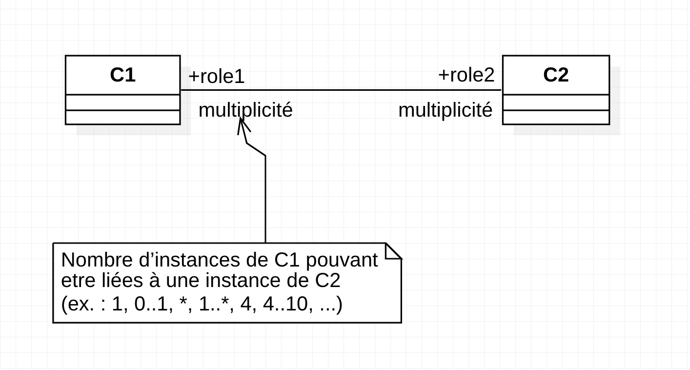
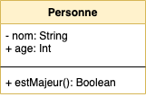
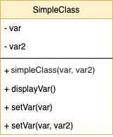
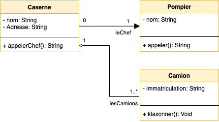
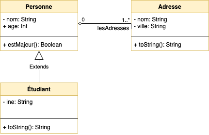
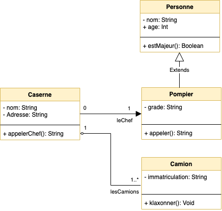
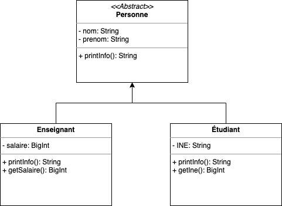

# La modélisation objet

Ce document présente l'équivalence entre une représentation UML et la syntaxe objet (PHP)

::: details Sommaire
[[toc]]
:::

## Un diagramme de classes est un graphe :

- Nœud du graphe = Classe
- Le lien = Relation entre des classes.
- Représente un problème dans son ensemble.

## Multiplicité



## La navigabilité


Par défaut :

- Navigabilité dans les deux sens
- C1 a un attribut de type C2 et C2 a un attribut de type C1


Spécification de la navigabilité :

- Orientation de l’association
- C1 a un attribut du type de C2, mais pas l’inverse


## Classe Personne



```php
class Personne {
    private String nom;
    public int age;

    function __construct($nom, $age){
        $this->nom = $nom;
        $this->age = $age;
    }

    function estMajeur(){
        return $this->age >= 18;
    }

    function getNom(){
        return $this->nom;
    }

    function setNom($nom){
        return $this->nom = $nom;
    }
}
```

## La surcharge



```php
<?php
class SimpleClass
{
    // déclaration d'une propriété
    private string $var = 'une valeur par défaut';
    private string $var2 = 'une valeur par défaut';

    // Constructeur
    function __construct($var, $var2)
    {
        $this->var = $var;
        $this->var2 = $var2;
    }

    // déclaration des méthodes
    public function displayVar() {
        echo $this->var;
    }

    public function setVar($var){
        $this->var = $var;
    }

    public function setVar($var, $var2){
        $this->var = $var;
        $this->var2 = $var2;
    }
}
?>
```

## Une personne possède une ou des voiture


```php
class Voiture {
    public Integer $vitesse;
    private Integer $nombreKm;
    private Date $annéeFabrication;
    private Personne $lePropriétaire;

    function __construct($nombreKm, $date, $lePropriétaire){
        $this->nombreKm = $nombreKm;
        $this->annéeFabrication = $annéeFabrication;
        $this->lePropriétaire = $lePropriétaire;
    }

    function __construct($nombreKm, $date){
        $this->nombreKm = $nombreKm;
        $this->annéeFabrication = $annéeFabrication;
    }

    // Reste des méthodes

    function affecterPropriétaire(Personne $p){
        $this->lePropriétaire = $p
    }
}

class Personne {
    private String $nom;
    private String $prenom;
    private String $salaire;
    private Date $dateNaissance;
    Int $nbEnfant;

    function __construct($nom, $prenom){
        $this->nom = $nom;
        $this->prenom = $prenom;
    }

    function presenter(){
        return $this->nom . " " . $ths->prenom;
    }
}
```

## Un enseignant stagiaire à un Tuteur


```php
class Enseignant {
    private string $nom;
    private string $prenom;
    private Enseignant unTuteur;

    function __construct($nom, $prenom, $tuteur){
        $this->nom = $nom;
        $this->prenom = $prenom;
        $this->unTuteur = $tuteur;
    }

    function __construct($nom, $prenom){
        $this->nom = $nom;
        $this->prenom = $prenom;
    }
}
```

⚠️ Nous avons ici une récursive, une classe qui possède une propriété du même type à l'intérieur. **(Autre exemple, un Client possède un Parrain de type Client)**

## Classe Caserne & lien avec Pompier & collection de camions



```php
class Caserne {
    private string nom;
    private string addresse;
    private Pompier leChef;
    private Camion[] lesCamions = [];

    function __construct($nom, $addresse, $leChef){
        $this->nom = $nom;
        $this->addresse = $addresse;
        $this->leChef = $leChef;
    }

    function __construct($nom, $addresse, $leChef, $lesCamions){
        $this->nom = $nom;
        $this->addresse = $addresse;
        $this->leChef = $leChef;
        $this->lesCamions = $lesCamions;
    }

    function __construct($nom, $addresse){
        $this->nom = $nom;
        $this->addresse = $addresse;
    }

    function appelerChef(){
        if($this->leChef){
            return $this->leChef->appeler();
        }
    }
}

class Pompier {
    private nom;

    function __construct($nom){
        $this->nom = $nom;
    }

    function appeler(){
        return "Appel du pompier";
    }
}

class Camion {
    private immatriculation;

    function __construct($immatriculation){
        $this->immatriculation = $immatriculation;
    }

    function klaxonner(){
        echo "PimPom PimPom";
    }
}
```

## Héritage


```php
class Personne {
    private nom;
    public age;

    function __construct($nom, $age){
        $this->nom = $nom;
        $this->age = $age;
    }

    function estMajeur(){
        return $this->age >= 18;
    }
}

class Etudiant extends Personne {
    private ine;

    function __construct($ine, $nom, $age){
        parent::__construct($nom, $age);
        $this->ine = $ine;
    }

    function toString(){
        return "{$this->nom}, {$this->age}, {$this->ine}";
    }
}

$etudiant = new Etudiant("0X…", "Valentin", 34);
$etudiant->estMajeur(); // Appel d'une méthode du parent => True
$etudiant->toString(); // Affiche « Valentin, 34, 0X… »
```

## Héritage & Collection



```php
class Personne {
    private nom;
    public age;
    private lesAdresses = []

    function __construct($nom, $age, $lesAdresses){
        $this->nom = $nom;
        $this->age = $age;
        $this->$lesAdresses = $lesAdresses;
    }

    function estMajeur(){
        return $this->age >= 18;
    }
}

class Etudiant extends Personne {
    private ine;

    function __construct($ine, $nom, $age, $lesAdresses){
        parent::__construct($nom, $age, $lesAdresses);
        $this->ine = $ine;
    }

    function toString(){
        return "{$this->nom}, {$this->age}, {$this->ine}, Nombre d'adresse => {count($this->lesAdresses)}";
    }
}

$etudiant = new Etudiant("0X…", "Valentin", 34, [new Adresse("YOLO", "Angers")]);
$etudiant->estMajeur(); // Appel d'une méthode du parent => True
$etudiant->toString(); // Affiche « Valentin, 34, 0X…, Nombre d'adresse => 1»
```

## Cas complet



```php
class Caserne {
    private nom;
    private addresse;
    private leChef;
    private lesCamions = [];

    function __construct($nom, $addresse, $leChef){
        $this->nom = $nom;
        $this->addresse = $addresse;
        $this->leChef = $leChef;
    }

    function __construct($nom, $addresse, $leChef, $lesCamions){
        $this->nom = $nom;
        $this->addresse = $addresse;
        $this->leChef = $leChef;
        $this->lesCamions = $lesCamions;
    }

    function __construct($nom, $addresse){
        $this->nom = $nom;
        $this->addresse = $addresse;
    }

    function appelerChef(){
        if($this->leChef){
            return $this->leChef->appeler();
        }
    }
}

class Personne {
    private nom;
    public age;

    function __construct($nom, $age){
        $this->nom = $nom;
        $this->age = $age;
    }

    function estMajeur(){
        return $this->age >= 18;
    }
}

class Pompier extends Personne {
    private grade;

    function __construct($nom, $age, $grade){
        parent::__construct($nom, $age);
        $this->grade = $grade;
    }

    function appeler(){
        return "Appel du pompier";
    }
}

class Camion {
    private immatriculation;

    function __construct($immatriculation){
        $this->immatriculation = $immatriculation;
    }

    function klaxonner(){
        echo "PimPom PimPom";
    }
}
```

## Classe Abstraite



```php
abstract class Personne
{
    private $nom = "";
    private $prenom = "";

    abstract public function printInfo();

    public function getNom() {
        return $this->nom . "\n";
    }

    public function getPrenom() {
        return $this->prenom . "\n";
    }
}

class Enseignant extends Personne
{
    private $salaire = 0;

    public function printInfo() {
        return $this->nom . " => " . $this->$salaire;
    }
}

class Etudiant extends Personne
{
    private $INE = "";

    public function printInfo() {
        return $this->INE . " => " . $this->$nom;
    }
}
```

## Les interfaces


```php
interface Player{
    public function play();
    public function stop();
    public function pause();
    public function reverse();
}

interface Recorder{
    public function record();
}

class DVDPlayer implements Player{

    // Vous avez ici des éléments propres à un
    // Lecteur DVD. Mais l'implémentation
    // FORCERA à déclarer au moins les 4 méthodes suivantes

    public function play() {
        // Implémentation de la méthode
    }

    public function stop() {
        // Implémentation de la méthode
    }

    public function pause() {
        // Implémentation de la méthode
    }

    public function reverse() {
        // Implémentation de la méthode
    }
}

class TapePlayer implements Player, Recorder{

    // Vous avez ici des éléments propres à un
    // lecteur cassette. Mais la DOUBLE implémentation
    // FORCERA à déclarer au moins les 4 méthodes suivantes
    // + La méthode record de l'interface REcorder

    public function record() {
        // Implémentation de la méthode
    }

    public function play() {
        // Implémentation de la méthode
    }

    public function stop() {
        // Implémentation de la méthode
    }

    public function pause() {
        // Implémentation de la méthode
    }

    public function reverse() {
        // Implémentation de la méthode
    }
}


class Studio{

    // Player
    private $player;

    function __construct($player){
        $this->player = $player;
    }
}


```
