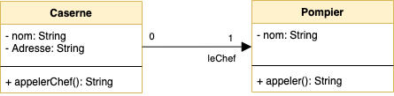

# La modélisation objet

Ce document présente l'équivalence entre une représentation UML et la syntaxe objet (PHP)

::: details Sommaire
[[toc]]
:::

## Classe Personne


```php
class Personne {
    private nom;
    public age;

    function __construct($nom, $age){
        $this->nom = $nom;
        $this->age = $age;
    }

    function estMajeur(){
        return $this->age >= 18;
    }
}
```

## Classe Caserne & lien avec Pompier



```php
class Caserne {
    private nom;
    private addresse;
    private leChef;

    function __construct($nom, $addresse, $leChef){
        $this->nom = $nom;
        $this->addresse = $addresse;
        $this->leChef = $leChef;
    }

    function __construct($nom, $addresse){
        $this->nom = $nom;
        $this->addresse = $addresse;
    }

    function appelerChef(){
        if($this->leChef){
            return $this->leChef->appeler();
        }
    }
}

class Pompier {
    private nom;

    function __construct($nom){
        $this->nom = $nom;
    }

    function appeler(){
        return "Appel du pompier";
    }
}
```

## Classe Caserne & lien avec Pompier & collection de camions


```php
class Caserne {
    private nom;
    private addresse;
    private leChef;
    private lesCamions = [];

    function __construct($nom, $addresse, $leChef){
        $this->nom = $nom;
        $this->addresse = $addresse;
        $this->leChef = $leChef;
    }

    function __construct($nom, $addresse, $leChef, $lesCamions){
        $this->nom = $nom;
        $this->addresse = $addresse;
        $this->leChef = $leChef;
        $this->lesCamions = $lesCamions;
    }

    function __construct($nom, $addresse){
        $this->nom = $nom;
        $this->addresse = $addresse;
    }

    function appelerChef(){
        if($this->leChef){
            return $this->leChef->appeler();
        }
    }
}

class Pompier {
    private nom;

    function __construct($nom){
        $this->nom = $nom;
    }

    function appeler(){
        return "Appel du pompier";
    }
}

class Camion {
    private immatriculation;

    function __construct($immatriculation){
        $this->immatriculation = $immatriculation;
    }

    function klaxonner(){
        echo "PimPom PimPom";
    }
}
```

## Héritage


```php
class Personne {
    private nom;
    public age;

    function __construct($nom, $age){
        $this->nom = $nom;
        $this->age = $age;
    }

    function estMajeur(){
        return $this->age >= 18;
    }
}

class Etudiant extends Personne {
    private ine;

    function __construct($ine, $nom, $age){
        parent::__construct($nom, $age);
        $this->ine = $ine;
    }

    function toString(){
        return "{$this->nom}, {$this->age}, {$this->ine}";
    }
}

$etudiant = new Etudiant("0X…", "Valentin", 34);
$etudiant->estMajeur(); // Appel d'une méthode du parent => True
$etudiant->toString(); // Affiche « Valentin, 34, 0X… »
```

## Héritage & Collection


```php
class Personne {
    private nom;
    public age;
    private lesAdresses = []

    function __construct($nom, $age, $lesAdresses){
        $this->nom = $nom;
        $this->age = $age;
        $this->$lesAdresses = $lesAdresses;
    }

    function estMajeur(){
        return $this->age >= 18;
    }
}

class Etudiant extends Personne {
    private ine;

    function __construct($ine, $nom, $age, $lesAdresses){
        parent::__construct($nom, $age, $lesAdresses);
        $this->ine = $ine;
    }

    function toString(){
        return "{$this->nom}, {$this->age}, {$this->ine}, Nombre d'adresse => {count($this->lesAdresses)}";
    }
}

$etudiant = new Etudiant("0X…", "Valentin", 34, [new Adresse("YOLO", "Angers")]);
$etudiant->estMajeur(); // Appel d'une méthode du parent => True
$etudiant->toString(); // Affiche « Valentin, 34, 0X…, Nombre d'adresse => 1»
```

## Cas complet


```php
class Caserne {
    private nom;
    private addresse;
    private leChef;
    private lesCamions = [];

    function __construct($nom, $addresse, $leChef){
        $this->nom = $nom;
        $this->addresse = $addresse;
        $this->leChef = $leChef;
    }

    function __construct($nom, $addresse, $leChef, $lesCamions){
        $this->nom = $nom;
        $this->addresse = $addresse;
        $this->leChef = $leChef;
        $this->lesCamions = $lesCamions;
    }

    function __construct($nom, $addresse){
        $this->nom = $nom;
        $this->addresse = $addresse;
    }

    function appelerChef(){
        if($this->leChef){
            return $this->leChef->appeler();
        }
    }
}

class Personne {
    private nom;
    public age;

    function __construct($nom, $age){
        $this->nom = $nom;
        $this->age = $age;
    }

    function estMajeur(){
        return $this->age >= 18;
    }
}

class Pompier extends Personne {
    private grade;

    function __construct($nom, $age, $grade){
        parent::__construct($nom, $age);
        $this->grade = $grade;
    }

    function appeler(){
        return "Appel du pompier";
    }
}

class Camion {
    private immatriculation;

    function __construct($immatriculation){
        $this->immatriculation = $immatriculation;
    }

    function klaxonner(){
        echo "PimPom PimPom";
    }
}
```

## Classe Abstraite


```php
abstract class Personne
{
    private $nom = "";
    private $prenom = "";

    abstract protected function printInfo();

    public function getNom() {
        return $this->nom . "\n";
    }

    public function getPrenom() {
        return $this->prenom . "\n";
    }
}

class Enseignant extends Personne
{
    private $salaire = 0;

    protected function printInfo() {
        return $this->nom . " => " . $this->$salaire;
    }
}

class Etudiant extends Personne
{
    private $INE = "";

    protected function printInfo() {
        return $this->INE . " => " . $this->$nom;
    }
}
```

## Les interfaces


```php
interface Player{
    public function play();
    public function stop();
    public function pause();
    public function reverse();
}

interface Recorder{
    public function record();
}

class DVDPlayer implements Player{

    // Vous avez ici des éléments propres à un
    // Lecteur DVD. Mais l'implémentation
    // FORCERA à déclarer au moins les 4 méthodes suivantes

    public function play() {
        // Implémentation de la méthode
    }

    public function stop() {
        // Implémentation de la méthode
    }

    public function pause() {
        // Implémentation de la méthode
    }

    public function reverse() {
        // Implémentation de la méthode
    }
}

class TapePlayer implements Player, Recorder{

    // Vous avez ici des éléments propres à un
    // lecteur cassette. Mais la DOUBLE implémentation
    // FORCERA à déclarer au moins les 4 méthodes suivantes
    // + La méthode record de l'interface REcorder

    public function record() {
        // Implémentation de la méthode
    }

    public function play() {
        // Implémentation de la méthode
    }

    public function stop() {
        // Implémentation de la méthode
    }

    public function pause() {
        // Implémentation de la méthode
    }

    public function reverse() {
        // Implémentation de la méthode
    }
}


class Studio{

    // Player
    private $player;

    function __construct($player){
        $this->player = $player;
    }
}


```
