# La modélisation objet

Ce document présente l'équivalence entre une représentation UML et la syntaxe objet (PHP)

::: details Sommaire
[[toc]]
:::

::: warning Un instant !

Les exemples de ce document utilisent la syntaxe **PHP 8** (propriétés et paramètres typés, types de retour). Attention cependant : la surcharge (plusieurs méthodes ou constructeurs avec le même nom) **n'existe pas en PHP**, même en PHP 8. Quand le diagramme UML montre plusieurs constructeurs, l'équivalent PHP est **un seul constructeur avec des paramètres optionnels** (valeur par défaut, type nullable `?Type`). En Java ou en C#, la surcharge est en revanche possible.

:::

## Un diagramme de classes est un graphe :

- Nœud du graphe = Classe
- Le lien = Relation entre des classes.
- Représente un problème dans son ensemble.

## Multiplicité

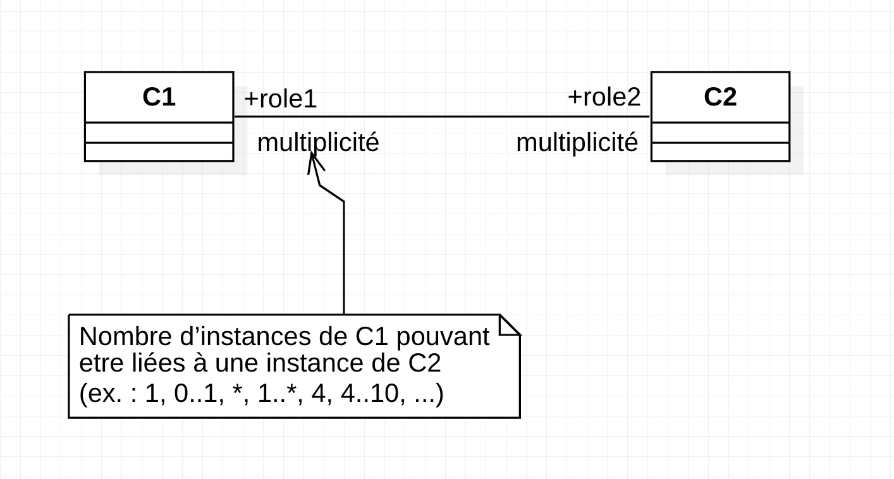

## La navigabilité

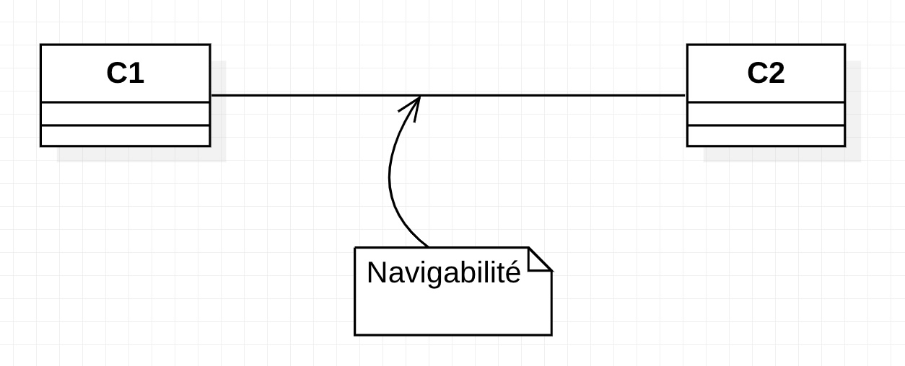

Par défaut :

- Navigabilité dans les deux sens
- C1 a un attribut de type C2 et C2 a un attribut de type C1

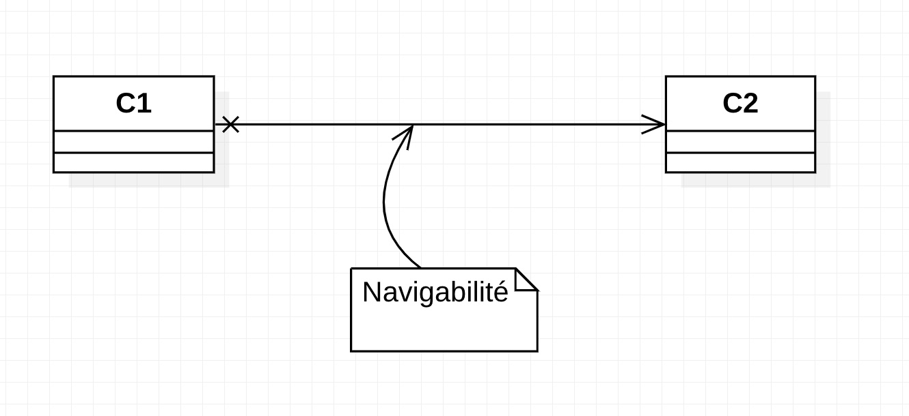

Spécification de la navigabilité :

- Orientation de l’association
- C1 a un attribut du type de C2, mais pas l’inverse


## Classe Personne

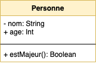

```php
class Personne {
    private string $nom;
    public int $age;

    function __construct(string $nom, int $age){
        $this->nom = $nom;
        $this->age = $age;
    }

    function estMajeur(): bool {
        return $this->age >= 18;
    }

    function getNom(): string {
        return $this->nom;
    }

    function setNom(string $nom): void {
        $this->nom = $nom;
    }
}
```

## La surcharge

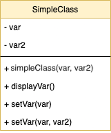

⚠️ Rappel : ce code illustre le concept, mais la surcharge n'est pas possible en PHP (ce code provoquerait une erreur). Elle est en revanche valide en Java ou en C#.

```php
<?php
class SimpleClass
{
    // déclaration d'une propriété
    private string $var = 'une valeur par défaut';
    private string $var2 = 'une valeur par défaut';

    // Constructeur
    function __construct(string $var, string $var2)
    {
        $this->var = $var;
        $this->var2 = $var2;
    }

    // déclaration des méthodes
    public function displayVar(): void {
        echo $this->var;
    }

    public function setVar(string $var){
        $this->var = $var;
    }

    public function setVar(string $var, string $var2){
        $this->var = $var;
        $this->var2 = $var2;
    }
}
?>
```

En PHP, l'équivalent valide s'écrit avec **un seul** `setVar` et un paramètre optionnel :

```php
public function setVar(string $var, ?string $var2 = null): void {
    $this->var = $var;

    if ($var2 !== null) {
        $this->var2 = $var2;
    }
}
```

## Une personne possède une ou des voitures

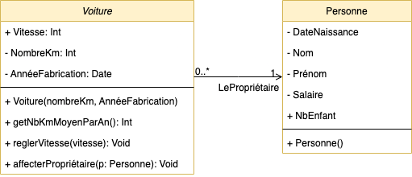

```php
class Voiture {
    public int $vitesse;
    private int $nombreKm;
    private DateTime $annéeFabrication;
    private ?Personne $lePropriétaire;

    // Le propriétaire est optionnel : un seul constructeur suffit en PHP
    function __construct(int $nombreKm, DateTime $date, ?Personne $lePropriétaire = null){
        $this->nombreKm = $nombreKm;
        $this->annéeFabrication = $date;
        $this->lePropriétaire = $lePropriétaire;
    }

    // Reste des méthodes

    function affecterPropriétaire(Personne $p): void {
        $this->lePropriétaire = $p;
    }
}

class Personne {
    private string $nom;
    private string $prenom;
    private float $salaire;
    private DateTime $dateNaissance;
    public int $nbEnfant;

    function __construct(string $nom, string $prenom){
        $this->nom = $nom;
        $this->prenom = $prenom;
    }

    function presenter(): string {
        return $this->nom . " " . $this->prenom;
    }
}
```

## Un enseignant stagiaire a un Tuteur

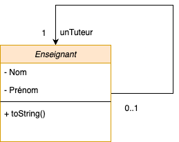

```php
class Enseignant {
    private string $nom;
    private string $prenom;
    private ?Enseignant $unTuteur;

    // Le tuteur est optionnel : un seul constructeur suffit en PHP
    function __construct(string $nom, string $prenom, ?Enseignant $tuteur = null){
        $this->nom = $nom;
        $this->prenom = $prenom;
        $this->unTuteur = $tuteur;
    }
}
```

⚠️ Nous avons ici une relation récursive, une classe qui possède une propriété du même type à l'intérieur. **(Autre exemple, un Client possède un Parrain de type Client)**

## Classe Caserne & lien avec Pompier & collection de camions

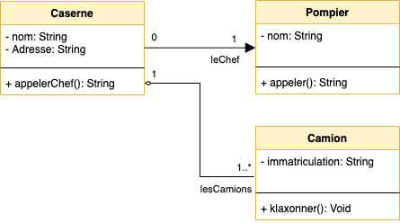

```php
class Caserne {
    private string $nom;
    private string $addresse;
    private ?Pompier $leChef;
    private array $lesCamions; // Collection de Camion

    // Le chef et les camions sont optionnels : un seul constructeur suffit en PHP
    function __construct(string $nom, string $addresse, ?Pompier $leChef = null, array $lesCamions = []){
        $this->nom = $nom;
        $this->addresse = $addresse;
        $this->leChef = $leChef;
        $this->lesCamions = $lesCamions;
    }

    function appelerChef(): ?string {
        if($this->leChef){
            return $this->leChef->appeler();
        }

        return null;
    }
}

class Pompier {
    private string $nom;

    function __construct(string $nom){
        $this->nom = $nom;
    }

    function appeler(): string {
        return "Appel du pompier";
    }
}

class Camion {
    private string $immatriculation;

    function __construct(string $immatriculation){
        $this->immatriculation = $immatriculation;
    }

    function klaxonner(): void {
        echo "PimPom PimPom";
    }
}
```

## Héritage

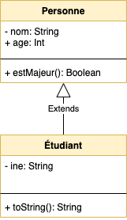

```php
class Personne {
    protected string $nom; // protected : accessible depuis les classes filles
    public int $age;

    function __construct(string $nom, int $age){
        $this->nom = $nom;
        $this->age = $age;
    }

    function estMajeur(): bool {
        return $this->age >= 18;
    }
}

class Etudiant extends Personne {
    private string $ine;

    function __construct(string $ine, string $nom, int $age){
        parent::__construct($nom, $age);
        $this->ine = $ine;
    }

    function toString(): string {
        return "{$this->nom}, {$this->age}, {$this->ine}";
    }
}

$etudiant = new Etudiant("0X…", "Valentin", 34);
$etudiant->estMajeur(); // Appel d'une méthode du parent => True
$etudiant->toString(); // Affiche « Valentin, 34, 0X… »
```

## Héritage & Collection

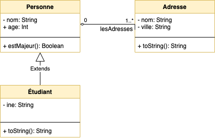

```php
class Personne {
    protected string $nom; // protected : accessible depuis les classes filles
    public int $age;
    protected array $lesAdresses = [];

    function __construct(string $nom, int $age, array $lesAdresses){
        $this->nom = $nom;
        $this->age = $age;
        $this->lesAdresses = $lesAdresses;
    }

    function estMajeur(): bool {
        return $this->age >= 18;
    }
}

class Etudiant extends Personne {
    private string $ine;

    function __construct(string $ine, string $nom, int $age, array $lesAdresses){
        parent::__construct($nom, $age, $lesAdresses);
        $this->ine = $ine;
    }

    function toString(): string {
        return "{$this->nom}, {$this->age}, {$this->ine}, Nombre d'adresses => " . count($this->lesAdresses);
    }
}

$etudiant = new Etudiant("0X…", "Valentin", 34, [new Adresse("YOLO", "Angers")]);
$etudiant->estMajeur(); // Appel d'une méthode du parent => True
$etudiant->toString(); // Affiche « Valentin, 34, 0X…, Nombre d'adresses => 1 »
```

## Cas complet

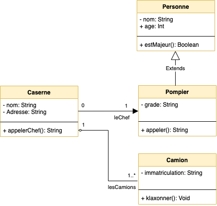

```php
class Caserne {
    private string $nom;
    private string $addresse;
    private ?Pompier $leChef;
    private array $lesCamions;

    // Le chef et les camions sont optionnels : un seul constructeur suffit en PHP
    function __construct(string $nom, string $addresse, ?Pompier $leChef = null, array $lesCamions = []){
        $this->nom = $nom;
        $this->addresse = $addresse;
        $this->leChef = $leChef;
        $this->lesCamions = $lesCamions;
    }

    function appelerChef(): ?string {
        if($this->leChef){
            return $this->leChef->appeler();
        }

        return null;
    }
}

class Personne {
    protected string $nom;
    public int $age;

    function __construct(string $nom, int $age){
        $this->nom = $nom;
        $this->age = $age;
    }

    function estMajeur(): bool {
        return $this->age >= 18;
    }
}

class Pompier extends Personne {
    private string $grade;

    function __construct(string $nom, int $age, string $grade){
        parent::__construct($nom, $age);
        $this->grade = $grade;
    }

    function appeler(): string {
        return "Appel du pompier";
    }
}

class Camion {
    private string $immatriculation;

    function __construct(string $immatriculation){
        $this->immatriculation = $immatriculation;
    }

    function klaxonner(): void {
        echo "PimPom PimPom";
    }
}
```

## Classe Abstraite

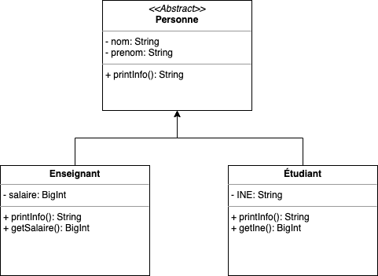

```php
abstract class Personne
{
    protected string $nom = ""; // protected : accessible depuis les classes filles
    protected string $prenom = "";

    abstract public function printInfo(): string;

    public function getNom(): string {
        return $this->nom . "\n";
    }

    public function getPrenom(): string {
        return $this->prenom . "\n";
    }
}

class Enseignant extends Personne
{
    private float $salaire = 0;

    public function printInfo(): string {
        return $this->nom . " => " . $this->salaire;
    }
}

class Etudiant extends Personne
{
    private string $INE = "";

    public function printInfo(): string {
        return $this->INE . " => " . $this->nom;
    }
}
```

## Les interfaces

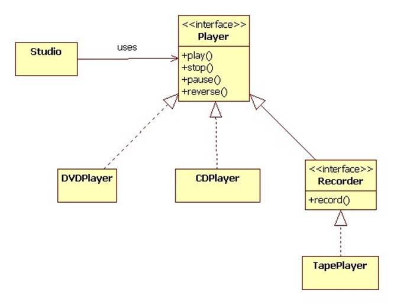

```php
interface Player{
    public function play(): void;
    public function stop(): void;
    public function pause(): void;
    public function reverse(): void;
}

interface Recorder{
    public function record(): void;
}

class DVDPlayer implements Player{

    // Vous avez ici des éléments propres à un
    // Lecteur DVD. Mais l'implémentation
    // FORCERA à déclarer au moins les 4 méthodes suivantes

    public function play(): void {
        // Implémentation de la méthode
    }

    public function stop(): void {
        // Implémentation de la méthode
    }

    public function pause(): void {
        // Implémentation de la méthode
    }

    public function reverse(): void {
        // Implémentation de la méthode
    }
}

class TapePlayer implements Player, Recorder{

    // Vous avez ici des éléments propres à un
    // lecteur cassette. Mais la DOUBLE implémentation
    // FORCERA à déclarer au moins les 4 méthodes suivantes
    // + La méthode record de l'interface Recorder

    public function record(): void {
        // Implémentation de la méthode
    }

    public function play(): void {
        // Implémentation de la méthode
    }

    public function stop(): void {
        // Implémentation de la méthode
    }

    public function pause(): void {
        // Implémentation de la méthode
    }

    public function reverse(): void {
        // Implémentation de la méthode
    }
}


class Studio{

    // Le type est l'interface : n'importe quel Player convient (DVDPlayer, TapePlayer…)
    private Player $player;

    function __construct(Player $player){
        $this->player = $player;
    }
}


```
