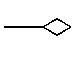
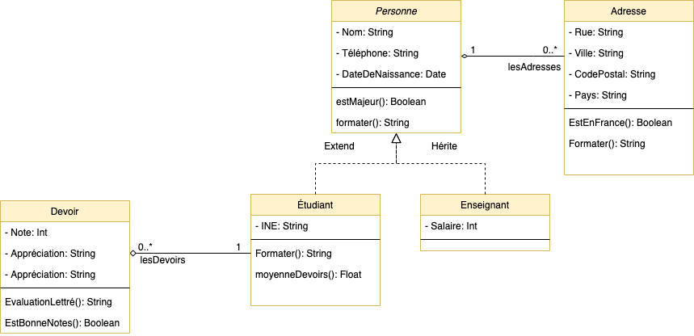
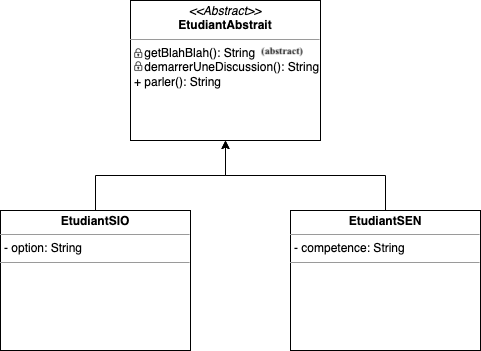
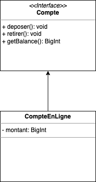
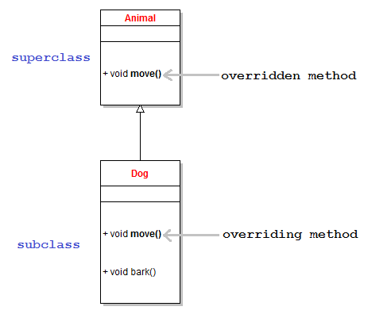

# La syntaxe Objet

Ce document présente la syntaxe objet avec des exemples PHP, Java & Kotlin

::: details Sommaire
[[toc]]
:::

## Introduction

### La POO c'est 4 concepts

- **Concept de modélisation** à travers la notion de classe et d’instanciation de ces classes.
- **Concept d’action** à travers la notion d’envoi de messages et de méthodes à l’intérieur des objets.
- **Concept de construction** en créant un objet en reposant sur la définition d’une classe.
- **Concept d'encapsulation** l'accès aux propriétés se fait via un getter et un setter. (inaccessible de l'exterieur).

::: tip, Mais surtout
Ça permet de représenter **informatiquement** quelque chose du monde réel.
:::

### Deux notions

- Les classes
- Les objets

### Définition

La **programmation orientée objet** (POO) est un paradigme de programmation qui utilise des objets pour représenter des entités du monde réel. Les objets sont des instances de classes, qui peuvent contenir des données et des méthodes. Les classes sont des modèles pour créer des objets.

### Avantages

- **Réutilisation** : on peut réutiliser des classes déjà existantes.
- **Abstraction** : on peut cacher les détails d'implémentation.
- **Encapsulation** : on peut cacher les données et les méthodes.
- **Héritage** : on peut créer des classes à partir d'autres classes.

### La modélisation

Avant de parler des classes ou des objets, je vous propose de regarder le principe de la modélisation

[Voir la version UML / Classe](/cheatsheets/poo-uml/)

### Les classes

- Serviront de moule pour créer des objets.
- Une classe étant **une définition**, elle nous servira plus tard à créer **des objets**.

#### Une classe est composée de :

- D'attributs (variable d'instance ou propriété).
- De méthodes (actions / opération au niveau de la classe).

Les attributs sont les valeurs qui feront fonctionner notre objet (exemple `nom`, `prenom`, `age` etc.).

Les méthodes vont permettre d'effectuer des actions dans notre objet (exemple `presenter()`, `bouger()`, etc.).

#### Nous avons donc deux types membres dans la classe

- Des **propriétés** (le données de l'objet) **avec une visibilité**
- Des **méthodes** (les actions possibles : accélérer, freiner, etc.) **avec une visibilité**

#### La visibilité ?

- Privée : accessible que dans l'objet.
- Public : accessible hors de l'objet.
- Protected : **Accessible** aux enfants (héritage), mais pas hors de la classe.

#### Les méthodes

- Comme une fonction, mais **encapsulé** dans la classe.
- Possède une visibilité.
- Possède des paramètres.
- Surcharge: plusieurs **méthodes** peuvent avoir le même nom et des paramètres différents (type et/ou ordre).

#### Les types de méthodes

Dans une classe nous avons différents types de méthodes :

- Le constructeur.
- Les méthodes d'actions.
- Les méthodes accesseurs / mutateurs.

Le constructeur est une méthode qui permet d'initialiser un objet. Il est appelé automatiquement lors de la création d'un objet (`new`). Il est possible de définir plusieurs constructeurs dans une classe (surcharge).

Les méthodes d'actions sont des méthodes qui permettent d'effectuer des actions sur l'objet. Exemple : `accelerer()`, `freiner()`, `tourner()`, etc.

Les méthodes accesseurs / mutateurs sont des méthodes qui permettent de lire ou d'écrire les propriétés de l'objet. Exemple : `getVitesse()`, `setVitesse()`, etc. Elles sont appelées **getter** et **setter**.

### Exemple


<CodeGroup>
  <CodeGroupItem title="PHP" active>

```php
class Personne
{

    // Attribut
    public $nom;
    public $prenom;
    private $dateNaissance;
    private $salaire;
    public $nbEnfant;


    // Constructeur
    function __construct($nom, $prenom, $dateNaissance, $nbEnfant = 0)
    {
        $this->nom = $nom;
        $this->prenom = $prenom;
        $this->dateNaissance = $dateNaissance;
        $this->nbEnfant = $nbEnfant;
    }

    // Mutateurs
    public function setSalaire($valeur)
    {
        $this->salaire = $valeur;
    }

    // Accesseur
    public function getSalaire()
    {
        return $this->salaire;
    }


    // Méthode
    public function identite(){
        return $this->nom . " " . $this->prenom;
    }

    // Méthode
    public function age()
    {
        // Implémentation
    }

    // Méthode
    public function argentPoche()
    {
        // Implémentation
    }
}
```

  </CodeGroupItem>
  <CodeGroupItem title="Java">

```java
import java.util.Date;

class Personne
{

    // Attribut
    public String nom;
    public String prenom;
    private Date dateNaissance;
    private Integer salaire;
    public Integer nbEnfant;


    // Constructeur
    public Personne(String nom, String prenom, Date dateNaissance, Integer nbEnfant = 0)
    {
        this.nom = nom;
        this.prenom = prenom;
        this.dateNaissance = dateNaissance;
        this.nbEnfant = nbEnfant;
    }

    // Mutateurs
    public void setSalaire(Integer valeur)
    {
        this.salaire = valeur;
    }

    // Accesseur
    public Integer getSalaire()
    {
        return this.salaire;
    }


    // Méthode
    public String identite(){
        return this.nom + " " + this.prenom;
    }

    // Méthode
    public void age()
    {
        // Implémentation
    }

    // Méthode
    public void argentPoche()
    {
        // Implémentation
    }
}
```

  </CodeGroupItem>
  <CodeGroupItem title="Kotlin">

```kotlin
import java.util.*

internal class Personne(var nom: String, var prenom: String, private val dateNaissance: Date, var nbEnfant: Int) {
    var salaire: Int? = null

    // Méthode
    fun identite(): String {
        return "$nom $prenom"
    }

    // Méthode
    fun age() {
        // Implémentation
    }

    // Méthode
    fun argentPoche() {
        // Implémentation
    }
}
```

  </CodeGroupItem>
  <CodeGroupItem title="C#">

```cs
public class Personne
{
    
  // Variable
 public string nom, prenom;
	public int nbEnfant;
	private DateTime dateNaissance;
	private int salaire;
	
	public Personne(string nom, string prenom, DateTime dateNaissance, int nbEnfant)
	{
		this.nom = nom;
		this.prenom = prenom;
		this.dateNaissance = dateNaissance;
		this.nbEnfant = nbEnfant;
	}

	public void setSalaire(int value)
	{
		this.salaire = value;
	}
	
	public int getSalaire()
	{
		return this.salaire;
	}
	
	public string identite()
	{
		return this.nom + " " + this.prenom;
	}
	
	public int age()
	{
		//Implémentation
	}
	
	public void argentPoche(int value)
	{
		//Implémentation
	}
}
```
  </CodeGroupItem>
</CodeGroup>

::: danger Ce qu'il faut retenir

- Les classes sont instanciables (création d'objets, `$unPersonne = new Personne(…)`).
- Les propriétés sont les « variables » de l'objet.
- Les méthodes sont les « actions » de l'objet.
- Les méthodes **et** les propriétés _**ont des visibilités**_.
- Les méthodes peuvent être surchargées.

:::

## Les objets

Chaque objet représente un objet du monde réel. Exemple : une voiture, une personne, un élément de menu, etc.

### exemple :

- une personne **précise**
- une voiture **spécifique**
- Un élément de menu.

⚠️ Utilise les classes précédemment définies ⚠️

<CodeGroup>
  <CodeGroupItem title="PHP" active>

```php
$personne1 = new Personne("Valentin", "Brosseau", "28/02/1987", 0);
$personne2 = new Personne("John", "Doe", "01/01/1970", 12); 
```

</CodeGroupItem>  
<CodeGroupItem title="C#">

```cs 
Personne personne1 = new Personne("Valentin", "Brosseau", "28/02/1987", 0);
Personne personne2 = new Personne("John", "Doe", "01/01/1970", 12);
```
    
  </CodeGroupItem>  
</CodeGroup>

👀 Créer un objet == Instancier 👀

---

## Définir une classe

<CodeGroup>
  <CodeGroupItem title="PHP" active>

```php
class Personne
{
    // Attribut
    private $nom;
    private $prenom;

    // Constructeur
    function __construct($nom, $prenom)
    {
        $this->nom = $nom;
        $this->prenom = $prenom;
    }

    // Méthode
    public function identite(){
        return $this->nom . " " . $this->prenom;
    }

    // Accesseur
    public function getNom()
    {
        return $this->nom;
    }

    // Mutateur
    public function setNom($nom)
    {
        $this->nom = $nom;
    }
}
```

  </CodeGroupItem>

  <CodeGroupItem title="Java">

```java
class Personne {

    // Attribut
    private String nom;
    private String prenom;

    // Constructeur
    public Personne(String nom, String prenom) {
        this.nom = nom;
        this.prenom = prenom;
    }

    // Méthode
    public String identite(){
        return this.nom + " " + this.prenom;
    }

    // Accesseur
    public String getNom()
    {
        return this.nom;
    }

    // Mutateur
    public void setNom(String nom)
    {
        this.nom = nom;
    }

}
```

  </CodeGroupItem>

  <CodeGroupItem title="Kotlin">

```kotlin
class Personne(val nom: String, val prenom: String) {
    // Méthode
    fun identite(): String {
        return "$nom $prenom"
    }

    // Accesseur
    fun getNom(): String {
        return nom
    }

    // Mutateur
    fun setNom(nom: String) {
        this.nom = nom
    }
}
```

  </CodeGroupItem>
  <CodeGroupItem title="C#">

```cs
class Personne {
    // Attribut
    private string nom;
    private string prenom;

    // Constructeur
    public Personne(string nom, string prenom) {
        this.nom = nom;
        this.prenom = prenom;
    }

    // Méthode  
    public string identite() {
        return this.nom + " " + this.prenom;
    }

    // Accesseur
    public string getNom() {
        return this.nom;
    }
}
```

  </CodeGroupItem>
</CodeGroup>

## Instanciation (créer un objet)

<CodeGroup>
  <CodeGroupItem title="PHP" active>

```php
// Instanciation
$unePersonne = new Personne("Valentin", "Brosseau");
```

  </CodeGroupItem>

  <CodeGroupItem title="Java">

```java
// Instanciation
Personne unPersonne = new Personne("Valentin", "Brosseau");
```

  </CodeGroupItem>

  <CodeGroupItem title="Kotlin">

```kotlin
// Instanciation
unPersonne = Personne("Valentin", "Brosseau");
```

  </CodeGroupItem>
  
  <CodeGroupItem title="C#">

```cs
// Instanciation
Personne unePersonne = new Personne("Valentin", "Brosseau");
```

  </CodeGroupItem>
</CodeGroup>

## Le constructeur

<CodeGroup>
  <CodeGroupItem title="PHP" active>

```php
class Personne
{
    // Attribut
    private $nom;
    private $prenom;

    // Constructeur
    function __construct($nom, $prenom)
    {
        $this->nom = $nom;
        $this->prenom = $prenom;
    }
}
```

  </CodeGroupItem>

  <CodeGroupItem title="Java">

```java
class Personne {
    // Attribut
    private final String nom;
    private final String prenom;

    // Constructeur
    public Personne(String nom, String prenom) {
        this.nom = nom;
        this.prenom = prenom;
    }
}
```

  </CodeGroupItem>
  <CodeGroupItem title="Kotlin">

```kotlin
class Personne(val nom: String, val prenom: String) {
}
```

  </CodeGroupItem>
  
   <CodeGroupItem title="C#">

```cs 
class Personne {
  
  // Attribut
  private string nom;
  private string prenom;

  // Le constructeur
  public Personne(string nom, string prenom)
  {
    this.nom = nom;
    this.prenom = prenom;
  }
}
```

  </CodeGroupItem>
</CodeGroup>

## Accès à une méthode

<CodeGroup>
  <CodeGroupItem title="PHP" active>

```php
// Instanciation
$unePersonne = new Personne("Valentin", "Brosseau");

// Appel de la méthode
$unPersonne->afficheIdentite(); // Affiche "Valentin Brosseau"
```

  </CodeGroupItem>

  <CodeGroupItem title="Java">

```java
// Instanciation
Personne unePersonne = new Personne("Valentin", "Brosseau");

// Appel de la méthode
unePersonne.afficheIdentite(); // Affiche "Valentin Brosseau"
```

  </CodeGroupItem>
  <CodeGroupItem title="Kotlin">

```kotlin
// Instanciation
unePersonne = Personne("Valentin", "Brosseau");

// Appel de la méthode
unePersonne.afficheIdentite(); // Affiche "Valentin Brosseau"
```

  </CodeGroupItem>
  <CodeGroupItem title="C#">

```cs
// Instanciation
Personne unePersonne = new Personne("Valentin", "Brosseau");

// Appel de la méthode
unePersonne.identite(); // Affiche "Valentin Brosseau"
```

  </CodeGroupItem>
</CodeGroup>

## Accès à une propriété // Accesseur et Mutateur

<CodeGroup>
  <CodeGroupItem title="PHP" active>

```php
$unePersonne = new Personne("Valentin", "Brosseau");
$unePersonne->getNom(); // Affiche "Valentin"

$unePersonne->setNom("Chouette");
$unePersonne->getNom(); // Affiche "Chouette", la valeur a été modifiée
```

  </CodeGroupItem>

  <CodeGroupItem title="Java">

```java
Personne unPersonne = new Personne("Valentin", "Brosseau");
unePersonne.getNom(); // Affiche "Valentin"

unePersonne.setNom("Chouette");
unePersonne.getNom(); // Affiche "Chouette", la valeur a été modifiée
```

  </CodeGroupItem>
</CodeGroup>

::: tip Attention

L'accès aux propriétés ne fonctionnera que si la visibilité (`private`, `public`, `protected`) ne vous y autorise :

|  Visibilité |                                                                     Accès depuis |
| ----------: | -------------------------------------------------------------------------------: |
|   `private` |                                             Seulement depuis l'objet en lui-même |
|    `public` |                 Depuis n'import où (objet, depuis l'objet, ou depuis l'héritage) |
| `protected` | Comme, `private` **mais non accessible depuis la classe fille en cas d'héritage** |

:::

## Les collections


::: tip Le losange vide



Ce symbole signifie la notion de composition. Dans notre cas, une Entreprise n’est composée de personne.

:::

Permets de regrouper des listes d'objets.



En modélisation, la flèche signifie un lien entre les deux classes. En l'occurrence, dans le cas des collections, nous aurons :

- Le nom « de la collection » qui va contenir les objets.
- Le nombre minimum & maximum.
- Exemple, **1** étudiant possède plusieurs devoirs.

Fonctionnellement, nous allons donc avoir dans l'étudiant une collection d'objets du type devoirs. Celle-ci sera nommée **lesDevoirs**. **lesDevoirs** sera une propriété de la classe Étudiant.

### Déclaration

<CodeGroup>
  <CodeGroupItem title="PHP" active>

```php
$lesPersonnes = [];
```

  </CodeGroupItem>

  <CodeGroupItem title="Java">

```java
ArrayList<Personne> lesPersonnes = new ArrayList();
```

  </CodeGroupItem>
  <CodeGroupItem title="C#">

```cs
List<Personne> lesPersonnes = new List<Personne>();
```

  </CodeGroupItem>
</CodeGroup>

### Utilisation

<CodeGroup>
  <CodeGroupItem title="PHP" active>

```php
$lesPersonnes = [];
$unePersonne = new Personne("Doe", "John");

array_push($lesPersonnes, new Personne("Brosseau", "Valentin"));
array_push($lesPersonnes, $unePersonne);

$nombre = sizeof($lesPersonnes); // 2

$unePersonne1 = $lesPersonnes[0]; // Valentin Brosseau
$unePersonne2 = $lesPersonnes[1]; // John Doe

$lesPersonnes = [];
$nombre = sizeof($lesPersonnes); // 0
```

  </CodeGroupItem>

  <CodeGroupItem title="Java">

```java
ArrayList<Personne> lesPersonnes = new ArrayList<>();
Personne carine = new Personne("John", "Doe");

lesPersonnes.add(new Personne("Valentin", "Brosseau"));
lesPersonnes.add(carine);
int count = lesPersonnes.size(); // 2

Personne laPersonne1 = lesPersonnes.get(0); // Valentin;
Personne laPersonne2 = lesPersonnes.get(1); // Carine;

lesPersonnes.clear();
int count2 = lesPersonnes.size(); // 0
```

  </CodeGroupItem>
  <CodeGroupItem title="Kotlin">

```kotlin
val lesPersonnes = ArrayList<Personne>()
val carine = Personne("John", "Doe")

lesPersonnes.add(Personne("Valentin", "Brosseau"))
lesPersonnes.add(carine)
val count = lesPersonnes.size // 2

val laPersonne1 = lesPersonnes[0] // Valentin;
val laPersonne2 = lesPersonnes[1] // Carine;

lesPersonnes.clear()
val count2 = lesPersonnes.size // 0
```

  </CodeGroupItem>
      <CodeGroupItem title="C#">

```cs
List<Personne> lesPersonnes = new List<Personne>();
Personne unePersonne = new Personne("Doe", "John");

lesPersonnes.add(new Personne("Valentin", "Brosseau");
lesPersonnes.add(unePersonne);

Personne unePersonne1 = lesPersonnes[0];
Personne unePersonne2 = lesPersonnes[1];

List<Personne> lesPersonnes = new List<Personne>();

int nombre = lesPersonnes.count(); // 0
```

  </CodeGroupItem>
</CodeGroup>

### Parcours de collection

<CodeGroup>
  <CodeGroupItem title="PHP" active>

```php
foreach ($lesPersonne as $laPersonne){
    // $laPersonne contient « un pointeur » vers une des personne de la liste
    // À chaque tour de boucle nous avons la personne suivante.
}
```

  </CodeGroupItem>

  <CodeGroupItem title="Java">

```java
// Version moderne
lesPersonnes.forEach(laPersonne -> {
    // laPersonne contient « un pointeur » vers une des personne de la liste
    // À chaque tour de boucle nous avons la personne suivante.
});

// Version « à l'ancienne »
for (Personne laPersonne : lesPersonnes) {
    // laPersonne contient « un pointeur » vers une des personne de la liste
    // À chaque tour de boucle nous avons la personne suivante.
}
```

  </CodeGroupItem>
  <CodeGroupItem title="Kotlin">

```kotlin
// Version moderne
lesPersonnes.forEach { laPersonne -> }

// Version « à l'ancienne »
for (laPersonne in lesPersonnes) {
    // laPersonne contient « un pointeur » vers une des personne de la liste
    // À chaque tour de boucle nous avons la personne suivante.
}
```

  </CodeGroupItem>
  
  <CodeGroupItem title="C#">

```cs
foreach (Personne laPersonne in lesPersonnes){
	// laPersonne contient « un pointeur » vers une des personne de la liste
    // À chaque tour de boucle nous avons la personne suivante.
}
```

  </CodeGroupItem>
</CodeGroup>

## L'héritage

L'héritage permet de généraliser le fonctionnement d'un objet. L'idée est de mettre dans un « objet parent » la logique de plusieurs objets qui fonctionne de la même façon. **Exemple**

- Un **humain** et une baleine partage des propriété et fonctionnement commun. Nous allons donc créer une super classe **mammifère,** celle-ci contiendra les méthodes et les propriétés communes.
- Une **Voiture** et une **Moto** sont des véhicules. Nous pouvons donc créer une super classe « **Véhicule** ».
- …

Comment identifier qu'il s'agit d'un héritage ? **C'est simple**, si vous pouvez dire « est un » alors il s'agit d'un héritage. Exemple :

- Un **humain** est un **mammifère**.
- Une **Voiture** est un **Véhicule**.
- Mais nous ne pouvons pas dire qu'un **Pompier** est un **Camion**. Il n'y a pas d'héritage.

Le mot clé **extends** permet de définir une classe enfant. **Exemple**

<CodeGroup>
  <CodeGroupItem title="PHP" active>

```php
class Mammifere {
    private $vertebre = true;

    public function print() {
        echo "Je suis un mammifère";
    }

    public function manger(){
        echo "Je mange";
    }
}

// Humain hérite de Mammifere
class Humain extends mammifere {
    private $prenom = "";

    function __construct($prenom)
    {
        parent::__construct();
        this->$prenom = $prenom;
    }

    public function manger(){
        echo "Je suis omnivore";
    }
}

$unHumain = new Humain("Valentin");
$unHumain->print(); // Je suis un mammifère.
$unHumain->manger(); // Je suis omnivore
```

  </CodeGroupItem>

  <CodeGroupItem title="Java">

```java
class Mammifere {
    private Boolean vertebre = true;

    public void print() {
        System.out.println("Je suis un mammifère");
    }

    // Redéfinition de méthode
    public String manger(){
        System.out.println("Je mange");
    }
}

class Humain extends Mammifere {
    private String prenom = "";

    public Hunain(String prenom)
    {
        super();
        this.prenom = prenom;
    }

    // Redéfinition de méthode
    public String manger(){
        System.out.println("Je suis omnivore");
    }
}

Humain unHumain = new Humain("Valentin");
unHumain.print(); // Je suis un mammifère.
unHumain.manger(); // Je suis omnivore.
```

  </CodeGroupItem>
  <CodeGroupItem title="Kotlin">

```kotlin
internal open class Mammifere {
    private val vertebre = true
    fun print() {
        println("Je suis un mammifère")
    }

    // Redéfinition de méthode
    open fun manger() {
        println("Je mange")
    }
}

internal class Humain(val prenom: String) : Mammifere() {
    // Redéfinition de méthode
    override fun manger() {
        println("Je suis omnivore")
    }

    var unHumain = Humain("Valentin")
}

Humain unHumain = Humain("Valentin");
unHumain.print(); // Je suis un mammifère.
unHumain.manger(); // Je suis omnivore.
```

  </CodeGroupItem>
  
  <CodeGroupItem>
    
```cs
public class Mammifere {
    
    private Bool vertebre = true;

    public void print() 
    {
        Console.WriteLine("Je suis un mammifère");
    }

    public void manger()
    {
        Console.WriteLine("Je mange");
    }
}

public class Humain : Mammifere {
    private string prenom = "";

    public Humain(string prenom) : base()
    {
        this.prenom = prenom;
    }

    public string manger()
    {
        Console.WriteLine("Je suis omnivore");
    }
}

Humain unHumain = new Humain("Valentin");
unHumain.string(); // Je suis un mammifère
unHumain.manger(); // Je suis omnivore
```
    
  </CodeGroupItem>
</CodeGroup>

## Synthèse héritage

- La classe mère contient la logique **partagée**.
- La classe fille contient la logique **spécifique**.
- Si nous pouvons dire « est un » alors il s'agit d'un héritage.
- Un mot-clé Extends `class Humain extends Mammifere`.
- **Vous devez** construire le parent dans le constructeur de l'enfant.
- **Permets de généraliser un objet afin de partager des propriétés communes.**.
- **mais** il est également possible de spécialiser / redéfinir un objet.
  - Redéfinition, comme la surcharge, mais entre la classe fille et la classe mère.

## Le polymorphisme

Le polymorphisme peut être vu comme la capacité de choisir dynamiquement la méthode qui correspond au type réel de l’objet. C’est un concept fondamental de la programmation orientée objet.

Le mot polymorphisme vient du grec poly (plusieurs) et morphisme (forme). Il signifie donc « plusieurs formes ». **L'héritage est une forme de polymorphisme.**

## L'encapsulation

Mécanisme consistant à rassembler les données et les méthodes au sein d'une structure en cachant l'implémentation de l'objet, c'est-à-dire en empêchant l'accès aux données par un autre moyen que les services proposés.


::: danger Sécurité ?

Vous avez ici un élément important, la notion de visibilité et de gestion de l'accès aux propriétés est **fondamentale**. L'encapsulation fait partie d'une des raisons pourquoi la POO est à favoriser pour réaliser un développement sécurisé.

:::

## Les méthodes statiques

Les méthodes statiques sont des méthodes qui peuvent être appelées sans avoir besoin d'instancier un objet. Elles sont déclarées avec le mot-clé `static`. Les méthodes statiques sont souvent utilisées pour créer des fonctions utilitaires.

<CodeGroup>
  <CodeGroupItem title="PHP" active>

```php
// Déclaration
class Personne {
    static function laReponseDeLunivers(){
        return 42;
    }
}

// Utilisation
Personne::laReponseDeLunivers();
```

  </CodeGroupItem>

  <CodeGroupItem title="Java">

```java
// Déclaration
class Personne {
    static int laReponseDeLunivers(){
        return 42;
    }
}

// Utilisation
Personne.laReponseDeLunivers();
```

  </CodeGroupItem>

  <CodeGroupItem title="Kotlin">

```kotlin
// Déclaration
internal object Personne {
    fun laReponseDeLunivers(): Int {
        return 42
    }
}

// Utilisation
Personne.laReponseDeLunivers();
```

  </CodeGroupItem>
  <CodeGroupItem title="C#">

```cs
// Déclaration
public class Personne {
    
    public static int laReponseDeLunivers(){
        return 42;
    }
    
}
    
// Utilisation
Personne.laReponseDeLunivers();
```

  </CodeGroupItem>
</CodeGroup>

## Abstraction et Interface

### Les classes abstraites

_Définition :_

- Une classe abstraite est une classe qui ne peut pas être instanciée.
- Permets de définir des comportements (méthodes) dont l'implémentation (le code dans la méthode) se fait dans les classes filles.

 Ainsi, on a l'assurance que les classes filles respecteront le contrat défini par la classe mère abstraite.

Nous aurons donc deux types de classes :

- Des classes abstraites (sans code, non instanciable).
- Des classes concrètes (avec du code, et instanciable).

Une classe abstraite **doit posséder** au moins une méthode **abstraite** (c'est-à-dire sans code). Si nécessaire, elle peut également avoir des méthodes **concrètes** (avec du code).

#### Les classes abstraites :

- Ne peuvent pas être instanciées (pas de new).
- Sont des modèles pour d'autres classes.
- Permettent de factoriser du code.
- Doivent être héritée depuis une classe fille.
- Apporte une sécurité grâce à l'encapsulation.



<CodeGroup>
  <CodeGroupItem title="PHP" active>

```php
<?php

// Classe abstraite, non instanciable
abstract class EtudiantAbstrait
{
    // Force les classes filles à définir cette méthode
    abstract protected function getBlahBlah();
    abstract public function demarrerUneDiscussion($sujet);

    // méthode commune
    public function parler() {
        print $this->getBlahBlah() . "\n";
    }
}

// Classe fille, instanciable car concrète l'ensemble des méthodes possède du code
class EtudiantSIO extends EtudiantAbstrait
{
    private $option = "SLAM";

     protected function getBlahBlah() {
       return "L'informatique c'est cool, je suis : {$this->option}";
     }

     public function demarrerUneDiscussion($sujet) {
       return "Je vais vous parler de « {$sujet} »";
    }
}

// Classe fille, instanciable car concrète l'ensemble des méthodes possède du code
class EtudiantSEN extends EtudiantAbstrait
{
    private $competences = "SOUDER";

     protected function getBlahBlah() {
       return "L'électronique c'est cool, je connais comment {$this->competences}";
     }

     public function demarrerUneDiscussion($sujet) {
       return "Je vais vous parler de « {$sujet} »";
    }
}

// Instanciation
$class1 = new EtudiantSIO();
$class1->parler(); // L'informatique c'est cool, je suis : SLAM
echo $class1->demarrerUneDiscussion('La sécurité') ."\n"; // Je vais vous parler de « La sécurité »

// Le code suivant ne fonctionne pas car on ne peut pas instancier une classe abstraite
$class1 = new EtudiantAbstrait(); // Erreur, on ne peut pas instancier une classe abstraite
```

  </CodeGroupItem>

  <CodeGroupItem title="Java">

```java

// Une classe abstraite, non instanciable
abstract class EtudiantAbstrait
{
    // Force les classes filles à définir cette méthode
    abstract protected String getBlahBlah();
    abstract public String demarrerUneDiscussion(String sujet);

    // méthode commune
    public void parler() {
        print this.getBlahBlah();
    }
}

class EtudiantSIO extends EtudiantAbstrait
{
    private String option = "SLAM";

    @Override
    protected String getBlahBlah() {
      return "L'informatique c'est cool, je suis : {$this->option}";
    }

    @Override
    public String demarrerUneDiscussion(String sujet) {
      return String.format("Moi en SIO, je vais vous parler de « {%s} »", sujet);
    }
}

class EtudiantSEN extends EtudiantAbstrait
{
    private String competences = "SOUDER";

    @Override
    protected String getBlahBlah() {
      return "L'électronique c'est cool, je connais comment {$this->competences}";
    }

    @Override
    public String demarrerUneDiscussion(String sujet) {
      return String.format("Je vais vous parler de « {%s} »", sujet);
    }
}

EtudiantSIO class1 = new EtudiantSIO();
class1.parler();
$class1->demarrerUneDiscussion('La sécurité')
```

  </CodeGroupItem>

<CodeGroupItem title="C#">

```cs
abstract class EtudiantAbstrait
{
    // Force les classes filles à définir cette méthode
    abstract protected string getBlahBlah();
    abstract public string demarrerUneDiscussion(string sujet);

    // méthode commune
    public string parler() {
        Console.WriteLine(this.getBlahBlah());
    }
}

public class EtudiantSIO : EtudiantAbstrait
{
    private string option = "SLAM";

     protected string getBlahBlah() {
       Console.WriteLine("L'informatique c'est cool, je suis : " + option.toString();
     }

     public string demarrerUneDiscussion(string sujet) {
       Console.WriteLine("Je vais vous parler de " + sujet.toString());
    }
}

public class EtudiantSEN : EtudiantAbstrait
{
    private string competences = "SOUDER";

     protected function getBlahBlah() {
       Console.WriteLine("L'électronique c'est cool, je connais comment " + competences.toString());
     }

     public string demarrerUneDiscussion(string sujet) {
       Console.WriteLine("Je vais vous parler de ' " + sujet.toString() + " ' ");
    }
}

EtudiantSIO class1 = new EtudiantSIO();
class1.parler(); // L'électronique c'est cool, je connais comment SOUDER
class1.demarrerUneDiscussion('La sécurité'); // Je vais vous parler de ' La sécurité ' 
```

  </CodeGroupItem>

</CodeGroup>

### Les Interfaces

Une Interface ressemble beaucoup à une classe abstraite. **Sauf que** celle-ci ne possède pas de code. Une Interface définit un comportement qui **devra être** implémenté par la classe fille.

Les classes filles **implémentent** une interface, une classe fille peut **implémenter** plusieurs interfaces.

Quand une classe implémente une interface, elle **doit** définir l'ensemble des méthodes de l'interface.

**C'est obligatoire**. C'est une sorte de contrat entre la classe fille et l'interface.

À quoi sert une interface ? **A définir un comportement**. 

#### Les interfaces :

- Ne contiennent que des méthodes publiques.
- Ne contiennent pas de code.
- N'est pas instanciable.
- Son « un contrat » que les classes filles devront **implémenter**.



<CodeGroup>
  <CodeGroupItem title="PHP" active>

```php
// Declaration de l'interface 'Template'
interface Compte
{
    public function deposer($montant);
    public function retirer($montant);
    public function getBalance();
}

class CompteEnLigne implements Compte
{
    private $montant = 0;

    public function deposer($montant){
        $this->montant += $montant;
    }

    public function retirer($montant){
        $this->montant -= $montant;
    }

    public function getBalance() {
        return $montant;
    }
}


$class1 = new CompteEnLigne();
$class1->deposer(1400);
$class1->getBalance(); // 1400

$class1->retirer(400);
$class1->getBalance(); // 1000
```

  </CodeGroupItem>
  <CodeGroupItem title="Java">

```java
// Declaration de l'interface 'Template'
interface Compte
{
    public void deposer(int montant );
    public void retirer(int montant);
    public int getBalance();
}

class CompteEnLigne implements Compte
{
    private int montant = 0;

    @Override
    public void deposer(int montant){
        this.montant += montant;
    }

    @Override
    public void retirer(int montant){
        this.montant -= montant;
    }

    @Override
    public int getBalance() {
        return this.montant;
    }
};


CompteEnLigne class1 = new CompteEnLigne();
class1.deposer(1400);
class1.getBalance(); // 1400

class1.retirer(400);
class1.getBalance(); // 1000
```

  </CodeGroupItem>

  <CodeGroupItem title="Kotlin">

```kotlin
// Declaration de l'interface 'Template'
internal interface Compte {
    fun deposer(montant: Int)
    fun retirer(montant: Int)
    fun getBalance(): Int
}

internal class CompteEnLigne(var contenu: Int = 0) : Compte {
    override fun deposer(montant: Int) {
        contenu += montant
    }

    override fun retirer(montant: Int) {
        contenu -= montant
    }

    override fun balance(): Int {
        return contenu
    }
}

fun main(){
    val class1 = CompteEnLigne();
    class1.deposer(1400);
    class1.getBalance(); // 1400

    class1.retirer(400);
    class1.getBalance(); // 1000
}
```

  </CodeGroupItem>
<CodeGroupItem title="C#">

```cs
// Declaration de l'interface 'Template'
interface Compte
{
    public void deposer(int montant);
    public void retirer(int montant);
    public int getBalance();
}

class CompteEnLigne : Compte
{
    private int montant = 0;

    public void deposer(int montant){
        this.montant += montant;
    }

    public void retirer(int montant){
        this.montant -= montant;
    }

    public int getBalance() {
        return this.montant;
    }
}


CompteEnLigne class1 = new CompteEnLigne();
class1.deposer(1400);
class1.getBalance(); // 1400

class1.retirer(400);
class1.getBalance(); // 1000
```

  </CodeGroupItem>
</CodeGroup>

### Interfaces ou classes abstraites ?

Les interfaces et les classes abstraites remplissent un rôle différent :

- Les classes abstraites servent à factoriser du code.
- Les interfaces servent à définir un contrat de service.

::: tip Un instant !

L'avantage d'une Interface est qu'il est possible pour une classe d'implémenter plusieurs « contrat » (Interface). Alors que dans la plupart des langages, il n'est pas possible d'hériter de plusieurs classes abstraites.

:::

## Redéfinition (Remplacement de méthode)

La redéfinition est la possibilité d’utiliser exactement la même signature pour définir une méthode dans une classe mère et dans une classe fille. Contrairement à la surcharge, la signature (nom et paramètre doivent **être identiques**).



La méthode `move()` remplace donc la définition de celle de la classe mère, et donc son comportement.

::: danger Un instant !

- Nous parlons de redéfinition uniquement dans **le cadre de l'héritage**.
- Il ne faut pas confondre la redéfinition avec la surcharge de méthode au sein d'un objet.

:::

::: tip Les méthodes spécialisées

Il est également possible de **spécialiser une méthode**, dans ce cas nous ne remplacerons pas complètement la méthode, nous viendrons la compléter en appelant **la méthode mère** avant notre traitement. Exemple :

<CodeGroup>
  <CodeGroupItem title="Java" active>

```java
class Animal{
  // Reste de la classe
  // …

  public void bruit(){
    System.out.print("BRUUUUIIIITTTT");
  }

  // Reste de la classe
  // …
}

class Humain extends Animal {
  // Reste de la classe
  // …

  @Override
  public void bruit(){
    super.bruit()
    System.out.print(" (Oui mais compréhensible)");
  }

  // Reste de la classe
  // …

}

$humain = new Humain();
$humain.bruit(); // BRUUUUIIIITTTT (Oui mais compréhensible)
```

  </CodeGroupItem>
  <CodeGroupItem title="PHP">

```php
class Animal{
  // Reste de la classe
  // …

  public bruit(){
    echo "BRUUUUIIIITTTT";
  }

  // Reste de la classe
  // …
}

class Humain extends Animal {
  // Reste de la classe
  // …

  public bruit(){
    parent::bruit()
    echo " (Oui mais compréhensible)";
  }

  // Reste de la classe
  // …

}

$humain = new Humain();
$humain->bruit(); // BRUUUUIIIITTTT (Oui mais compréhensible)
```

  </CodeGroupItem>

  <CodeGroupItem title="Kotlin">

```kotlin
class Animal {
    // Reste de la classe
    // …
    public fun bruit() {
        print("BRUUUUIIIITTTT")
    }
    // Reste de la classe
    // …
}

class Humain : Animal() {
    // Reste de la classe
    // …
    override fun bruit() {
        super.bruit()
        print(" (Oui mais compréhensible)")
    }
    // Reste de la classe
    // …
}

humain = Humain()
humaim.bruit() // BRUUUUIIIITTTT (Oui mais compréhensible)

```

  </CodeGroupItem>
<CodeGroupItem title="C#">

```cs
class Animal{

  // Reste de la classe
  // …

  public void bruit(){
    Console.WriteLine("BRUUUUIIIITTTT");
  }

  // Reste de la classe
  // …
  
}

class Humain : Animal {

  // Reste de la classe
  // …

  public override void bruit() {
    base.bruit()
    Console.WriteLine(" (Oui mais compréhensible)");
  }

  // Reste de la classe
  // …

}

Humain humain = new Humain();
humain.bruit(); // BRUUUUIIIITTTT (Oui mais compréhensible)
```

  </CodeGroupItem>
</CodeGroup>

:::

## Polymorphisme

Le polymorphisme peut être vu comme la capacité de choisir dynamiquement la méthode qui correspond au type réel de l’objet.

- Si la classe B hérite de la classe A

  - Classe B "EST-UN" Classe A
  - Toutes les méthodes de la classe A peuvent donc être appelées sur la classe B.

- Le polymorphisme nous permettra :
  - Manipuler un objet sans en connaître le type précis.
  - Manipulation de liste sans connaître le type des objets.

::: tip Pratique !

Grâce au polymorphisme, nous allons pouvoir créer des `array` (liste, tableau …) avec des objets de types différents. Exemple :
<CodeGroup>
  <CodeGroupItem title="Java" active>

```java
abstract class MachineVolante {
    public void fly()
}

class Mig29 extends MachineVolante {
    @Override
    public void fly() {
        out.println("Start, fly");
    }

    public void bombardment() {
        out.println("Fire missile");
    }
}

class Helicoptere extends MachineVolante {
    @Override
    public void fly() {
        out.println("Start vertically, hover, fly");
    }
}

// La liste est du type de la classe mère
List<MachineVolante> machines = new ArrayList<MachineVolante>();
machines.add(new MachineVolante());
machines.add(new Mig29());
machines.add(new Helicoptere());
machines.add(new Mig29());

// On boucle sans en connaitre le type
for (MachineVolante m : machines) {
    m.fly();
}
```

  </CodeGroupItem>
  <CodeGroupItem title="C#" >

```cs
abstract class MachineVolante {
    public void fly()
}

class Mig29 : MachineVolante {
    
    public override void fly() {
        Console.WriteLine("Start, fly");
    }

    public void bombardment() {
        Console.WriteLine("Fire missile");
    }
}

class Helicoptere : MachineVolante {
    public void fly() : base() {
        Console.WriteLine("Start vertically, hover, fly");
    }
}

// La liste est du type de la classe mère
List<MachineVolante> machines = new List<MachineVolante>();
machines.add(new MachineVolante()); // Une erreur apparait ici
machines.add(new Mig29());
machines.add(new Helicoptere());
machines.add(new Mig29());

// On boucle sans en connaitre le type
foreach (MachineVolante m in machines) {
    m.fly();
}
```

  </CodeGroupItem>
</CodeGroup>

:::

## Les namespaces (organisation des classes)

Les namespaces permettent d'organiser les classes en groupes. Cela permet de mieux s'y retrouver dans un projet et de mieux gérer les dépendances. Les namespaces sont des espaces de noms. Ils permettent de regrouper des classes ayant un nom identique, mais qui ne sont pas les mêmes. Par exemple, si vous avez une classe `Personne` dans votre projet, vous pouvez avoir une classe `Personne` dans un namespace `Mammifere` et une classe `Personne` dans un namespace `Primate`. Les deux classes `Personne` ne seront pas les mêmes.

```php
namespace Mammifere\Primate ;

class Personne { // etc...
}
```
