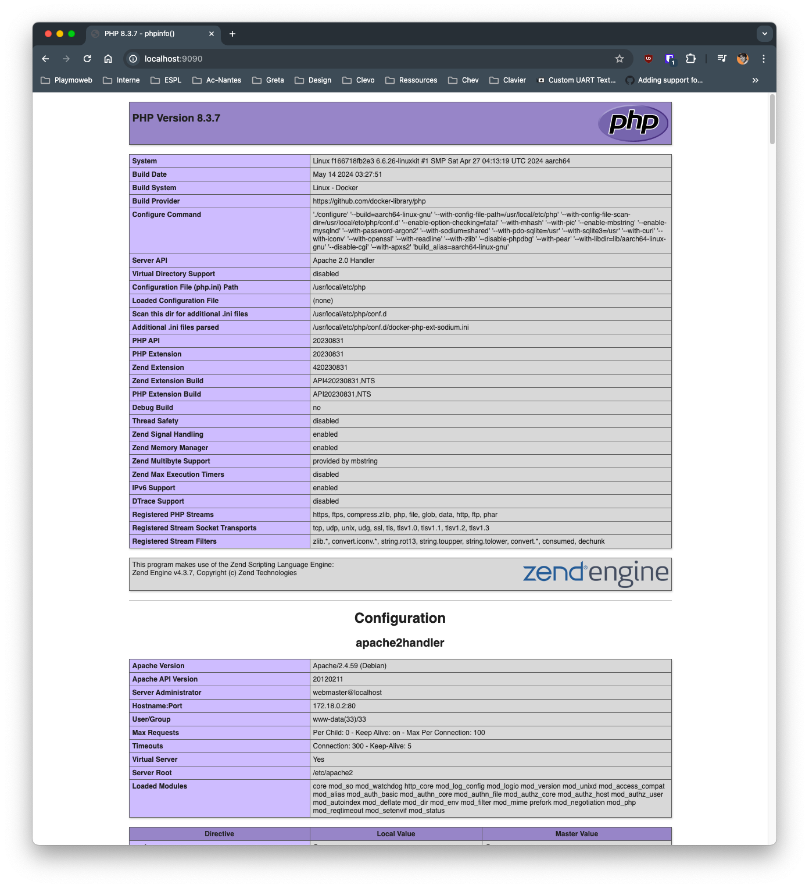

# Installer Docker sur une debian

Dans cet aide-mémoire vous trouverez l'ensemble des éléments de base pour installer Docker sur une machine Debian.

::: details Table des matières
[[toc]]
:::

## Introduction

Docker est un outil qui permet de créer des conteneurs. Il ne faut pas le confondre avec une machine virtuelle. Un conteneur est un ensemble de processus qui partagent le même noyau. Il est donc plus léger qu'une machine virtuelle.

Dans cette procédure, nous allons installer Docker sur une machine Debian 12.

## Installation

Je pars du principe que vous avez déjà une machine Debian 12. Si ce n'est pas le cas, je vous invite à consulter l'aide-mémoire [Installer Debian 12](/tp/devops/serveur/tp1.md) ([ou via un modèle](/tp/devops/serveur/tp1alt.md)).

## Commande en root

Dans cette procédure, nous allons être exclusivement en mode `root`. Pour passer en mode `root`, vous pouvez utiliser la commande suivante :

```bash
sudo su -
```

### Si vous avez déjà un MariaDB installé

Si vous avez déjà un MariaDB installé sur votre machine, il est nécessaire de le désinstaller avant d'installer Mysql via Docker. Pour cela, vous pouvez utiliser la commande suivante :

```bash
apt-get remove --purge mariadb-server mariadb-client -y
```

::: danger Attention

Cette commande va supprimer MariaDB de votre machine. Assurez-vous d'avoir une sauvegarde de vos bases de données avant de lancer cette commande.

:::

### Installation de Docker

```bash
# Ajout des éléments nécessaire à l'installation
apt-get update
apt-get -y install \
    ca-certificates \
    curl \
    gnupg \
    lsb-release

# Ajout du dépôt permettant d'installer Docker
mkdir -m 0755 -p /etc/apt/keyrings
curl -fsSL https://download.docker.com/linux/debian/gpg | sudo gpg --dearmor -o /etc/apt/keyrings/docker.gpg
echo "deb [arch="$(dpkg --print-architecture)" signed-by=/etc/apt/keyrings/docker.gpg] https://download.docker.com/linux/debian "$(. /etc/os-release && echo "$VERSION_CODENAME")" stable" | tee /etc/apt/sources.list.d/docker.list > /dev/null

# Update la liste des packages et installation de Docker
apt update
apt install docker-ce docker-ce-cli containerd.io docker-buildx-plugin docker-compose-plugin -y
```

## Autoriser un utilisateur à utiliser Docker

Par défaut, seul le compte `root` peut utiliser Docker. Pour autoriser un autre utilisateur à utiliser Docker, il faut ajouter ce compte dans le groupe `docker`.

```bash
# Ajout de l'utilisateur dans le groupe docker
usermod -aG docker <votre-utilisateur>
```

Une fois l'utilisateur ajouté au groupe `docker`, il faut se déconnecter et se reconnecter pour que les changements soient pris en compte.

## La suite est en tant qu'utilisateur

Vous pouvez maintenant vous déconnecter du compte `root` et vous reconnecter avec votre compte utilisateur.

```bash
exit
```

Pour que vous puissez utiliser Docker sans avoir à passer par un `sudo`, il est nécessaire de vous déconnecter et de vous reconnecter (quitter la session SSH et vous reconnecter).

## Démarrer Docker au démarrage de la machine

```bash
systemctl enable docker.service
systemctl enable containerd.service
```

Cette commande permet de démarrer Docker au démarrage de la machine, et donc démarre automatiquement les conteneurs que vous avez spécifiés comme étant à démarrer au démarrage (exemple les conteneurs de type `nginx` ou `mysql`).

## Créer un environnement complet MySQL + PHPMyAdmin

Créer un fichier `docker-compose.yml` avec le contenu suivant :

```yaml
services:
  db:
    image: mysql:8
    container_name: db
    restart: always
    environment:
      - MYSQL_USER=user
      - MYSQL_PASSWORD=user-password
      - MYSQL_ROOT_PASSWORD=root
    volumes:
      - ~/mysql-data:/var/lib/mysql
    ports:
      - 3306:3306

  phpmyadmin:
    image: phpmyadmin
    container_name: phpmyadmin
    restart: always
    environment:
      - PMA_HOST=db
      - PMA_PORT=3306
    ports:
      - 8081:80
    depends_on:
      - db
```

Pour démarrer l'environnement, il suffit de lancer la commande suivante :

```bash
docker compose up -d
```

Vous pouvez maintenant accéder à PHPMyAdmin via l'adresse :

- Accéder à votre PHPMyAdmin : http://ip-de-votre-machine:8081
- Pour le MYSQL vous avez les informations suivantes :
  - Utilisateur : `user`
  - Mot de passe : `user-password`
  - Utilisateur root : `root`
  - Mot de passe root : `root`

## Héberger un site PHP

Pour héberger un site PHP, nous allons utiliser un conteneur PHP officiel. Cepedant, il est nécessaire de le personnaliser pour y ajouter les extensions nécessaires.

Créez un fichier `Dockerfile` avec le contenu suivant :

```Dockerfile
FROM php:apache
RUN docker-php-ext-install pdo pdo_mysql mysqli
```

Nous ajoutons les extensions `pdo`, `pdo_mysql` et `mysqli` qui sont nécessaires pour faire fonctionner un site PHP avec une base de données MySQL (ou MariaDB). Ce dockerfile est basé sur l'image officielle de PHP avec Apache (`php:apache`).


Puis, créez un fichier `docker-compose.yml` avec le contenu suivant :

```yaml
services:
  php:
    build: .
    container_name: php
    restart: always
    volumes:
      - ~/site:/var/www/html
    ports:
      - 9090:80
```

Comment lire ce fichier :

- `build: .` : permet de construire l'image à partir du fichier `Dockerfile` situé dans le dossier courant.
- `ports: - 9090:80` : permet de rediriger le port 9090 de votre machine vers le port 80 du conteneur.

Nous allons monter le dossier `~/site` dans le dossier `/var/www/html` du conteneur. Vous pouvez donc placer votre site dans le dossier `~/site` de votre machine.

::: tip Rappel

Le `~` indique le home directory de l'utilisateur. Par exemple, si vous êtes l'utilisateur `valentin`, le dossier `~/site` correspondra à `/home/valentin/site`.

:::

Évidemment, vous pouvez modifier le fichier `docker-compose.yml` pour ajouter des éléments comme un serveur MySQL ou autre.

Puis, pour démarrer le conteneur, il suffit de lancer la commande suivante :

```bash
docker compose up -d
```

Vous pouvez maintenant accéder à votre site PHP via l'adresse : <http://ip-de-votre-machine:9090>

Dans mon cas :



## Sources

- [Docker - Installation](https://docs.docker.com/engine/install/debian/)
