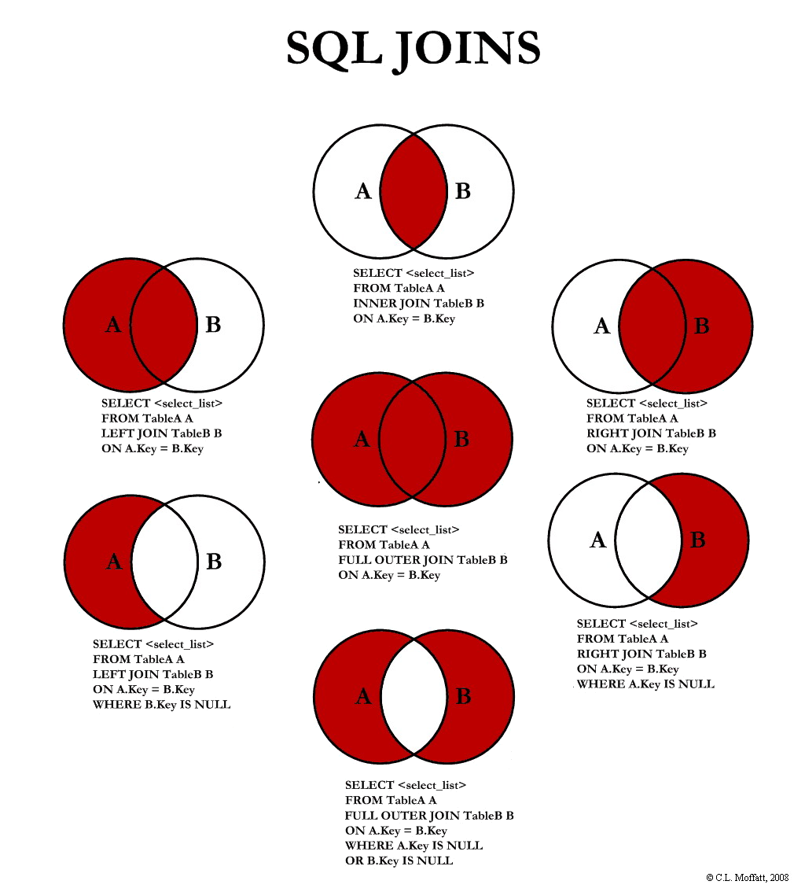

# Aide mémoire SQL

Aide mémoire sur le SQL. Vous retrouverez dans cet aide mémoire les éléments que nous avons vus ensemble.

::: warning
Cet aide mémoire n'est pas exhaustif, elle ne contient que le minimum à connaitre pour débuter sereinement.  
:::

| Catégorie                | Mot-clé                                         | Usage                                      |
| ------------------------ | ----------------------------------------------- | ------------------------------------------ |
| Définition d'une base    | `CREATE`, `ALTER`, `TRUNCATE`, `DROP`, `RENAME` | Structure de la base                       |
| Manipulation des données | `INSERT`, `UPDATE`, `DELETE`, `MERGE`           | Gestion des données en base                |
| Transaction              | `COMMIT`, `ROLLBACK`                            | Groupement d'opérations                    |
| Contrôle d'accès         | `GRANT`, `REVOKE`                               | Droit d'accès aux données                  |
| Accès aux données        | `SELECT`                                        | Récupération d'enregistrements de table(s) |

## Obtenir des données depuis _une table_

```sql
SELECT quoi FROM votreTable WHERE condition(s);
```

- `quoi` : Ce que vous souhaitez obtenir, `*` pour l'ensemble, sinon `nom_colonne` séparé par des virgules.
- `table` : La table que vous souhaitez requêter.
- `condition(s)` : La ou les condition(s) que vous souhaitez appliquer à votre récupération de données.

```sql
-- Toutes le données de la table « t »
SELECT * FROM t;

-- Colonne « nom » et « age » pour l'ensemble des données de la table « t »
SELECT nom, age FROM t;

-- Toutes le données de la table « t » respectant la condition
SELECT * FROM t WHERE CONDITION;

-- Dans la table « t » récupération de l'ensemble des enregistrements dont la colonne « age » est plus grand que 18.
SELECT * FROM t WHERE age > 18;

-- Dans la table « t » récupération de l'ensemble des enregistrements dont la colonne « age » est plus grand que 18 et ayant comme « country » FRA.
SELECT * FROM t WHERE age > 18 AND country = "FRA";

-- Calcul de l'age moyen Age moyen.
SELECT avg(age) FROM t;

-- Récupération des données triées
SELECT * FROM t ORDER BY age ASC;
-- Ou
SELECT * FROM t ORDER BY age DESC;

-- Pagination des résultats
SELECT * FROM t ORDER BY c1 LIMIT 10 OFFSET 0; -- 10 premiers résultats
SELECT * FROM t ORDER BY c1 LIMIT 10 OFFSET 10; -- 10 suivants etc
SELECT * FROM t ORDER BY c1 LIMIT 10 OFFSET 20; -- etc

-- Retourne la liste des dédoublonner des pays présent dans t.
SELECT distinct(pays) FROM t;

-- Compter et Grouper, Affiche la répartition des utilisateurs par age.
SELECT COUNT(id), age FROM t GROUP BY age;

-- Compter et Grouper, Affiche la répartition des utilisateurs par age pour les personnes de plus de 18ans
SELECT COUNT(id), age FROM t GROUP BY age HAVING age > 18;
```

## Obtenir des données depuis _plusieurs tables_


git

```sql
-- Left join t1 and t2
SELECT c1, c2
FROM t1
INNER JOIN t2
ON t1.id = t2.id;

-- Left join t1 and t2
SELECT c1, c2
FROM t1
LEFT JOIN t2
ON t1.id = t2.id;

-- Right join t1 and t2
SELECT c1, c2
FROM t1
RIGHT JOIN t2
ON t1.id = t2.id;

-- full outer join
SELECT c1, c2
FROM t1
FULL OUTER JOIN t2
ON t1.id = t2.id;
```

## Gestion des données

### Ajout

```sql
-- Ajout de certains champs
INSERT INTO utilisateurs (nom, prenom, age) VALUES (1, 'Test'), (2, 'Insert'), (3, 22);

 -- En spécifiant l'ensemble des champs
INSERT INTO utilisateurs VALUES (99,'Test','Insert',12, 'IT');
```

### Mise à jour

```sql
-- Met à jour l'ensemble des enregistrements en base pour la table utilisateur pour ceux ayant comme nom « Valentin »
UPDATE utilisateurs SET name = 'valentin-update' WHERE name = 'Valentin';

-- Idem mais uniquement pour l'utilisateur ayant comme « id » 1
UPDATE utilisateurs SET name = 'Valentine' WHERE id = 1;
```

::: danger ATTENTION
Attention !!! Si vous oubliez le **WHERE** vous allez modifier l'ensemble des données présent dans la table (Et aucun retour en arrière possible)
:::

## Suppression

```sql
DELETE FROM utilisateurs WHERE id = 1;
```

::: danger ATTENTION
Attention !!! Si vous oubliez le **WHERE** vous allez vider l'ensemble de la table. (Et aucun retour en arrière possible)
:::

## SQL et PHP ?

PHP intègre nativement le connecteur permettant d'attaquer les bases de données les plus connues, vous avez des exemples [d'utilisations disponibles ici](/cheatsheets/php/#le-php-et-la-base-de-donnees)
