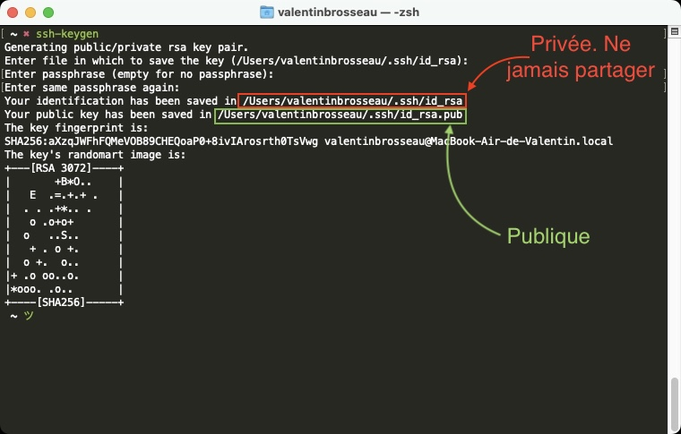
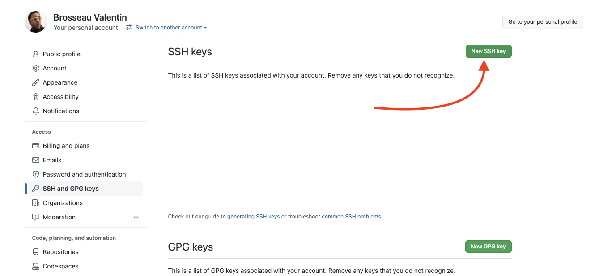
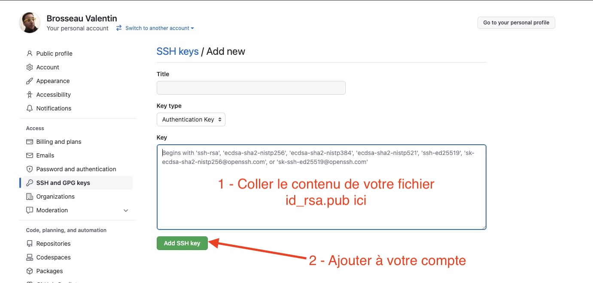

# Aide mémoire Clef SSH

Dans cet aide mémoire vous allez retrouver l'ensemble des commandes et des opérations à réaliser pour réaliser une clef SSH sur votre machine et l'échanger avec un tiers pour vous authentifier sans mot de passe.

> Autrefois, tout le monde employait l'authentification typique par le principe identifiant - mot de passe. Cependant si quelqu'un connaît votre mot de passe ou le découvre au moyen d'une attaque, la sécurité est compromise. De plus, utiliser un mot de passe différent pour chaque serveur et le saisir à chaque connexion peut s'avérer contraignant.
>
> Pour se débarrasser de ces problèmes, SSH propose un système d'authentification par clef publique/privée au lieu des mots de passe « simples ».
>
> Ceci peut permettre par exemple :
>
> - De vous connecter à des centaines de machines sans devoir connaître des centaines de mots de passe différents ;
> - De ne pas avoir un mot de passe à saisir toutes les 2 minutes.
>
> La clef privée est en principe unique : chaque utilisateur possède une clef privée qu'il peut copier sur les terminaux auxquels il accède physiquement et depuis lesquels il a besoin d'un accès SSH (via le client SSH).
>
> Source : [doc.ubuntu-fr](https://doc.ubuntu-fr.org/ssh)

::: details Sommaire
[[toc]]
:::

## Générer une clef privée/publique

Cette opération n'est à réaliser qu'une seule fois (sur chaque machine/session). Au lycée, la clef va s'enregistrer dans votre dossier utilisateur, elle sera donc synchronisée automatiquement avec l'ensemble des ordinateurs sur lesquels vous allez pouvoir vous connecter.

### Générer la clef

La commande pour générer une clef est la suivante.

::: tip Windows, Linux, macOS ?

La commande sera la même, quel que soit votre système d'exploitation. Cependant, le terminal lui sera différent :

- Windows : `Git Bash` (ou `Git cmd`). ([nécessite Git](https://git-scm.com/downloads))
- macOS : `terminal`.
- Linux : `console`.

:::

```bash
ssh-keygen
```



La commande va générer **deux fichiers** :

- **id_rsa**, est privé. **Vous ne devez jamais le partager**.
- **id_rsa.pub**, est publique, vous pouvez le partager autant que vous voulez ce fichier permettra de vous reconnaître au moment de la connexion.

::: danger Plus de sécurité

Vous pouvez faire « entrée (3×) » pour générer une clef sans mot de passe. Vous pouvez également faire le choix de mettre un mot de passe sur votre clef pour plus de sécurité.

:::

## Dans le cadre de Git (github, gitlab)

Maintenant que nous avons généré les clefs, il vous suffit d'envoyer votre clef **publique** sur Github/Gitlab pour que celui-ci vous reconnaisse automatiquement.

### Github

Pour ajouter votre clef, vous devez :

- Copier **le contenu** du fichier `id_rsa.pub`(ouvrir le fichier avec par exemple Notepad++)
- L'ajouter à votre profil Github [en cliquant ici](https://github.com/settings/ssh/new)

#### Étape 1 : Settings


#### Étape 2 : SSH & GPG Key



#### Étape 3 : Coller et ajouter votre clef



### Gitlab

La procédure avec Gitlab est très similaire, vous devez :

- Copier **le contenu** du fichier `id_rsa.pub`(ouvrir le fichier avec par exemple Notepad++)
- L'ajouter à votre profil Github [en cliquant ici](https://gitlab.com/-/profile/keys)

#### Ajouter la clef sur votre compte gitlab


## Dans le cadre de la gestion à distance de serveur (ssh, sft, etc)

Votre clef est également compatible pour vous connecter sur un serveur SSH distant (pratique pour ne **jamais oublier son mot de passe**).

Pour cela, il vous suffit de faire la commande suivante sur votre ordinateur.

```bash
ssh-copy-id <username>@<ipaddress>
```

⚠️ Vous devez évidemment remplacer `<username>`et `<ipaddress>`par votre utilisateur et votre mot de passe. Exemple :

```bash
ssh-copy-id pi@192.168.1.253
```

::: tip Et voilà !

Rien de plus, à partir de maintenant votre serveur acceptera votre connexion sans vous demander de mot de passe. Pratique non ? (Et surtout très sécurisé)

:::