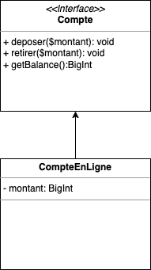
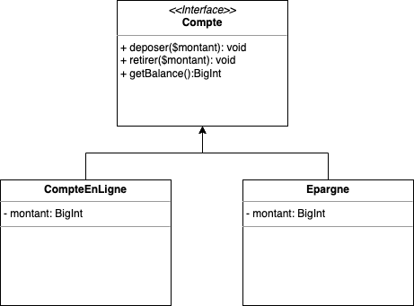

# Interface : Mise en pratique 1

Dans cette mise en pratique, nous allons voir comment déclarer et utiliser des Interfaces PHP. Les interfaces sont un élément important de la programmation-objet, pour rappel les Interfaces sont un type des classes abstraites (instanciation impossible), elles vont :

- Va d'écrire un comportement.
- Définir les signatures des méthodes et propriétés
- Garantir au code qui fait l'appel que la méthode existera.

C'est donc un contrat que la classe doit respecter si elle implémente l'interface, si celle-ci implémente une Interface, elle devra forcément avoir l'ensemble des méthodes « décrite » dans l'interface.

## Ressources disponibles :

- [Aide mémoire POO](/cheatsheets/poo/README.md)
- [Aide mémoire POO-UML](/cheatsheets/poo-uml/README.md)
- [Cours POO](/cours/poo.md)

::: tip Définition

Une interface ressemble à une classe abstraite dans laquelle aucune méthode ne serait implémentée.

- Ne contiens que des méthodes publiques.
- Ne contiens aucun code.
- N'est pas instanciable.
- Son « un contrat » que les classes filles devront **implémenter**.

:::

## Mise en situation



```php
// Declaration de l'interface 'Compte'
interface Compte
{
    public function deposer($montant);
    public function retirer($montant);
    public function getBalance();
}
```

::: tip Questionnement

- Une Interface est définie avec le mot clé :
- Identifier les particularités de la classe `Compte`
  - **Particularité 1 :**
  - **Particularité 2 :**
  - **Particularité 3 :**
- Selon vous, pourquoi la classe ne possède-t-elle pas de constructeur ?

:::

## Utiliser l'interface

```php
class CompteEnLigne implements Compte
{
}
```

::: tip Questionnement

- Quel nouveau mot clé avons-nous dans l'exemple ci-dessus ?
- Écrire le reste du code en suivant l'UML proposé.

:::

## Utiliser la classe Compte en ligne

Je souhaite créer **1 compte**, et effectuer les opérations suivantes :

- `$operations = [100, 2000, 5000, -100, -1000, 0, -300]`
- Utiliser le tableau `$operations` via **une boucle** pour manipuler le compte.
- Afficher à la fin le solde du compte.

::: tip Questionnement

- Indiquez pourquoi je vous propose de passer par un tableau d'opération ?

:::

## Une Interface = Un Contrat



En utilisant à nouveau l'Interface, écrire l'implémentation de classe `Epargne`, celle-ci doit fonctionner :

- N'autoriser que les dépôts > 200€.
- Avoir un constructeur avec une valeur de base du compte.
- Ne pas autoriser un retrait si le compte ne possède pas > 1000€

::: tip Questionnement

- Pourquoi, dans ce cas-ci, une Interface est utile ?
- Les langages de programmation proposent une instruction `instanceOf`¹, en quoi cette instruction peut-être utile ici ?

:::

¹ `instanceOf` est utilisé pour déterminer si une variable PHP est un objet instancié d'une certaine classe.

## Héritage multiple


✋ Une classe peu implémenter plusieurs Interfaces

La définition de la classe comporte alors le mot clé `implements` suivi d'une liste de noms d'interfaces (les noms des interfaces implantées y sont séparés par une virgule).

::: tip Questionnement

- Quel sera l'impact sur la classe `CompteEnLigne` ?
- Quel est l'intérêt d'implémenter plusieurs interfaces ?

:::
