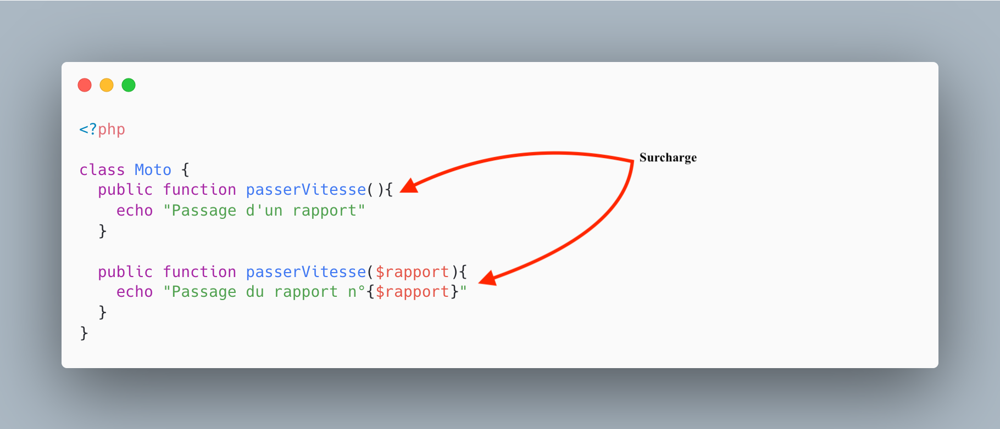
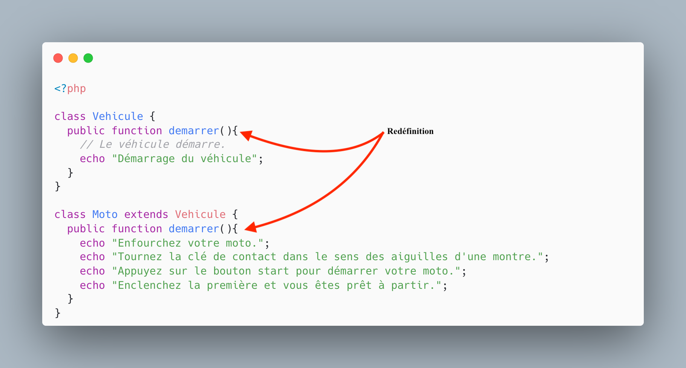

# La redefinition : Mise en pratique

Dans cette mise en pratique, nous allons voir comment fonctionne la redéfinition de méthodes. Aussi appelée « overriding » (en Anglais), consiste à définir le comportement d'une méthode selon le type de l'objet qui l'invoque. Autrement dit, elle consiste à donner une nouvelle implémentation à une méthode héritée **sans changer sa signature** :

- Nom de méthode **identique**.
- Paramètres de la méthode **identique**.
- Type de retour **identique**.

::: warning Surcharge et redéfinition

La redéfinition de méthode est un concept que l’on rencontre lors de la création de classe fille.

Pour rappel :




:::

---

Avec les changements récents du BTS, Mr Jousseaume souhaite moderniser son parc d'ordinateur pour y intégrer différents types d'ordinateurs, et notamment des ordinateurs Apple (Mac). À cause de leur prix, les ordinateurs Apple ne seront pas en accès libre, mais disponible uniquement sur demande.

Comme pour une entreprise classique les ordinateurs doivent être amortis à ce titre il est prévu d'amortir différemment, vous ne gérerez pas cette partie du code cependant il vous ait demandé de fournir la méthode `vendre()` qui permettra de fournir le prix de vente de l'ordinateur en question.

Nous sommes au début du projet, l'équipe de développement a écrit l'UML de la problématique lors d'une réunion de lancement :


## Étudier l'UML

- Combien avons-nous de classe instantiable ?
- Pourquoi l'héritage est intéressant ici ?
- Lire l'UML :
  - Combien de propriétés possède un `Ordinateur`.
  - Combien de propriétés possède un `PC`.
  - Et le `Mac` ?

Une première classe a été écrite dans le projet :

```php
abstract class Ordinateur {
    protected nom;
    protected dateFabrication;
    protected prix;

    abstract public function Acheter();
    abstract public function Vendre();

    public age(){
        return date('Y') - $this->dateFabrication;
    }

    public toString(){
        return "{$this->nom}, {$this->dateFabrication}";
    }
}
```

::: tip Questionnement

- Identifier les particularités de la classe `Ordinateur`
  - **Particularité 1 :**
  - **Particularité 2 :**
- Pourquoi la classe ne possède-t-elle pas de constructeur ?

:::

## La classe `Mac`

Vous avez à votre charge l'écriture du code de la classe `Mac`. Les ordinateurs de la marque Apple ont une spécificité c'est qu'il possède une architecture spécifique :

- ARM
- Intel

Cette différence impactera évidemment leurs performances, mais également **leur valeur de revente**.

::: tip Question 1
Identifiez dans l'UML le nombre de méthodes redéfini.
:::

::: tip Question 2
Écrire le code de la classe `Mac` :

- La méthode `Acheter` retourne le prix de vente.
- La méthode `Vendre` retourne :
  - Le prix - (age \* 100).
  - Pour un Mac ARM : Le prix - (age \* 50).
    :::

::: tip Question 3

La méthode `toString` est utilisée pour afficher le contenu des étagères dans l'interface Web. Pour améliorer la lisibilité de l'interface, il vous ait demandé de **spécialiser** la méthode `toString` pour afficher par exemple :

```text
- [APPLE] Ordinateur1, 01-02-2021, Type ARM.
- [APPLE] Ordinateur2, 01-01-2021, Type Intel.
```

- Écrire le code permettant de répondre à la problématique.
- Pourquoi une méthode spécialisée est-elle intéressante ici ?

:::
