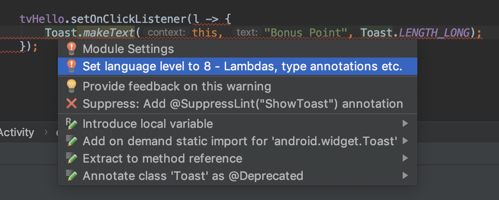
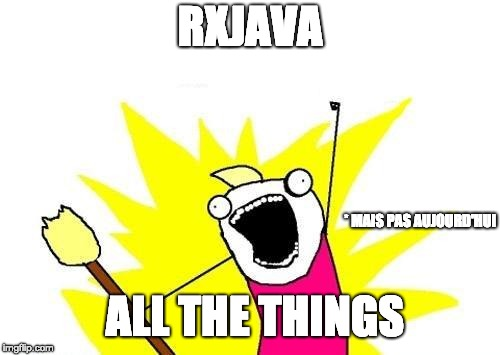

# Android

Par [Valentin Brosseau](https://github.com/c4software) / [Playmoweb](https://www.playmoweb.com)

---

## Introduction à Android

---

- Développé par Google
- Créé en 2008
- Actuellement en version 9.0 (Android Pie)

---

## Pourquoi Android

- Multi marques (Google, Samsung, Xiaomi, HTC, …)
- Part de marché
- Ouvert
- Personnalisable
- Le prix

---

## Les défauts d'Android

- La fragmentation
- Un Android ? Non… des Android!

---

## L'architecture


---


Linux ?

---

## Android is not Linux

Construit autour du noyau Linux mais … c'est tout

- Noyau Linux : Drivers, Batterie, Ram.
- Runtime Android : Fait tourner les applications Android.
- App Framework : Android Framework (Android API).

---

## La sécurité

- Chaque application a son propre utilisateur Linux.
- Les applications sont sandboxées.
- Chaque application tourne dans sa propre VM.
- Chaque application a son cycle de vie.

---

## Les API

Intégrées dans Android.

- SDK Android : Évolue lors des mises à jour de système.
- Play Service : Évolue automatiquement indépendamment de la version de l'OS (presque).

---

## Les langages

---

### Code

- Java (historique)
- Kotlin (Nouveau)

---

### Ressources

- xml (drawables)
- png / jpeg / 9.png (images)

---

## Android Studio

- Java
- Version spéciale de Intellij

---


---

## Toolbar


---

## Créer un émulateur

- Intégré dans Android Studio.
- Performances suffisantes pour tester.
- BLE / Bluetooth non disponible.

---

# Première application

---

- File > New > New Project
- Configurer le projet
- Lancer l'application sans aucune modification (dans un émulateur)

---

## C'est à vous

---

## Structure du projet

---


---

- **src** : Vos sources Java (ou Kotlin).
- **res** : XML, fichiers de configurations, images
  - layout
  - strings
  - drawable…

---

### **R.java.class**

- Généré automatiquement.
- Contiens les références de tous les id.
- Permet l'accès aux ressources depuis votre code :
  - `getString(R.string.title)`
  - `setContentView(R.layout.activity_main)`

---

## Debugger

- Points d'arrêts possible.
- Logs.
- Logs affichés dans le Logcat.

---

## Logcat


---

## Gradle

- Open-source.
- Règles / scripts de compilation de votre projet.
- Complètement intégré dans Android Studio (complétion, etc…)

---

## Votre première application

- Activity
- Un Layout associé
- Déclaré dans le « Manifest »

---

## L'activity

- Représente un seul écran.
- Gère tout ce qu'il y a dans l'écran.
- Gère la logique des interactions utilisateurs.
- Possède son propre **cycle de vie**.

---


---


---

- L'ensemble de vos activity hérite d'une super **Activity**.
- Override des méthodes de base (au début uniquement onCreate).

---

## Un détail qui compte… les layout

- Constraint Layout
- Linear Layout
- Relative Layout
- Grid Layout

---

## Constraint Layout

- Contraint par rapport au « TOP, BOTTOM, START, END » des autres éléments.
- La nouvelle façon de faire.

---

## Les éléments du Layout

- TextView
- Button
- ListView
- ImageView
- …

---

## C'est à vous

Ajouter un bouton dans l'interface et une ImageView.

---

## Le fichier Manifest

- Déclare le nom de l'application.
- Déclare les activités.
- Déclare le thème de l'application.
- L'icône de l'application.
- Configuration de l'application (package…).
- Déclare les permissions.

---

## Permissions ?


---

## Contenu d'un Manifest

```xml
<?xml version="1.0" encoding="utf-8"?>
<manifest xmlns:android="http://schemas.android.com/apk/res/android"
    package="com.playmoweb.demo.dmocourseseo">

    <application
        android:allowBackup="true"
        android:icon="@mipmap/ic_launcher"
        android:label="@string/app_name"
        android:roundIcon="@mipmap/ic_launcher_round"
        android:supportsRtl="true"
        android:theme="@style/AppTheme">

        <activity android:name=".MainActivity">
            <intent-filter>
                <action android:name="android.intent.action.MAIN" />
                <category android:name="android.intent.category.LAUNCHER" />
            </intent-filter>
        </activity>

    </application>

</manifest>
```

---

## Le dossier `res` en détail

- **anim** : Définition des propriétés d'animation (`R.anim.…`)
- **drawable** : Vos images (png, xml, 9.png…) (`R.drawable.…`)
- **layout** : Vos interfaces un fichier par vue (`R.layout.…`)
- **menu** : Contenu de vos menus (Options Menu, Sub Menu…)
- **values** : « Constantes » de votre application (String, Int, Color, etc)
- **mipmap** : Icônes de votre application.

---

## Le dossier `res` en détail 2

### AKA Les ressources alternatives

Chaque dossier peut-être redéfini en fonction de la résolution. (`-hdpi`, `-mdpi`, `-xxhdpi`…)

---


---

## Interagir avec l'utilisateur

---

### Les toasts


---

## C'est à vous

Ajouter un Toast dans votre interface

```java
Toast.makeText(this, "Bonjour à tous", Toast.LENGTH_SHORT).show();
```

⚠️ Avec la complétion d'Android Studio

---

### Les Dialog

Interaction complexe avec l'utilisateur (Choix…)


---

## C'est à vous

Ajouter une Dialog dans votre interface. Nous allons utiliser une library.

[Material Dialog](https://github.com/afollestad/material-dialogs)

---

## Interagir avec l'utilisateur

### 3 étapes

- Le layout
- Le `findViewById` (dans la méthode `onCreate`)
- Le `setOnClickListener(…)`

---

## Le listner

```java
tvHello.setOnClickListener(new View.OnClickListener() {
    @Override
    public void onClick(View v) {
        Toast.makeText(MainActivity.this, "Bonus point", Toast.LENGTH_SHORT).show();
    }
});
```

---

## C'est verbeux …

### mais …


---

## Migrer en Java 1.8

Android supporte Java 1.8 (dont les lambdas)

---

## Les lambda's

```java
tvHello.setOnClickListener(l -> {
    Toast.makeText(this, "Bonus Point", Toast.LENGTH_LONG).show();
});
```

---



---

## Les ListView (AdapterView)

---

- **adapter** : Gère les données pour les afficher dans la vue.
- L'adapter est associé à la liste.
- Un Datasource est attaché à l'Adapter.
- Les données sont ajoutées dans la Datasource.

---


---

[Guide](https://guides.codepath.com/android/Using-an-ArrayAdapter-with-ListView)

---

## C'est complexe… mais des librairies existent

[FlexibleAdapter](https://github.com/davideas/FlexibleAdapter)

---

## Le futur

- Migration vers AndroidX.
- Passer de Java à Kotlin.

---

## Organisation du code

- MVP
- MVVM

---

## Au minimum quelques packages

---

Android c'est très ouvert… Il faut s'imposer une organisation

---

## Quelques packages

- ui (pour l'interface)
- data (pour les données)
- remote (pour la partie accès au API http)

---

Bien évidement c'est un exemple

(Vous pouvez faire autrement…)

---

### Zoom sur le package ui

- Organisation par « vue ».
- On regroupe les fonctionnalités par « vue » (exemple les adapters)

---

### C'est à vous

Réorganisation de votre projet initial.

---


---

## Pourquoi est-ce important

- Partage de code
- Reprise du code
- Maintenance
- …

---

## Démarrer une autre activitée

Une astuce…

---

### Dans la class UI ajouter

```java
public static Intent getStartIntent(final Context ctx) {
    return new Intent(ctx, ClassEnCoursDeDemo.class);
}
```

---

### Et quand on souhaite afficher la vue

```java
startActivity(ClassEnCoursDeDemo.getStartIntent(this));
```

---


---

## La home

- Design du layout.
- Les contraintes :
  - Le bouton « actions » ne doit pas être actif si pas de périphérique sélectionné.
  - Afficher le logo de L'ESEO.

---

## Exemple


---

## Le scan

- Design du layout
- Contrainte
  - Avoir une liste (`listView`)

---

## C'est à vous

- Créer deux Activity :
  - Celle existante qui sera notre page de home.
  - Une nouvelle qui sera la page de scan.

---

## Le Bluetooth et Android

- Les permissions
- Différent en fonction d'Android ( > Lolipop )

---

## Deux solutions

- Le coder.
- Utiliser une librairie.

---

## La librairie

- Plus simple (la partie multi-version est masquée)
- Requiers RxJava

---

## Rx ?


---

- Multi-thread
- Asynchrone

---

## Asynchrone is hard

(non pas de gif)

---

- Les données sont des streams
- Les traitements sont faits dans d'autre thread que l'UI
- Simplifie le multi-thread

---


[Le site](http://reactivex.io/)

---

## La librairie (suite)

- [RxAndroidBLE](https://github.com/Polidea/RxAndroidBle)
- Gère le Bluetooth
- Les permissions (presque)
- L'état du Bluetooth
- …

---

## La version code

- Demander les permissions (Manifest + Code)
- Détecter la version d'Android
- Démarrer le Scan
- Ajouter des filtres (ou pas)

---

## Les permissions

- Localisation ?
- Est-ce que le Bluetooth est actif ?
- Le Manifest
- [Exemple](https://gitlab.com/playmoweb/eseo-course-android-app/blob/part-3-setup-ble/app/src/main/java/fr/eseo/course/ui/devices/DevicesActivity.java)

---

## Les permissions : Le manifest

```xml
<uses-feature android:name="android.hardware.bluetooth_le" android:required="true"/>
<uses-feature android:name="android.hardware.location.gps"/>
<uses-permission android:name="android.permission.INTERNET"/>
<uses-permission android:name="android.permission.BLUETOOTH"/>
<uses-permission android:name="android.permission.BLUETOOTH_ADMIN"/>
<uses-permission android:name="android.permission.ACCESS_FINE_LOCATION"/>
```

---

## BLE

### Le Scan

---

## Vérifier les permissions

```java
private void checkPermissions() {
    if (ContextCompat.checkSelfPermission(this, Manifest.permission.ACCESS_FINE_LOCATION) == PackageManager.PERMISSION_DENIED) {
        ActivityCompat.requestPermissions(this, new String[]{Manifest.permission.ACCESS_FINE_LOCATION}, REQUEST_LOCATION_CODE);
    } else {
        checkForLocationEnabled();
    }
}
```

## Après l'acceptation de l'utilisateur

```java
@Override
public void onRequestPermissionsResult(final int requestCode, @NonNull final String[] permissions, @NonNull final int[] grantResults) {
    if (requestCode == REQUEST_LOCATION_CODE) {
        if (grantResults.length > 0 && grantResults[0] == PackageManager.PERMISSION_GRANTED) {
            checkForLocationEnabled();
        } else {
            checkPermissions(); // force permission
        }
    }
}
```

---

## Vérifier si la localisation est active

```java
private void checkForLocationEnabled() {
    final LocationManager lm = (LocationManager) getSystemService(Context.LOCATION_SERVICE);
    if (lm != null) {
        final boolean gps_enabled = lm.isProviderEnabled(LocationManager.GPS_PROVIDER);
        final boolean network_enabled = lm.isProviderEnabled(LocationManager.NETWORK_PROVIDER);

        if (!gps_enabled || !network_enabled) {
            startActivityForResult(new Intent(Settings.ACTION_LOCATION_SOURCE_SETTINGS), REQUEST_ENABLED_LOCATION_CODE);
        } else {
            setupBLE();
        }
    } else {
        startActivityForResult(new Intent(Settings.ACTION_LOCATION_SOURCE_SETTINGS), REQUEST_ENABLED_LOCATION_CODE);
    }
}
```

---

## Et finalement …

---

## Le Bluetooth

```java
private void setupBLE() {
    final BluetoothManager bluetoothManager = (BluetoothManager) getSystemService(Context.BLUETOOTH_SERVICE);
    if (bluetoothManager != null) {
        bluetoothAdapter = bluetoothManager.getAdapter();
    }

    if (bluetoothManager == null || !bluetoothAdapter.isEnabled()) { // bluetooth is off
        startActivityForResult(new Intent(BluetoothAdapter.ACTION_REQUEST_ENABLE), REQUEST_ENABLE_BLE);
    } else {
        scanNearbyDevices(); // start scanning by default
    }
}
```

---

## Le ble : Le scan

```java
private void scanNearbyDevices() {
    if (isScanning) {
        return;
    }

    isScanning = true;
    scanningHandler.postDelayed(scanDevicesRunnable, SCAN_DURATION_MS);
    if (Build.VERSION.SDK_INT >= Build.VERSION_CODES.LOLLIPOP) { // for recent version of android
        final ScanSettings settings = new ScanSettings.Builder().setScanMode(ScanSettings.SCAN_MODE_LOW_LATENCY).build();
        final List<ScanFilter> scanFilters = new ArrayList<>();

        // Create ScanFilters
        // for (final UUID uuid : BluetoothLEManager.SERVICES_TO_FILTER) {
        //    scanFilters.add(new ScanFilter.Builder().setServiceUuid(new ParcelUuid(uuid)).build()); // add service filters
        // }

        bluetoothAdapter.getBluetoothLeScanner().startScan(scanFilters, settings, bleLollipopScanCallback);
    } else {
        bluetoothAdapter.startLeScan(BluetoothLEManager.SERVICES_TO_FILTER, bleScanCallback);
    }
}

// À votre avis ?
private final Runnable scanDevicesRunnable = () -> stopScan();
```

---

## Le Ble : Le Scan avant Lolipop

```java
private final BluetoothAdapter.LeScanCallback bleScanCallback = new BluetoothAdapter.LeScanCallback() {
    @Override
    public void onLeScan(final BluetoothDevice bluetoothDevice, final int i, final byte[] bytes) {
        runOnUiThread(new Runnable() {
            @Override
            public void run() {
                // bluetoothDevice est notre objet après le scan
                // C'est ici qu'il faut l'ajouter à l'Adapter
            }
        });
    }
};
```

---

## Le Ble : Le Scan après Lolipop

```java
private final ScanCallback bleLollipopScanCallback = new ScanCallback() {
    @TargetApi(Build.VERSION_CODES.LOLLIPOP)
    @Override
    public void onScanResult(final int callbackType, final ScanResult result) {
        super.onScanResult(callbackType, result);
        BluetoothDevice bluetoothDevice = result.getDevice();
        // C'est ici qu'il faut l'ajouter à l'adapter
    }

    @Override
    public void onScanFailed(final int errorCode) {
        super.onScanFailed(errorCode);
        Toast.makeText(ScanActivity.this, getString(R.string.ble_scan_error, errorCode), Toast.LENGTH_SHORT).show();
    }
};
```

---

## Le Ble : Stopper le scan

```java
private void stopScan(){
    if (Build.VERSION.SDK_INT >= Build.VERSION_CODES.LOLLIPOP) {
        bluetoothAdapter.getBluetoothLeScanner().stopScan(bleLollipopScanCallback);
    } else {
        bluetoothAdapter.stopLeScan(bleScanCallback);
    }
    isScanning=false;
}
```

---

## Quelques variables en plus

Dans la class ScanActivity

```java
// REQUEST Code de gestion
private static final int REQUEST_LOCATION_CODE = 1235;
private static final int REQUEST_ENABLED_LOCATION_CODE = 1236;
private static final long SCAN_DURATION_MS = 10_000L;
private static final int REQUEST_ENABLE_BLE = 999;

// Gestion du bluetooth
private BluetoothAdapter bluetoothAdapter;
private BluetoothGatt currentBluetoothGatt = null; // Connexion actuelle
private boolean isScanning = false;
private final Handler scanningHandler = new Handler();

// Partie adapter
private DeviceAdapter deviceAdapter;
private ArrayList<BluetoothDevice> deviceArrayList = new ArrayList<>();
```

---

## Quelle est la méthode à appeler

### Pour lancer le scan

---

### Beaucoup de périphérique non ?

---

## Activer le filtre par Service UUID

Oui car c'est vrai on détecte trop de périphérique incompatible !

```java
private void scanNearbyDevices() {
    // …
    // Limite la recherche a l'UUID de notre service du Pi
    scanFilters.add(new ScanFilter.Builder().setServiceUuid(new ParcelUuid(BluetoothLEManager.DEVICE_UUID)).build());
    // …
}
```

---

## C'est à vous !

### Implémenter le scan et mettre les résultats dans le RecyclerView

---

## Maintenant que l'on a la liste…

---

## Sélectionner un périphérique…

- setOnItemClickListener sur le ListView
- Sauvegarder (de manière `static`) le périphérique
- Changer de vue

---

## Obtenir l'element sélectionné

```java
protected void onCreate(Bundle savedInstanceState) {
    // …………

    deviceAdapter = new DeviceAdapter(this, deviceArrayList);
    ListView listView = findViewById(R.id.rvDevices);
    listView.setAdapter(deviceAdapter);

    // Active la sélection d'éléments dans la ListView
    listView.setClickable(true);
    listView.setOnItemClickListener(listClick);
}
```

---

```java
private BluetoothDevice selectedDevice;
private AdapterView.OnItemClickListener listClick = (parent, view, position, id) -> {
    final BluetoothDevice item = deviceAdapter.getItem(position);
    selectedDevice = item;
    LocalPreferences.getInstance(this).saveCurrentSelectedDevice(item.getName());
    connectToCurrentDevice();
};
```

---

## Modification de l'Adapter

Nous avions un Device…
Remplacez-le par un BluetoothDevice.

- Éditer l'Adapter.
- Et son utilisation.

---

## Sauvegarder la sélection dans la liste

### selectedDevice && LocalPreferences

```java
selectedDevice = item;
LocalPreferences.getInstance(this).saveCurrentSelectedDevice(item.getName());
```

---

## Le BluetoothLEManager

```java
public class BluetoothLEManager {
    public static final BluetoothLEManager INSTANCE = new BluetoothLEManager();

    // Device service UUID
    public static UUID DEVICE_UUID = UUID.fromString("795090c7-420d-4048-a24e-18e60180e23c");

    // Send GPIO Configuration UUID
    public static UUID CHARACTERISTIC_LED_PIN_UUID = UUID.fromString("31517c58-66bf-470c-b662-e352a6c80cba");
    public static UUID CHARACTERISTIC_BUTTON_PIN_UUID = UUID.fromString("0b89d2d4-0ea6-4141-86bb-0c5fb91ab14a");

    // Toggle LED UUID
    public static UUID CHARACTERISTIC_TOGGLE_LED_UUID = UUID.fromString("59b6bf7f-44de-4184-81bd-a0e3b30c919b");

    public static BluetoothLEManager getInstance() {
        return INSTANCE;
    }

    public BluetoothDevice currentBluetoothDevice = null;

    private BluetoothLEManager() {
    }

    public void setCurrentDevice(final BluetoothDevice device) {
        currentBluetoothDevice = device;
    }

    public BluetoothDevice getCurrentDevice() {
        return currentBluetoothDevice;
    }
}
```

---

## Organisation

- « Ranger » le `BluetoothLEManager` dans le package `….data.manager`

---

## LocalPreferences

- Sauvegarde d'information dans les préférences de l'application

---

```java
import android.content.Context;
import android.content.SharedPreferences;

public class LocalPreferences {

    private SharedPreferences sharedPreferences;
    private static LocalPreferences INSTANCE;

    public static LocalPreferences getInstance(Context context) {
        if (INSTANCE == null) {
            INSTANCE = new LocalPreferences(context);
        }
        return INSTANCE;
    }

    private LocalPreferences(Context context) {
        sharedPreferences = context.getSharedPreferences("MyPref", Context.MODE_PRIVATE);
    }

    public void saveCurrentSelectedDevice(String deviceName) {
        sharedPreferences.edit().putString("selectedDevice", deviceName).apply();
    }

    public String getCurrentSelectedDevice() {
        return sharedPreferences.getString("selectedDevice", null);
    }

}
```

---

## Connexion a un périphérique

---

```java
private void connectToCurrentDevice() {
    if (selectedDevice != null) {
        Toast.makeText(this, "Connexion en cours…", Toast.LENGTH_SHORT).show();
        currentBluetoothGatt = selectedDevice.connectGatt(this, false, gattCallback);
    }
}
```

---

## gattCallBack


---

```java
private final BluetoothGattCallback gattCallback = new BluetoothGattCallback() {
    @Override
    public void onServicesDiscovered(final BluetoothGatt gatt, final int status) {
        super.onServicesDiscovered(gatt, status);
        runOnUiThread(() -> {
            Toast.makeText(ScanActivity.this, "Services discovered with success", Toast.LENGTH_SHORT).show();
            setUiMode(true);
        });
    }

    @Override
    public void onConnectionStateChange(final BluetoothGatt gatt, final int status, final int newState) {
        super.onConnectionStateChange(gatt, status, newState);

        runOnUiThread(() -> {
            switch (newState) {
                case BluetoothGatt.STATE_CONNECTED:
                    currentBluetoothGatt.discoverServices(); // start services
                    break;
                case BluetoothProfile.STATE_DISCONNECTED:
                    gatt.close();
                    setUiMode(false);
                    break;
            }

        });
    }

    @Override
    public void onCharacteristicWrite(final BluetoothGatt gatt, final BluetoothGattCharacteristic characteristic, final int status) {
        super.onCharacteristicWrite(gatt, characteristic, status);
    }
};
```

---

## Déconnexion du périhérique

```java
private void discconnectFromCurrentDevice() {
    if(currentBluetoothGatt != null) {
        currentBluetoothGatt.disconnect();
    } 
}
```

---

## SetUiMode

Méthode permettant de changer l'état de l'interface en fonction de la connexion.

---

```java
private void setUiMode(boolean isConnected) {
    if (isConnected) {
        // Connecté à un périphérique, passage en node action BLE
        deviceAdapter.clear();
        rvDevices.setVisibility(View.GONE);
        scanBtn.setVisibility(View.GONE);

        tvCurrentConnexion.setVisibility(View.VISIBLE);
        tvCurrentConnexion.setText(String.format("Connecté à : %s", selectedDevice.getName()));
        disconnectBtn.setVisibility(View.VISIBLE);
        toggleLed.setVisibility(View.VISIBLE);
    } else {
        // Non connecté, reset de la vue.
        rvDevices.setVisibility(View.VISIBLE);
        scanBtn.setVisibility(View.VISIBLE);

        tvCurrentConnexion.setVisibility(View.GONE);
        disconnectBtn.setVisibility(View.GONE);
        toggleLed.setVisibility(View.GONE);
    }
}
```

---

## Et allumer / éteindre la led ?

---

```java
private void toggleLed() {
    if (currentBluetoothGatt == null) {
        Toast.makeText(this, "Non Connecté", Toast.LENGTH_SHORT).show();
        return;
    }

    final BluetoothGattService service = currentBluetoothGatt.getService(BluetoothLEManager.DEVICE_UUID);
    if (service == null) {
        Toast.makeText(this, "UUID Introuvable", Toast.LENGTH_SHORT).show();
        return;
    }

    final BluetoothGattCharacteristic toggleLed = service.getCharacteristic(BluetoothLEManager.CHARACTERISTIC_TOGGLE_LED_UUID);
    toggleLed.setValue("1");
    currentBluetoothGatt.writeCharacteristic(toggleLed);
}
```

---

## Les variables de la vue

Voilà mon `onCreate`

```java
Button scanBtn;
Button disconnectBtn;
Button toggleLed;
TextView tvCurrentConnexion;
ListView rvDevices;

@Override
protected void onCreate(Bundle savedInstanceState) {
    super.onCreate(savedInstanceState);
    setContentView(R.layout.activity_scan);

    getSupportActionBar().setDisplayHomeAsUpEnabled(true);

    // Lancement du scan
    scanBtn = findViewById(R.id.startScan);
    scanBtn.setOnClickListener(v -> checkPermissions());

    // Bouton pour la deconnexion
    disconnectBtn = findViewById(R.id.disconnect);
    disconnectBtn.setOnClickListener(v -> discconnectFromCurrentDevice());

    // Bouton pour change l'état de la led
    toggleLed = findViewById(R.id.toggleLed);
    toggleLed.setOnClickListener(v -> toggleLed());

    // TextView d'affichage
    tvCurrentConnexion = findViewById(R.id.currentConnexion);

    deviceAdapter = new DeviceAdapter(this, deviceArrayList);
    rvDevices = findViewById(R.id.rvDevices);
    rvDevices.setAdapter(deviceAdapter);
    rvDevices.setClickable(true);
    rvDevices.setOnItemClickListener(listClick);

    setUiMode(false);
}
```

---

## C'est à vous !

---

## Exemple de Layout


---

## Interagir avec le RaspberryPi via Internet

---

## Android et le réseau

---

## La permissions

- `<uses-permission android:name="android.permission.INTERNET"/>`

---

Depuis Android > 6, c'est **automatique** (plus nécessaire)

---

## Les appels réseaux

---

### Mais avant…

## Les Threads

---

- Les appels ne doivent **pas** être fait dans le Thread UI.
- Le traitement de l'affichage doit être fait sur le Thread UI.

---


---

## La solution



---

## Les librairies

- OkHttp
- GSON
- Retrofit

---

## OkHttp (3)

- RestClient
- Http2
- Gestion du cache
- Intercepteur de requête

---

```conf
implementation 'com.squareup.okhttp3:okhttp:3.8.0'
implementation 'com.squareup.okhttp3:logging-interceptor:3.8.0'
```

---

## GSON

- Sérialisation / Deserialisation automatique entre un JSON et un Objet Java / Kotlin

---

```conf
implementation 'com.google.code.gson:gson:2.8.5'
```

---

## Retrofit

- Une API Http qui s'utilise comme une « Interface Java ».
- Conversion de données (mapping automatique des objets 🚀).
- Utilise des annotations (@GET, @POST, @PUT, @DELETE, @HEAD, …)
- Synchrone **ou** Asynchrone

---

```conf
implementation 'com.squareup.retrofit2:retrofit:2.3.0'
implementation 'com.squareup.retrofit2:converter-gson:2.3.0'
```

---

## Les annotations

```
@GET("/status")
Call<LedStatus> readStatus(@Query("identifier") final String identifier);

@POST("/status")
Call<LedStatus> writeStatus(@Body final LedStatus status);

@POST("/status/{id}")
Call<LedStatus> writeStatus(@Path("id") int ledId);
```

---

## Bon… Et maintenant !

---

## Deux fichiers

- Le `ApiService.class` (l'interface et le builder pour la partie HTTP)
- La classe `LedStatus`

---

## L'interface (et le builder)

### Deux méthodes

- ReadStatus
- WriteStatus

---

## L'objet de retour et d'action

`Call<LedStatus>`

---

## Le model : LedStatus

---

- Construit par vous pour intéragir.
- Construit automatiquement par GSON pour avoir le Status.

---

[Télécharger le fichier LedStatus.java](https://gist.github.com/c4software/330cbf0c747ab3e60f0c5d944c58e77e)
(À ranger dans le package `….data.remote` - qui n'existe pas pour l'instant)

---

## Le ApiService

---

- Définition du « connecteur » HTTP.
- Définition des méthodes.

---

[Télécharge le fichier ApiService.java](https://gist.github.com/c4software/9f5305a1c37f2bbaef276144fbb7a9d8)
(À ranger dans le package `….data.service`)

---

BuildConfig.URI_REMOTE_SERVER ?

---

## Externaliser la conf c'est bien !


---

```conf
defaultConfig {
    buildConfigField "String", "URI_REMOTE_SERVER", "\"https://us-central1-eseo-course.cloudfunctions.net\""
…
}
```

---

## C'est à vous
### Configurer votre projet

---

## Faire un appel réseau

---

### 1 - Obtenir l'APIService

```java
private final ApiService apiService = ApiService.Builder.getInstance();
```

---

### 2 - L'appel réseau

```java
apiService.readStatus(ledStatus.getIdentifier()).enqueue(new Callback<LedStatus>() {
    @Override
    public void onResponse(Call<LedStatus> call, Response<LedStatus> ledStatusResponse) {
        runOnUiThread(() -> {
            if (ledStatusResponse.body() != null) {
                newStatus = ledStatusResponse.body() // LedStatus
            }
        });
    }

    @Override
    public void onFailure(Call<LedStatus> call, Throwable t) {
        t.printStackTrace();
        runOnUiThread(() -> {
            Toast.makeText(ActionActivity.this, "Erreur de connexion au serveur", Toast.LENGTH_SHORT).show();
        });
    }
});
```

---

### 3 - Profit !

---

## C'est à vous !

- Création d'une nouvelle activity (`ActionActivity.java`)
- Création du Layout `activity_action.xml`
- Implémentation des méthodes sur les boutons.

---

## ActionActivity

Ne pas oublier la méthode static !

```java
public static Intent getStartIntent(final Context ctx) {
    return new Intent(ctx, ActionActivity.class);
}
```

⚠️ Utiliser la méthode depuis la `MainActivity.java`

---

## Exemple de Layout


---

## L'ActionActivity

### En quelques lignes…

```java
public static Intent getStartIntent(final Context ctx) {
    return new Intent(ctx, ActionActivity.class);
}

@Override
protected void onCreate(Bundle savedInstanceState) {
    super.onCreate(savedInstanceState);
    setContentView(R.layout.activity_action);

    getSupportActionBar().setDisplayHomeAsUpEnabled(true);

    final String currentSelectedDevice = LocalPreferences.getInstance(this).getCurrentSelectedDevice();
    if (currentSelectedDevice == null) {
        Toast.makeText(this, "Aucun périphérique connu", Toast.LENGTH_SHORT).show();
        finish();
    } else {
        ledStatus.setIdentifier(currentSelectedDevice);

        refresh = findViewById(R.id.refresh);
        status = findViewById(R.id.ledStatus);
        btnNetwork = findViewById(R.id.btnNetwork);

        refresh.setOnClickListener(v -> refreshLedState());
        btnNetwork.setOnClickListener(v -> toggleWithNetwork());
    }
}

@Override
protected void onResume() {
    super.onResume();
    refreshLedState();
}

// …
```

---

## Passer des paramètres
### Entre deux activity

---

- À votre avis ?

---

## Problème simple… solution (presque) complexe.

---

- Modifier le `getStartIntent`.
- Ajouter des `putExtra` à l'`intent`
- Lors de l'exécution les récupérer via `getIntent().getExtras()`

---


---

## Un exemple ?

---

### Modification du getStartIntent

---

```java
private static final String IDENTIFIANT_ID = "IDENTIFIANT_ID";
public static Intent getStartIntent(final Context ctx, final String identifiant) {
    final Intent myIntent = new Intent(ctx, ActionActivity.class);
    myIntent.putExtra(ActionActivity.IDENTIFIANT_ID, identifiant);
    return myIntent;
}
```

---

### Récupérer « le paramètre »

---

```java
String getRequestedId() {
    final Bundle b = getIntent().getExtras();
    return b != null ? b.getString(ActionActivity.IDENTIFIANT_ID, "") : "";
}
```

---

## C'est à vous
### Modifier votre projet pour intégrer le passage du paramètre

---

- Modifier l'`ActionActivity`.
- Passage l'id en paramètre lors de l'appel depuis le `MainActivity`.
- Désactiver le bouton si pas d'ID sur le `MainActivity`.