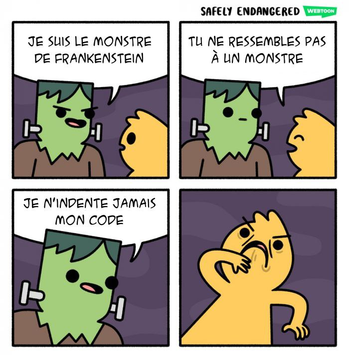

# Organiser mon code

## Pour qui ? Pourquoi ? Comment !

Par [Valentin Brosseau](https://github.com/c4software) / [@c4software](http://twitter.com/c4software)

---

## Pour qui

---

- Pour vous
- Pour moi
- Pour vous (du futur)
- Pour vos collègues
- Vos tests

---

### Pour réfléchir

---

---

### Petit apparté

---

## Pourquoi ?

---

- Améliorer la lisibilité. <!-- .element: class="fragment" -->
- Simplifier votre travail. <!-- .element: class="fragment" -->
- Réduire votre charge mentale. <!-- .element: class="fragment" -->

---

### Mais également

---

- S'améliorer. <!-- .element: class="fragment" -->
- Pouvoir tester. <- 🤔 <!-- .element: class="fragment" -->
- Pouvoir faire évoluer son code. <!-- .element: class="fragment" -->
- Avoir une meilleure note… <!-- .element: class="fragment" -->

---

Car au final, le but c'est de ne pas être noyé dans son propre code

---

---

## Comment

---

- Découper.
- Modèle.
- DAO.
- Définir (configurations, constantes)
- Réutiliser.
- Code en commentaire 🤔

---

### Découper

- Fonctions d'aide.
- Accessible dans l'ensemble du projet (`/libs/…`, `/helpers/…`).
- Ne pas copier / coller. Découper pour réutiliser.

---

### Penser fonctionnalités pas finalités

---

Avez vous des exemples ?

---

### Modèle

C'est quoi ?

---

Représente votre objet. Intégre les méthodes qui s'implifie sa manipulation.

- Des exemples ?

---

## Pourquoi est-ce important ?

---

Pourquoi dans le cadre d'un developpement en mode API c'est encore plus important ?

---

- Centralise la logique métier. <!-- .element: class="fragment" -->
- Permet les évolutions simplifiés. <!-- .element: class="fragment" -->
- Évite le codes dupliqués. <!-- .element: class="fragment" -->
- Normalise votre code. <!-- .element: class="fragment" -->

---

### DAO

- Défini les méthodes qui accède à la données
- Retourne un objet « typé » (un modèle)

---

## Pourquoi est-ce important ?

---

- Permet de tester. <!-- .element: class="fragment" -->
- Permet de changer la source de données. <!-- .element: class="fragment" -->
- Centralise votre code. <!-- .element: class="fragment" -->
- Simplifie les modifications. (À votre avis ?) <!-- .element: class="fragment" -->
- Facilite le partage de code. <!-- .element: class="fragment" -->

---

[Un exemple](https://gist.github.com/c4software/30947f2a86eb0ab065d26a6ed0edb3e9)

---

### Définir

---

### Fichier regroupant la configuration

À votre avis, que doit-il contenir ?

---

### Les constantes

- Utilité ?

--- 

[Un exemple](https://gist.github.com/c4software/8b5122405b38f4c933d6a4490f45e1ad)

---

Alors ?

---

- Simplifie la lecture du code. <!-- .element: class="fragment" -->
- Centralise les éléments « sensible ». <!-- .element: class="fragment" -->
- Évite le code dubliqués. <!-- .element: class="fragment" -->
- Réduit la charge mentale. (évite la panique !) <!-- .element: class="fragment" -->
- Être quelqu'un de bien. <!-- .element: class="fragment" -->

---

### Réutiliser

- Savoir faire des librairies.
- Savoir faire des fichiers « d'aide ».
- Partager les définitions de méthodes entre client-serveur.

---

### Pourquoi ?

---

## Le but de tout ça (DAO, Modèle, …)

---

### Être prêt pour les modifications de

- L'examen ! <!-- .element: class="fragment" -->
- Du stage ! <!-- .element: class="fragment" -->
- De la vie ! <!-- .element: class="fragment" -->
- …

---

---

### Point bonus

---

## Un code commenté, c'est du code supprimé

---

## Vous utilisez git !

### Le je garde au cas où

---

---

# Des questions ?
