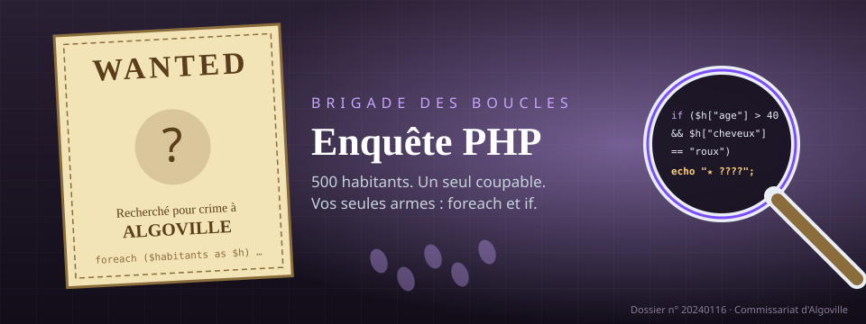

# Jeu : Enquête PHP



::: details Sommaire
[[toc]]
:::

Vous savez écrire des conditions, des boucles et manipuler des tableaux en PHP ? Alors vous savez mener une enquête. Un crime a été commis à Algoville, la police a des fichiers… et rien d'autre. C'est à vous de jouer !

Sept histoires : les **quatre premières** se jouent avec ce que vous connaissez déjà (`foreach`, `if`, quelques fonctions sur les chaînes), les **trois dernières** reprennent le même principe en **orienté objet**, à jouer quand vous aurez vu les classes ([la suite en orienté objet](#la-suite-en-oriente-objet)).

::: tip Pour les étudiants en avance
Ce jeu est un **bonus** : il n'est pas noté et ne demande aucun rendu. Vous pouvez y jouer en autonomie, seul ou à deux, dès que vous avez terminé le TP en cours. Comptez environ une heure par histoire.
:::

## À vous de jouer : choisissez votre enquête

Sélectionnez une histoire, lisez le brief, puis écrivez votre code dans l'éditeur. Tout s'exécute dans votre navigateur (le premier « Exécuter » télécharge PHP, environ 13 Mo, une seule fois). Les données et la fonction `verifier()` sont dépliables juste sous l'éditeur.

<ClientOnly>
<AlgoEnquete />
</ClientOnly>

## Les règles du jeu

- Toutes les histoires se passent dans la même ville : mêmes tableaux (`$habitants`, `$vehicules`, `$temoignages`, `$passages`), reliés par l'`id` de l'habitant. Seules les données changent.
- Chaque enquête commence par `echo $rapport;` : le rapport vous dit comment trouver les témoins, les témoins décrivent le coupable, et parfois le coupable vous mène plus loin encore.
- Les dates sont des entiers `AAAAMMJJ` (`20240116` pour le 16 janvier 2024), les heures `HHMM` (`1830` pour 18h30).
- Quand vous pensez avoir trouvé, vous **accusez** avec `verifier("Prénom Nom");`. La réponse vous dit si c'est la bonne personne et si l'enquête continue. Le journal de bord au-dessus de l'éditeur coche les étapes réussies.

::: warning Interdit
Pas de `print_r($habitants);` en espérant repérer le coupable à l'œil : il y a 500 habitants. L'objectif est justement d'écrire des boucles et des conditions qui **réduisent** la liste jusqu'à n'avoir qu'un seul nom. Et évitez les `while` sans condition de sortie : une boucle infinie fige l'onglet.
:::

::: details Rattrapage express : les outils dont vous aurez besoin
- `foreach ($habitants as $h) { … }` : parcourir un tableau ; `$h["cle"]` : lire une valeur.
- `if ($a && $b) { … }` : cumuler plusieurs conditions.
- `str_starts_with($texte, "abc")`, `str_ends_with(…)`, `str_contains(…)` : commence par, se termine par, contient.
- Garder un maximum : une variable `$record` mise à jour dans la boucle quand on trouve mieux.
- Compter : `$compteur[$cle] = ($compteur[$cle] ?? 0) + 1;` (le `?? 0` donne une valeur par défaut la première fois).

Si vous préférez votre éditeur habituel : le lien « Télécharger les données » donne un fichier `.php` autonome, à charger avec `require "nom_du_fichier.php";`.
:::

## Enquête n° 1 : on la fait ensemble

Pour prendre en main l'outil, nous allons résoudre **Le vol de la médiathèque** ensemble. Sélectionnez cette histoire dans l'éditeur, copiez chaque bloc de code et comparez votre résultat au mien. Les autres histoires seront à faire seul, avec la même méthode.

### 1. Le rapport de police

Le lien « Insérer le code de départ » écrit ce code pour vous :

```php
<?php

echo $rapport;
```

Le rapport nous apprend qu'un témoin a tout vu, et qu'il « vit au dernier numéro de « Rue des Tilleuls » ». Pas de nom : le rapport ne donne jamais un nom, seulement une manière de le retrouver.

### 2. Trouver le témoin

« Le dernier numéro de la rue », c'est **le plus grand `numero` parmi les habitants de cette rue**. On parcourt `$habitants`, on ignore tout le monde sauf les habitants de la rue, et on garde en mémoire le plus grand numéro rencontré :

```php
<?php

$temoin = null;
$record = 0;
foreach ($habitants as $h) {
    if ($h["rue"] === "Rue des Tilleuls" && $h["numero"] > $record) {
        $record = $h["numero"];
        $temoin = $h;
    }
}
echo $temoin["nom"];
```

::: details Pourquoi `$record = 0;` avant la boucle ?
On part du plus petit numéro possible. À chaque habitant de la rue dont le numéro dépasse le record, on met à jour le record **et** on mémorise l'habitant complet (c'est son `id` qui servira ensuite). Pour le plus **petit** numéro, inversez la comparaison et partez d'un record très grand (`PHP_INT_MAX`).
:::

::: details Les autres formulations que vous rencontrerez
| Le rapport dit… | Vous cherchez… |
| --- | --- |
| « le plus petit numéro de la rue X » | le même code, comparaison inversée |
| « prénommé Lucas, rue X » | `str_starts_with($h["nom"], "Lucas ")` en plus du test sur la rue |
| « la personne au revenu le plus élevé de la rue X » | le plus grand `revenu` de la rue, avec `$record` |
:::

### 3. Lire son témoignage

Notre témoin s'appelle Gaston Lefebvre. Sa déclaration est dans `$temoignages`, relié par `habitant_id`. Ajoutez à la suite de votre code :

```php
foreach ($temoignages as $t) {
    if ($t["habitant_id"] === $temoin["id"]) {
        echo $t["texte"];
    }
}
```

Le témoignage décrit la voleuse : une femme, entre 44 et 48 ans, entre 158 et 161 cm, cheveux noirs.

### 4. Croiser les indices

Quatre conditions, une boucle, un seul `if` :

```php
<?php

foreach ($habitants as $h) {
    if ($h["genre"] === "femme"
        && $h["cheveux"] === "noir"
        && $h["taille"] >= 158 && $h["taille"] <= 161
        && $h["age"] >= 44 && $h["age"] <= 48) {
        echo $h["nom"] . "\n";
    }
}
```

Un seul nom s'affiche. Retirez une condition et réexécutez : plusieurs suspects apparaissent. C'est voulu, la ville contient des habitants qui correspondent à presque toute la description. **Chaque indice compte.**

::: details La couleur est « noir » ou « noirs » ?
La clé `cheveux` contient la couleur au singulier (`"noir"`, `"brun"`, `"roux"`…), alors que le témoignage parle français. Quand un test ne renvoie rien, vérifiez toujours la valeur **exacte** stockée dans les données.
:::

::: details Que se passe-t-il quand un indice dit « trois passages à un endroit » ?
Un simple `if` ne suffit plus : il faut d'abord **compter** les passages de chaque habitant dans un tableau compteur (`$compteur[$h["id"]]`), puis filtrer sur ce compteur. Vous en aurez besoin dès l'histoire 2.
:::

### 5. Accuser

```php
verifier("le nom que vous avez trouvé");
```

::: tip Point de contrôle
Le journal de bord affiche « ✔ Étape 1 » et le message vous félicite. Si le message dit « Ce n'est pas la bonne personne », vérifiez l'orthographe exacte du nom (copiez-collez-le depuis votre sortie). Quand une histoire continue, lisez le témoignage de la personne démasquée : elle a peut-être été payée par quelqu'un.
:::

## Enquêtes 2 à 4 : indices et solutions

Les histoires suivantes se corsent : plusieurs témoins, des voitures à croiser avec les habitants, des passages à compter, et même une fausse piste. Essayez d'abord sans indice ; si vous bloquez, dépliez-les dans l'ordre, la solution complète vient en dernier.

### Sabotage au gymnase

<!--@include: ../public/enquete-algo/solutions/gymnase.md-->

### Le disparu du marché couvert

<!--@include: ../public/enquete-algo/solutions/marche.md-->

### Fausse piste au carnaval

<!--@include: ../public/enquete-algo/solutions/carnaval.md-->

## La suite en orienté objet

Les histoires 5 à 7 reprennent exactement le même jeu, mais les habitants ne sont plus des tableaux : ce sont des **objets**. Même éditeur, mêmes règles, même fonction `verifier()` ; seule la manière d'écrire le code change, et chaque histoire monte d'un cran.

::: warning Pas encore vu les classes ?
Cette partie demande [les bases de la POO](/cours/poo), [les interfaces](/cours/les_interfaces) et idéalement [le polymorphisme](/cours/poo_redefinition_polymorphisme) (l'[aide-mémoire POO](/cheatsheets/poo/) est un bon compagnon). Si ce n'est pas encore fait, arrêtez-vous ici et revenez après le cours. Le jeu vous attendra.
:::

::: details Les classes fournies et la syntaxe dont vous aurez besoin
Toutes les données sont encapsulées dans un objet `$ville`, déjà créé pour vous (les classes sont aussi dépliables dans l'éditeur).

| Classe | Propriétés | Méthodes |
| --- | --- | --- |
| `Habitant` | `id`, `nom`, `genre`, `age`, `taille`, `cheveux`, `rue`, `numero`, `revenu` (lecture seule) | `prenom(): string`, `habite(string $rue): bool` |
| `Vehicule` | `habitantId`, `marque`, `modele`, `plaque` | `appartientA(Habitant $h): bool` |
| `Passage` | `habitantId`, `lieu`, `date`, `heure` | `estA(string $lieu): bool` |
| `Ville` | (privées : c'est l'encapsulation) | `rapport(): string`, `habitants(): array`, `vehiculeDe(Habitant $h): ?Vehicule`, `temoignageDe(Habitant $h): ?string`, `passagesDe(Habitant $h): array` |

Et pour la dernière histoire :

```php
interface Critere
{
    public function accepte(Habitant $h): bool;
}

/** Renvoie les habitants qui passent TOUS les critères. */
function filtrer(Ville $ville, Critere ...$criteres): array
```

Côté syntaxe : `$h->age` lit une propriété, `$ville->habitants()` appelle une méthode, `class MonCritere implements Critere { … }` implémente l'interface, `new MonCritere("roux")` instancie avec un argument. Une méthode comme `vehiculeDe()` peut renvoyer `null` : testez-le.

**Pourquoi ne peut-on plus faire `$habitants[3]["cheveux"]` ?** Parce que `Ville` garde ses tableaux privés et n'expose que des méthodes : vous dépendez du **contrat** de la classe, pas de la façon dont elle stocke ses données. Si demain `Ville` lisait une base de données, votre code d'enquête ne changerait pas d'une ligne.
:::

### Histoire 5 : l'affaire de l'observatoire, semi-guidée

Remontez à [l'éditeur](#a-vous-de-jouer-choisissez-votre-enquete) et sélectionnez **L'affaire de l'observatoire**. Je vous montre le début, vous finissez. Le code de départ devient `echo $ville->rapport();`.

Le gardien « habite la dernière maison de « Chemin du Parc » ». Même technique du record qu'avant, mais `$h` est un **objet** :

```php
<?php

$temoin = null;
$record = 0;
foreach ($ville->habitants() as $h) {
    if ($h->habite("Chemin du Parc") && $h->numero > $record) {
        $record = $h->numero;
        $temoin = $h;
    }
}
echo $temoin->nom . "\n";
echo $ville->temoignageDe($temoin);
```

Remarquez `$h->numero` au lieu de `$h["numero"]`, et surtout `$ville->temoignageDe($temoin)` : plus besoin de boucler sur un tableau de témoignages, la ville s'en charge.

Le témoin décrit une femme, son âge, ses cheveux… et sa voiture. La description se teste sur les propriétés de `Habitant` ; pour la voiture, demandez `$ville->vehiculeDe($h)`, qui peut être `null` (tout le monde n'a pas de voiture) : testez `$v !== null` **avant** de lire `$v->marque`.

::: details Coup de pouce : la structure de la boucle
```php
foreach ($ville->habitants() as $h) {
    $v = $ville->vehiculeDe($h);
    if ($v !== null
        && $h->genre === "..."
        && ...) {
        echo $h->nom . "\n";
    }
}
```
:::

Un seul nom doit s'afficher. Accusez, lisez le témoignage de la voleuse : l'enquête continue vers un mystérieux collectionneur, que vous trouverez seul (une adresse et un revenu : tout est dans `Habitant`).

::: tip Point de contrôle
Les deux étapes du journal de bord sont cochées. Les indices dégressifs sont ci-dessous si vous bloquez.
:::

<!--@include: ../public/enquete-algo/solutions/observatoire.md-->

### Histoire 6 : le fantôme du théâtre, dans une classe

Sélectionnez **Le fantôme du théâtre**. Nouveauté : des indices en « n passages à tel endroit », à compter avec `$ville->passagesDe($h)`. Et une exigence de forme : **votre code d'enquête vit dans une classe à vous** :

```php
final class EnqueteFantome
{
    public function __construct(private Ville $ville)
    {
    }

    /** @return Habitant[] */
    public function suspects(): array
    {
        // votre filtre ici : parcourez les habitants, comptez les passages,
        // et retournez un tableau d'objets Habitant (pas des echo !)
    }
}

$enquete = new EnqueteFantome($ville);
foreach ($enquete->suspects() as $suspect) {
    echo $suspect->nom . "\n";
}
```

C'est le même filtre qu'avant, mais **encapsulé** : `suspects()` retourne des objets, l'affichage reste à l'extérieur. Une méthode privée `nombreDePassages(Habitant $h): int` gardera `suspects()` lisible.

<!--@include: ../public/enquete-algo/solutions/theatre.md-->

### Histoire 7 : le naufrage de la régate, avec des critères

Sélectionnez **Le naufrage de la régate**. Dernier niveau : chaque indice devient une **classe critère** qui implémente `Critere`, et `filtrer()` les combine. Méfiez-vous aussi des fausses pistes…

Un critère, c'est une toute petite classe :

```php
final class CheveuxDeCouleur implements Critere
{
    public function __construct(private string $couleur)
    {
    }

    public function accepte(Habitant $h): bool
    {
        return $h->cheveux === $this->couleur;
    }
}
```

Et l'enquête devient une composition, lisible comme une phrase :

```php
$suspects = filtrer(
    $ville,
    new CheveuxDeCouleur("roux"),
    new AgeEntre(40, 45),
);
foreach ($suspects as $suspect) {
    echo $suspect->nom . "\n";
}
```

À vous d'écrire les critères dont l'histoire a besoin : couleur de cheveux, âge, plaque qui contient un fragment (ce critère aura besoin de `$ville` dans son constructeur pour appeler `vehiculeDe()`), nombre de passages à un lieu… Chaque classe fait UNE chose, `filtrer()` les assemble.

::: details Question : pourquoi `filtrer()` fonctionne avec n'importe quel critère ?
Parce qu'elle ne connaît que l'interface `Critere` : elle appelle `accepte($h)` sans savoir quelle classe concrète est derrière. Dix critères différents, un seul code de filtrage : c'est le **polymorphisme** du cours, appliqué à quelque chose d'utile.
:::

<!--@include: ../public/enquete-algo/solutions/regate.md-->

## Pour aller plus loin

- Écrivez une fonction `trouverParNom(array $habitants, string $nom): ?array` qui renvoie un habitant complet à partir de son nom.
- Refaites l'enquête n° 1 avec `array_filter()` et une fonction anonyme.
- Côté POO : ajoutez un critère `Non(Critere $c)` qui inverse n'importe quel critère, et un critère `Ou(Critere ...$criteres)`. Vous venez d'écrire un moteur de requêtes.
- Comparez avec l'[Enquête SQL](/jeux/enquete-sql.md) : ce sont les mêmes enquêtes, en une ligne de requête. `filtrer($ville, …)` ressemble beaucoup à un `WHERE … AND …`, et ce n'est pas un hasard.

## Conclusion

En jouant, vous avez :

- filtré un tableau avec `foreach` + `if`, en cumulant les conditions ;
- cherché un maximum avec une variable record et compté des occurrences avec un tableau compteur ;
- croisé plusieurs tableaux grâce à un identifiant commun ;
- côté objet : respecté le contrat d'une classe encapsulée, structuré votre code dans vos propres classes et composé des critères grâce à une interface.

👋 Si vous avez des questions, n'hésitez pas !
