# Lecture d'UML : les diagrammes de classes

Nom : ______________________  Prénom : ______________________

**Question 1 — Visibilité privée**

Dans un diagramme de classes, que signifie le symbole « - » devant « -nom: String » ?

- ☐ **a.** L'attribut nom est en lecture seule
- ☐ **b.** L'attribut nom est privé, il n'est accessible que depuis l'intérieur de la classe
- ☐ **c.** L'attribut nom est optionnel
- ☐ **d.** L'attribut nom sera supprimé dans une prochaine version

**Question 2 — Les symboles de visibilité**

Associez chaque symbole UML à la visibilité qu'il représente.

| | À relier à… |
|---|---|
| + → ______ | • private |
| - → ______ | • abstract |
| # → ______ | • static |
|  | • public |
|  | • protected |

**Question 3 — Méthode publique**

La notation « +presenter(): String » désigne une méthode publique qui retourne une chaîne de caractères.

☐ Vrai  ☐ Faux

**Question 4 — Le mot void**

Dans la signature « +ajouterEnfant(enfant: Personne): void », que signifie void ?

- ☐ **a.** Le paramètre enfant peut être nul
- ☐ **b.** La méthode est privée
- ☐ **c.** La méthode ne retourne aucune valeur
- ☐ **d.** La méthode est vide, il n'y a rien à écrire

**Question 5 — Multiplicité 0..***

Une multiplicité « 0..* » sur une association signifie que l'objet peut être lié à ______ objets de l'autre classe.

(a) au plus un / (b) exactement un / (c) zéro ou plusieurs / (d) au moins un

**Question 6 — Constructeurs et getters**

Les constructeurs, getters et setters n'apparaissent pas dans le diagramme, il est donc impossible d'en écrire dans le code.

☐ Vrai  ☐ Faux

**Question 7 — Le propriétaire de la maison**

Observez le diagramme :
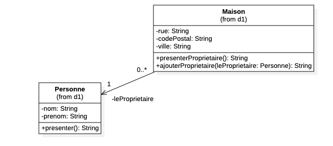
Que peut-on déduire de l'association entre Maison et Personne ?

- ☐ **a.** Une maison peut ne pas avoir de propriétaire
- ☐ **b.** Une maison peut avoir plusieurs propriétaires
- ☐ **c.** Une personne possède obligatoirement une maison
- ☐ **d.** Une maison a exactement un propriétaire, et une personne peut posséder plusieurs maisons

**Question 8 — Traduire une association**

Observez le diagramme :

Comment se traduit le rôle « -leProprietaire » dans le code de la classe Maison ?

- ☐ **a.** Par un attribut privé de type Maison dans la classe Personne
- ☐ **b.** Par un attribut privé de type Personne dans la classe Maison
- ☐ **c.** Par une nouvelle classe nommée LeProprietaire
- ☐ **d.** Par un attribut public de type String

**Question 9 — Type de retour**

Observez le diagramme :

Quel est le type de retour de la méthode presenterProprietaire() de la classe Maison ?

Réponse : ________________________________________

**Question 10 — L'auto-association**

Observez le diagramme :
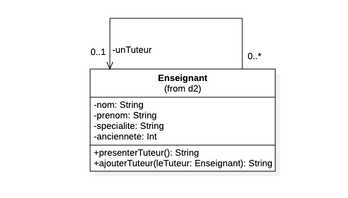
La classe Enseignant est associée à elle-même (rôle -unTuteur). Que signifie cette association ?

- ☐ **a.** Un enseignant peut avoir plusieurs tuteurs
- ☐ **b.** Un enseignant a obligatoirement un tuteur
- ☐ **c.** Le tuteur est une personne extérieure à la classe Enseignant
- ☐ **d.** Un enseignant peut avoir au plus un tuteur, qui est lui-même un Enseignant

**Question 11 — Compter les attributs**

Observez le diagramme :

Combien d'attributs sont déclarés dans la classe Enseignant ?

Réponse : ________________________________________

**Question 12 — La caserne**

Observez le diagramme :
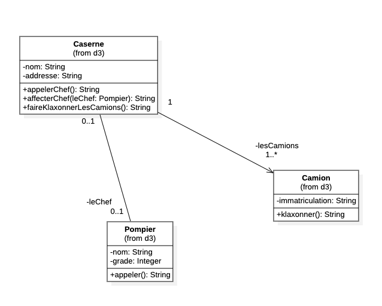
Que signifie la multiplicité « 1..* » côté Camion (rôle -lesCamions) ?

- ☐ **a.** Une caserne possède au moins un camion
- ☐ **b.** Une caserne possède exactement un camion
- ☐ **c.** Une caserne peut ne posséder aucun camion
- ☐ **d.** Un camion appartient à plusieurs casernes

**Question 13 — Le chef optionnel**

Observez le diagramme :

Avec la multiplicité « 0..1 » sur le rôle -leChef, une caserne peut très bien ne pas avoir de chef.

☐ Vrai  ☐ Faux

**Question 14 — Faire klaxonner les camions**

Observez le diagramme :

Comment implémenter la méthode faireKlaxonnerLesCamions() de la classe Caserne ?

- ☐ **a.** Créer un nouveau Camion puis le faire klaxonner
- ☐ **b.** Appeler klaxonner() directement sur la classe Camion
- ☐ **c.** Retourner la liste des immatriculations
- ☐ **d.** Parcourir la collection -lesCamions et appeler klaxonner() sur chaque camion

**Question 15 — Attributs accessibles**

Observez le diagramme :
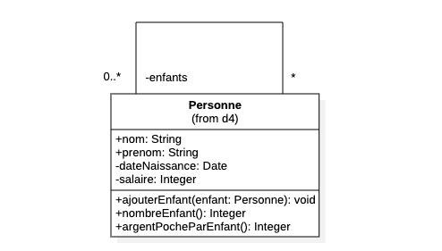
Quels attributs de la classe Personne sont directement accessibles depuis l'extérieur de la classe ? (plusieurs réponses attendues)

*Plusieurs réponses possibles.*

- ☐ **a.** salaire
- ☐ **b.** dateNaissance
- ☐ **c.** nom
- ☐ **d.** prenom

**Question 16 — Les rôles de l'entreprise**

Observez le diagramme :
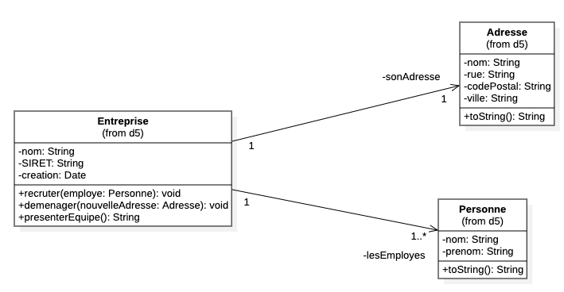
Associez chaque élément de la classe Entreprise à sa traduction dans le code.

| | À relier à… |
|---|---|
| -sonAdresse → ______ | • Une collection de Personne (au moins une) |
| -lesEmployes → ______ | • Une collection d'Adresse |
| -creation → ______ | • Un attribut de type Date |
|  | • Un attribut de type Adresse (exactement une) |
|  | • Un attribut de type String |

**Question 17 — Représentation en chaîne**

Observez le diagramme :

Les classes Adresse et Personne possèdent toutes les deux une méthode « +toString(): String ». Quel est son rôle ?

- ☐ **a.** Convertir la classe en String définitivement
- ☐ **b.** Retourner une représentation de l'objet sous forme de chaîne de caractères
- ☐ **c.** Comparer deux objets entre eux
- ☐ **d.** Sauvegarder l'objet dans un fichier texte

**Question 18 — L'arbitre du match**

Observez le diagramme :
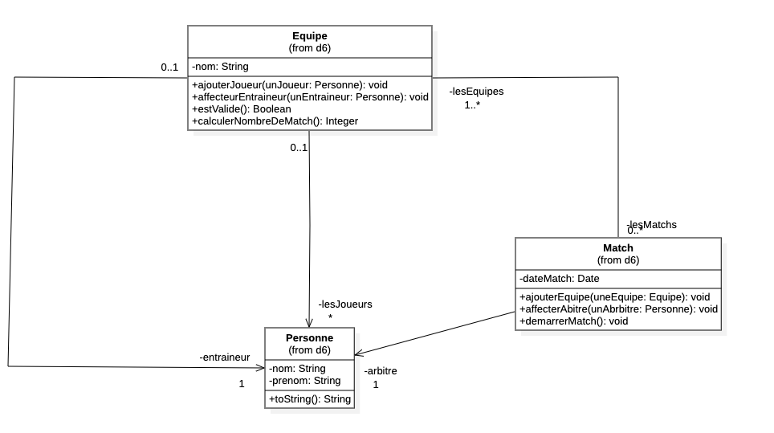
Combien d'arbitres possède un match ?

Réponse : ________________________________________

**Question 19 — Le type Boolean**

Observez le diagramme :

Dans la classe Equipe, la méthode « +estValide(): Boolean » retourne :

- ☐ **a.** Un nombre entier
- ☐ **b.** Vrai ou faux
- ☐ **c.** Le nom de l'équipe
- ☐ **d.** Rien du tout

**Question 20 — Retourner une collection**

Observez le diagramme :
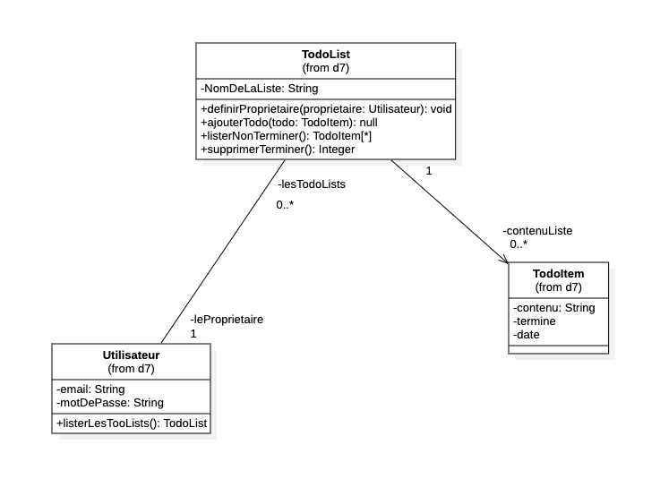
Que retourne la méthode listerNonTerminer() de la classe TodoList ?

- ☐ **a.** Un seul TodoItem
- ☐ **b.** Une chaîne de caractères
- ☐ **c.** Une collection (un tableau) de TodoItem
- ☐ **d.** Le nombre de TodoItem non terminés

**Question 21 — Les listes de l'utilisateur**

Observez le diagramme :

Avec la multiplicité « 0..* » sur le rôle -lesTodoLists, un utilisateur peut posséder plusieurs listes.

☐ Vrai  ☐ Faux

**Question 22 — Les multiplicités du forum**

Observez le diagramme :
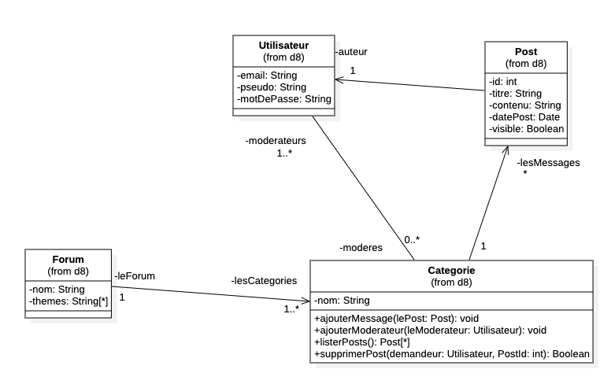
Associez chaque rôle à sa multiplicité.

| | À relier à… |
|---|---|
| -lesCategories → ______ | • 0..1 |
| -lesMessages → ______ | • 1..* |
| -leForum → ______ | • 2..* |
|  | • 1 |
|  | • * |

**Question 23 — Supprimer un post**

Observez le diagramme :

Combien de paramètres la méthode supprimerPost() de la classe Categorie attend-elle ?

Réponse : ________________________________________

**Question 24 — Le cinéma piégeux**

Observez le diagramme :
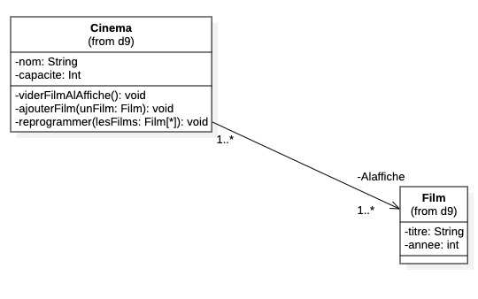
Depuis l'extérieur de la classe Cinema, il est possible d'appeler directement ajouterFilm().

☐ Vrai  ☐ Faux

**Question 25 — La flèche d'héritage**

Observez le diagramme :
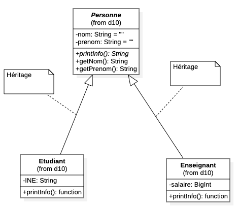
Etudiant et Enseignant pointent vers Personne avec une flèche à pointe triangulaire vide. Que signifie cette flèche ?

- ☐ **a.** Etudiant et Enseignant contiennent un objet Personne
- ☐ **b.** Etudiant et Enseignant héritent de Personne
- ☐ **c.** Personne hérite d'Etudiant et d'Enseignant
- ☐ **d.** Les trois classes sont identiques

**Question 26 — L'italique**

Observez le diagramme :

Le nom de la classe Personne et la méthode printInfo() sont écrits en italique. Qu'est-ce que cela signifie ?

- ☐ **a.** C'est purement décoratif
- ☐ **b.** La classe est plus importante que les autres
- ☐ **c.** La classe est abstraite : on ne peut pas l'instancier directement, et printInfo() doit être redéfinie dans les classes filles
- ☐ **d.** La classe est dépréciée, il ne faut plus l'utiliser

**Question 27 — Les attributs hérités**

Observez le diagramme :

Grâce à l'héritage, quels attributs possède un objet Etudiant ? (plusieurs réponses attendues)

*Plusieurs réponses possibles.*

- ☐ **a.** nom
- ☐ **b.** prenom
- ☐ **c.** INE
- ☐ **d.** salaire
- ☐ **e.** specialite

**Question 28 — Les élèves absents**

Observez le diagramme :
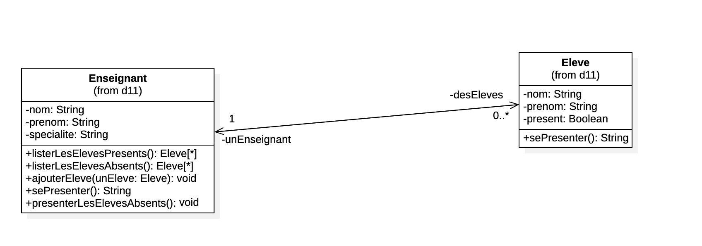
Comment implémenter la méthode listerLesElevesAbsents() de la classe Enseignant ?

- ☐ **a.** Créer de nouveaux élèves absents
- ☐ **b.** Retourner l'attribut present de la classe Eleve
- ☐ **c.** Parcourir la collection -desEleves et retourner ceux dont l'attribut present vaut faux
- ☐ **d.** Appeler sePresenter() sur tous les élèves

## Corrigé

**1.** (b) L'attribut nom est privé, il n'est accessible que depuis l'intérieur de la classe — *Exact, c'est pour cela qu'on passe par des getters / setters ou des méthodes publiques.*

**2.** + → public ; - → private ; # → protected

**3.** Vrai — *Exact : « + » pour public, et le type après « : » est le type de retour.*

**4.** (c) La méthode ne retourne aucune valeur — *Exact, elle fait une action mais ne renvoie rien.*

**5.** (c) zéro ou plusieurs

**6.** Faux — *Au contraire : par convention ils sont souvent omis du diagramme, mais vous devez les écrire dans votre code.*

**7.** (d) Une maison a exactement un propriétaire, et une personne peut posséder plusieurs maisons — *Exact : « 1 » côté Personne, « 0..* » côté Maison.*

**8.** (b) Par un attribut privé de type Personne dans la classe Maison — *Exact : une association navigable devient un attribut du type de la classe liée.*

**9.** String

**10.** (d) Un enseignant peut avoir au plus un tuteur, qui est lui-même un Enseignant — *Exact : une classe peut être associée à elle-même, ici avec un tuteur optionnel (« 0..1 »).*

**11.** 4

**12.** (a) Une caserne possède au moins un camion — *Exact : « 1..* » se lit « de un à plusieurs ».*

**13.** Vrai — *Exact : c'est pour cela que appelerChef() doit vérifier qu'un chef existe avant de l'appeler.*

**14.** (d) Parcourir la collection -lesCamions et appeler klaxonner() sur chaque camion — *Exact : une multiplicité « * » devient une liste qu'on parcourt avec une boucle.*

**15.** (c) nom ; (d) prenom — *Exact, il est précédé de « + ». / Exact, il est précédé de « + ».*

**16.** -sonAdresse → Un attribut de type Adresse (exactement une) ; -lesEmployes → Une collection de Personne (au moins une) ; -creation → Un attribut de type Date

**17.** (b) Retourner une représentation de l'objet sous forme de chaîne de caractères — *Exact, pratique pour afficher l'objet.*

**18.** 1

**19.** (b) Vrai ou faux — *Exact : un Boolean ne peut prendre que deux valeurs.*

**20.** (c) Une collection (un tableau) de TodoItem — *Exact : la notation « [*] » indique un tableau d'éléments.*

**21.** Vrai — *Exact : il peut même n'en avoir aucune.*

**22.** -lesCategories → 1..* ; -lesMessages → * ; -leForum → 1

**23.** 2

**24.** Faux — *Bien vu : les trois méthodes sont précédées de « - », elles sont donc privées et inaccessibles depuis l'extérieur.*

**25.** (b) Etudiant et Enseignant héritent de Personne — *Exact : la flèche triangulaire vide représente l'héritage (la généralisation).*

**26.** (c) La classe est abstraite : on ne peut pas l'instancier directement, et printInfo() doit être redéfinie dans les classes filles — *Exact : l'italique signale l'abstraction en UML.*

**27.** (a) nom ; (b) prenom ; (c) INE — *Exact, hérité de Personne. / Exact, hérité de Personne. / Exact, déclaré dans Etudiant.*

**28.** (c) Parcourir la collection -desEleves et retourner ceux dont l'attribut present vaut faux — *Exact : on filtre la collection issue de l'association.*
