# Les bases d'Android

Par [Valentin Brosseau](https://github.com/c4software) / [Playmoweb](https://www.playmoweb.com)

---

Point statistique :

- Combien d'entre vous ont un téléphone Android ?
- Combien d'entre vous ont un iPhone ?

---

## Introduction à Android

---

- Développé par Google
- Créé en 2008 (17 ans)
- Actuellement en version 16
- Android 17 (Q2 2026)

---

À la base un OS pour appareil photo.

---

## Pourquoi Android ?

- Multi marques (Google, Samsung, Xiaomi, Microsoft, …)
- Part de marché
- Ouvert
- Personnalisable
- Le prix

---

## Le problème d'Android ?

- La fragmentation

---

- Un Android ? Non… des Android!

---

- [Répartition des versions](https://gs.statcounter.com/android-version-market-share/mobile-tablet/worldwide)
- [Répartition des caractéristiques](https://developer.android.com/about/dashboards)
- [API Level VS utilisation](https://apilevels.com/)

---

## L'architecture

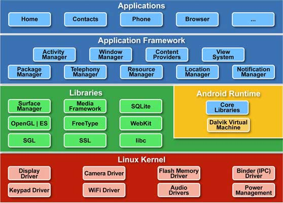

---

Linux ?

<center>
    <iframe src="https://giphy.com/embed/3og0ICG4WxdKSRzE3K" width="480" height="270" frameBorder="0" class="giphy-embed" allowFullScreen></iframe>
</center>

---

## Android is not Linux

Construis autour du noyau Linux mais … c'est tout

- Noyau Linux : Drivers, Batterie, Ram.
- Runtime Android (ART, Dalvik) : Fais tourner les applications Android.
- App Framework : Android Framework (Android API).

---

## La sécurité

---

L'isolation avant tout

---

- Chaque application a son propre utilisateur Linux.
- Les applications sont sandboxées.
- Chaque application tourne dans sa propre « VM ».
- Chaque application a son cycle de vie.

---

Permissions d'accès

---

- Chaque application doit demander l'accès à certaines ressources.
- L'utilisateur doit accepter ces permissions.
- Les permissions sont limitées (et révoquables).

---

## Les API

Deux types :

- SDK Android : Évolue lors des mises à **jour de système**. (Intégré)
- Play Service : Évolue automatiquement indépendamment de la version de l'OS. (Distribué par Google, mais…)

---

## Les langages

---

### Le Code

- Java (Historique)
- Kotlin (à privilégier maintenant)
- Flutter (Dart ? Quoi ?)

---

### Les Ressources

- XML (Drawables, Layout, Settings, Color, String)
- png / jpeg / SVG (presque)

---

### Android est une plateforme ouverte, qui évolue rapidement.

Trop pour certains… Mais le reflet de la réalité (foldable, 5G, Bluetooth LE, Bluetooth Mesh, NFC,…)

---

### Bon… Et comment on fait une application ?

<center>
<iframe src="https://giphy.com/embed/Ot4U0KHw2fdvxJZ4jh" width="480" height="480" style="" frameBorder="0" class="giphy-embed" allowFullScreen></iframe>
</center>

---

## 1. L'interface

---

## Nous sommes en transition

### Dommage pour vous ? Pas certains…

#### Cette année, nous utiliserons Compose + Kotlin

---

- [Compose (Code)](https://developer.android.com/compose)
- [View (XML)](https://developer.android.com/guide/topics/ui/declaring-layout)

---

### Layout « View »

- Fichier XML
- Représente l'interface graphique
- Déclaratif

---

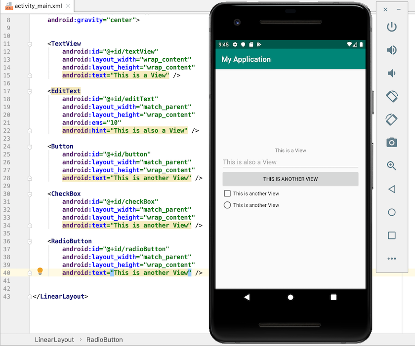

---

### Évolutions permanentes

- AndroidX
- Jetpack
- Compose

---

### Compose ?

- Passer d'une Interface déclarative (XML).
- À une Interface « Composable » écrite en **code** (Kotlin)

---

```kotlin
@Composable
fun Greeting(name: String) {
    Text(text = "Hello $name!")
}
```

---

## Repose sur une approche composant

### Comme SwiftUI, Flutter… ou encore VueJS, React…

---

Le composant sont maintenant un principe de base de la conception d'interface utilisateur.

---

## Un composant c'est quoi ?

### À votre avis ?

---

- Un morceau d'interface.
- Réutilisable.
- Interactif.
- Indépendant.
- Imbriquable.

---


---

Des briques de base d'une interface.

---

## Compose

- Librairie Kotlin à part entière.
- Remplace le XML pour les interfaces.
- Utilise un moteur de rendu (Skia).

---

## Un moteur de rendu ?

---

<iframe src="https://giphy.com/embed/a5viI92PAF89q" width="480" height="331" frameBorder="0" class="giphy-embed" allowFullScreen></iframe>

---

## Utilisable sur :

- Android (Maintenu par Google).
- Desktop (Compose Multiplatform).
- iOS (Compose Multiplatform).
- Web (Compose Multiplatform, mais expérimental).

---

## Revenons à Android

- Compose est la nouvelle façon de faire des interfaces.
- Poussé par Google.
- En cours de développement.
- En cours d'adoption par les entreprises.

---

Change la façon de faire des interfaces. Et **uniquement** ça.

(Nous avons toujours besoin de Kotlin, de Java, de Gradle, de l'Android SDK, etc.)

---

## Le fonctionnement

- Chaque composant est une fonction.
- Mis à jour en fonction de l'état de l'écran.
- Mise à jour automatique et temps réel.

---

## Un exemple

---

```kotlin
var counter by remember { mutableStateOf(0) }
Button(onClick = { counter++ }) {
    Text("Clique => ${counter}")
}
```

Qu'observez-vous ? À votre avis, comment ça fonctionne ?

---

## Un autre exemple

---

```kotlin
var isLogin by remember { mutableStateOf(false) }

if (isLogin) {
    Text("Bienvenue")
} else {
    Button(onClick = { isLogin = true }) {
        Text("Se connecter")
    }
}
```

Qu'observez-vous ? À votre avis, comment ça fonctionne ?

---

- `remember` : Permet de conserver l'état d'une variable entre les recompositions.
- `mutableStateOf` : Permet de créer une variable observable.

---

## Recomposition ?

- Lorsqu'une variable observable change, Compose « recomposera » l'interface.
- Compose va détecter les changements et mettre à jour l'interface en conséquence.
- Pas besoin de gérer manuellement les mises à jour de l'interface.

---

## Quelques composants de base

---

## La structure

- `Column` : Alignement vertical.
- `Row` : Alignement horizontal.
- `Box` : Alignement libre.

---

## Les interactions

- `Button` : Un bouton.
- `TextField` : Un champ de texte.
- `Checkbox` : Une case à cocher.
- `Switch` : Un interrupteur.
- `Text` : Un texte.
- …

---

Beaucoup de composants sont déjà disponibles.

[https://developer.android.com/jetpack/compose/components](https://developer.android.com/jetpack/compose/components)

---

Repose sur le material design (nous y reviendrons)

[https://m3.material.io/](https://m3.material.io/)

---

## Les animations

```kotlin
var counter by remember { mutableStateOf(0) }

Column {
    Button(onClick = { counter++ }) {
        Text("Action")
    }

    AnimatedVisibility(visible = counter > 0) {
        Text("Visible")
    }

    AnimatedContent(targetState = count) { targetState ->
        Text(text = "Count: $targetState")
    }
}
```

---

- [Présentation](https://developer.android.com/jetpack/compose)
- [Documentation](https://developer.android.com/jetpack/compose/documentation)
- [Quelques cours et tutoriaux](https://developer.android.com/courses/jetpack-compose/course)

---

Le renouveau du développement Android

[Exemple les animations](https://developer.android.com/jetpack/compose/animation)

---

- Plus simple
- Permets de faire des animations simplement
- Écriture plus moderne
- Repose sur des Composants (comme React, Vue, Flutter…)
- Pensez réutilisation
- Est multi-plateforme (Desktop, Web…)

---

## Multi-plateforme ?

Arrêtons-nous un instant…

---

- Google développe Compose pour Android.
- JetBrains développe Compose pour iOS, Desktop (Linux, MacOS, Windows), Web.

---

Jetbrains a développé Kotlin, Google l'a adopté. Les deux travaillent ensemble. Activement. 

Le tout est Open Source.

---

Trois termes à retenir :

- **Compose** : La librairie de Google pour Android => Interface déclarative.
- **KMM** : Kotlin Multiplatform (Jetbrains) => Logique métier partagée.
- **CMP** : Compose Multiplatform (Jetbrains) => Interface partagée.

---

Compose multi-plateforme vous permettra donc de créer du code partagé entre vos applications Android, iOS, Desktop et Web.

---

Une dernière chose…

---

Jetpack Compose c'est jeune.

Il faut donc accepter que ça évolue vite / change / sois (parfois) instable.

---

Pour nous accompagner dans cette transition, Google a créé :

[Accompanist](https://github.com/google/accompanist)

---

Accompanist est voué à disparaître. Car les fonctionnalités seront intégrées à Compose.

---

## 2. L'outillage

---

## Android Studio

- l'IDE
- Java + Kotlin
- Version spéciale de Intellij

---


---

## Toolbar

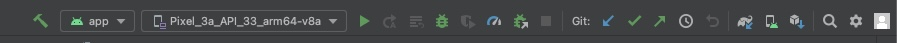

---

Deux façons de travailler :

- Téléphone connecté en USB.
- Émulateur (et non simulateur).

---

## L'émulateur

- Intégré dans Android Studio (🙌).
- Performances suffisantes pour tester.
- Consomme de la RAM (car c'est un VM).
- BLE / Bluetooth partiellement disponible (**très limité**).

---

## Première application

---

- File > New > New Project
- Configurer le projet
- Lancer l'application sans aucune modification (dans un émulateur)

---

## C'est à vous

---

## Structure du projet

---

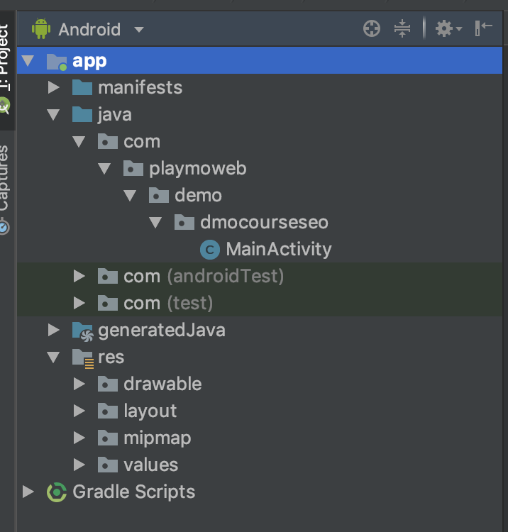

---

- **src** : Vos sources Kotlin (ou Java).
- **res** : XML, fichiers de configurations, images
  - layout
  - strings
  - drawable…

---

### **R.java.class**

- Généré automatiquement.
- Contiens les références de tous les id.
- Permets l'accès aux ressources depuis votre code :
  - `stringResource(R.string.hello)`
  - `imageResource(R.drawable.image)`
  - …

---

### Pourquoi est-ce important ?

- Accessibilité.
- Une plateforme pensée internationalement.
- Une adaptation à l'utilisateur (taille, couleur, etc.)

---

## Débugger

- Points d'arrêts.
  - Avec arrêt.
  - Sans arrêt.
  - Conditionnés
- Logs.
- Logs affichés dans le Logcat.

---

## Logcat


---


---

## Que se passe-t-il lors de la compilation ?

### Avez-vous regardé ?

---

## Un logiciel a été lancé « Gradle »

- Compilation
- Test
- Packaging
- Configurable via un fichier

---

## Gradle

- Open source.
- Règles / scripts de compilation de votre projet.
- Complètement intégré dans Android Studio (complétion, etc.)

---

## Votre première application

- Activity
- Un layout (Composant)
- Déclaré dans le « Manifest »

---

## C'est à vous

- Personnaliser le nom de votre application.
- Personnaliser l'icône de votre application.

---

- Dans le fichier `AndroidManifest.xml` (édition du fichier strings.xml)
- Via l'outil d'Android Studio (clique droit sur `res` > New > Image Asset)

---

## Un détail qui compte… les composants

- Découpage de l'interface.
- Réutilisation.
- Indépendance.
- Paramétrable (car réutilisable).

---

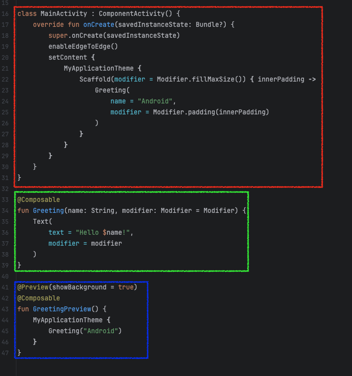

Qu'observez-vous ?

---

## 3. Définir un Layout

---

- Des colonnes.
- Des lignes.
- Des boîtes (box)

---

## Un exemple

```kotlin
Column {
    Text("Hello")
    Text("World")
}
```

---

## Un exemple

```kotlin
Row {
    Text("Hello")
    Text("World")
}
```

---

## Un exemple

```kotlin
Column {
    Row {
        Text("Hello")
        Text("World")
    }
    Row {
        Text("Hello")
        Text("World")
    }
}
```

---

## Un exemple

```kotlin
Box {
    Text("Hello")
    Text("World")
}
```

---

## Définir un taille

```kotlin
Row(modifier = Modifier.size(100.dp))

Row(modifier = Modifier.fillMaxWidth())

Row(modifier = Modifier.fillMaxHeight())

Row(modifier = Modifier.fillMaxSize())
```

---

## Le positionnement

```kotlin
Row(
    horizontalArrangement = Arrangement.Center,
    verticalAlignment = Alignment.CenterVertically
)

Row(
    horizontalArrangement = Arrangement.SpaceBetween,
    verticalAlignment = Alignment.CenterVertically
)
```

---

Nous construisons donc des grilles de composants.

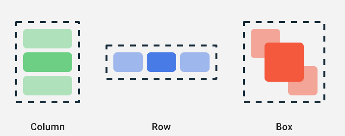

---

## C'est à vous

Modifier pour réaliser ceci :

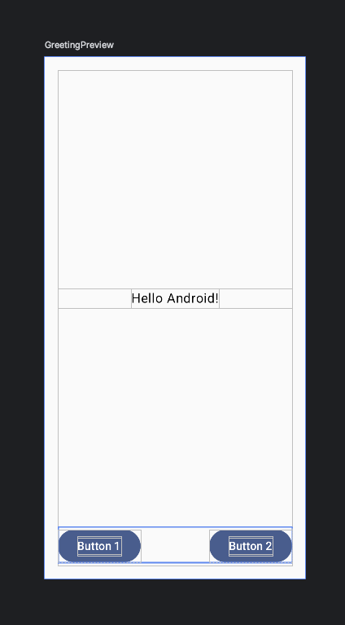

---

## Il vous manque quelque chose ?

… quelques composants, et un peu de style.

---

Pour le style c'est plutôt automatique :

- Material Design.

---

Nous avons à notre disposition un ensemble de composants « fonctionnels » qui vont nous permettre de créer les éléments de notre interface.

---

- `Text` : Un composant qui permet d'afficher du texte.
- `Button` : Un composant qui permet d'afficher un bouton.
- `Switch` : Un composant qui permet d'afficher un toggle (un bouton qui peut être activé ou désactivé).
- `Image` : Un composant qui permet d'afficher une image.
- `LazyColumn` : Un composant qui permet d'afficher une liste.
- `Scaffold` : Un composant qui permet de créer une structure de base pour notre application (barre de navigation, - etc.).
- `TopAppBar` : Un composant qui permet de créer une barre de navigation en haut de l'application.
- `Card` : Un composant qui permet de créer une carte.
- `IconButton` : Un composant qui permet de créer un bouton avec une icône.
- Etc… (Il y en a beaucoup plus, mais nous allons nous arrêter là pour l'instant).

---

Nous avons également des composants qui sont là pour définir la structure de notre application :

- `Column` : Un composant qui permet de créer une colonne.
- `Row` : Un composant qui permet de créer une ligne.
- `Box` : Un composant qui permet de créer une boîte.
- `Spacer` : Un composant qui permet de créer un espace entre deux éléments.

---

Exemple :

```kotlin
Column {
    Button(onClick = { /* Action */ }) {
        Text("Cliquez ici")
    }
    Spacer(modifier = Modifier.weight(1f))
    Text("Un texte")
}
```

---

## Tout est donc composant

### Et imbriquable à l'infini.

---

<center>
    <iframe src="https://giphy.com/embed/xSTtrYhZOpDjYIGkYC" width="480" height="343" frameBorder="0" class="giphy-embed" allowFullScreen></iframe>
</center>

---

## En vrai… c'est hard non ?

Un peu d'explication… avant de continuer…

---

## Un bouton

```kotlin
Button(onClick = { /* Action */ }) {
    Text("Cliquez ici")
}
```

Ici, nous avons un bouton qui affiche un texte. Lorsque l'on clique dessus, une action est déclenchée.

---

## Spacer

```kotlin
Spacer(modifier = Modifier.weight(1f))
```

Un espace qui prend tout l'espace disponible. `weight` est un pourcentage. Ici nous avons un poids de 1, donc il prend tout l'espace disponible.

---

```kotlin
Column {
    Spacer(modifier = Modifier.weight(1f))
    Text("Un texte")
}
```

À votre avis, que va-t-il se passer ?

---

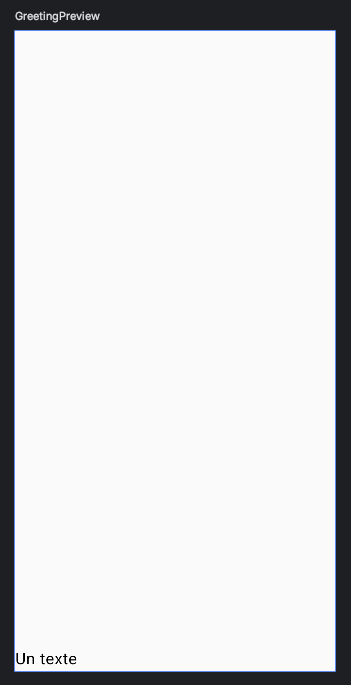

---

Comment faire pour que le texte soit centré ?

Deux solutions :

- `horizontalAlignment = Alignment.CenterHorizontally` sur la `Column`.
- `textAlign = TextAlign.Center` sur le `Text`. ⚠️ Attention, cela ne fonctionne que si votre `Text` fait la largeur de l'écran.

---

```kotlin
Column(
    horizontalAlignment = Alignment.CenterHorizontally
) {
    Spacer(modifier = Modifier.weight(1f))
    Text("Un texte")
}
```

---


---

## C'est à vous…

Comment faire pour que le texte soit centré verticalement ?

(PS : Il y a plusieurs solutions)

---

## Une solution

```kotlin
Column(horizontalAlignment = Alignment.CenterHorizontally) {
    Spacer(modifier = Modifier.weight(1f))
    Text("Un texte")
    Spacer(modifier = Modifier.weight(1f))
}
```

---

## Une autre solution

```kotlin
Column(
    verticalArrangement = Arrangement.Center, 
    horizontalAlignment = Alignment.CenterHorizontally) 
{
    Text("Un texte")
}
```

À votre avis, dans quels cas utiliser l'une ou l'autre des solutions ?

---

## Compose c'est beaucoup de pratique et « de référence »

Pss : N'hésitez pas à consulter la documentation (mais également StackOverflow, ChatGPT, Claude, etc)

---

## C'est à vous

Modifier pour réaliser ceci :


- [https://developer.android.com/develop/ui/compose/layouts/basics]

---

## Exemple de Layout

```kotlin
Column(
    modifier = Modifier.padding(innerPadding)
) {
    Spacer(modifier = Modifier.weight(1f))

    Row(
        modifier = Modifier.fillMaxWidth(),
        horizontalArrangement = Arrangement.Center,
        verticalAlignment = Alignment.CenterVertically
    )
    {
        Greeting(
            name = "Android",
        )
    }

    Spacer(modifier = Modifier.weight(1f))

    Row {
        Button(onClick = { /*TODO*/ }) {
            Text("Button 1")
        }

        Spacer(modifier = Modifier.weight(1f))

        Button(onClick = { /*TODO*/ }) {
            Text("Button 2")
        }
    }
}
```

---

<center>
    <iframe src="https://giphy.com/embed/kRXnZwKrPTwVq" width="480" height="360" frameBorder="0" class="giphy-embed" allowFullScreen></iframe>
</center>

---

Avant de continuer, une petite pause…

Nous allons en profiter pour créer un composant (vous aller voir c'est simple).

---

## Créer un composant

```kotlin
@Composable
fun VotreComposant(content: String) {
    Text(text = content)
}
```

Et c'est tout… Je vous laisse essayer en créant un composant `MyUI` qui représente votre petite interface.

---

## À votre avis, où ranger ce composant ?

---

## 3.1. L'agencement

En compose, nous parlons de `Modifier`.

Les modifiers ont des méthodes pour modifier les composants (taille, couleur, etc.). Ils sont chaînables et varient en fonction du composant.

---

## Exemple

```kotlin
Text(
    text = "Hello World",
    modifier = Modifier
        .padding(16.dp)
        .background(Color.Blue)
        .border(1.dp, Color.Black)
)
```

---

## Exemple les dimensions

```kotlin
Modifier.fillMaxWidth() // Rempli la largeur
Modifier.fillMaxHeight() // Rempli la hauteur
Modifier.fillMaxSize() // Rempli la taille
```

---

## Exemple le padding

```kotlin
Modifier.padding(16.dp) // Ajoute un padding de 16dp
Modifier.padding(16.dp, 8.dp) // Ajoute un padding de 16dp en largeur et 8dp en hauteur
```

---

## Modifier ?

**Rappel** Un `Modifier` est un objet qui permet de modifier le comportement ou l'apparence d'un composant.

---

## Taille et style du texte

```kotlin
Text(text = content, fontWeight = FontWeight.Light, fontSize = 10.sp)
```

---

## Ou via un style

```kotlin
// Défini dans le theme
val monStyle = TextStyle(
    fontWeight = FontWeight.Light,
    fontSize = 10.sp
)

Text(
    text = content,
    style = monStyle
)
```

---

## 4. Les ressources

---

### L'internationalisation

- `res/values/strings.xml`

Accessible via `stringResource(R.string.un_texte)`.

---

## C'est à vous, je vous laisse extraire le texte dans le fichier `strings.xml`

👋 Pour la première fois, faisons-le ensemble

---

## Comment procéder ?

Via Android Studio bien évidemment. Et de préférence via l'éditeur XML

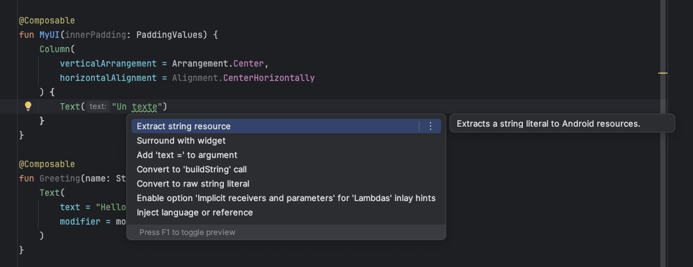

---

## Les images

- `res/drawable/`
- Un nom sans espace, sans accent, sans caractère spéciaux.
- Importable directement dans le code (`R.drawable.nom_image`).

---

## Ajoutons le logo de l'ESEO :

```kotlin
Image(
    painter = painterResource(R.drawable.nom_image),
    contentDescription = "Une image",
    modifier = Modifier.size(128.dp)
)
```

Placer l'image dans le dossier `res/drawable/`. Puis ajouter le au-dessus de votre `Text` qui est actuellement au centre de votre `Column`.

---

## Et maintenant ?

---

## Le fichier Manifest

- Déclare le nom de l'application.
- Déclare les activités.
- Déclare le thème de l'application.
- L'icône de l'application.
- Configuration de l'application (package…).
- Déclare les permissions.

---

## « Exemple » contenu d'un Manifest

```xml
<?xml version="1.0" encoding="utf-8"?>
<manifest xmlns:android="http://schemas.android.com/apk/res/android"
    package="com.playmoweb.demo.dmocourseseo">

    <!-- Nouvelles permissions permettant de scanner en BLE Android après 11 -->    
    <uses-permission android:name="android.permission.BLUETOOTH_SCAN"
        android:usesPermissionFlags="neverForLocation"
        tools:targetApi="s" />
    <uses-permission android:name="android.permission.BLUETOOTH_CONNECT" />

    <!-- Ancienne permission pour permettre l'usage du BLE  Android avant 11 inclus -->
    <uses-permission android:name="android.permission.BLUETOOTH" />
    <uses-permission android:name="android.permission.BLUETOOTH_ADMIN" />

    <uses-permission android:name="android.permission.ACCESS_COARSE_LOCATION" />
    <uses-permission android:name="android.permission.ACCESS_FINE_LOCATION" />

    <application
        android:allowBackup="true"
        android:icon="@mipmap/ic_launcher"
        android:label="@string/app_name"
        android:roundIcon="@mipmap/ic_launcher_round"
        android:supportsRtl="true"
        android:theme="@style/AppTheme">

        <activity android:name=".MainActivity">
            <intent-filter>
                <action android:name="android.intent.action.MAIN" />
                <category android:name="android.intent.category.LAUNCHER" />
            </intent-filter>
        </activity>

    </application>

</manifest>
```

---

## Le dossier `res` en détail

- **drawable** : Vos images (png, xml, 9.png…) (`R.drawable.…`)
- **layout** : Vos interfaces un fichier par vue (`R.layout.…`)
- **menu** : Contenu de vos menus (Options Menu, Sub Menu…)
- **values** : « Constantes » de votre application (String, Int, Color, etc.)
- **mipmap** : Icônes de votre application.

---

## Le dossier `res` en détail 2

### AKA les ressources alternative

Chaque dossier peut être redéfini en fonction de la résolution. (`-hdpi`, `-mdpi`, `-xxhdpi`…)

---

## Dingue, non ?

- Vous connaissez un équivalent dans d'autre environnement ?

---

## Mais ce n’est pas tout !

Chaque dossier peut être redéfini en fonction… De la langue (`values-fr/strings.xml`), de la configuration du « mobile », du thème sombre…

---


---


---


---

Pratiquons ensemble les ressources alternatives. En testant de dynamiser nos textes sans modifier le code.

---

## Afficher un message à l'utilisateur

Plusieurs solutions (Toast, Snackbar, Dialog)

---

### Les toasts


---

## C'est à vous

Ajouter un Toast dans votre interface

```kotlin
// Récupération du context
val context = LocalContext.current

Toast.makeText(context, "Je suis un Toast", Toast.LENGTH_LONG).show();
```

⚠️ Avec la complétion d'Android Studio.

---

### Context ?

Le contexte est l'environnement dans lequel votre application s'exécute. Il permet d'accéder aux ressources, aux services et aux informations sur l'application.

C'est un objet important dans Android, car il est utilisé pour accéder à de nombreuses fonctionnalités de l'application.

---

### Les Snackbars

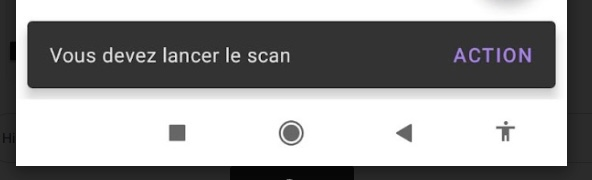


---

[https://developer.android.com/develop/ui/compose/components/snackbar]

---

### Vous souhaitez changer la durée d'affichage ?

#### Plusieurs options s'offrent à vous :

- `Snackbar.LENGTH_SHORT`
- `Snackbar.LENGTH_LONG`
- `Snackbar.LENGTH_INDEFINITE`

---

## 6. Les interactions

---

## Avant de continuer…

### Les callbacks avec Kotlin

---

Un callback est une fonction qui est passée en paramètre d'une autre fonction.

---

## Exemple en Kotlin

```kotlin
fun doSomething(callback: () -> Unit) {
    callback()
}
```

---

Fonctionne dans le code, mais également dans vos composants Compose.

---

```kotlin
@Composable
fun MyRedButton(onClick: () -> Unit) {
    Button(onClick = onClick, colors = ButtonDefaults.buttonColors(backgroundColor = Color.Red)) {
        Text("Cliquez ici")
    }
}
```

---

## Très simple avec compose

- `onClick` : Clic sur un composant de type `Button`.
- `Modifier.clickable` : Clic sur tous les composants.

---

## Exemple

```kotlin
Button(onClick = { /* Action */ }) {
    Text("Cliquez ici")
}
```

L'action est déclenchée lors du clic sur le bouton. Simple, non ?

---

Si vous souhaitez par exemple afficher un Toast lors du clic sur un bouton :

```kotlin
val context = LocalContext.current

Button(onClick = {
    Toast.makeText(context, "Clic sur le bouton", Toast.LENGTH_LONG).show()
}) {
    Text("Cliquez ici")
}
```

---

Où sur une `Image` :

```kotlin
val context = LocalContext.current

Image(
    painter = painterResource(R.drawable.nom_image),
    contentDescription = "Une image",
    modifier = Modifier.size(128.dp).clickable {
        Toast.makeText(context, "Clic sur l'image", Toast.LENGTH_LONG).show()
    }
)
```

---

## C'est à vous

Ajouter une interaction sur votre bouton pour afficher un Toast.

---

[Voir dans le support](/tp/android/android-base-tp.html#rendre-un-element-clickable-2)

---

### Les Dialog

Interaction « complexe » avec l'utilisateur (Choix…)


---

```kotlin
val context = LocalContext.current

AlertDialog(
    onDismissRequest = { /* Action */ },
    title = { Text("Titre") },
    text = { Text("Contenu") },
    confirmButton = {
        Button(
            onClick = {
                Toast.makeText(context, "Clic sur le bouton", Toast.LENGTH_LONG).show()
            }
        ) {
            Text("Confirmer")
        }
    },
    dismissButton = {
        Button(
            onClick = {
                Toast.makeText(context, "Clic sur le bouton", Toast.LENGTH_LONG).show()
            }
        ) {
            Text("Annuler")
        }
    }
)
```

---

## C'est à vous, je vous laisse ajouter un Dialog

---

Ok mais… mais comment « déclencher » ce Dialog ?

---

## En compose, il faut penser Code et État

---

```kotlin
var showDialog by remember { mutableStateOf(false) }

if (showDialog) {
    // Afficher le Dialog
}

Button(onClick = { showDialog = true }) {
    Text("Afficher le Dialog")
}
```

---

showDialog est un état qui permet de savoir si le Dialog doit être affiché ou non. Il est **mutable**, car il peut changer.

---

## On s'arrête un instant…

### Ça fait beaucoup là non ?

---

## Material ?

Ensemble « de règles » / de bonne pratique pour avoir des interfaces de qualités _ou_ cohérentes.

---

## Créer une Dialog avec la proposition de Google

[La documentation](https://material.io/develop/android/components/dialogs)

---

## Créer plusieurs « Pages »

Principe du Router en Web.

---

```kotlin
val navController = rememberNavController()

NavHost(
    modifier = Modifier.padding(innerPadding),
    navController = navController,
    startDestination = "screen1"
) {
    // Une page simple sans paramètre
    composable("screen1") { Screen1(goToScreen2 = { name -> navController.navigate("screen2/$name") }) }

    // Une page avec un paramètre (ici un nom)
    composable(
        route = "screen2/{name}",
        arguments = listOf(navArgument("name") { type = NavType.StringType })
    ) { backStackEntry -> Screen2(
            name = backStackEntry.arguments?.getString("name") ?: "",
            goBack = { navController.popBackStack() }
        )
    }
}
```

---

## Ajouter la dépendance dans le `build.gradle`

```groovy
implementation("androidx.navigation:navigation-compose:2.7.7")
```

⚠️ N'oubliez pas de `Sync` votre projet.

---

## Exemple de page simple

```kotlin
@Composable
fun Screen1(goToScreen2: (String) -> Unit) {
    Column {
        Button(onClick = { goToScreen2("Valentin") }) {
            Text("Bonjour Valentin")
        }
    }
}
```

---

## Exemple de page avec paramètre

```kotlin
@Composable
fun Screen2(name: String, goBack: () -> Unit) {
    Column {
        Text("Bonjour $name")
        Button(onClick = { goBack() }) {
            Text("Retour")
        }
    }
}
```

---

- Où ranger ces pages ?
- Où mettre le Router ?

---

## C'est à vous

- Faire évoluer votre code pour y ajouter un Router.
- Découper votre code en :
  - `ui/` : Les pages.
    - `home.kt` : La page d'accueil, logo + deux boutons.
    - `screen1.kt` : La première page.
    - `screen2.kt` : La seconde page.

Screen 2 doit afficher le nom passé en paramètre.

---

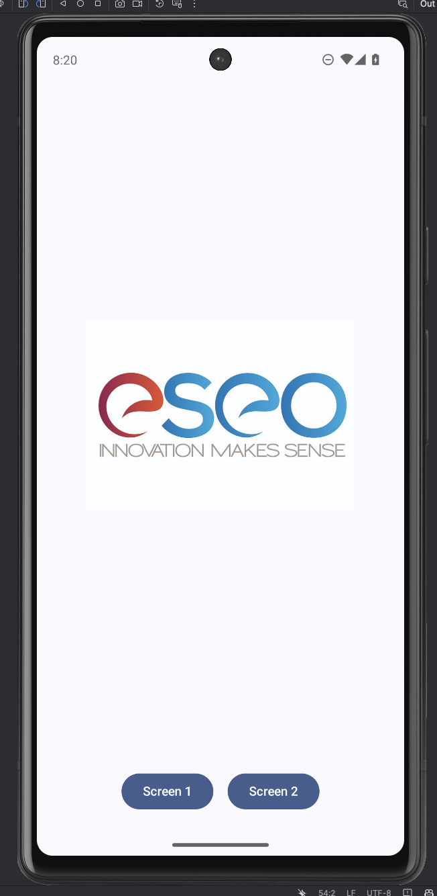

---

## Point dossier

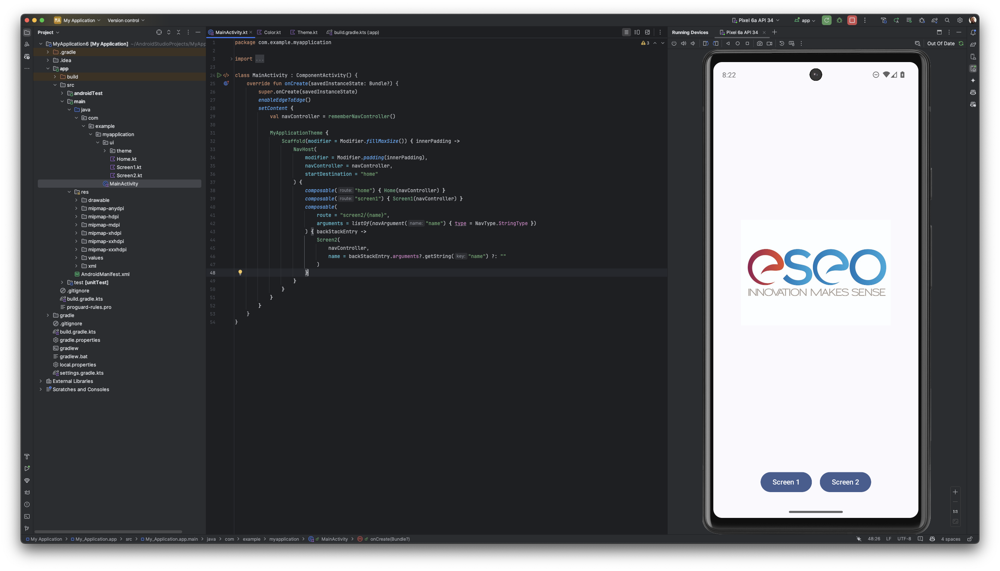

---

## Testons ensemble

- Rendre dynamique le nom saisi dans la le Screen 1.
- À votre avis, comment faire ? Quelle ressource utiliser ?

---

Voir le support de cours

---

## 7. Structure

---

## Le scaffold

---

Le Scaffold est un composant qui permet de créer une structure de base pour votre application (barre de navigation, etc.).

---

```kotlin
Scaffold(
        topBar = {
            TopAppBar(
                title = { Text("Ma liste") },
                navigationIcon = {
                    IconButton(onClick = { navController.popBackStack() }) {
                        Icon(
                            imageVector = Icons.AutoMirrored.Filled.ArrowBack,
                            contentDescription = "Back"
                        )
                    }
                })

        }
    ) { innerPadding ->
        Column(modifier = Modifier.padding(innerPadding)) {
            // Contenu de la page
        }
    }
```

---

## C'est à vous

Mettre en place un Scaffold dans votre `Screen1` et `Screen2`.

---

## 8. Les données

---

« Jouons » avec les données…

---

## Recomposition

---

Il faut comprendre ici que notre vue sera « **recomposée** » à chaque fois que nous allons mettre à jours nos données.

---


---

[En savoir plus sur la recomposition](https://developer.android.com/jetpack/compose/lifecycle?hl=fr)

---

## Où allons-nous ranger l'accès aux données ?

---

- Dans la vue ?
- Dans le composant ?
- Dans un ViewModel ?

---

## Le ViewModel

- Un composant de l'architecture Jetpack.
- Stocke et gère les données.
- Survis aux changements de configuration.
- Ne contiens pas de référence à la vue.

---

## Un exemple

```kotlin
class Screen3ViewModel : ViewModel() {
    // Liste de String.
    // MutableStateFlow est un Flow qui peut être modifié.
    val listFlow = MutableStateFlow(listOf<String>())

    // Ajouter un élément
    fun addElement(element: String) {
        listFlow.value += element
    }

    // Supprimer un élément
    fun removeElement(element: String) {
        listFlow.value -= element
    }

    // Vider la liste
    fun clearList() {
        listFlow.value = emptyList()
    }
}
```

---

## Exemple d'utilisation

```kotlin
@Composable
fun Screen3(
    navController: NavController,
    name: String,
    viewModel: Screen2ViewModel = viewModel()
) {
    // Liste dynamique de String
    val list by viewModel.listFlow.collectAsStateWithLifecycle()

    Column {
        Text("Bonjour $name")
        Button(onClick = { viewModel.addElement("Un élément") }) {
            Text("Ajouter un élément")
        }

        Spacer(modifier = Modifier.weight(1f))

        LazyColumn(modifier = Modifier.fillMaxSize()) {
            items(list) { item ->
                Text(item)
            }
        }
    }
}
```

---

<iframe width="560" height="315" src="https://www.youtube-nocookie.com/embed/ai1NUBL0gRs?si=Ldr1g2OIqPyMoPWX" title="YouTube video player" frameborder="0" allow="accelerometer; autoplay; clipboard-write; encrypted-media; gyroscope; picture-in-picture; web-share" referrerpolicy="strict-origin-when-cross-origin" allowfullscreen></iframe>

---

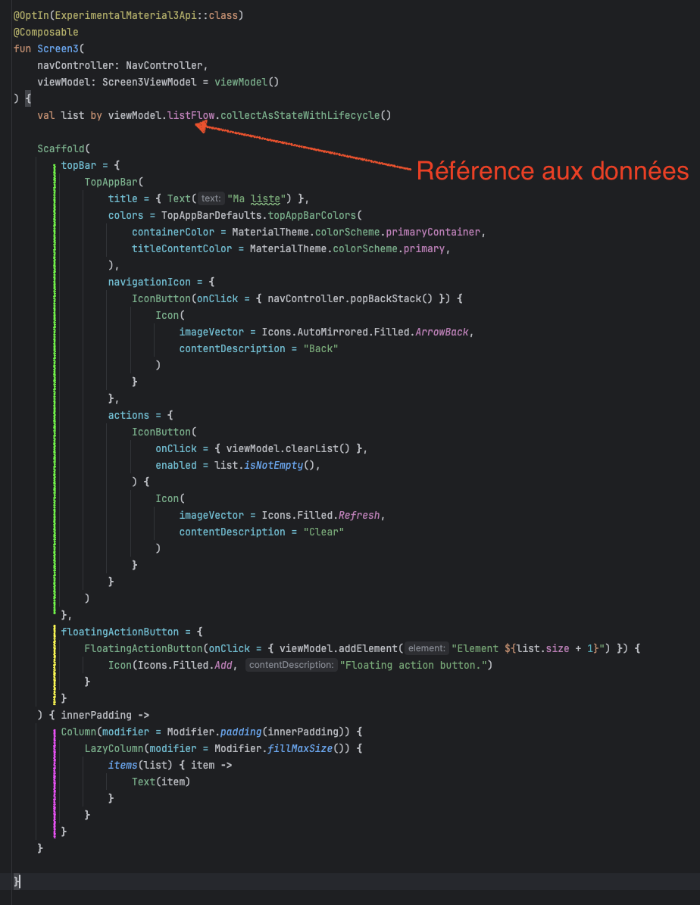

---

## Les flow

- Un `Flow` est un flux de données asynchrone.
- Il peut être modifié.
- Il peut être observé.

---

```kotlin
// Dans le ViewModel
val listFlow = MutableStateFlow(listOf<String>())
listFlow.value += "Un élément"
// Ou
val intFlow = MutableStateFlow(0)
intFlow.value += 1

// Dans le composant
val list by viewModel.listFlow.collectAsStateWithLifecycle()
```

- Le flow est mis à jour dans le ViewModel via le `.value = …`.
- Dans le composant, nous allons observer le flow avec un `collectAsStateWithLifecycle`.

---

## C'est à vous

- Créer un ViewModel pour votre `Screen3`.
- Implémenter l'ajout et la suppression d'élément dans votre liste.
  - Comment faire pour déclencher la suppression ?
- Afficher la liste dans votre `Screen3`.

---

## 9. Découper

---

## Plus simplement pour commencer…

### Au minimum quelques packages

---

Android c'est très ouvert… Il faut s'imposer une organisation.

---

## Quelques packages

- `ui/` (pour l'interface)
- `data/` (pour les données)
- `remote/` (pour la partie accès au API http)

---

Bien évidemment c'est un exemple

(Vous pouvez faire autrement…)

---

### Zoom sur le package ui

- Organisation par « vue » / « écran ».
- On regroupe les fonctionnalités par « vue » (exemple les `Adapters`)

---

### C'est à vous

Vérifier l'organisation de votre projet initial.

---

## Pourquoi est-ce important

- Partage de code
- Reprise du code
- Maintenance
- …

---

## 9. Découper plus finement

Maintenant que nous avons une organisation, nous allons découper plus finement.

---

Plutôt qu'une simple liste de String, nous allons créer un élément de liste que nous allons répéter.

---

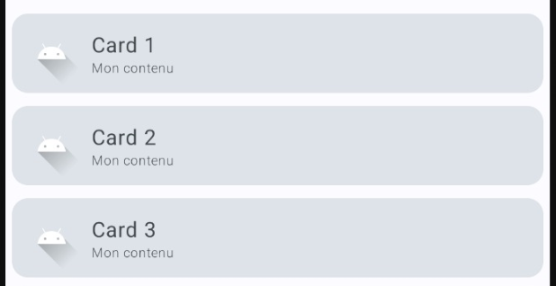

---

- Nous avons un `Card` qui contient un Titre, un Sous-Titre et une icône.
- Le `Card` est répété pour chaque élément de la liste.
- Vous ne le voyez pas, mais le `Card` est cliquable.

---

## À ranger dans

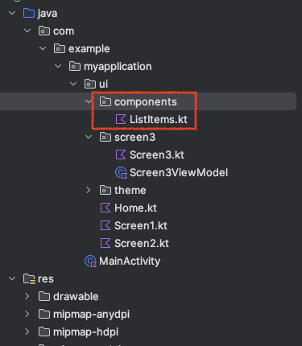

---

```kotlin
@Composable
fun ElementList(
    title: String = "Mon titre",
    content: String = "Mon contenu",
    image: Int? = R.drawable.ic_launcher_foreground,
    onClick: () -> Unit = {}
) {
    Card(modifier = Modifier.fillMaxWidth().padding(5.dp), onClick = onClick) {
        Row(modifier = Modifier.padding(5.dp), verticalAlignment = Alignment.CenterVertically) {
            image?.let {
                Image(modifier = Modifier.height(50.dp), painter = painterResource(id = it), contentDescription = content)
            }

            Column() {
                Text(text = title)
                Text(text = content, fontWeight = FontWeight.Light, fontSize = 10.sp)
            }
        }
    }
}
```

---

## C'est à vous

- Créer un composant `ElementList`.
- Utiliser ce composant dans votre `Screen3`.

---

<iframe width="560" height="315" src="https://www.youtube-nocookie.com/embed/y5himtvZQFQ?si=Ldr1g2OIqPyMoPWX" title="YouTube video player" frameborder="0" allow="accelerometer; autoplay; clipboard-write; encrypted-media; gyroscope; picture-in-picture; web-share" referrerpolicy="strict-origin-when-cross-origin" allowfullscreen></iframe>

---

## C'est à vous : Suite

- Ajouter une confirmation avec un Dialog (ou une snackbar) lors de la suppression d'un élément.

---

## Petit défi

Nous allons créer un composant `MyScaffold` qui va nous permettre de créer un Scaffold avec une barre de navigation et un contenu.

---

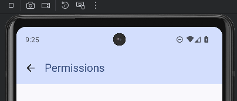

---

Créer un composant générique qui contient un Scaffold avec une barre de navigation et un contenu.

(Voir support)

---

## Bon et les permissions ?

---

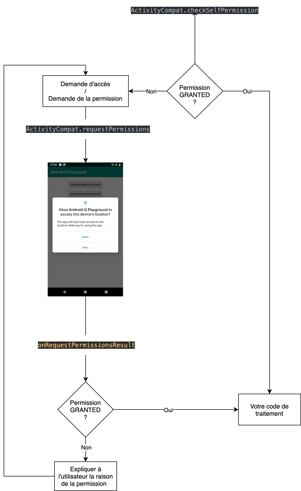

---

## Point clé de la plateforme

---

- Les permissions sont nécessaires pour accéder à certaines fonctionnalités.
- Elles sont demandées à l'utilisateur au moment de l'utilisation.
- Elles peuvent être refusées.
- Elles peuvent être retirées.

---

## Et pour le Bluetooth ?

---

- `BLUETOOTH` : Permet d'activer le Bluetooth.
- `BLUETOOTH_ADMIN` : Permet de gérer le Bluetooth.
- `ACCESS_COARSE_LOCATION` : Permet d'accéder à la localisation approximative.
- `ACCESS_FINE_LOCATION` : Permet d'accéder à la localisation précise.
- `BLUETOOTH_SCAN` : Permet de scanner en BLE.
- `BLUETOOTH_CONNECT` : Permet de se connecter en BLE.

---

À votre avis, pourquoi ces permissions sont-elles nécessaires ?

---

- Basé sur un système d'état (granted, denied, etc.)
- Utilise `Accompanist` pour les demandes de permissions.

---

La suite dans le support…

---

## Sauvegarder des paramètres

- SharedPreferences
- SQLite (via `Room` par exemple)

---

## SharedPreferences

- Simple
- Type natif **exclusivement** _(`int`, `string`, …)_
- Persistant
- Supprimé à chaque réinstallation

---

```kotlin
// Création d'un SharedPreferences
val sharedPreferences = context.getSharedPreferences("my_preferences", Context.MODE_PRIVATE)

sharedPreferences.edit().putString("key", "value").apply() // Enregistrer une valeur
val value = sharedPreferences.getString("key", "default_value") // Récupérer une valeur
```

---

Des questions ?

---
