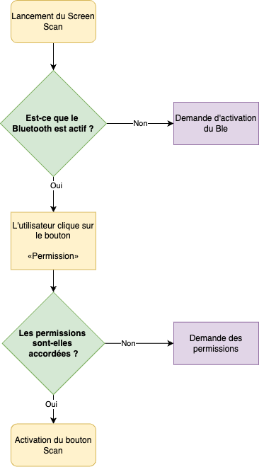
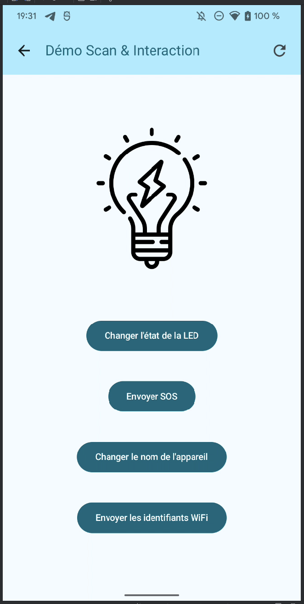
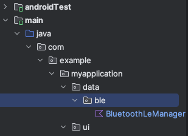
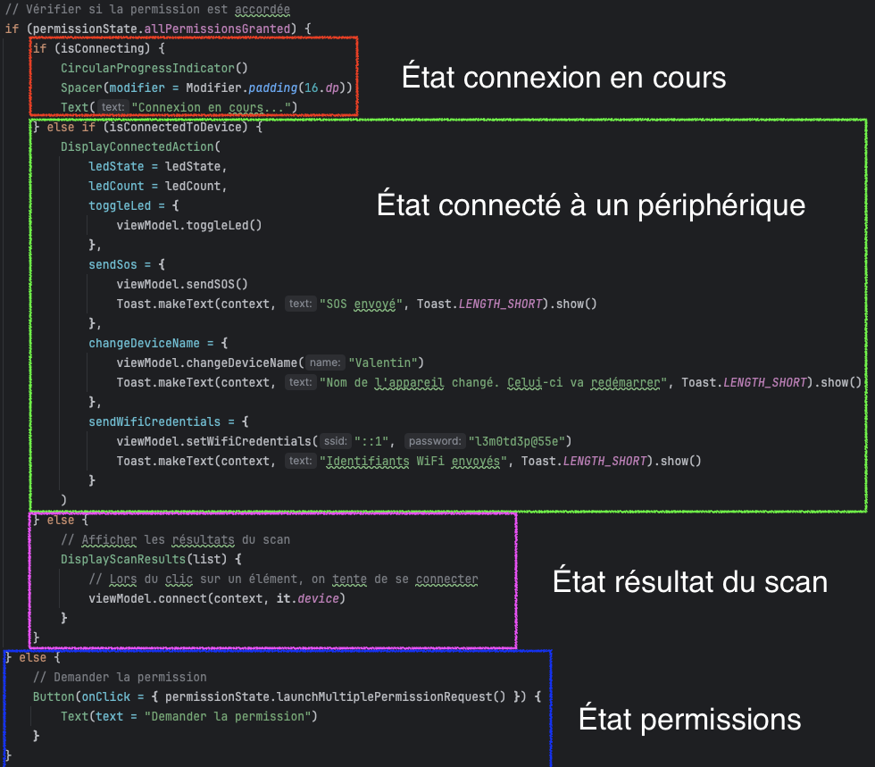

# Android + BLE

Par [Valentin Brosseau](https://github.com/c4software) / [Playmoweb](https://www.playmoweb.com)

---

Avant de rentrer dans le détail, que fait notre objet ?


---

**en BLE :**

- Toggle de la LED.
- Comptage du nombre d’allumages.
- Changement du nom de la carte (persistant).
- Notification lors de l’allumage / extinction de la LED.
- Liste des réseaux Wifi environnants.
- Définition des credentials Wifi (persistant).

---

**En HTTP :**

- Allumage et extinction de la LED (toggle).
- Récupération du statut.

---

**En Physique :**

- Utilisation du bouton pour allumer et éteindre la LED.

---

<center>
<iframe width="560" height="315" src="https://www.youtube-nocookie.com/embed/LQsL3jDOc7o?si=6ceKFVKceKS3GlwU" title="YouTube video player" frameborder="0" allow="accelerometer; autoplay; clipboard-write; encrypted-media; gyroscope; picture-in-picture; web-share" referrerpolicy="strict-origin-when-cross-origin" allowfullscreen></iframe>
</center>

---

<center>
<iframe width="560" height="315" src="https://www.youtube-nocookie.com/embed/W9N-JtwWSzE?si=6ceKFVKceKS3GlwU" title="YouTube video player" frameborder="0" allow="accelerometer; autoplay; clipboard-write; encrypted-media; gyroscope; picture-in-picture; web-share" referrerpolicy="strict-origin-when-cross-origin" allowfullscreen></iframe>
</center>

---

## Rappel sur le BLE

- Un serveur (périphérique)
- Des client (mobile, tablette, ordinateur, …)

---

- Des Services
- Des Characteristics

---

## Découvrons l'objet !

Avec l'application « nRF Connect »

---

## Le Bluetooth et Android

- Les permissions (Manifest + Code)
- Différent en fonction d'Android ( > Lolipop et Kotlin )

---

## Sur Android

### L'implémentation évolue **beaucoup**. Il est important de suivre les dernières recommandations. Sous peine d'avoir des comportements inattendus.

---

## Deux solutions

- Le coder.
- Utiliser une librairie.

---

## La librairie

- Plus simple (beaucoup moins de question à se poser, version, permissions… )

---

## La librairie (suite)

- [Android-Ble-Librairie](https://github.com/NordicSemiconductor/Android-BLE-Library)
- Proposé par … Nordic.
- Assez mal-docummentée.
- Très rapide « simple d'utilisation ».
- Un entredeux « Code / Librairie ».

---

## La version code

- Vérifier si le BLE est disponible
- Demander les permissions (Manifest + Code)
- Filtrer les résultats (ou pas)
- Démarrer le Scan
- Connexion au `BluetoothDevice`
- Lire / Ecrire des données

---

## Un système à état

---



---

## Avant propos, nous allons co-réfléchir sur le projet

### Je vous propose du code

### Vous allez devoir l'implémenter

---

## Les permissions

- Localisation ?
- Est-ce que le Bluetooth est actif ?
- Le Manifest

---

## Les permissions : Le manifest

```xml
<!-- Permissions pour le BLE Android 12 et plus -->
    <uses-permission android:name="android.permission.BLUETOOTH_SCAN"
        android:usesPermissionFlags="neverForLocation"
        tools:targetApi="s" />
    <uses-permission android:name="android.permission.BLUETOOTH_CONNECT" />

    <!-- Ancienne permission pour permettre l'usage du BLE  Android avant 11 inclus -->
    <uses-permission android:name="android.permission.BLUETOOTH" />
    <uses-permission android:name="android.permission.BLUETOOTH_ADMIN" />

    <uses-permission android:name="android.permission.ACCESS_COARSE_LOCATION" />
    <uses-permission android:name="android.permission.ACCESS_FINE_LOCATION" />
```

---

## La vue scan

- Un nouveau screen à créer
- Un ViewModel associé

---

<center>
<iframe width="560" height="315" src="https://www.youtube-nocookie.com/embed/XzDb5gaF2zI?si=6ceKFVKceKS3GlwU" title="YouTube video player" frameborder="0" allow="accelerometer; autoplay; clipboard-write; encrypted-media; gyroscope; picture-in-picture; web-share" referrerpolicy="strict-origin-when-cross-origin" allowfullscreen></iframe>
</center>

---

## C'est à vous

- Créer une nouvelle « Screen ».
- Créer un nouveau ViewModel.
  - Cette vue doit afficher une « liste », je vous laisse préparer le code pour afficher une liste.
  - Nous allons utiliser le pattern MVVM.

---

## Les permissions

---

```kotlin
// Partie 1: Demander la permission
// En fonction de la version d'Android, on demande des permissions différentes
// Pour Android 12, on demande les permissions BLUETOOTH_CONNECT et BLUETOOTH_SCAN (qui sont moins agréssives pour l'utilisateur)
// Pour les autres versions, on demande la permission ACCESS_FINE_LOCATION (Souvent non comprise par l'utilisateur)
val toCheckPermissions = if (Build.VERSION.SDK_INT < Build.VERSION_CODES.S) {
    listOf(android.Manifest.permission.ACCESS_FINE_LOCATION)
} else {
    listOf(android.Manifest.permission.BLUETOOTH_CONNECT, android.Manifest.permission.BLUETOOTH_SCAN)
}

// État de la demande de permission (granted, denied, shouldShowRationale)
val permissionState = rememberMultiplePermissionsState(toCheckPermissions)

 // Vérifier si la permission est accordée
if (permissionState.allPermissionsGranted) {
    // La permission est accordée
    // Nous sommes prêt à scanner
} else {
    // La permission n'est pas accordée
    // Nous devons demander la permission
    Button(onClick = { permissionState.launchMultiplePermissionRequest() }) {
        Text(text = "Demander la permission")
    }
}
```

---

## C'est à vous ! Je vous laisse implémenter la demande de permission

---

## Vérifier si le Bluetooth est actif

---

## Composant de vérification

```kotlin
@Composable
fun checkBluetoothEnabled(context: Context, notAvailable: () -> Unit = {}) {
    val bluetoothManager: BluetoothManager? = remember {
        context.getSystemService(Context.BLUETOOTH_SERVICE) as BluetoothManager?
    }
    val bluetoothAdapter: BluetoothAdapter? = bluetoothManager?.adapter
    val enableBluetoothLauncher = rememberLauncherForActivityResult(contract = ActivityResultContracts.StartActivityForResult()) {}
    LaunchedEffect(bluetoothAdapter) {
        when {
            bluetoothAdapter == null -> { notAvailable() }
            !bluetoothAdapter.isEnabled -> {
                // Demander l'activation du Bluetooth
                val enableBtIntent = Intent(BluetoothAdapter.ACTION_REQUEST_ENABLE)
                enableBluetoothLauncher.launch(enableBtIntent)
            }
        }
    }
}
```

---

### Utilisation du composant de vérification

```kotlin
// Vérification si le Bluetooth est activé
checkBluetoothEnabled(context) {
    // Le Bluetooth n'est pas disponible
    Toast.makeText(context, "Le Bluetooth n'est pas disponible", android.widget.Toast.LENGTH_SHORT).show()
    navController.popBackStack()
}
```

À votre avis, que fait ce code ? Où doit-il être placé ?

---

## C'est à vous, je vous laisse implémenter la partie demande d'activation du Bluetooth

---

## Exemple de Layout (à adapter)


---

## Le Scan

Réparti entre le ViewModel et la Vue.

---

- La vue doit afficher la liste des périphériques.
- Le ViewModel doit gérer le scan (méthode asynchrone).

---

## Le ViewModel : Les variables de scan

```kotlin
// Le processus de scan
private var scanJob: Job? = null

// Durée du scan
private val scanDuration = 10000L

/**
    * Le scanner bluetooth
    */
private val scanFilters: List<ScanFilter> = listOf(
    // À décommenter pour filtrer les périphériques
    // ScanFilter.Builder().setServiceUuid(ParcelUuid(BluetoothLEManager.DEVICE_UUID)).build()
)
private val scanSettings = ScanSettings.Builder().setScanMode(ScanSettings.SCAN_MODE_LOW_LATENCY).build()
private val scanResultsSet = mutableMapOf<String, ScanResult>()
```

---

## Le ViewModel : La méthode de scan

```kotlin
@SuppressLint("MissingPermission")
fun startScan(context: Context) {
    // Récupération du scanner BLE
    val bluetoothLeScanner = (context.getSystemService(BLUETOOTH_SERVICE) as BluetoothManager).adapter.bluetoothLeScanner

    // Si nous sommes déjà en train de scanner, on ne fait rien
    if (isScanningFlow.value) return

    // Définition du processus de scan (Coroutine)
    // Une coroutine est un moyen de gérer des tâches asynchrones de manière plus simple et plus lisible
    scanJob = CoroutineScope(Dispatchers.IO).launch {
        // On indique que nous sommes en train de scanner
        isScanningFlow.value = true

        // Objet qui sera appelé à chaque résultat de scan
        val scanCallback = object : ScanCallback() {
            /**
                * Le callback appelé à chaque résultat de scan (nouvel appareil trouvé)
                * Il n'est pas dédoublonné, c'est à nous de le faire (il peut être appelé plusieurs fois pour le même appareil)
                */
            override fun onScanResult(callbackType: Int, result: ScanResult) {
                super.onScanResult(callbackType, result)
                // On ajoute le résultat dans le set, si il n'y est pas déjà
                // L'ajout retourne null si l'élément n'était pas déjà présent
                if (scanResultsSet.put(result.device.address, result) == null) {
                    // On envoie la nouvelle liste des appareils scannés
                    scanItemsFlow.value = scanResultsSet.values.toList()
                }
            }
        }

        // On lance le scan BLE a la souscription de scanFlow
        bluetoothLeScanner.startScan(scanFilters, scanSettings, scanCallback)

        // On attend la durée du scan (10 secondes)
        delay(scanDuration)

        // Lorsque scanFlow est stoppé, on stop le scan BLE
        bluetoothLeScanner.stopScan(scanCallback)

        // On indique que nous ne sommes plus en train de scanner
        isScanningFlow.value = false
    }
}

fun stopScan() {
    scanJob?.cancel()
    isScanningFlow.value = false
}
```

---

## Vous avez remarqué ?

- La méthode `startScan` est une méthode asynchrone.
- Elle utilise une coroutine pour gérer le scan.
- Elle utilise un `Flow` pour envoyer les résultats de scan.

---

## En parlant de Flow

```kotlin
// La liste des appareils scannés autour
val scanItemsFlow = MutableStateFlow<List<ScanResult>>(emptyList())

// Boolean permettant de savoir si nous sommes en train de scanner
val isScanningFlow = MutableStateFlow(false)
```

---

## C'est à vous, je vous laisse implémenter la partie scan

Rappel : Écouter les variables du ViewModel dans la Vue.

```kotlin
val list by viewModel.scanItemsFlow.collectAsStateWithLifecycle()
val isScanning by viewModel.isScanningFlow.collectAsStateWithLifecycle()
```

---

## Connexion à un périphérique

---

- Action de connexion déclenchée par l'utilisateur. (Clic sur un élément de la liste)
- Affichage d'un loader pendant la connexion.
- L'écran liste est remplacé par un nouveau composant d'action

---



---

Qu'allons-nous faire ?

- Modifier le ViewModel pour ajouter de nouvelles variables d'état.
- Écouter les variables côté Vue.

---

```kotlin
// Flow permettant de savoir si nous sommes en train de nous connecter
val isConnectingFlow = MutableStateFlow(false)

// Flow permettant de savoir si un appareil est connecté
val isConnectedToDeviceFlow = MutableStateFlow(false)
```

---

## Le code de la connexion

```kotlin
@SuppressLint("MissingPermission")
fun connect(context: Context, bluetoothDevice: BluetoothDevice) {
    // On arrête le scan si il est en cours
    stopScan()

    // On indique que nous sommes en train de nous connecter (pour afficher un loader par exemple)
    isConnectingFlow.value = true

    // On tente de se connecter à l'appareil
    // On utilise le GattCallback pour gérer les événements BLE (connexion, déconnexion, notifications).
    currentBluetoothGatt = bluetoothDevice.connectGatt(
        context,
        false,
        BluetoothLEManager.GattCallback(
            // La connexion a réussi (onServicesDiscovered)
            onConnect = {
                isConnectedToDeviceFlow.value = true
                isConnectingFlow.value = false
                // On active les notifications pour recevoir les événements de la LED et du compteur
                // enableNotify()
            },

            // Nouvelle valeur reçue sur une caractéristique de type notification
            onNotify = { characteristic, value ->
                when (characteristic.uuid) {
                    BluetoothLEManager.CHARACTERISTIC_NOTIFY_STATE -> connectedDeviceLedStateFlow.value = value == "1"
                    BluetoothLEManager.CHARACTERISTIC_GET_COUNT -> ledCountFlow.value = value.toInt()
                }
            },

            // L'ESP32 s'est déconnecté (BluetoothGatt.STATE_DISCONNECTED)
            onDisconnect = {
                isConnectedToDeviceFlow.value = false
            }
        ))
}
```

---

## Avez vous remarqué ?

- La méthode `connect` est une méthode asynchrone.
- Elle repose sur un `GattCallback` pour gérer les événements BLE.
- Elle utilise des `Flow` pour envoyer les informations à la Vue.

---

## BluetoothLEManager

- Code générique pour gérer les états BLE.
- Contient les UUIDs des services et caractéristiques.
- Contient le `GattCallback` pour gérer les événements BLE.
- Écrit par moi-même pour simplifier le code.

---

Ce code est à ajouter dans un fichier `BluetoothLEManager.kt` dans un package `data.ble`



---

```kotlin
class BluetoothLEManager {

    companion object {
        var currentDevice: BluetoothDevice? = null

        /**
         * Les UUIDS sont des identifiants uniques qui permettent d'identifier les services et les caractéristiques.
         * Ces UUIDs sont définis dans le code de l'ESP32.
         */
        val DEVICE_UUID: UUID = UUID.fromString("795090c7-420d-4048-a24e-18e60180e23c")
        val CHARACTERISTIC_TOGGLE_LED_UUID: UUID = UUID.fromString("59b6bf7f-44de-4184-81bd-a0e3b30c919b")
        val CHARACTERISTIC_NOTIFY_STATE: UUID = UUID.fromString("d75167c8-e6f9-4f0b-b688-09d96e195f00")
        val CHARACTERISTIC_GET_COUNT: UUID = UUID.fromString("a877d87f-60bf-4ad5-ba61-56133b2cd9d4")
        val CHARACTERISTIC_GET_SET_WIFI: UUID = UUID.fromString("10f83060-64f8-11ee-8c99-0242ac120002")
        val CHARACTERISTIC_SET_DEVICE_NAME: UUID = UUID.fromString("1497b8a8-64f8-11ee-8c99-0242ac120002")
        val CHARACTERISTIC_UPDATE_NOTIFICATION_DESCRIPTOR_UUID: UUID = UUID.fromString("00002902-0000-1000-8000-00805f9b34fb")

    }

    /**
     * Définitionn de la classe GattCallback qui va nous permettre de gérer les différents événements BLE
     * Elle implémente la classe BluetoothGattCallback fournie par Android
     */
    open class GattCallback(
        val onConnect: () -> Unit,
        val onNotify: (characteristic: BluetoothGattCharacteristic, value: String) -> Unit,
        val onDisconnect: () -> Unit
    ) : BluetoothGattCallback() {

        /**
         * Méthode appelé au moment ou les « services » ont été découvert
         */
        override fun onServicesDiscovered(gatt: BluetoothGatt, status: Int) {
            super.onServicesDiscovered(gatt, status)
            if (status == BluetoothGatt.GATT_SUCCESS) {
                onConnect()
            } else {
                onDisconnect()
            }
        }

        /**
         * Méthode appelé au moment du changement d'état de la stack BLE
         */
        @SuppressLint("MissingPermission")
        override fun onConnectionStateChange(gatt: BluetoothGatt, status: Int, newState: Int) {
            super.onConnectionStateChange(gatt, status, newState)
            when (newState) {
                BluetoothGatt.STATE_CONNECTED -> gatt.discoverServices()
                BluetoothProfile.STATE_DISCONNECTED -> onDisconnect()
            }
        }

        /**
         * Méthode appelé lorsqu'une caractéristique a été modifiée
         * Dans les nouvelles versions d'Android, cette méthode est appelée
         */
        override fun onCharacteristicChanged(gatt: BluetoothGatt, characteristic: BluetoothGattCharacteristic, value: ByteArray) {
            super.onCharacteristicChanged(gatt, characteristic, value)
            onNotify(characteristic, value.toString(Charsets.UTF_8))
        }

        /**
         * Méthode appelé lorsqu'une caractéristique a été modifiée
         * Ancienne méthode utilisée sur les versions antérieures d'Android
         */
        override fun onCharacteristicChanged(gatt: BluetoothGatt, characteristic: BluetoothGattCharacteristic) {
            super.onCharacteristicChanged(gatt, characteristic)
            onNotify(characteristic, characteristic.value.toString(Charsets.UTF_8))
        }

        override fun onDescriptorWrite(gatt: BluetoothGatt?, descriptor: BluetoothGattDescriptor?, status: Int) {
            if (status == BluetoothGatt.GATT_SUCCESS) {
                Log.d("BLE", "Descriptor write successful for ${descriptor?.characteristic?.uuid}")
            } else {
                Log.e("BLE", "Descriptor write failed for ${descriptor?.characteristic?.uuid}, status: $status")
            }
        }
    }
}
```

---

## C'est à vous, je vous laisse implémenter la connexion

- Créer l'action de connexion dans la Vue.
- Écouter les variables du ViewModel.
- Créer un **Composant** pour afficher les actions.
- Gérer les différents états (scan, connexion, actions).
- Pour vous aider…

---



---

## Interagir avec le périphérique

---

- Envoi de commandes via les caractéristiques.
- Écoute des notifications (caractéristiques de type notification).

---

```kotlin
fun toggleLed() {
    writeCharacteristic(BluetoothLEManager.CHARACTERISTIC_TOGGLE_LED_UUID, "1")
}
```

⚠️ Méthode générique pour écrire dans une caractéristique. Elle s'applique à toutes les caractéristiques du projet.

---

```kotlin
@SuppressLint("MissingPermission")
private fun writeCharacteristic(uuid: UUID, value: String) {
    // Récupération du service principal (celui de l'ESP32)
    getMainService()?.let { service ->
        // Récupération de la caractéristique
        val characteristic = service.getCharacteristic(uuid)

        if (characteristic == null) {
            Log.e("BluetoothLEManager", "La caractéristique $uuid n'a pas été trouvée")
            return
        }

        Log.i("BluetoothLEManager", "Ecriture de la valeur $value dans la caractéristique $uuid")

        // En fonction de la version de l'OS, on utilise la méthode adaptée
        if (Build.VERSION.SDK_INT >= Build.VERSION_CODES.TIRAMISU) {
            // On écrit la valeur dans la caractéristique
            currentBluetoothGatt?.writeCharacteristic(characteristic, value.toByteArray(), BluetoothGattCharacteristic.WRITE_TYPE_DEFAULT)
        } else {
            // On écrit la valeur dans la caractéristique
            characteristic.setValue(value)
            currentBluetoothGatt?.writeCharacteristic(characteristic)

        }
    }
}
```

---

```kotlin
private fun getMainService(): BluetoothGattService? = currentBluetoothGatt?.getService(BluetoothLEManager.DEVICE_UUID)
```

---

```kotlin
@SuppressLint("MissingPermission")
private fun enableNotify() {
    getMainService()?.let { service ->
        // Indique que le GATT Client va écouter les notifications sur le charactérisque
        val notificationStatus = service.getCharacteristic(BluetoothLEManager.CHARACTERISTIC_NOTIFY_STATE)
        val notificationLedCount = service.getCharacteristic(BluetoothLEManager.CHARACTERISTIC_GET_COUNT)
        val wifiScan = service.getCharacteristic(BluetoothLEManager.CHARACTERISTIC_GET_SET_WIFI)

        listOf(notificationStatus, notificationLedCount, wifiScan).forEach { characteristic ->
            currentBluetoothGatt?.setCharacteristicNotification(characteristic, true)
            characteristic.getDescriptor(BluetoothLEManager.CHARACTERISTIC_UPDATE_NOTIFICATION_DESCRIPTOR_UUID)?.let {
                if (Build.VERSION.SDK_INT >= Build.VERSION_CODES.TIRAMISU) {
                    currentBluetoothGatt?.writeDescriptor(it, BluetoothGattDescriptor.ENABLE_NOTIFICATION_VALUE)
                } else {
                    it.value = BluetoothGattDescriptor.ENABLE_NOTIFICATION_VALUE
                    currentBluetoothGatt?.writeDescriptor(it)
                }
            }
        }
    }
}
```

---

## C'est à vous, je vous laisse implémenter l'action de toggle de la LED

---


---

## Recevoir l'état de la LED

---

- Fonctionne par notification.
- Est asynchrone.
- Utilise un `Flow`.

---

## Dans votre viewModel

```kotlin
// Flow permettant de savoir si la LED est allumée ou éteinte
val connectedDeviceLedStateFlow = MutableStateFlow(false)

// Sera mis à jour dans la méthode onNotify du GattCallback
// Si la valeur est "1", la LED est allumée, sinon elle est éteinte
// connectedDeviceLedStateFlow.value = value == "1"
```

---

## Dans votre Vue

```kotlin
val ledState by viewModel.connectedDeviceLedStateFlow.collectAsStateWithLifecycle()

// … ailleurs dans votre code
if(ledState) {
    // La LED est allumée
} else {
    // La LED est éteinte
}
```

---

## D'autres actions sont possibles (Wifi, Nom de la carte, …)

### Elles seront à implémenter de la même manière dans le projet final.

---

## Interagir avec Internet

---

## Android et le réseau

---

## La permission

- `<uses-permission android:name="android.permission.INTERNET"/>`

---

## Les appels réseau

---

### Mais avant…

## Les Threads

---

- Les appels ne doivent **pas** être fait dans le Thread UI.
- Le traitement de l'affichage doit être fait sur le Thread UI.

---


---

## Les librairies

- OkHttp
- GSON
- Retrofit
- CoRoutines Kotlin

---

## Les CoRoutines Kotlin

- Quelques explications…
- Asynchrone, vous connaissez ?
- Un mot magique… `suspend`

```txt
implementation 'org.jetbrains.kotlinx:kotlinx-coroutines-core:1.3.9'
implementation 'org.jetbrains.kotlinx:kotlinx-coroutines-android:1.3.8'
```

---

## OkHttp (3)

- RestClient
- Http2
- Gestion du cache
- Intercepteur de requête

---

```txt
implementation 'com.squareup.okhttp3:okhttp:4.7.2'
implementation 'com.squareup.okhttp3:logging-interceptor:4.7.2'
```

---

## GSON

- Sérialisation / Deserialisation automatique entre un JSON et un Objet Java / Kotlin

---

```txt
implementation 'com.squareup.retrofit2:converter-gson:2.9.0'
```

---

## Retrofit

- Une API Http qui s'utilise comme une « Interface Java ».
- Conversion de données (mapping automatique des objets 🚀).
- Utilise des annotations (@GET, @POST, @PUT, @DELETE, @HEAD, …)
- Compatible CoRoutine (mais également sans)

---

```txt
implementation 'com.squareup.okhttp3:okhttp:4.7.2'
implementation 'com.squareup.okhttp3:logging-interceptor:4.7.2'
```

---

## Les annotations

```kotlin
@GET("/status")
suspend fun readStatus(@Query("identifier") identifier: String): LedStatus

@POST("/status")
suspend fun writeStatus(@Body status: LedStatus): LedStatus
```

---

## Bon… Et maintenant !

---

## Deux fichiers

- Le `ApiService.kt` (l'interface et le builder pour la partie HTTP)
- La classe / un modèle `LedStatus`

---

## L'interface (et le builder)

### Deux méthodes

- ReadStatus
- WriteStatus

---

## L'objet de retour et d'action

`LedStatus`

---

## Le model : LedStatus

---

- Construit par vous pour interagir.
- Construit automatiquement par GSON pour avoir le Status.

---

[Télécharger le fichier LedStatus.java](https://gist.github.com/c4software/11c170fde7c1f93b0ae9e562856c56a8)
(À ranger dans le package `….data.modele`.

---

## Le ApiService

---

- Définition du « connecteur » HTTP.
- Définition des méthodes.

---

[Télécharge le fichier ApiService.kt](https://gist.github.com/c4software/b3eb79cc5649d12e497dbf6d35649dcd)
(À ranger dans le package `….data.service`)

---

BuildConfig.URI_REMOTE_SERVER ?

---

## Externaliser la conf c'est bien !


---

```txt
defaultConfig {
    buildConfigField "String", "URI_REMOTE_SERVER", "\"http://IP.DU.ESP\""
…
}
```

---

## C'est à vous

### Configurer votre projet

---

## Faire un appel réseau

---

### 1 - Obtenir l'APIService

```kotlin
ApiService.Builder.getInstance();
```

---

### 2 - L'appel réseau

```kotlin
CoroutineScope(Dispatchers.IO).launch {
    runCatching {
        val readStatus = ApiService.instance.readStatus(ledStatus.identifier)
        ledStatus.setStatus(readStatus.status)
        setVisualState()
    }
}
```

On en parle non ?

---

### 3 - Profit !

---

## C'est à vous !

- Création d'une nouvelle activity (`ActionActivity.kt`)
- Création du Layout `activity_action.xml`
- Implémentation des méthodes sur les boutons.

---

## ActionActivity

Ne pas oublier la méthode static !

```kotlin
companion object {
    private const val IDENTIFIANT_ID = "IDENTIFIANT_ID"

    fun getStartIntent(context: Context, identifiant: String?): Intent {
        return Intent(context, RemoteActivity::class.java).apply {
            putExtra(IDENTIFIANT_ID, identifiant)
        }
    }
}
```

⚠️ Utiliser la méthode depuis la `MainActivity.kt`

---

## Hey ?! Mais c'est pas le même non ?

Oui… On passe des paramètres… Parlons-en des paramètres justement…

---

## Récupérer le paramètre

```kotlin
private fun getIdentifiant(): String? {
    return intent.extras?.getString(IDENTIFIANT_ID, null)
}
```

---

## L'ActionActivity

### En quelques mots…

- Vous devez obtenir l'état de la led en arrivant dans la Vue.
- Vous devez modifier l'état de la led avec le bouton.
- Vous devez pouvoir obtenir l'état de la led aux cliques sur le symbole « refresh ».

---

## C'est à vous
