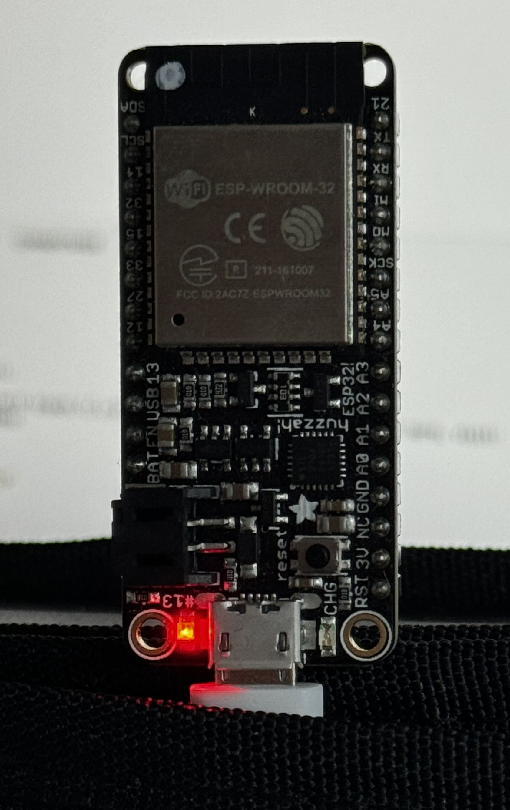
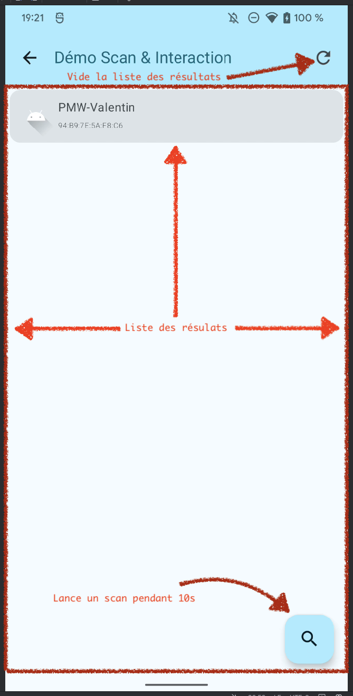

# Android + BLE

Par [Valentin Brosseau](https://github.com/c4software) / [Playmoweb](https://www.playmoweb.com)

---

Avant de rentrer dans le détail, que fait notre objet ?



---

**en BLE :**

- Toggle de la LED.
- Comptage du nombre d’allumages.
- Changement du nom de la carte (persistant).
- Notification lors de l’allumage / extinction de la LED.
- Liste des réseaux Wifi environnants.
- Définition des credentials Wifi (persistant).

---

**En HTTP :**

- Allumage et extinction de la LED (toggle).
- Récupération du statut.

---

**En Physique :**

- Utilisation du bouton pour allumer et éteindre la LED.

---

<center>
<iframe width="560" height="315" src="https://www.youtube-nocookie.com/embed/LQsL3jDOc7o?si=6ceKFVKceKS3GlwU" title="YouTube video player" frameborder="0" allow="accelerometer; autoplay; clipboard-write; encrypted-media; gyroscope; picture-in-picture; web-share" referrerpolicy="strict-origin-when-cross-origin" allowfullscreen></iframe>
</center>

---

<center>
<iframe width="560" height="315" src="https://www.youtube-nocookie.com/embed/W9N-JtwWSzE?si=6ceKFVKceKS3GlwU" title="YouTube video player" frameborder="0" allow="accelerometer; autoplay; clipboard-write; encrypted-media; gyroscope; picture-in-picture; web-share" referrerpolicy="strict-origin-when-cross-origin" allowfullscreen></iframe>
</center>

---

## Rappel sur le BLE

- Un serveur (périphérique)
- Des client (mobile, tablette, ordinateur, …)

---

- Des Services
- Des Characteristics

---

## Découvrons l'objet !

Avec l'application « nRF Connect »

---

## Le Bluetooth et Android

- Les permissions (Manifest + Code)
- Différent en fonction d'Android ( > Lolipop et Kotlin )

---

## Sur Android

### L'implémentation évolue **beaucoup**. Il est important de suivre les dernières recommandations. Sous peine d'avoir des comportements inattendus.

---

## Deux solutions

- Le coder.
- Utiliser une librairie.

---

## La librairie

- Plus simple (beaucoup moins de question à se poser, version, permissions… )

---

## La librairie (suite)

- [Android-Ble-Librairie](https://github.com/NordicSemiconductor/Android-BLE-Library)
- Proposé par … Nordic.
- Assez mal-docummentée.
- Très rapide « simple d'utilisation ».
- Un entredeux « Code / Librairie ».

---

## La version code

- Demander les permissions (Manifest + Code)
- Vérifier si le BLE est disponible
- Filtrer les résultats (ou pas)
- Démarrer le Scan
- Connexion au `BluetoothDevice`

---

## Les permissions

- Localisation ?
- Est-ce que le Bluetooth est actif ?
- Le Manifest

---

## Les permissions : Le manifest

```xml
<uses-feature android:name="android.hardware.bluetooth_le" android:required="true"/>
<uses-permission android:name="android.permission.INTERNET"/>
<uses-permission android:name="android.permission.BLUETOOTH"/>
<uses-permission android:name="android.permission.BLUETOOTH_ADMIN"/>
<uses-permission android:name="android.permission.ACCESS_FINE_LOCATION"/>
```

---

## La home

- Design du layout.
- Les contraintes :
  - Le bouton « actions » ne doit pas être actif si pas de périphérique sélectionné.
  - Afficher le logo du campus / école.

---

## Exemple


---

## Le scan

- Design du layout
- Contrainte
  - Avoir une liste (`RecyclerView`)

---

## C'est à vous

- Deux Activity :
  - Celle existante qui sera notre page de home.
  - Une nouvelle qui sera la page de scan.

---

## BLE

### Le Scan

---

## Vérifier si le BLE est disponible / compatible

```kotlin
private fun isLECompatible(): Boolean {
    return packageManager.hasSystemFeature(PackageManager.FEATURE_BLUETOOTH_LE)
}
```

---

## Vérifier les permissions

```kotlin
private fun hasPermission(): Boolean {
    return ContextCompat.checkSelfPermission(this, Manifest.permission.ACCESS_FINE_LOCATION) == PackageManager.PERMISSION_GRANTED
}

private fun askForPermission() {
    ActivityCompat.requestPermissions(this, arrayOf(Manifest.permission.ACCESS_FINE_LOCATION), PERMISSION_REQUEST_LOCATION)
}
```

---

## Après l'acceptation de l'utilisateur

On en parle ?

```kotlin
override fun onRequestPermissionsResult(requestCode: Int, permissions: Array<out String>, grantResults: IntArray) {
    if (requestCode == PERMISSION_REQUEST_LOCATION && grantResults.size == 1) {
        if (grantResults[0] == PackageManager.PERMISSION_GRANTED) {
            // Permission OK => Lancer SCAN
            setupBLE()
        } else {
            // Permission KO => Gérer le cas.
            // Vous devez ici modifier le code pour gérer le cas d'erreur (permission refusée)
            // Avec par exemple une Dialog
        }
    }
}
```

---

## Vérifier si la localisation est active

```kotlin
private fun locationServiceEnabled(): Boolean {
    return if (Build.VERSION.SDK_INT >= Build.VERSION_CODES.P) {
        // This is new method provided in API 28
        val lm = this.getSystemService(Context.LOCATION_SERVICE) as LocationManager
        lm.isLocationEnabled
    } else {
        // This is Deprecated in API 28
        val mode = Settings.Secure.getInt(this.contentResolver, Settings.Secure.LOCATION_MODE, Settings.Secure.LOCATION_MODE_OFF)
        mode != Settings.Secure.LOCATION_MODE_OFF
    }
}
```

---

## Et finalement …

---

## Le Bluetooth

```kotlin
private fun setupBLE() {
    (getSystemService(BLUETOOTH_SERVICE) as BluetoothManager?)?.let { bluetoothManager ->
        bluetoothAdapter = bluetoothManager.adapter
        if (bluetoothAdapter != null && bluetoothManager.adapter.isEnabled) {
            startActivityForResult(Intent(BluetoothAdapter.ACTION_REQUEST_ENABLE), REQUEST_ENABLE_BLE)
        } else {
            scanLeDevice()
        }
    }
}
```

---

## Le BLE : Le scan

```kotlin
private fun scanLeDevice(scanPeriod: Long = 10000) {
    if (!mScanning) {
        bluetoothLeScanner = bluetoothAdapter?.bluetoothLeScanner

        // On vide la liste qui contient les devices actuellement trouvées
        bleDevicesFoundList.clear()

        mScanning = true

        // On lance une tache qui durera « scanPeriod » à savoir donc de base
        // 10 secondes
        handler.postDelayed({
            mScanning = false
            bluetoothLeScanner?.stopScan(leScanCallback)
            Toast.makeText(this, getString(R.string.scan_ended), Toast.LENGTH_SHORT).show()
        }, scanPeriod)

        // On lance le scan
        bluetoothLeScanner?.startScan(scanFilters, scanSettings, leScanCallback)
    }
}
```

---

## Le BLE : Le Scan Gestion des résultats

```kotlin
private val leScanCallback: ScanCallback = object : ScanCallback() {
    override fun onScanResult(callbackType: Int, result: ScanResult) {
        super.onScanResult(callbackType, result)

        // Ajout dans la liste du nouveau périphérique trouvé (si celui-ci est pas déjà présent)
        val device = Device(result.device.name, result.device.address, result.device)
        if (!bleDevicesFoundList.contains(device)) {
            bleDevicesFoundList.add(device)
        }
    }
}
```

---

## Quelques variables en plus

Dans la class ScanActivity

```kotlin
// REQUEST Code de gestion
companion object {
    const val PERMISSION_REQUEST_LOCATION = 9999
    const val REQUEST_ENABLE_BLE = 9997
}
// L'Adapter permettant de se connecter
private var bluetoothAdapter: BluetoothAdapter? = null

// La connexion actuellement établie
private var currentBluetoothGatt: BluetoothGatt? = null

// « Interface système nous permettant de scanner »
private var bluetoothLeScanner: BluetoothLeScanner? = null

/**
* Gestion du SCAN, recherche des device BLE à proximité
*/

// Parametrage du scan BLE
private val scanSettings = ScanSettings.Builder().setScanMode(ScanSettings.SCAN_MODE_LOW_LATENCY).build()

// On ne retourne que les « Devices » proposant le bon UUID
private var scanFilters: List<ScanFilter> = arrayListOf()

// Variable de fonctionnement
private var mScanning = false
private val handler = Handler()

// La liste des résultats
private val bleDevicesFoundList = mutableListOf<Device>()
```

---

## Le RecyclerView

- Un DeviceViewHolder
- Un « modèle Device » (représente l'élément trouvé)

---

## Le layout (item_device.xml)

Représente un élément de la liste (dans notre cas un périphérique)

```xml
<?xml version="1.0" encoding="utf-8"?>
<androidx.constraintlayout.widget.ConstraintLayout xmlns:android="http://schemas.android.com/apk/res/android"
    xmlns:app="http://schemas.android.com/apk/res-auto"
    android:layout_width="match_parent"
    android:layout_height="wrap_content">

    <TextView
        android:id="@+id/title"
        android:layout_width="match_parent"
        android:layout_height="wrap_content"
        android:padding="20dp"
        android:text="@string/app_name"
        android:textSize="16sp"
        app:layout_constraintStart_toStartOf="parent"
        app:layout_constraintTop_toTopOf="parent" />

</androidx.constraintlayout.widget.ConstraintLayout>
```

---

## Le modele

```kotlin
// Représente les données
data class Device (
    var name: String?,
    var mac: String?,
    var device: BluetoothDevice
) {
    // Pourquoi est-ce que j'ai besoin de cette méthode ?
    // À votre avis ?
    override fun equals(other: Any?): Boolean {
        return other is Device && other.mac == this.mac
    }
}
```

- Pouvez-vous m'en dire plus ?

---

## Le ViewHolder

```kotlin
// Représente la vue
class DeviceViewHolder(itemView: View) : ViewHolder(itemView) {
    val name: TextView = itemView.findViewById(R.id.title)
}
```

---

## Initialisation

```kotlin
rvDevices.adapter = DeviceAdapter(bleDevicesFoundList) { item ->
    Toast.makeText(this@ScanActivity, getString(R.string.trying_connection_to, item.name), Toast.LENGTH_SHORT).show()
    BluetoothLEManager.currentDevice = item.device
    connectToCurrentDevice()
}
```

---

## Quelle est la méthode à appeler

### Pour lancer le scan

---

### Beaucoup de périphériques non ?

---

## Activer le filtre par Service UUID

Oui, car c'est vrai on détecte trop de périphériques incompatibles !

Remplacer dans votre code `scanFilters` par :

```kotlin
private var scanFilters: List<ScanFilter> = arrayListOf(
    ScanFilter.Builder().setServiceUuid(ParcelUuid(BluetoothLEManager.DEVICE_UUID)).build()
)
```

---

## C'est à vous !

### Implémenter le scan et mettre les résultats dans le RecyclerView

---

## Maintenant que l'on a la liste…

---

## Sélectionner un périphérique…

- Implémenter la méthode `onClick` de votre « RecyclerView ».
- Sauvegarder (de manière `static`) le périphérique dans le `BluetoothLEManager`.
- Changer la vue d'état.

---

```kotlin
onClick {
    Toast.makeText(this@ScanActivity, getString(R.string.trying_connection_to, item.name), Toast.LENGTH_SHORT).show()
    BluetoothLEManager.currentDevice = item.device
    connectToCurrentDevice()
}
```

---

## Le BluetoothLEManager

```kotlin
class BluetoothLEManager {

    companion object {
        var currentDevice: BluetoothDevice? = null

        val DEVICE_UUID: UUID = UUID.fromString("795090c7-420d-4048-a24e-18e60180e23c")
        val CHARACTERISTIC_TOGGLE_LED_UUID: UUID = UUID.fromString("59b6bf7f-44de-4184-81bd-a0e3b30c919b")
        val CHARACTERISTIC_NOTIFY_STATE: UUID = UUID.fromString("d75167c8-e6f9-4f0b-b688-09d96e195f00")
        val CHARACTERISTIC_GET_COUNT: UUID = UUID.fromString("a877d87f-60bf-4ad5-ba61-56133b2cd9d4")
        val CHARACTERISTIC_GET_WIFI_SCAN: UUID = UUID.fromString("10f83060-64f8-11ee-8c99-0242ac120002")
        val CHARACTERISTIC_SET_DEVICE_NAME: UUID = UUID.fromString("1497b8a8-64f8-11ee-8c99-0242ac120002")
        val CHARACTERISTIC_SET_WIFI_CREDENTIALS: UUID = UUID.fromString("1a0f3c0c-64f8-11ee-8c99-0242ac120002")
    }
}
```

---

## Organisation

- « Ranger » le `BluetoothLEManager` dans le package `….data.manager`

---

## LocalPreferences

- Sauvegarde d'information dans les préférences de l'application

---

```kotlin
import android.content.Context
import android.content.SharedPreferences

class LocalPreferences private constructor(context: Context) {
    private val sharedPreferences: SharedPreferences = context.getSharedPreferences("MyPref", Context.MODE_PRIVATE)

    fun lastConnectedDeviceName(deviceName: String?) {
        sharedPreferences.edit().putString("selectedDevice", deviceName).apply()
    }

    fun lastConnectedDeviceName(): String? {
        return sharedPreferences.getString("selectedDevice", null)
    }

    companion object {
        private var INSTANCE: LocalPreferences? = null

        fun getInstance(context: Context): LocalPreferences {
            return INSTANCE?.let {
                INSTANCE
            } ?: run {
                INSTANCE = LocalPreferences(context)
                return INSTANCE!!
            }
        }
    }
}
```

---

- « Ranger » le `LocalPreferences` dans le package `….data.local`

---

### Selected Device && LocalPreferences

```kotlin
LocalPreferences.getInstance(this).saveCurrentSelectedDevice("MON_DEVICE_SELECTED");
```

---

## Connexion à un périphérique

---

```kotlin
private fun connectToCurrentDevice() {
    BluetoothLEManager.currentDevice?.let { device ->
        Toast.makeText(this, "Connexion en cours … $device", Toast.LENGTH_SHORT).show()

        currentBluetoothGatt = device.connectGatt(
            this,
            false,
            gattCallback)
    }
}
```

---

## gattCallBack


---

### Le GattCallback gère la connexion à votre périphérique

- Fourni par le SDK (mais vide).
- Méthodes à implémenter :
  - onServicesDiscovered
  - onConnectionStateChange
  - onCharacteristicChanged

---

## Un exemple à implémenter

### À ajouter dans votre class `BluetoothLEManager`

---

```kotlin
open class GattCallback(
        val onConnect: () -> Unit,
        val onNotify: (characteristic: BluetoothGattCharacteristic) -> Unit,
        val onDisconnect: () -> Unit
    ) : BluetoothGattCallback() {

        /**
         * Méthode appelée au moment où les « services » ont été découverts
         */
        override fun onServicesDiscovered(gatt: BluetoothGatt, status: Int) {
            super.onServicesDiscovered(gatt, status)
            if (status == BluetoothGatt.GATT_SUCCESS) {
                onConnect()
            } else {
                onDisconnect()
            }
        }

        /**
         * Méthode appelée au moment du changement d'état de la stack BLE
         */
        override fun onConnectionStateChange(gatt: BluetoothGatt, status: Int, newState: Int) {
            super.onConnectionStateChange(gatt, status, newState)
            when (newState) {
                BluetoothGatt.STATE_CONNECTED -> gatt.discoverServices()
                BluetoothProfile.STATE_DISCONNECTED -> onDisconnect()
            }
        }

        /**
         * Méthodes appelées à chaque notification BLE
         */
        override fun onCharacteristicChanged(gatt: BluetoothGatt, characteristic: BluetoothGattCharacteristic) {
            super.onCharacteristicChanged(gatt, characteristic)
            onNotify(characteristic)
        }
    }
```

---

## Comment ça fonctionne ?

- Callback a implémenté dans votre code:
  - onConnect
  - onDisconnect
  - onNotify

---

## Les CallBacks ça vous parle ?

---

```kotlin
device.connectGatt(
    this,
    false,
    BluetoothLEManager.GattCallback(
        onConnect = {
            // On indique à l'utilisateur que nous sommes correctement connecté
            runOnUiThread {
                // Nous sommes connecté au device, on active les notifications pour être notifié si la LED change d'état
                enableListenBleNotify()

                // On change la vue « pour être en mode connecté »
                setUiMode(true)

                // On sauvegarde dans les « LocalPreference » de l'application le nom du dernier préphérique
                // sur lequel nous nous sommes connecté avec BluetoothLEManager.currentDevice?.name

                // JE VOUS LAISSE APPELER LE LocalPreferences COMME VU PLUS HAUT

            }
        },
        onNotify = { runOnUiThread { handleToggleLedNotificationUpdate(it) } },
        onDisconnect = { runOnUiThread { disconnectFromCurrentDevice() } })
)
```

---

## runOnUiThread ?

- Nous permet de lancer une action sur le bon Thread

---

## Attend quoi ?

- Quelques explications !

---

## Déconnexion du périphérique

```kotlin
    currentBluetoothGatt?.disconnect()
    BluetoothLEManager.currentDevice = null
    setUiMode(false)
```

---

## Réagir aux notifications BLE

```kotlin
/**
* Méthode appelée à chaque notification du Device, la notification contient le nouvel
* état de la led
*/
private fun handleToggleLedNotificationUpdate(characteristic: BluetoothGattCharacteristic) {
    if (characteristic.getStringValue(0).equals("on", ignoreCase = true)) {
        ledStatus.setImageResource(R.drawable.led_on)
    } else {
        ledStatus.setImageResource(R.drawable.led_off)
    }
}
```

---

## SetUiMode

Méthode permettant de changer l'état de l'interface en fonction de la connexion.

---

```kotlin
private fun setUiMode(isConnected: Boolean) {
    if (isConnected) {
        // Connecté à un périphérique
        bleDevicesFoundList.clear()
        rvDevices.visibility = View.GONE
        startScan.visibility = View.GONE
        currentConnexion.visibility = View.VISIBLE
        currentConnexion.text = getString(R.string.connected_to, BluetoothLEManager.currentDevice?.name)
        disconnect.visibility = View.VISIBLE
        toggleLed.visibility = View.VISIBLE
    } else {
        // Non connecté, reset de la vue.
        rvDevices.visibility = View.VISIBLE
        startScan.visibility = View.VISIBLE
        ledStatus.visibility = View.GONE
        currentConnexion.visibility = View.GONE
        disconnect.visibility = View.GONE
        toggleLed.visibility = View.GONE
    }
}
```

---

## À votre avis… Une autre façon de faire ?

---

## Et allumer / éteindre la led ?

### L'interaction va fonctionner avec un Service (déclarer via un UUID)

---

## Récupérer le service « commande »

Récupération de « service » BLE (via UUID) qui nous permettra d'envoyer / recevoir des commandes

```kotlin
private fun getMainDeviceService(): BluetoothGattService? {
    return currentBluetoothGatt?.let { bleGatt ->
        val service = bleGatt.getService(BluetoothLEManager.DEVICE_UUID)
        service?.let {
            return it
        } ?: run {
            Toast.makeText(this, getString(R.string.uuid_not_found), Toast.LENGTH_SHORT).show()
            return null;
        }
    } ?: run {
        Toast.makeText(this, getString(R.string.not_connected), Toast.LENGTH_SHORT).show()
        return null
    }
}
```

---

## Changer l'état de la LED

En écrivant sur la bonne Characteristics

```kotlin
private fun toggleLed() {
    getMainDeviceService()?.let { service ->
        val toggleLed = service.getCharacteristic(BluetoothLEManager.CHARACTERISTIC_TOGGLE_LED_UUID)
        toggleLed.setValue("1")
        currentBluetoothGatt?.writeCharacteristic(toggleLed)
    }
}
```

---

## C'est à vous !

---

## Exemple de Layout



---

## Interagir avec Internet

---

## Android et le réseau

---

## La permission

- `<uses-permission android:name="android.permission.INTERNET"/>`

---

Depuis Android > 6, c'est **automatique** (plus nécessaire)

---

## Les appels réseau

---

### Mais avant…

## Les Threads

---

- Les appels ne doivent **pas** être fait dans le Thread UI.
- Le traitement de l'affichage doit être fait sur le Thread UI.

---


---

## Les librairies

- OkHttp
- GSON
- Retrofit
- CoRoutines Kotlin

---

## Les CoRoutines Kotlin

- Quelques explications…
- Asynchrone, vous connaissez ?
- Un mot magique… `suspend`

```txt
implementation 'org.jetbrains.kotlinx:kotlinx-coroutines-core:1.3.9'
implementation 'org.jetbrains.kotlinx:kotlinx-coroutines-android:1.3.8'
```

---

## OkHttp (3)

- RestClient
- Http2
- Gestion du cache
- Intercepteur de requête

---

```txt
implementation 'com.squareup.okhttp3:okhttp:4.7.2'
implementation 'com.squareup.okhttp3:logging-interceptor:4.7.2'
```

---

## GSON

- Sérialisation / Deserialisation automatique entre un JSON et un Objet Java / Kotlin

---

```txt
implementation 'com.squareup.retrofit2:converter-gson:2.9.0'
```

---

## Retrofit

- Une API Http qui s'utilise comme une « Interface Java ».
- Conversion de données (mapping automatique des objets 🚀).
- Utilise des annotations (@GET, @POST, @PUT, @DELETE, @HEAD, …)
- Compatible CoRoutine (mais également sans)

---

```txt
implementation 'com.squareup.okhttp3:okhttp:4.7.2'
implementation 'com.squareup.okhttp3:logging-interceptor:4.7.2'
```

---

## Les annotations

```kotlin
@GET("/status")
suspend fun readStatus(@Query("identifier") identifier: String): LedStatus

@POST("/status")
suspend fun writeStatus(@Body status: LedStatus): LedStatus
```

---

## Bon… Et maintenant !

---

## Deux fichiers

- Le `ApiService.kt` (l'interface et le builder pour la partie HTTP)
- La classe / un modèle `LedStatus`

---

## L'interface (et le builder)

### Deux méthodes

- ReadStatus
- WriteStatus

---

## L'objet de retour et d'action

`LedStatus`

---

## Le model : LedStatus

---

- Construit par vous pour interagir.
- Construit automatiquement par GSON pour avoir le Status.

---

[Télécharger le fichier LedStatus.java](https://gist.github.com/c4software/11c170fde7c1f93b0ae9e562856c56a8)
(À ranger dans le package `….data.modele`.

---

## Le ApiService

---

- Définition du « connecteur » HTTP.
- Définition des méthodes.

---

[Télécharge le fichier ApiService.kt](https://gist.github.com/c4software/b3eb79cc5649d12e497dbf6d35649dcd)
(À ranger dans le package `….data.service`)

---

BuildConfig.URI_REMOTE_SERVER ?

---

## Externaliser la conf c'est bien !


---

```txt
defaultConfig {
    buildConfigField "String", "URI_REMOTE_SERVER", "\"http://IP.DU.ESP\""
…
}
```

---

## C'est à vous

### Configurer votre projet

---

## Faire un appel réseau

---

### 1 - Obtenir l'APIService

```kotlin
ApiService.Builder.getInstance();
```

---

### 2 - L'appel réseau

```kotlin
CoroutineScope(Dispatchers.IO).launch {
    runCatching {
        val readStatus = ApiService.instance.readStatus(ledStatus.identifier)
        ledStatus.setStatus(readStatus.status)
        setVisualState()
    }
}
```

On en parle non ?

---

### 3 - Profit !

---

## C'est à vous !

- Création d'une nouvelle activity (`ActionActivity.kt`)
- Création du Layout `activity_action.xml`
- Implémentation des méthodes sur les boutons.

---

## ActionActivity

Ne pas oublier la méthode static !

```kotlin
companion object {
    private const val IDENTIFIANT_ID = "IDENTIFIANT_ID"

    fun getStartIntent(context: Context, identifiant: String?): Intent {
        return Intent(context, RemoteActivity::class.java).apply {
            putExtra(IDENTIFIANT_ID, identifiant)
        }
    }
}
```

⚠️ Utiliser la méthode depuis la `MainActivity.kt`

---

## Hey ?! Mais c'est pas le même non ?

Oui… On passe des paramètres… Parlons-en des paramètres justement…

---

## Récupérer le paramètre

```kotlin
private fun getIdentifiant(): String? {
    return intent.extras?.getString(IDENTIFIANT_ID, null)
}
```

---

## Exemple de Layout


---

## L'ActionActivity

### En quelques mots…

- Vous devez obtenir l'état de la led en arrivant dans la Vue (OnResume).
- Vous devez modifier l'état de la led avec le bouton.
- Vous devez pouvoir obtenir l'état de la led aux cliques sur le symbole « refresh ».

---

## C'est à vous
