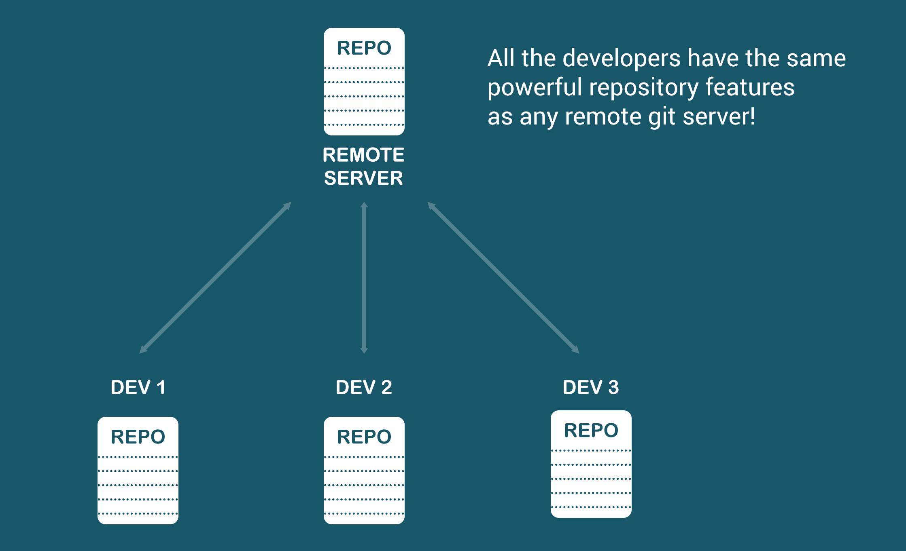
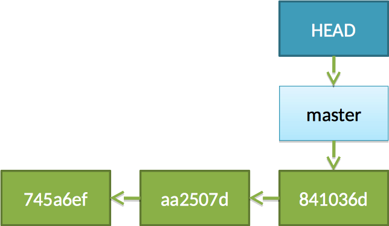
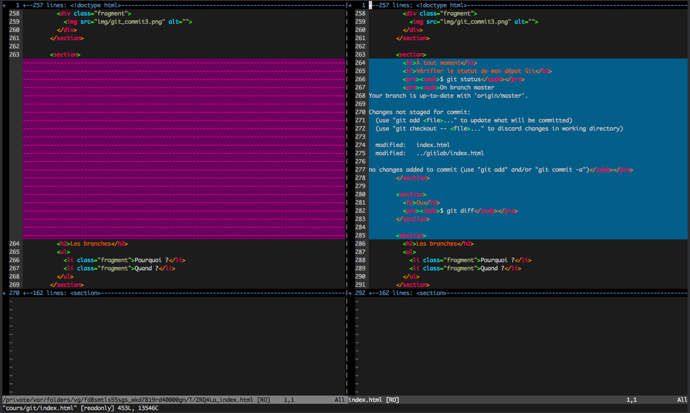
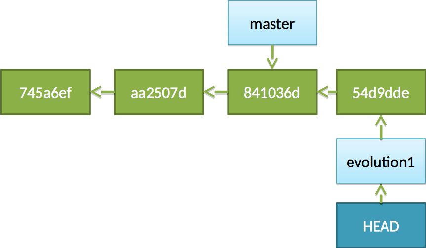

# Git

## Introduction à Git / Gestionnaire de versions

Par [Valentin Brosseau](https://github.com/c4software) / [@c4software](https://twitter.com/c4software)

---

## Pour vous, qu’est-ce qu’un gestionnaire de versions ?

---

## Quand utiliser un gestionnaire de versions ?

- À votre avis ?

---

## Dès que l’on code !

---

## Définition

Un logiciel de gestion de versions ou **VCS** (*Version Control System*) est un logiciel qui permet de stocker **un ensemble de fichiers** en conservant la **chronologie** de toutes les **modifications** effectuées.

Un gestionnaire de versions agit sur une **arborescence de fichiers** afin de conserver l’historique complet des **versions**.

---

## Git en quelques mots

Git est développé par Linus Torvalds (créateur du noyau Linux) depuis 2005.

C’est un **SCM** (*Source Code Management*), un gestionnaire de versions comparable à CVS ou SVN, à la différence près qu’il est **décentralisé**.

Les dépôts Git d’un projet sont donc **distribués** : aucun dépôt n’est intrinsèquement prioritaire sur les autres.

---

## Un peu d’histoire…

### Noyau Linux

- ~150 Mo de sources
- Des milliers de développeurs
- Un niveau de stabilité très élevé

---

## Maintenu pendant des années par des patchs…

## … envoyés par e-mail


---


---

- Linus Torvalds utilise BitKeeper
- BitKeeper devient payant
- Il décide donc de développer son propre outil

---

## Git

### (2005 — récent à l’époque)

---

## Historique (avant Git)

- FTP
- Fichiers `index1`, `index2`, …
- E-mail
- CVS
- SVN
- Git

---

## Les points clés de Git

- Distribué
- Très rapide (comparaison par différences)
- Très fiable (hash cryptographique SHA-1 / SHA-256)
- Ligne de commande puissante et expressive
- Capable de gérer des projets de toute taille

---



---

## RAPIDE


---

## Pourquoi ?

### Le principe des snapshots et des diffs


---

## Connaissez-vous d’autres systèmes utilisant ce principe ?

- Quels sont les avantages du fonctionnement par « diffs » ?

---

## Les points clés

- Traçabilité
- Gestion des branches
- Fusion de code efficace (*merge*)
- Rapidité
- Ligne de commande
- Historique non modifiable sans action explicite

---

### Avant de commencer

### Terminologie

---

### Repository (dépôt)

Vos sources + un dossier caché nommé `.git`.

Le dossier `.git` contient **l’historique complet du projet** (et bien plus).

---

### Diff (ou patch)

Différence entre deux versions d’un fichier.

---

### Commiter

Action d'enregistrer les modifications d'un ou des fichiers. Création d'une version.

---

### Commit

Action d’enregistrer un ensemble de modifications.

Un commit est identifié par un hash cryptographique unique (SHA-1 ou SHA-256).

---

### Branche

Une lignée de développement indépendante.

Par défaut, le développement se fait sur la branche `main`.

---

### Tag

Identifiant symbolique associé à un commit.

> Une étiquette pointant vers une version précise

---


---


---

## Les branches


---

## Le merge


---

## Quelques chiffres

Nombre de commits par semaine chez Facebook :

- ~10 000

---

## Exemple

### Vous allez voir, c’est simple…

(Enfin presque… mais extrêmement puissant)


---

## Qui suis-je ?

```sh
git config --global user.name "Valentin Brosseau"
git config --global user.email "c4software@gmail.com"
````

---

## Initialisation

```sh
cd mon_projet
git init
```

Création d’un nouveau dépôt Git **vide**.

---

## Premier commit

```sh
vim mon_fichier.js
git add mon_fichier.js
```

---

## Premier commit

```sh
git commit -m "Mon premier commit"

[main 745a6ef] Mon premier commit
 1 file changed, 1 insertion(+)
 create mode 100644 mon_fichier.js
```


---

## Voilà !


---

## Que mettre dans le message de commit ?

* Numéro de ticket
* Nom ou objectif de la fonctionnalité

---

## Des conventions existent

* [Conventional Commits](https://www.conventionalcommits.org/fr/v1.0.0/)
* [Gitmoji](https://gitmoji.dev/)

---

## Exemples de commits

```sh
git commit -m "feat: ajout de la fonctionnalité de connexion"
git commit -m "fix: correction du bug de connexion"
git commit -m "docs: ajout de la documentation"
```

---

```sh
git add fichier1.js fichier2.js
git commit -m "Deuxième commit"
```

```sh
[main aa2507d] Deuxième commit
 2 files changed, 2 insertions(+), 0 deletions(-)
 create mode 100644 fichier1.js
 create mode 100644 fichier2.js
```


---

```sh
vim fichier.js
git commit -am "Modification du fichier"
```

```sh
[main 841036d] Modification du fichier
 1 files changed, 28 insertions(+), 0 deletions(-)
```



---

## À tout moment

### Vérifier le statut du dépôt

```sh
git status
```

---

## Visualiser les différences

```sh
git difftool
```



---

## Figer une version

```sh
git tag v1.0.0
```

---

## Est-ce que tout doit être commité ?

* Oui
* Non
* La réponse D ?

---

## Non, bien évidemment

Il faut exclure :

* Données sensibles (mots de passe, clés API)
* Fichiers générés
* Dépendances locales

---

## Le `.gitignore`

```txt
lib.so
conf/
*.yml
*.pyc
```

[Générer un `.gitignore`](https://www.toptal.com/developers/gitignore)

---

## Les branches

* Pourquoi ?
* Quand ?

---

## Création d’une branche

```sh
git branch evolution1
```


---

```sh
git switch evolution1
```


---

```sh
vim fichier2.js
git commit -am "Ajout de l’évolution"
```

```sh
[evolution1 54d9dde] Ajout de l’évolution
 1 files changed, 208 insertions(+), 10 deletions(-)
```



---

## Fusion des branches

```sh
git switch main
git merge evolution1
```

---

## Que vient-il de se passer ?

* Qui réalise la fusion ?
* Y a-t-il des conflits ?
* Que faire de la branche ?

---

## Suppression de la branche

```sh
git branch -d evolution1
```

---

## Aller plus loin

* Consulter l’historique (`git log`)
* Taguer une version
* Signer des commits

---

## J’ai un bug en production !

---

## Aucun souci

* Les branches
* `git stash`

---

## Les différentes façons d’utiliser Git

* Individuellement (local)
* Individuellement avec dépôt distant
* En équipe avec dépôt de référence
* Avec intégrateurs
* Avec plateformes (GitLab, GitHub, …)

---

## En résumé


---

## La zone de staging

```sh
git status
git add monFichier
git restore --staged monFichier
```

---

## En résumé : le cycle de vie


---

## Gestion du code inutile

* Le commenter ?
* Le neutraliser ?
* Le supprimer ?

---

## Je le supprime : il est dans Git

---

## Interfaces graphiques

* [VS Code](https://code.visualstudio.com/docs/sourcecontrol/overview)
* [SourceTree](https://www.sourcetreeapp.com/)
* [GitKraken](https://www.gitkraken.com/)
* [Fork](https://git-fork.com/)

---

## Travail collaboratif

---

## Protocoles supportés

* `file://`
* `https://`
* `ssh://`
* `rsync://`
* BitTorrent

---

## Git à plusieurs

* GitLab
* GitHub
* Gogs

---

