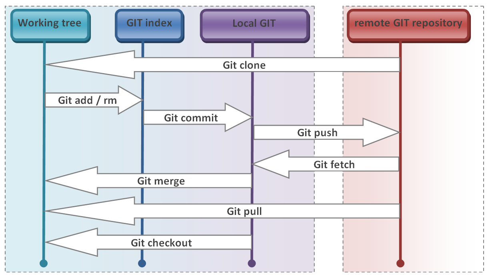
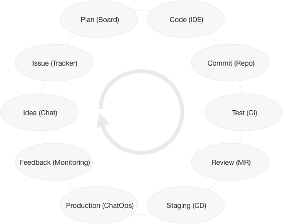

# Git en groupe

## Avec GitLab

Par [Valentin Brosseau](https://github.com/c4software) / [@c4software](http://twitter.com/c4software)

---

## Les commandes git de base

---

### Récupération d’un projet du dépôt distant

```sh
$ git clone URL_DU_PROJET
```

- À votre avis ? Quel protocole sera utilisé ?

---

## Un instant !

Gitlab et GitHub permettent de télécharger le projet en ZIP.

Dans le cadre du développement, IL NE FAUT PAS UTILISER CETTE MÉTHODE.

Pourquoi à votre avis ?

---

### Mise à jour

```sh
$ git pull
```

#### ou

```sh
$ git fetch
```

---

### Envoi des modifications sur le dépôt distant

```sh
$ git push
```

---

## Le « Workflow » Git



---

## Des outils / interfaces existent

## GitLab

- Interface Web pour Git
- Ruby On Rails (+VueJS)
- Gestion des dépôts : Privé, Public, Interne
- Gestionnaire de dépôts GIT
- « Équivalent open source de GitHub »
- Revue de Code
- Gestion des tâches (issues)
- Agile (Issue Board)

---

## Trois versions

- CE (gratuite)
- EE (payante)
- Cloud (gratuite)
- Communauté, facilement contribuable

---

## Qui utilise GitLab

- Vous ?
- Moi, Playmoweb
- AT&T
- Bell
- CERN
- Nasa
- Interpol
- Red Hat
- …

---

## STOP

Mais !? Y'a-t-il des équivalents ?

---

### GitLab est un choix parmi plusieurs outils

- GitHub
- GitLab
- Gogs / Gitea
- Bitbucket
- Serveur SSH
- …

---

## GitHub

### Service dans le Cloud

- Avril 2008
- Dépôt public gratuit, payant pour des privés
- Revue de code
- Wiki
- Issues
- Branches privées (payant)
- Intégration continue (Service tiers)
- Hébergement interne (payant)
- Microsoft (Rachat en 2017, 7,5 milliards de $)

---

## GOGS / GITEA

### Service installable en privé

- Go
- Gestion de droits
- Wiki
- Issues
- Minimaliste
- Gratuit / Open Source

---

## GitLab

### Service dans le Cloud en Privé

- Septembre 2011
- Dépôts publics et privés gratuits
- Revue de code
- Wiki
- Issues
- Branches privées
- Intégration continue (Integré : Gitlab-CI)
- Hébergement interne (Intégré, simple .rpm / .deb)

---

## Les risques dans le Cloud ?

- Indisponibilité
- Lenteur
- Dépends de VOTRE connexion Internet
- Dépends de LEUR connexion Internet
- Sécurité
- Faille

---

## Installation

- Via les sources
- Via Omnibus (paquets)
- Avec docker

---

## Dans le cloud

- Gratuit
- Dépôts privés
- Équivalent version payante (mais gratuite)

---

## Les fonctionnalités

### Pour vous maintenant

### Mais aussi dans votre future vie…

---

### Dépôts

### Privés / publics

---

### Gestion des groupes

---

### Gestion fine des droits

---

### Gestion des tickets

### « Issues »

---

### Gestion de tableau de taches

### Un peu comme Trello

Mais intégré dans le développement (vous aller voir c’est génial)

---

### Branches

Intégration dans les issues, et dans le « workflow » de travail à plusieurs.

---

### Wiki


---

### API

Une API pour tout piloter ;)

---

### Des « snippets »

Des morceaux de code que l’on partage.

- Quelqu'un connaît un équivalent ?

---

### Des « Web hooks »

Des URL appelées lors d’action dans l’interface (Intégration Slack par exemple)


---

### Intégration continue

On en reparlera…

---

### Authentification

- Via mot de passe (site)
- Via Clef SSH (client git)

---

## Gitlab, GitHub va vous identifier par votre clef SSH.

---

Clé SSH ?

[Comment générer une clef SSH](https://cours.brosseau.ovh/cheatsheets/ssh-key/)

---

Bon… Comment tester ? Plusieurs solutions :

- Gitlab.com
- Github.com
- Ou…

---

Un serveur local ici même !

- <http://gitlab.dombtsig.local/>

---

À votre avis, comment choisir ?

---

### Démo

---

### Le workflow GitLab (début)

---

#### (Flux de travail)

- Création d’une issue
- Création d’une branche relative à l’issue
- Changement de branche
- Modification du code
- « Pusher » le code

---

### Le workflow Gitlab (Suite)

- Création de la « merge request »
- Assignation de la « merge request » à quelqu’un
- Discussion avec le « quelqu’un » (IMPORTANT)
- « merge du code » sur la branche Master

---



---

### L’intégration continue

- Valide le code en continu
- Analyser la qualité du code ([Sonar](https://www.sonarqube.org/))
- Effectuer les tests (à chaque commit)
- Réaliser les « livrables » en automatique

---

### GitLab-CI

- Isolation grâce à Docker
- Multi serveurs

---

### Qualité de code

- Important (pourquoi ?)
- Pour le chef du projet / responsable de projet (pour qui)
- Améliore la qualité (comment)
- Commentaires automatiques dans les issues
- Recherche les vulnérabilités (le vrai pourquoi…)

---

### Les tests unitaires

- Permets de valider le fonctionnement
- Évite les régressions
- Façon de penser

---

### Les livrables

- Identifié par un tag
- Si possible, automatisé

Sur quelle branche ? Pourquoi ?

---

- Possible en ligne de commande (`git tag -a v1.0 -m "Version 1.0"`)
- Possible via l’interface GitLab (Création de tag)

---

### L’identité sur Git

#### Encore plus important en groupe

  

- PGP Physique
- PGP Logiciel (OpenPGP)

---

### La traçabilité

- Qui a fait quoi ?
- Quand ?
- Pourquoi ?

---

### Concrètement

- Un commit par fonctionnalité
- Un commit par bug
- Un commit par amélioration

---

```md
#1234 - Ajout de la fonctionnalité X

En détail :

Expliquer ici ce que fait la fonctionnalité

Pourquoi :

Pourquoi cette fonctionnalité est nécessaire (demande client, amélioration, etc.)
```

---

Pourquoi ? 

- Identifier les modifications
- En cas de problème, revenir en arrière
- En cas de problème de sécurité, identifier les modifications
- ...

---

## Rappel

### Les commandes Git

---

### Récupération d’un projet du dépôt distant

```sh
$ git clone URL_DU_PROJET
```

---

### Mise à jour

```sh
$ git pull
```

#### ou

```sh
$ git fetch
```

---

### Envoi des modifications sur le dépôt distant

```sh
$ git push
```

---

## Le « Workflow » Git


---

## Trois commandes à retenir

```sh
$ git clone URL_DU_PROJET
$ git pull
$ git push
```

---

## Des questions ?
