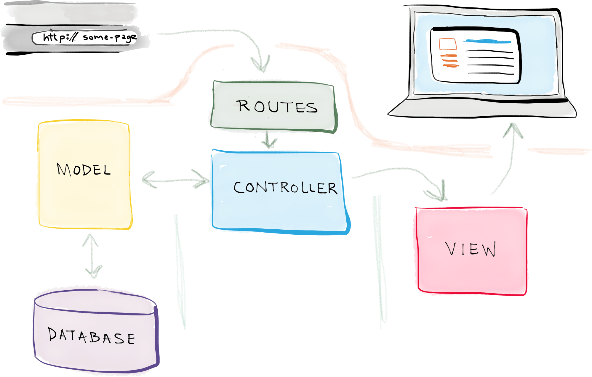
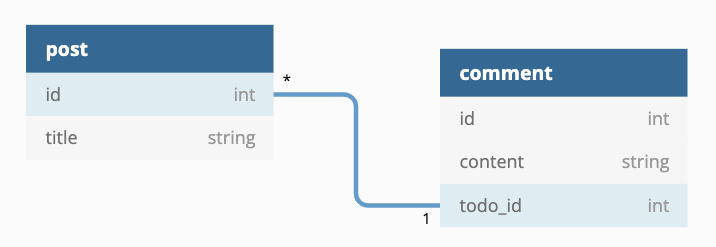
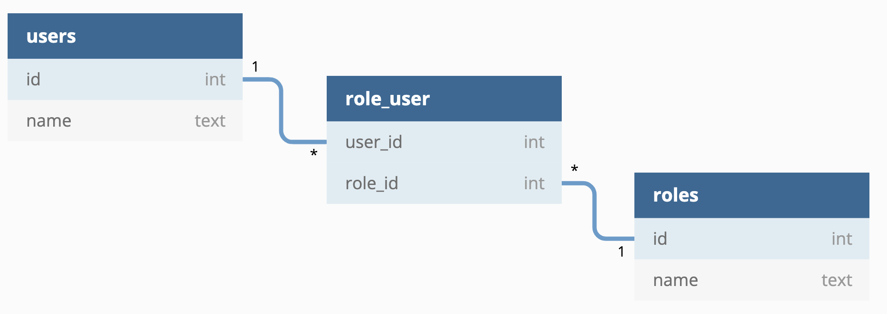

# Laravel

## The PHP Framework For Web Artisans

Par [Valentin Brosseau](https://github.com/c4software) / [@c4software](http://twitter.com/c4software)

---

## Les frameworks

Ensemble d'outils et de composants logiciels à la base d'un logiciel ou d'une application.

---

## Pourquoi ?

---

- Simplification
- Standardisation
- Homogénéité
- Sécurité

---

## Quand ?

---

- En entreprise
- En groupe
- Le plus souvent possible…

---

## Quelques frameworks

- Laravel
- Symfony
- CodeIgniter
- CakePHP
- Zend Framework
- Fat-Free Framework

---

## Revenons sur le quand…

Le choix du framework dépend du projet en question… Et parfois pas de framework dutout…

---

## Laravel c’est ?

- Un framework
- Gratuit et Open-Source
- Utilise le PHP de façon moderne
- Démarrage simple et rapide
- Développement objet
- Approche MVC (mais…)

---

## Laravel == PHP

### Mais sous stéroïdes ! Vous allez voir…

---

## Historique

- Taylor Otwell
- 2011: Création
- 2016: Projet PHP le mieux noté sur GitHub

La communauté s’est rapidement formée autour du projet. C’est bon signe!

---

## La vision…

Taylor Otwell était un utilisateur de CodeIgniter. **Mais** il le trouvait trop compliqué, trop lourd, et chaque modification était trop complexe…

Il a donc voulu quelque chose de plus **souple**, **simple** et **simple à apprendre**

---

Le pitch de lancement, c’est « Un framework connu pour sa simplicité »

---

## L’histoire

- V1, V2: Le début, les versions sont rapidement disponibles. Système de routes, et contrôleurs MVC très simple.
- V3: février 2012, Boom de la popularité.
- V4: mai 2013, réécriture complète du Framework. Intégration du gestionnaire de paquets « Composer »
- …

---

### À votre avis pourquoi, est-ce important (le gestionnaire de paquets) ?

---

## Zoom sur Composer

- Partage simple des dépendances
- Multiplateforme
- Partage simplifié d’un projet

---

## L’histoire… (maintenant)

- 11.X: Version actuelle

**Requiert PHP 8.2**, à votre avis pourquoi ?


---

## Architecture



---

## Architecture

- **Model**: La base de données (ORM: Éloquent).
- **Vue**: Gestion du HTML (Moteur de template : Blade).
- **Controller**: Gestion des requêtes et génère le contenu.

---

## ORM ?


Technique de programmation informatique qui crée l'illusion d'une base de données orientée objet à partir d'une base de données relationnelle en définissant des correspondances entre cette base de données et les objets.

---

## Du PHP Objet ?

- Logique découpée dans des classes avec des comportements et des fonctionnements propres.
- Plus simple, plus maintenable, plus facilement **TESTABLE**

---

### Car oui, un code de qualité, c’est un code testé !


---

## Comment ça fonctionne ?

---

## Créer un projet

```bash
$ composer create-project laravel/laravel projectName
laravel new projectName
Crafting application...
Loading composer repositories with package information
Installing dependencies (including require-dev) from lock file
Package operations: 68 installs, 0 updates, 0 removals
  - Installing doctrine/inflector (v1.2.0): Loading from cache
  - Installing doctrine/lexer (v1.0.1): Loading from cache
  - Installing erusev/parsedown (1.6.3): Loading from cache
[…]
Application ready! Build something amazing.
```

---

## Gérer l’application créée

```bash
$ php artisan
Laravel Framework X.Y.Z

Usage:
command [options] [arguments]

Options:
-h, --help            Display this help message
[…]
```

---

## Réinstaller un projet

```bash
$ composer install
```

---

## Lancer le serveur

```bash
$ php artisan serve
```

---

## Les « routes »

- Gestion des URL's de l’application
- Assemble l'ensemble (le contrôleur et la vue)

---

## Connaissez-vous un équivalent ?

---

## Dans Laravel : 3 fichiers

- **web.php**: Gestion des urls pour le « web »
- **api.php**: Gestion des urls pour les API.
- **console.php**: Gestion des commandes pour la console Laravel

---

## Un exemple simple

```php
Route::get('/', function () {
  return "Bonjour Monde";
});
```

---

## Avec des paramètres

```php
Route::get('/demo/{id}', [DemoController::class, "voir"]);
```

Consulter la page **/demo/3** chargera automatiquement le bon contrôleur et la bonne méthode en passant le paramètre **3**

---

## Et pour le POST ?

```php
Route::post('/demo/ajout', [DemoController::class, "ajout");
```
---

## Autre que le POST ?

(get, post, put, patch, delete, options)

```php
Route::put('/demo/{id}', [DemoController::class, "modifier"]);
Route::delete('/demo/{id}', [DemoController::class, "supprimer"]);
```

---

## Protéger une route

```php
Route::get('/demo/{id}', [DemoController::class, "voir"])->middleware('auth');
```

---

## Les « middlewares »

Auth est un middleware fourni par Laravel Breeze. Il permet de vérifier que l’utilisateur est connecté.

---

## Un middleware ?

Un middleware est un « filtre » qui va être exécuté avant l’action demandée. Il sera exécuté avant le contrôleur. Il permettra de vérifier des choses avant d’exécuter le contrôleur.

Ex: L'authentification, token, etc…

---

Vous pouvez également créer vos propres middlewares.

```bash
php artisan make:middleware isEquipeConnected
```

---

Exemple dans l'AP 3 :

```php
class IsEquipeConnected
{
    /**
     * Handle an incoming request.
     *
     * @param  \Closure(\Illuminate\Http\Request): (\Symfony\Component\HttpFoundation\Response)  $next
     */
    public function handle(Request $request, Closure $next): Response
    {
        // Si l'équipe n'est pas connectée, on la redirige vers la page de connexion
        if (!SessionHelpers::isConnected()) {
            return redirect("/login");
        }

        return $next($request);
    }
}
```

---

```php
Route::get('/me', [EquipeController::class, "me"])->middleware(IsEquipeConnected::class);
```

---

## Simple non ?


---

## Les contrôleurs

Gestion de la logique « metier » pour traiter chaque demande

```bash
$ php artisan make:controller DemoController
```

---

```php
namespace App\Http\Controllers;
use App\Http\Controllers\Controller;

class DemoController extends Controller
{
    public function voir(Request $request, $id)
    {
        return "Identifiant => ".$id;
    }
}
```

---

## Le « mapping » des paramètres

```php
    // […]
    public function voir(Request $request, $id)
    // […]
```

---

## Lire les données d'un formulaire

```php
    // […]
    public function voir(Request $request, $id)
    {
        $nom = $request->input('nom');
        $nom = $request->input('nom', 'John'); // Valeur par défaut

        $all = $request->all(); // Récupérer toutes les données
    }
```

---

## Les retours possibles d'une méthode

```php
// Retourne une vue
return view('view.name', ['name' => 'John']);

// Retourne une vue avec un message flash (session)
return redirect('/home')->with('status', 'Task was successful!');

// Retourn une redirection vers une route nommée
return redirect()->route('profile');

// Retourne une redirection vers une route nommée avec des paramètres
return redirect()->route('profile', ['id' => 1]);

// Retourne une redirection vers une route nommée avec des paramètres et un message flash
return redirect()->route('profile', ['id' => 1])->with('status', 'Task was successful!');

// Retourner une réponse JSON
$user = App\Models\User::find(1);
return response()->json($user);
```

---

[En savoir plus](https://laravel.com/docs/10.x/requests#retrieving-input)

---

Exercice :

- Créer une méthode dans le contrôleur User qui permet de récupérer un utilisateur par son identifiant.
- Créer une route qui retourne une réponse JSON de l’utilisateur 1.
- Créer une redirection vers la route « home » avec un message flash « Bienvenue ».
- Récupérer toutes les données dans la méthode « validation » du contrôleur « Demo ».

---

## Les modèles

La représentation objet de la base de données

---

## Exemple

```bash
$ php artisan make:model TodoList
```

---

```php
namespace App;

use Illuminate\Database\Eloquent\Model;

class TodoList extends Model
{
    protected $table = "todoList";
    protected $fillable = array('texte', 'termine');
}
```

---

## « Initialiser » la base de données

```bash
$ php artisan migrate:make create_todoList_table --create=todoList
```

Création d'un script PHP qui représente la définition de la base de données.

---

```php
// app/database/migrations/####_##_##_######_create_todoList_table.php

Schema::create('todoList', function(Blueprint $table)
{
    $table->increments('id');

    $table->string('texte');
    $table->boolean('termine');

    $table->timestamps();
});
```

---

## Lancement de la création

```bash
$ php artisan migrate
```

- À votre avis que va-t-il se passer ?

---

## Éloquent : Le « Query Builder »

```php
use App\TodoList;

$todos = App\TodoList::all();
// Ou pour le Todo avec l’identifiant « 42 »
$todo = App\TodoList::find(42);
```

---

## Éloquent : Le « Query Builder »

```php
    $flights = App\TodoList::where('temine', 1)
    ->orderBy('id', 'desc')
    ->take(10)
    ->get();
```

---

## Éloquent : Le « Query Builder »

```php
$users = DB::table('users')->paginate(15);
// Ou avec un where
$users = User::where('votes', '>', 100)->paginate(15);
```

Quel est l'avantage à votre avis de faire ce genre de requêtes ?

---

## Éloquent : Créer un enregistrement

```php
// Créer une Todo
App\TodoList::create(array(
    'texte'     => 'Super Cool',
    'termine'   => false
));
// La sauvegarde est automatique.
```

---

## Éloquent : Mettre à jour un enregistrement

```php
// Rechercher celui avec l’id 1
$todo = App\TodoList::find(1);

// Le passer à terminer
$todo->termine = true;

// Le sauvegarder en base de données
$todo->save();
```

---

## Éloquent : Suppression d’un enregistrement

```php
// Rechercher celui avec l’id 1
$todo = App\TodoList::find(1);

// Le supprimer
$todo->delete();

// Le supprimer directement
App\TodoList::destroy(1);

// En supprimer plusieurs directement
App\TodoList::destroy(1,2,3);

// Supprimer avec une condition
App\TodoList::where('termine', '==', 1)->delete();
```

---

## Éloquent : Les jointures

Quel type de jointure connaissez-vous ?

---

### One To One


```php
class Todo extends Model {

  // Dans le modèle
  public function categorie()
  {
      return $this->hasOne(Categorie::class);
  }

}
```

Éloquent supposera que dans le modèle `Categorie` contiendra une colonne `todo_id`.

---

### One To Many



```php
class Post extends Model {

  // Dans le modèle
  public function comments()
  {
      return $this->hasMany(Comment::class);
  }

}
```

Éloquent supposera que la colonne de clé étrangère sur le modèle `Comment` est `post_id`.

---

### L'inverse le « Belong To »

```php
class Comment extends Model
{
    public function post()
    {
        return $this->belongsTo(Post::class);
    }
}
```

- Éloquent tentera de trouver un modèle `Post` dont l'identifiant correspond à la colonne `post_id` du modèle `Comment`.
- Et supposera que la clé étrangère du modèle `Post` sur la table des commentaires est `post_id`.

---

### Many To Many



---

```php
class User extends Model
{
    /**
     * The roles that belong to the user.
     */
    public function roles()
    {
        return $this->belongsToMany(Role::class);
    }
}
```

---

```php
class Role extends Model
{
    /**
     * The users that belong to the role.
     */
    public function users()
    {
        return $this->belongsToMany(User::class);
    }
}
```

---

Via le modèle, il est possible de récupérer les données de l’autre modèle.

```php
// Récupérer les rôles d’un utilisateur
$roles = App\User::find(1)->roles;

// Récupérer les utilisateurs d’un rôle
$users = App\Role::find(1)->users;
```

---

Ou automatiquement via la méthode `with`

```php
$users = App\User::with('roles')->get();
```

---

Créer des enregistrements avec des relations. Deux méthodes sont disponibles :

- `attach` <= Ajoute une relation en plus de celles existantes
- `sync` <= Remplace les relations existantes par celles données

---

Le sync

```php
$user->roles()->sync([1, 2, 3]);
```

---

Le attach

```php
// Ajouter un commentaire à un post
$comment = new App\Comment(['message' => 'A new comment.']);
$post = App\Post::find(1);
$post->comments()->save($comment);

// Attacher un rôle à un utilisateur
$user = App\User::find(1);
$user->roles()->attach($roleId);

// Attacher des roles à un utilisateur nouvellement créé
$user = App\User::create($attributes);
$user->roles()->attach([1, 2, 3]);
```

---

La différence ?

- Dans le premier cas, la requête est exécutée au moment de l’appel (lazy loading).
- Dans le second cas, la requête est exécutée au moment de l’appel de la méthode `get` (eager loading).

---

[En savoir plus dans la documentation](https://laravel.com/docs/10.x/eloquent-relationships)

---

```php
class Article extends Model{
    public function comments(){
        return $this->hasMany(Comment::class);
    }
    public function categories(){
        return $this->belongsToMany(Category::class);
    }
    public function user(){
        return $this->belongsTo(User::class);
    }
}
class User extends Model{
    public function articles(){
        return $this->hasMany(Article::class);
    }
}
class Comment extends Model{
    public function article(){
        return $this->belongsTo(Article::class);
    }
    public function user(){
        return $this->belongsTo(User::class);
    }
}
class Category extends Model{
    public function articles(){
        return $this->belongsToMany(Article::class);
    }
}
class ArticleCategory extends Model{}
class ArticleComment extends Model{}
```

- Que constatez-vous ?
- Combien il y a-t-il de table ?
- Voyez-vous un/des problème(s) ?

---


---

- Écrire le code permettant d'obtenir l'ensemble des utilisateurs.
- Écrire le code permettant d'avoir l'ensemble des Article de l'utilisateur 4.
- Écrire le code permettant de modifier l'article 1.
- Écrire le code permettant de supprimer l'ensemble des messages de l'utilisateur 10.
- Écrire le code permettant d'ajouter un commentaire à l'article 1.
- Écrire le code permettant d'ajouter les catégories 1, 2 et 3 à l'article 1.

[Aide mémoire](https://cours.brosseau.ovh/cheatsheets/laravel/quick.html#l-orm-relations)

---

## Automatisation de la création des modèles

Créer les modèles peut-être fastidieux, il existe un outil pour automatiser la création des modèles depuis la base de données.

[https://github.com/reliese/laravel](https://github.com/reliese/laravel)

---

## La Vue : Blade

- Moteur de template
- Performant
- Héritage et redéfinition
- Les fichiers Blade sont des fichiers PHP
- Contrairement à beaucoup d’autres moteurs de template, le mix PHP + HTML est possible (mais personnellement je ne trouve pas que ça soit une bonne idée…)

---

## Utilisation

Afficher un template

```php
Route::get('/', function () {
    return view('accueil');
});
```

---

## Organiser les templates

- Pourquoi ?
- Comment ?
- À votre avis pourquoi est-ce très important ?

---


---

## Le template principal

```html
<!-- Sauvegardé dans resources/views/layouts/app.blade.php -->
<html>
  <head>
    <title>Site Exemple - @yield('titre')</title>
  </head>
  <body>
    @section('sidebar') « Section » Sidebard principal @show

    <div class="container">@yield('content')</div>
  </body>
</html>
```

---

## Le template « enfant »

```php
<!-- Sauvegardé dans resources/views/child.blade.php -->

@extends('layouts.app')

@section('titre', 'Page enfant')

@section('sidebar')
  @parent // <-- Hérite des donnés du parent
  Données de l’enfant
@endsection

@section('content')
  <p>Contenu de la page enfant.</p>
@endsection
```

---

## Les composants

Blade intègre également un système de composant permettant de découper son travail.

```html
<VotreComposant nom="Valentin"></VotreComposant>
```

---

[Documentation composant](https://laravel.com/docs/10.x/blade#components)

---

## Les composants pour le layout

[La documentation](https://laravel.com/docs/10.x/blade#layouts-using-components)

---

## Les directives « Blade »

---

## Les conditions

- **@if**, **@elseif**, **@else** et **@endif**
- **@switch**, **@case**, **@break**, **@default** et **@endswitch**

---

## Les boucles

- **@for**, **@endfor**
- **@foreach**, **@endforeach**
- **@forelse**, **@empty**, **@endforelse** <= Permet d’afficher autre chose si pas de données dans la boucle

---

## L'héritage

- **@include**('view.name') <= Inclusion d’une autre vue
- **@include**When(\$boolean, 'view.name') <= Inclusion conditionnelle

---

## Cas pratique


- Écrire le Blade / HTML permettant :
  - D'afficher la barre « Bienvenue » **uniquement** si la personne est connectée.
  - D'affiche la table de manière dynamique

---

## Gestion des droits d’accès

```php
@auth
  // L'utilisateur est authentifié...
@endauth

@guest
  // L'utilisateur n'est pas authentifié...
@endguest
```

---

## **@stack**

Zone dans le code où il sera possible « d'injecter » ultérieurement du code.

Exemple, zone dans le header pour injecter des scripts JS utiles que dans certaines pages.

---

### Dans la vue parent

```html
<head>
  […] @stack('scripts') […]
</head>
```

---

### Dans la vue enfant

```php
@push('scripts')
    <script src="/demo.js"></script>
@endpush
```

---

## La sécurité

Exemple le CSRF

```html
[…] {{ csrf_field() }} […]
```

La vérification côté serveur est **automatique**

---

## L’authentification

Intégré dans Laravel, s’initialise simplement en suivant la documentation

[En savoir plus](https://laravel.com/docs/5.7/authentication)

---

## Heu, mais c’est lourd non ?

Éffectivement Laravel est un « gros » Framework. Dans certains cas on veut plus simple.

Dans quel cas par exemple ?

---

## Laravel is PHP

---

Avant de commencer, il est important de comprendre que Laravel est un framework PHP. Il utilise donc les fonctionnalités de PHP.

---

## Quelques équivalents ($_GET, $_POST, etc…)

---

- `$_GET['id']` <=> `$request->query('id')`
- `$_POST['id']` <=> `$request->input('id')`
- `$_FILES['photo']` <=> `$request->file('photo')`

---

## Et pour les sessions ?

---

- `$_SESSION['user']` <=> `$request->session()->get('user')`
- `$_SESSION = []` <=> `$request->session()->flush()`
- `$_SESSION` <=> `$request->session()->all()`
- `isset($_SESSION['user'])` <=> `$request->session()->has('user')`

---

Et la base de données ?

```php
// Eloquent
$users = User::where('name', 'John')->get();

// PDO
$stmt = $pdo->prepare('SELECT * FROM users WHERE name = :name');
$stmt->execute(['name' => 'John']);
```

---

```php
// Eloquent
$user = new User();
$user->name = 'John';
$user->save();

// Eloquent (alternative)
User::create(['name' => 'John']);

// PDO
$stmt = $pdo->prepare('INSERT INTO users (name) VALUES (:name)');
$stmt->execute(['name' => 'John']);
```

---

## Les microservices vous connaissez ?

---

- Les services individuels sont simples à remplacer
- Les services sont conçus pour leur utilité spécifique (par exemple la facturation, la chaîne logistique, l'interface...)
- L'architecture est plus symétrique que hiérarchique (passage d'une architecture client-serveur à une architecture de plusieurs entités communicantes)
- L'architecture facilite le déploiement continu du code

---

- Les services sont petits, et conçus pour remplir une seule fonction.
- L'organisation du projet doit prendre en compte l'automatisation, le déploiement et les tests.
- Chaque service est élastique, résilient, composable, minimal et complet.

---

- Et pour vous ?

---

### Des questions ?

(Il doit y en avoir beaucoup)
