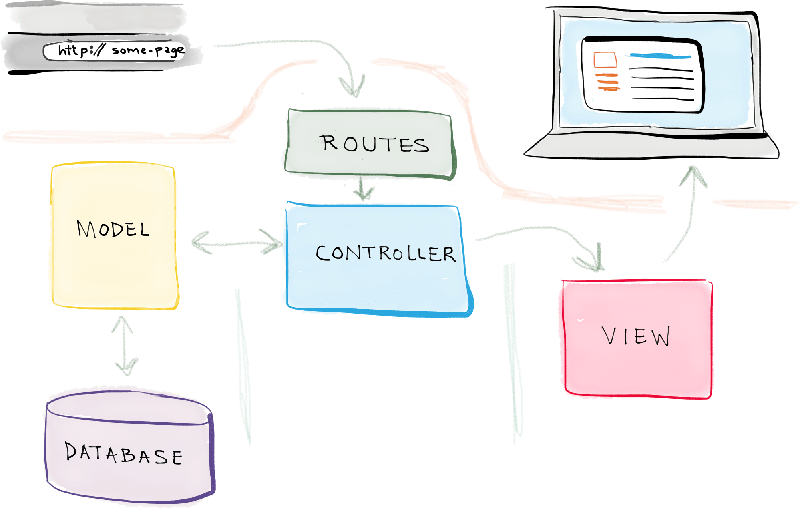
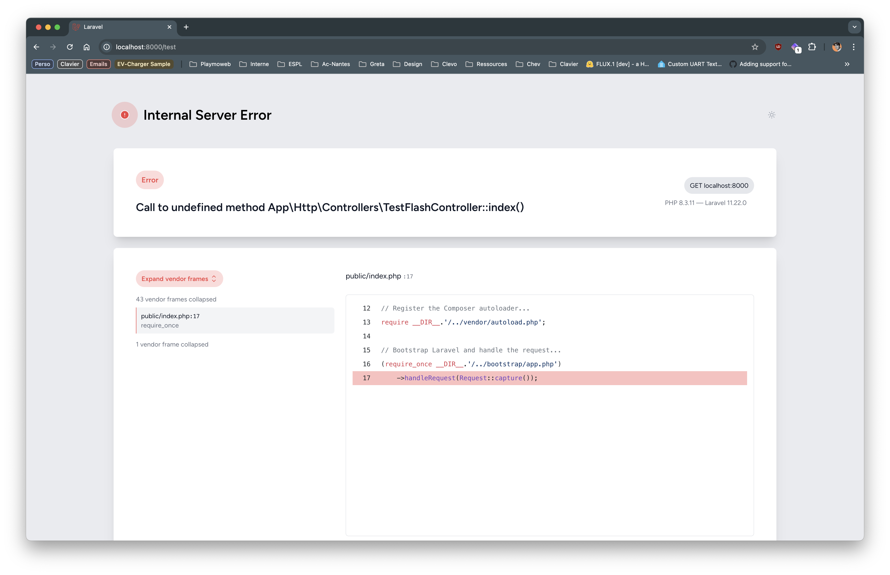
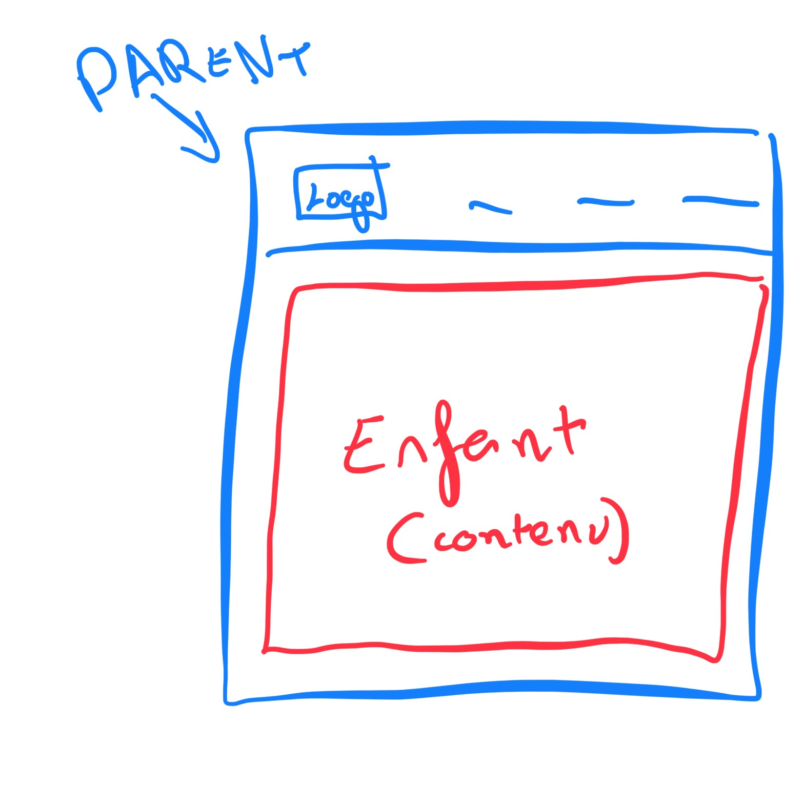
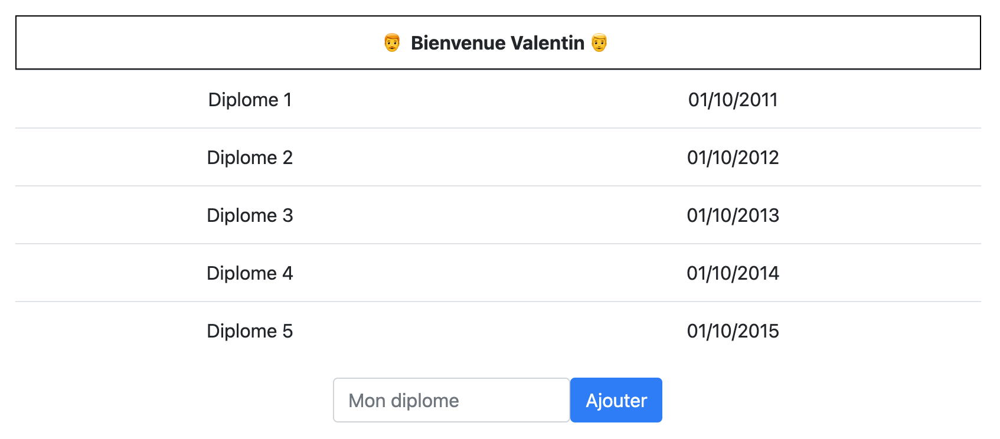
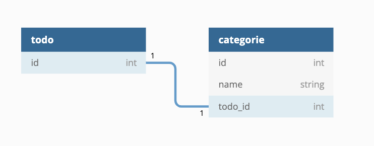
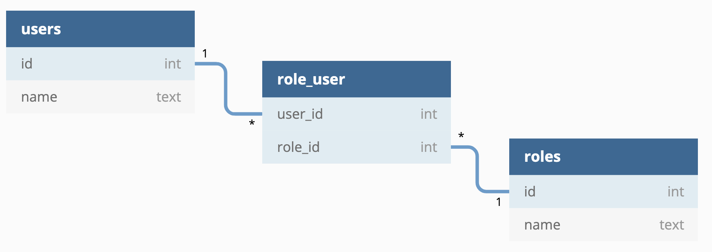
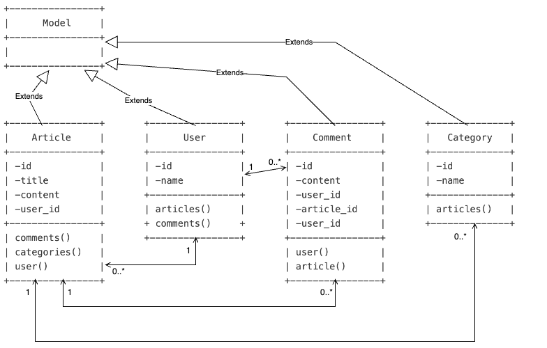

# Laravel

## The PHP Framework For Web Artisans

Par [Valentin Brosseau](https://github.com/c4software) / [@c4software](http://twitter.com/c4software)

---

## Les frameworks

Ensemble d'outils et de composants logiciels à la base d'un logiciel ou d'une application.

---

## Pourquoi ?

---

- Simplification
- Standardisation
- Homogénéité
- Sécurité

---

## Quand ?

---

- En entreprise
- En groupe
- Le plus souvent possible…

---

## Quelques frameworks

- Laravel
- Symfony
- CodeIgniter
- CakePHP
- Zend Framework
- Fat-Free Framework

---

## Revenons sur le quand…

Le choix du framework dépend du projet en question… Et parfois pas de framework du tout…

---

## Laravel c’est ?

- Un framework
- Gratuit et Open-Source
- Utilise le PHP de façon moderne
- Démarrage simple et rapide
- Développement objet
- Approche MVC (mais…)

---

## Laravel == PHP

### Mais sous stéroïdes ! Vous allez voir…

---

## Historique

- Taylor Otwell
- 2011: Création
- 2016: Projet PHP le mieux noté sur GitHub

La communauté s’est rapidement formée autour du projet. C’est bon signe !

---

## La vision…

Taylor Otwell était un utilisateur de CodeIgniter. **Mais** il le trouvait trop compliqué, trop lourd, et chaque modification était trop complexe…

Il a donc voulu quelque chose de plus **souple**, **simple** et **simple à apprendre**

---

Le pitch de lancement, c’est « Un framework connu pour sa simplicité »

---

## L’histoire

- V1, V2: Le début, les versions sont rapidement disponibles. Système de routes, et contrôleurs MVC très simple.
- V3: février 2012, Boom de la popularité.
- V4: mai 2013, réécriture complète du Framework. Intégration du gestionnaire de paquets « Composer »
- …

---

### À votre avis, pourquoi est-ce important (le gestionnaire de paquets) ?

---

## Zoom sur Composer

- Partage simple des dépendances
- Multiplateforme
- Partage simplifié d’un projet

---

## L’histoire… (maintenant)

- 12.x : Version actuelle

Requiert PHP 8.4 : à votre avis pourquoi ?


---

## Architecture



---

## Architecture

- **Model**: La base de données (ORM: Éloquent).
- **Vue**: Gestion du HTML (Moteur de template : Blade).
- **Controller**: Gestion des requêtes et génère le contenu.

---

## ORM ?


Technique de programmation informatique qui crée l'illusion d'une base de données orientée objet à partir d'une base de données relationnelle en définissant des correspondances entre cette base de données et les objets.

---

## Du PHP Objet ?

- Logique découpée dans des classes avec des comportements et des fonctionnements propres.
- Plus simple, plus maintenable, plus facilement **TESTABLE**

---

### Car oui, un code de qualité, c’est un code testé !


---

## Laravel is PHP

---

Avant de commencer, il est important de comprendre que Laravel est un framework PHP. Il utilise donc les fonctionnalités de PHP.

---

## Quelques équivalents ($_GET, $_POST, etc…)

---

- `$_GET['id']` <=> `$request->query('id')`
- `$_POST['id']` <=> `$request->input('id')`
- `$_FILES['photo']` <=> `$request->file('photo')`

---

## Et pour les sessions ?

---

- `$_SESSION['user']` <=> `$request->session()->get('user')`
- `$_SESSION = []` <=> `$request->session()->flush()`
- `$_SESSION` <=> `$request->session()->all()`
- `isset($_SESSION['user'])` <=> `$request->session()->has('user')`

---

Et la base de données ?

```php
// Eloquent
$users = User::where('name', 'John')->get();

// PDO
$stmt = $pdo->prepare('SELECT * FROM users WHERE name = :name');
$stmt->execute(['name' => 'John']);
```

---

```php
// Eloquent
$user = new User();
$user->name = 'John';
$user->save();

// Eloquent (alternative)
User::create(['name' => 'John']);

// PDO
$stmt = $pdo->prepare('INSERT INTO users (name) VALUES (:name)');
$stmt->execute(['name' => 'John']);
```

---

## Comment ça fonctionne ?

---

## Créer un projet

```bash
$ composer create-project laravel/laravel projectName
laravel new projectName
Crafting application...
Loading composer repositories with package information
Installing dependencies (including require-dev) from lock file
Package operations: 68 installs, 0 updates, 0 removals
  - Installing doctrine/inflector (v1.2.0): Loading from cache
  - Installing doctrine/lexer (v1.0.1): Loading from cache
  - Installing erusev/parsedown (1.6.3): Loading from cache
[…]
Application ready! Build something amazing.
```

---

## Gérer l’application créée

```bash
$ php artisan
Laravel Framework X.Y.Z

Usage:
command [options] [arguments]

Options:
-h, --help            Display this help message
[…]
```

---

## Lancer le serveur

```bash
$ php artisan serve
```

---

## Réinstaller un projet

```bash
$ composer install
```

---

## Les « routes »

- Gestion des URLs de l’application
- Assemble l'ensemble (le contrôleur et la vue)

---

## Connaissez-vous un équivalent ?

---

## Dans Laravel : 3 fichiers

- **web.php**: Gestion des urls pour le « web »
- **api.php**: Gestion des urls pour les API.
- **console.php**: Gestion des commandes pour la console Laravel

---

## Un exemple simple

```php
Route::get('/', function () {
  return "Bonjour Monde";
});
```

---

## Avec des paramètres

```php
Route::get('/demo/{id}', [DemoController::class, "voir"]);
```

Consulter la page **/demo/3** chargera automatiquement le bon contrôleur et la bonne méthode en passant le paramètre **3**

---

## Et pour le POST ?

```php
Route::post('/demo/ajout', [DemoController::class, 'ajout']);
```

---

## Autre que le POST ?

(get, post, put, patch, delete, options)

```php
Route::put('/demo/{id}', [DemoController::class, "modifier"]);
Route::delete('/demo/{id}', [DemoController::class, "supprimer"]);
```

---

## Analyse



---

## Protéger une route

```php
Route::get('/demo/{id}', [DemoController::class, "voir"])->middleware('auth');
```

---

## Les « middlewares »

Auth est un middleware fourni par Laravel Breeze. Il permet de vérifier que l’utilisateur est connecté.

---

## Un middleware ?

Un middleware est un « filtre » qui va être exécuté avant l’action demandée. Il sera exécuté avant le contrôleur. Il permettra de vérifier des choses avant d’exécuter le contrôleur.

Ex: L'authentification, token, etc…

---

Vous pouvez également créer vos propres middlewares.

```bash
php artisan make:middleware IsEquipeConnected
```

---

Exemple dans l'AP 3 :

```php
class IsEquipeConnected
{
    /**
     * Handle an incoming request.
     *
     * @param  \Closure(\Illuminate\Http\Request): (\Symfony\Component\HttpFoundation\Response)  $next
     */
    public function handle(Request $request, Closure $next): Response
    {
        // Si l'équipe n'est pas connectée, on la redirige vers la page de connexion
        if (!SessionHelpers::isConnected()) {
            return redirect("/login");
        }

        return $next($request);
    }
}
```

---

```php
Route::get('/me', [EquipeController::class, "me"])->middleware(IsEquipeConnected::class);
```

---

## Simple non ?


---

## Les contrôleurs

Gestion de la logique « métier » pour traiter chaque demande

```bash
$ php artisan make:controller DemoController
```

---

```php
namespace App\Http\Controllers;
use App\Http\Controllers\Controller;
use Illuminate\Http\Request;

class DemoController extends Controller
{
    public function voir(Request $request, $id)
    {
        return "Identifiant => ".$id;
    }
}
```

---

## Le « mapping » des paramètres

```php
    // […]
    public function voir(Request $request, $id)
    // […]
```

---

## Lire les données d'un formulaire

```php
    // […]
    public function voir(Request $request, $id)
    {
        $nom = $request->input('nom');
        $nom = $request->input('nom', 'John'); // Valeur par défaut

        $all = $request->all(); // Récupérer toutes les données
    }
```

---

## Les retours possibles d'une méthode

```php
// Retourne une vue
return view('view.name', ['name' => 'John']);

// Retourne une vue avec un message flash (session)
return redirect('/home')->with('status', 'Task was successful!');

// Retourne une redirection vers une route nommée
return redirect()->route('profile');

// Retourne une redirection vers une route nommée avec des paramètres
return redirect()->route('profile', ['id' => 1]);

// Retourne une redirection vers une route nommée avec des paramètres et un message flash
return redirect()->route('profile', ['id' => 1])->with('status', 'Task was successful!');

// Retourner une réponse JSON
$user = App\Models\User::find(1);
return response()->json($user);

// Retourner une réponse JSON avec un code de statut
$allUsers = App\Models\User::all();
return response()->json($allUsers);
```

---

[En savoir plus](https://laravel.com/docs/12.x/requests#retrieving-input)

---

## Observation

<div class="colContainer">
<div class="col">
<pre style="font-size:0.42em"><code class="php" data-trim data-line-numbers="2-3|4-5|6-7" data-fragment-index="0">// routes/web.php
Route::get('/users',
    [UserController::class, 'liste']);
Route::get('/users/{id}',
    [UserController::class, 'voir']);
Route::get('/bienvenue',
    [UserController::class, 'bienvenue']);</code></pre>
</div>
<div class="col">
<pre style="font-size:0.42em"><code class="php" data-trim data-line-numbers="1-4|6-9|11-15" data-fragment-index="0">public function liste()
{
    return response()-&gt;json(User::all());
}
&#8203;
public function voir(Request $request, $id)
{
    return response()-&gt;json(User::find($id));
}
&#8203;
public function bienvenue()
{
    return redirect('/')
        -&gt;with('message', 'Bienvenue');
}</code></pre>
</div>
</div>

<ul>
<li>Que reçoit le navigateur en consultant <strong>/users</strong> ?</li>
<li class="fragment" data-fragment-index="0">Et en consultant <strong>/users/1</strong> ? Où est passé le <code>1</code> de l'URL ?</li>
<li class="fragment" data-fragment-index="1">Que se passe-t-il en consultant <strong>/bienvenue</strong> ?</li>
</ul>

---

## La Vue : Blade

- Moteur de template
- Performant
- Héritage et redéfinition
- Les fichiers Blade sont des fichiers PHP
- Contrairement à beaucoup d’autres moteurs de template, le mix PHP + HTML est possible (mais personnellement je ne trouve pas que ça soit une bonne idée…)

---

## Utilisation

Afficher un template

```php
Route::get('/', function () {
    return view('accueil');
});
```

---

## Organiser les templates

- Pourquoi ?
- Comment ?
- À votre avis pourquoi est-ce très important ?

---



---

## Le template principal

```html
<!-- Sauvegardé dans resources/views/layouts/app.blade.php -->
<html>
  <head>
    <title>Site Exemple - @yield('titre')</title>
  </head>
  <body>
    @section('sidebar') « Section » barre latérale principale @show

    <div class="container">@yield('content')</div>
  </body>
</html>
```

---

## Le template « enfant »

```php
<!-- Sauvegardé dans resources/views/child.blade.php -->

@extends('layouts.app')

@section('titre', 'Page enfant')

@section('sidebar')
  @parent // <-- Hérite des données du parent
  Données de l’enfant
@endsection

@section('content')
  <p>Contenu de la page enfant.</p>
@endsection
```

---

## Les composants

Blade intègre également un système de composant permettant de découper son travail.

```html
<x-votre-composant nom="Valentin"></x-votre-composant>
```

---

[Documentation composant](https://laravel.com/docs/12.x/blade#components)

---

## Les composants pour le layout

[La documentation](https://laravel.com/docs/12.x/blade#layouts-using-components)

---

## Les directives « Blade »

---

## Les conditions

- **@if**, **@elseif**, **@else** et **@endif**
- **@switch**, **@case**, **@break**, **@default** et **@endswitch**

---

## Les boucles

- **@for**, **@endfor**
- **@foreach**, **@endforeach**
- **@forelse**, **@empty**, **@endforelse** <= Permet d’afficher autre chose si pas de données dans la boucle

---

## L'héritage

- **@include**('view.name') <= Inclusion d’une autre vue
- **@include**When(\$boolean, 'view.name') <= Inclusion conditionnelle

---

## Observation

<div class="colContainer">
<div class="col">

</div>
<div class="col">
<pre style="font-size:0.42em"><code class="php" data-trim data-line-numbers="1-3|5-14|11-12">@auth
  &lt;div&gt;Bienvenue {{ $user-&gt;name }}&lt;/div&gt;
@endauth
&#8203;
&lt;table&gt;
  @forelse ($diplomes as $diplome)
    &lt;tr&gt;
      &lt;td&gt;{{ $diplome-&gt;nom }}&lt;/td&gt;
      &lt;td&gt;{{ $diplome-&gt;date }}&lt;/td&gt;
    &lt;/tr&gt;
  @empty
    &lt;tr&gt;&lt;td&gt;Aucun diplôme&lt;/td&gt;&lt;/tr&gt;
  @endforelse
&lt;/table&gt;</code></pre>
</div>
</div>

---

- Dans quel cas la barre « Bienvenue » s'affiche-t-elle ?
- Que verra-t-on si la liste des diplômes est vide ?
- D'où viennent `$user` et `$diplomes` ?

---

## Gestion des droits d’accès

```php
@auth
  // L'utilisateur est authentifié...
@endauth

@guest
  // L'utilisateur n'est pas authentifié...
@endguest
```

---

## **@stack**

Zone dans le code où il sera possible « d'injecter » ultérieurement du code.

Exemple, zone dans le header pour injecter des scripts JS utiles que dans certaines pages.

---

### Dans la vue parent

```html
<head>
  […] @stack('scripts') […]
</head>
```

---

### Dans la vue enfant

```php
@push('scripts')
    <script src="/demo.js"></script>
@endpush
```

---

## La sécurité : le CSRF

### Un autre site peut-il envoyer un formulaire à votre place ?

---

## La protection : <code>@csrf</code>

<div class="colContainer">
<div class="col">
<pre style="font-size:0.42em"><code class="php" data-trim data-line-numbers="2|1-4" data-fragment-index="0">&lt;form method="POST" action="/compte/supprimer"&gt;
    @csrf
    &lt;button&gt;Supprimer mon compte&lt;/button&gt;
&lt;/form&gt;</code></pre>
</div>
<div class="col">
<pre style="font-size:0.42em"><code class="html" data-trim data-line-numbers="2-3|1-5" data-fragment-index="0">&lt;form method="POST" action="/compte/supprimer"&gt;
    &lt;input type="hidden" name="_token"
           value="Xk9fQ2mP7vLr..."&gt;
    &lt;button&gt;Supprimer mon compte&lt;/button&gt;
&lt;/form&gt;</code></pre>
</div>
</div>

<ul>
<li>Que devient <code>@csrf</code> une fois la page générée ?</li>
<li class="fragment" data-fragment-index="0">Le site pirate peut-il deviner cette valeur ?</li>
</ul>

---

## Sans jeton valide ?

La requête est refusée : **419 Page Expired**.

La vérification est **automatique**, aucun code à écrire.

---

## Les modèles

La représentation objet de la base de données

---

## Laravel > 11

- Base de données par défaut : SQLite
- Vous connaissez ?

---

## Exemple

```bash
$ php artisan make:model TodoList
```

---

```php
namespace App\Models;

use Illuminate\Database\Eloquent\Model;

class TodoList extends Model
{
    protected $table = "todoList";
    protected $fillable = array('texte', 'termine');
}
```

---

## « Initialiser » la base de données

```bash
$ php artisan make:migration create_todoList_table --create=todoList
```

Création d'un script PHP qui représente la définition de la base de données.

---

```php
// database/migrations/####_##_##_######_create_todoList_table.php

Schema::create('todoList', function(Blueprint $table)
{
    $table->increments('id');

    $table->string('texte');
    $table->boolean('termine');

    $table->timestamps();
});
```

---

## Lancement de la création

```bash
$ php artisan migrate
```

- À votre avis que va-t-il se passer ?

---

## Éloquent : Le « Query Builder »

```php
use App\Models\TodoList;

$todos = App\Models\TodoList::all();
// Ou pour le Todo avec l’identifiant « 42 »
$todo = App\Models\TodoList::find(42);
```

---

## Éloquent : Le « Query Builder »

```php
    $todos = App\Models\TodoList::where('termine', 1)
    ->orderBy('id', 'desc')
    ->take(10)
    ->get();
```

---

## Éloquent : Le « Query Builder »

```php
$users = DB::table('users')->paginate(15);
// Ou avec un where
$users = User::where('votes', '>', 100)->paginate(15);
```

Quel est l'avantage à votre avis de faire ce genre de requêtes ?

---

## Éloquent : Créer un enregistrement

```php
// Créer une Todo
App\Models\TodoList::create(array(
    'texte'     => 'Super Cool',
    'termine'   => false
));
// La sauvegarde est automatique.
```

---

## Éloquent : Mettre à jour un enregistrement

```php
// Rechercher celui avec l’id 1
$todo = App\Models\TodoList::find(1);

// Le passer à terminer
$todo->termine = true;

// Le sauvegarder en base de données
$todo->save();
```

---

## Éloquent : Suppression d’un enregistrement

```php
// Rechercher celui avec l’id 1
$todo = App\Models\TodoList::find(1);

// Le supprimer
$todo->delete();

// Le supprimer directement
App\Models\TodoList::destroy(1);

// En supprimer plusieurs directement
App\Models\TodoList::destroy(1,2,3);

// Supprimer avec une condition
App\Models\TodoList::where('termine', '=', 1)->delete();
```

---

## Éloquent : Les jointures

Quel type de jointure connaissez-vous ?

---

### One To One

<div class="colContainer">
<div class="col">

</div>
<div class="col">
<pre style="font-size:0.42em"><code class="php" data-trim>class Todo extends Model
{
  public function categorie()
  {
    return $this-&gt;hasOne(Categorie::class);
  }
}</code></pre>
</div>
</div>

Éloquent supposera que le modèle `Categorie` contiendra une colonne `todo_id`.

---

### One To Many

<div class="colContainer">
<div class="col">

</div>
<div class="col">
<pre style="font-size:0.42em"><code class="php" data-trim>class Post extends Model
{
  public function comments()
  {
    return $this-&gt;hasMany(Comment::class);
  }
}</code></pre>
</div>
</div>

Éloquent supposera que la colonne de clé étrangère sur le modèle `Comment` est `post_id`.

---

### L'inverse le « Belong To »

```php
class Comment extends Model
{
  public function post()
  {
    return $this->belongsTo(Post::class);
  }
}
```

- Éloquent tentera de trouver un modèle `Post` dont l'identifiant correspond à la colonne `post_id` du modèle `Comment`.
- Et supposera que la clé étrangère du modèle `Post` sur la table des commentaires est `post_id`.

---

### Many To Many

<div class="colContainer">
<div class="col">

</div>
<div class="col">
<pre style="font-size:0.42em"><code class="php" data-trim>class User extends Model
{
  public function roles()
  {
    return $this-&gt;belongsToMany(Role::class);
  }
}
class Role extends Model
{
  public function users()
  {
    return $this-&gt;belongsToMany(User::class);
  }
}</code></pre>
</div>
</div>

---

Via le modèle, il est possible de récupérer les données de l’autre modèle.

```php
// Récupérer les rôles d’un utilisateur
$roles = App\Models\User::find(1)->roles;

// Récupérer les utilisateurs d’un rôle
$users = App\Models\Role::find(1)->users;
```

---

Ou automatiquement via la méthode `with`

```php
$users = App\Models\User::with('roles')->get();
```

---

La différence ?

- `->roles` : la requête est exécutée au moment où on accède à la relation (lazy loading).
- `with('roles')` : les rôles sont chargés en même temps que les utilisateurs, lors du `get` (eager loading).

---

## Donner des rôles à un utilisateur

```php
$user = User::find(1); // Rôles actuels : 1 (admin), 2 (éditeur)

$user->roles()->attach([2, 3]); // 3 = modérateur
// ou
$user->roles()->sync([2, 3]);
```

Quels rôles aura l'utilisateur dans chaque cas ?

---

## `attach` ou `sync` ?

Rôles actuels : **1** et **2**. On passe `[2, 3]`.

|                  | `attach`       | `sync`         |
| ---------------- | -------------- | -------------- |
| Rôles après      | 1, 2, **2**, 3 | 2, 3           |
| Rôle 1 (absent)  | Conservé       | **Supprimé**   |
| Usage            | Ajouter        | Cases à cocher |

---

Le sync

```php
$user->roles()->sync([1, 2, 3]);
```

---

Le attach

```php
// Ajouter un commentaire à un post
$comment = new App\Models\Comment(['message' => 'A new comment.']);
$post = App\Models\Post::find(1);
$post->comments()->save($comment);

// Attacher un rôle à un utilisateur
$user = App\Models\User::find(1);
$user->roles()->attach($roleId);

// Attacher des rôles à un utilisateur nouvellement créé
$user = App\Models\User::create($attributes);
$user->roles()->attach([1, 2, 3]);
```

---

[En savoir plus dans la documentation](https://laravel.com/docs/12.x/eloquent-relationships)

---

## Observation : un blog

<div class="colContainer">
<div class="col">

</div>
<div class="col">
<pre style="font-size:0.38em"><code class="php" data-trim data-line-numbers="1-12|13-18|19-27|28-33|34-35" data-fragment-index="0">class Article extends Model
{
  public function comments() {
    return $this-&gt;hasMany(Comment::class);
  }
  public function categories() {
    return $this-&gt;belongsToMany(Category::class);
  }
  public function user() {
    return $this-&gt;belongsTo(User::class);
  }
}
class User extends Model
{
  public function articles() {
    return $this-&gt;hasMany(Article::class);
  }
}
class Comment extends Model
{
  public function article() {
    return $this-&gt;belongsTo(Article::class);
  }
  public function user() {
    return $this-&gt;belongsTo(User::class);
  }
}
class Category extends Model
{
  public function articles() {
    return $this-&gt;belongsToMany(Article::class);
  }
}
class ArticleCategory extends Model {}
class ArticleComment extends Model {}</code></pre>
</div>
</div>

<ul>
<li>Retrouvez-vous chaque relation du schéma dans le code ?</li>
<li class="fragment" data-fragment-index="3">Combien y a-t-il de tables ? Voyez-vous un problème ?</li>
</ul>

---

## Observation : utiliser les relations

<div class="colContainer">
<div class="col">
<pre style="font-size:0.42em"><code class="php" data-trim data-line-numbers="1-2|4-6|8|10-13" data-fragment-index="0">$users = User::all();
$articles = User::find(4)-&gt;articles;
&#8203;
$article = Article::find(1);
$article-&gt;title = 'Nouveau titre';
$article-&gt;save();
&#8203;
Comment::where('user_id', 10)-&gt;delete();
&#8203;
$article-&gt;comments()-&gt;save(
    new Comment(['content' =&gt; 'Super article'])
);
$article-&gt;categories()-&gt;attach([1, 2, 3]);</code></pre>
</div>
<div class="col">

</div>
</div>

<ul>
<li>Que contiennent <code>$users</code> et <code>$articles</code> ?</li>
<li class="fragment" data-fragment-index="0">Que fait ce bloc ?</li>
<li class="fragment" data-fragment-index="1">Pourquoi pas de relation ici ? Pouvait-on en utiliser une ?</li>
<li class="fragment" data-fragment-index="2">Quelles relations sont utilisées ? Pourquoi <code>attach</code> et pas <code>sync</code> ?</li>
</ul>

---

[Aide mémoire](https://cours.brosseau.ovh/cheatsheets/laravel/quick.html#l-orm-relations)

---

## Automatisation de la création des modèles

Créer les modèles peut être fastidieux, il existe un outil pour automatiser la création des modèles depuis la base de données.

[https://github.com/reliese/laravel](https://github.com/reliese/laravel)

---

## Laravel Tinker

Une console interactive (REPL) pour interagir avec votre application.

```bash
$ php artisan tinker
```

Permet de :

- Tester du code rapidement.
- Manipuler des données (créer, lire, mettre à jour, supprimer).
- Déboguer des parties de votre application.

---

## L’authentification

Laravel Breeze installe en quelques commandes la connexion, l'inscription et la réinitialisation du mot de passe.

[Mise en place de Breeze](https://cours.brosseau.ovh/tp/laravel/authentification.html#ajout-de-la-dependance)

---

- Heu, mais c'est lourd, non ?

Effectivement Laravel est un « gros » Framework. Dans certains cas on veut plus simple.

Dans quel cas par exemple ?

---

## Les microservices vous connaissez ?

---

- Les services individuels sont simples à remplacer
- Les services sont conçus pour leur utilité spécifique (par exemple la facturation, la chaîne logistique, l'interface...)
- L'architecture est plus symétrique que hiérarchique (passage d'une architecture client-serveur à une architecture de plusieurs entités communicantes)
- L'architecture facilite le déploiement continu du code

---

- Les services sont petits, et conçus pour remplir une seule fonction.
- L'organisation du projet doit prendre en compte l'automatisation, le déploiement et les tests.
- Chaque service est élastique, résilient, composable, minimal et complet.

---

- Et pour vous ?

---

### Des questions ?

(Il doit y en avoir beaucoup)
