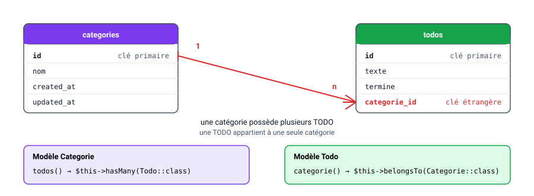

# Base de données & ORM

## Eloquent, les migrations

Par [Valentin Brosseau](https://github.com/c4software) / [@c4software](http://twitter.com/c4software)

---

## Le problème

Votre site Laravel fonctionne… mais il **oublie tout** à chaque rechargement.

Il nous faut une base de données.

---

## En PHP pur, ça donnait quoi ?

- Le SQL écrit à la main (`SELECT`, `INSERT`…).
- La connexion PDO, les erreurs.
- Les **injections SQL** à surveiller partout.
- Les résultats à transformer en tableaux.

---

## L'ORM

**O**bject **R**elational **M**apping :

- Une **table** = une **classe** PHP (le modèle).
- Une **ligne** = un **objet**.

Celui de Laravel s'appelle **Eloquent**.

---

## Concrètement

```php
$todos = Todo::all();
```

À votre avis, quelle requête SQL est exécutée derrière ?

---

## Derrière, du SQL classique

```sql
SELECT * FROM todos;
```

Eloquent **génère** le SQL pour vous (et le protège des injections).

---

## Question

D'accord, mais la table `todos`…

Qui l'a créée ? Et comment vos collègues auront la même ?

---

## Les migrations

La structure de la base **décrite en PHP**, dans le projet :

```php
Schema::create('todos', function (Blueprint $table) {
    $table->id();
    $table->string('texte');
    $table->boolean('termine')->default(false);
    $table->timestamps();
});
```

`php artisan migrate` transforme ça en vraie table.

---

## Pourquoi pas PhpMyAdmin ?

- La structure est **versionnée avec Git** : tout l'historique.
- Un collègue clone le projet, `migrate`, il a la même base.
- Reproductible sur le serveur de production.

Fini le « chez moi ça marche ».

---

## Une convention à retenir

```
Modèle : Todo      (singulier)
Table  : todos     (pluriel)
```

En respectant la convention, Laravel fait le lien **tout seul**.

---

## Et la base elle-même ?

Depuis Laravel 11 : **SQLite** par défaut.

Toute la base dans un fichier `database/database.sqlite`. Zéro configuration, parfait pour développer.

---

## Le CRUD avec Eloquent

```php
Todo::create(['texte' => 'Réviser']);   // Create
Todo::all();                            // Read
$todo->termine = true; $todo->save();   // Update
$todo->delete();                        // Delete
```

Pas une ligne de SQL.

---

## Une table, c'est bien. Deux ?

Nos TODO vont avoir une **catégorie** (Maison, Travail, Études…).

Comment relier la table `categories` à la table `todos` ?

---

## En SQL : une clé étrangère



Une catégorie possède **plusieurs** TODO, une TODO appartient à **une seule** catégorie.

---

## Rappel : One To Many

```php
class Categorie extends Model
{
  public function todos()
  {
    return $this->hasMany(Todo::class, 'categorie_id');
  }
}
```

Une catégorie « a plusieurs » TODO : `hasMany`.

---

## Rappel : l'inverse, le « Belongs To »

```php
class Todo extends Model
{
  public function categorie()
  {
    return $this->belongsTo(Categorie::class, 'categorie_id');
  }
}
```

Une TODO « appartient à » une catégorie : `belongsTo`.

Le second paramètre nomme la clé étrangère (facultatif si vous respectez la convention `categorie_id`).

---

## Et ensuite, dans le code

```php
// La catégorie d'une TODO (un objet)
Todo::find(1)->categorie->nom;

// Les TODO d'une catégorie (une collection)
Categorie::find(1)->todos;
```

Toujours **pas une ligne de SQL**, la jointure est faite par Eloquent.

---

## Et si une TODO a plusieurs étiquettes ?

Une TODO peut être « Urgent » **et** « Perso ».

Une colonne `tag_id` ne peut contenir qu'une valeur… alors comment faire ?

---

## La table pivot

```
tags        tag_todo         todos
 id   ←──   tag_id
            todo_id   ──→     id
```

Une **troisième table**, une ligne par association.

---

## Many To Many : `belongsToMany`

```php
// Dans Todo
return $this->belongsToMany(
    Tag::class, 'tag_todo', 'todo_id', 'tag_id'
);

// Depuis un formulaire à cases à cocher
$todo->tags()->sync($request->tags ?? []);
```

Le modèle, la table pivot, ma clé, la clé de l'autre.

---

## En bonus : le middleware

Un **filtre** exécuté avant le contrôleur :

```
Requête → Middleware → Contrôleur
              ↓
        (ou redirection)
```

Écrit une fois, appliqué à toutes les routes que vous voulez.

---

## Récapitulatif

- **ORM** : une table = une classe, une ligne = un objet.
- **Migrations** : la structure de la base, versionnée en PHP.
- Convention singulier / pluriel : Laravel relie modèle et table.
- **Eloquent** : le CRUD sans écrire de SQL.
- **Relations** : `hasMany` d'un côté, `belongsTo` de l'autre.
- **Table pivot** : `belongsToMany` + `sync` pour le plusieurs-à-plusieurs.
- **Middleware** (bonus) : un filtre avant le contrôleur.

---

## Des questions ?

Place au TP 🚀
