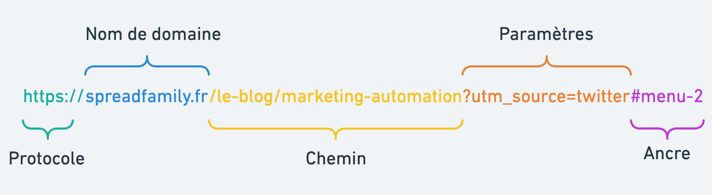
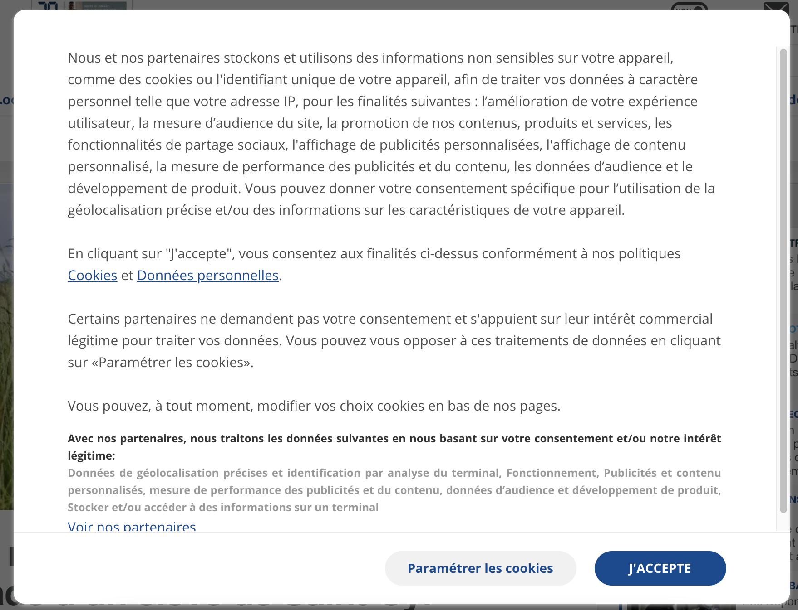

# Rappels PHP

Par [Valentin Brosseau](https://github.com/c4software) / [@c4software](http://twitter.com/c4software)

---

## Que vous souvenez-vous de PHP ?

---

## Les « Super-Globales »

Variables « automatiquement remplies », et ça dès le début de votre script.

---

[Liste des variables](/tp/php/support.md#les-super-globales)

---

- `$_GET` : Variables passées en paramètre dans l'URL
- `$_POST` : Variables passées en paramètre dans le corps de la requête HTTP
- `$_REQUEST` : Variables passées en paramètre dans l'URL ou dans le corps de la requête HTTP
- `$_COOKIE` : Variables passées dans les cookies
- `$_SESSION` : Variables de session

---

## Les URL

- `http://monsite.com/ma-page.php?param1=valeur1&param2=valeur2`

---



---

## À réfléchir

Soit l'URL suivante : `http://…/index.php?nom=Valentin&prenom=Brosseau`

Dans quelles variables super-globales retrouve-t-on les valeurs `Valentin` et `Brosseau` ?

---

## À réfléchir

```html
<form action="traitement.php" method="post">
    <input type="text" name="nom" />
    <input type="text" name="prenom" />
    <input type="submit" />
</form>
```

Dans quelles variables super-globales retrouve-t-on les valeurs saisies dans les champs `nom` et `prenom` ?

---

## La persistance

Sauvegarder des variables entre chaque chargement de pages

---

- La Session
- Les Cookies

---

### La session

- Sauvegarde pour une durée courte (quelques minutes).
- Sauvegarder **sur** le serveur.
- La durée dépend de l'activité de l'utilisateur.
- Propre au « domaine ».
- Différente pour chaque utilisateur.
- Tableau associatif

---

En PHP, elle est non démarrée par défaut

```php
<?php
session_start();
?>
```

⚠️ Le `session_start()` doit être la _première ligne_ de votre script PHP.

---

```php
<?php
// Enregistrer la variable
$_SESSION["ma_variable"] = "ceci est une valeur de session";


// La lire
echo $_SESSION["ma_variable"];
?>
```

Et … C'est tout !

---

### Les cookies

Comme la Session… Mais sauvegardé sur le poste client

---



---

### Poste client == Danger

Par défaut les valeurs enregistrées **dans** le cookie sont éditables par le client, donc il n'y a aucune garantie de ce que vous allez récupérer. Attention au XSS donc.

---

À réserver **aux données non sensibles**

- Paramètre d'affichage.
- Sauvegarde « de choix utilisateur ».
- Tracker un utilisateur (c'est ce que fait Google ou Facebook par exemple)

---

```php
// Enregistre une valeur
$value = 'Valeur de test';
setcookie("monCookie", $value);
setcookie("monCookie", $value, time()+3600);  /* expire dans 1 heure */

// Récupération d'un cookie
echo $_COOKIE["monCookie"];
```

---

## Mise en pratique

### Pratiquer les SESSIONS & Cookies

[je vous propose de pratiquer un peu la partie session](/tp/php/tp4.html)

---

## Des questions ?

---

## La suite… Laravel

---