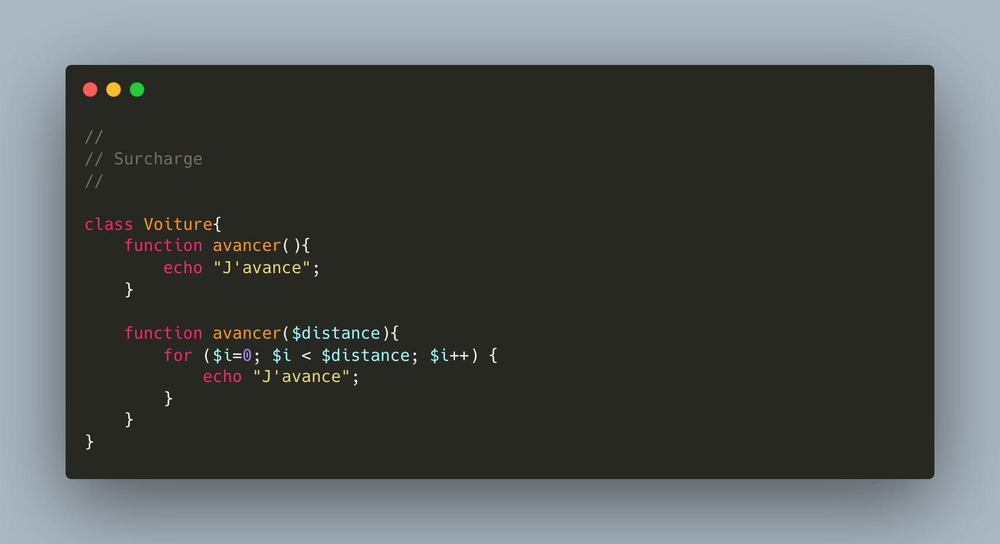
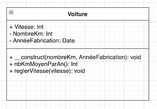
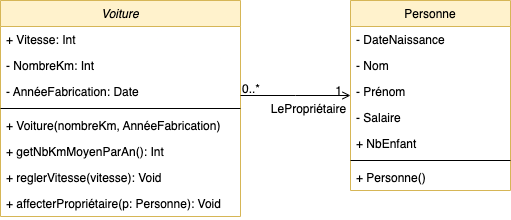
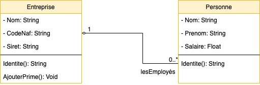
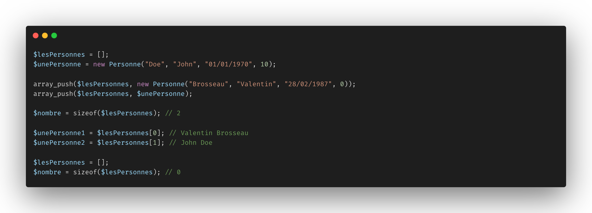
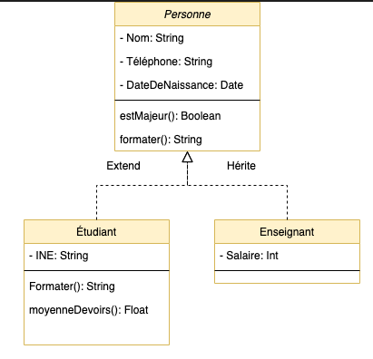
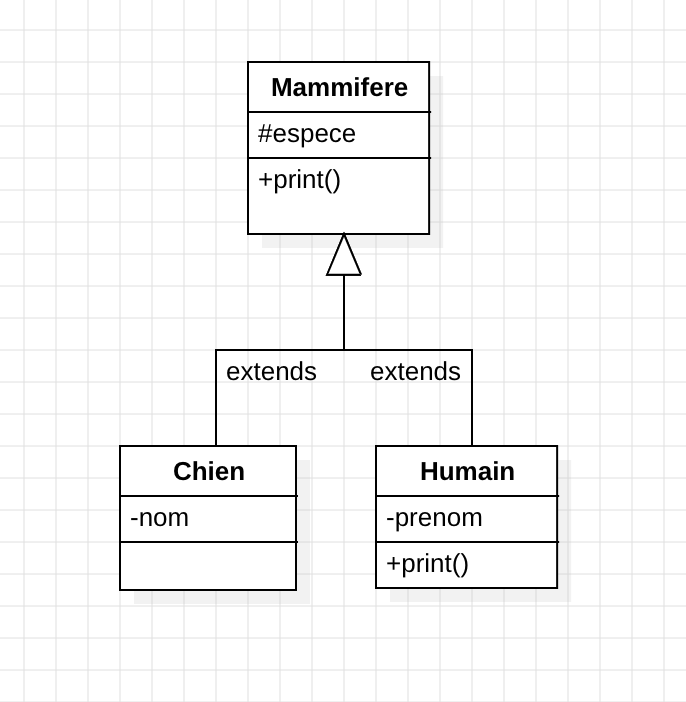
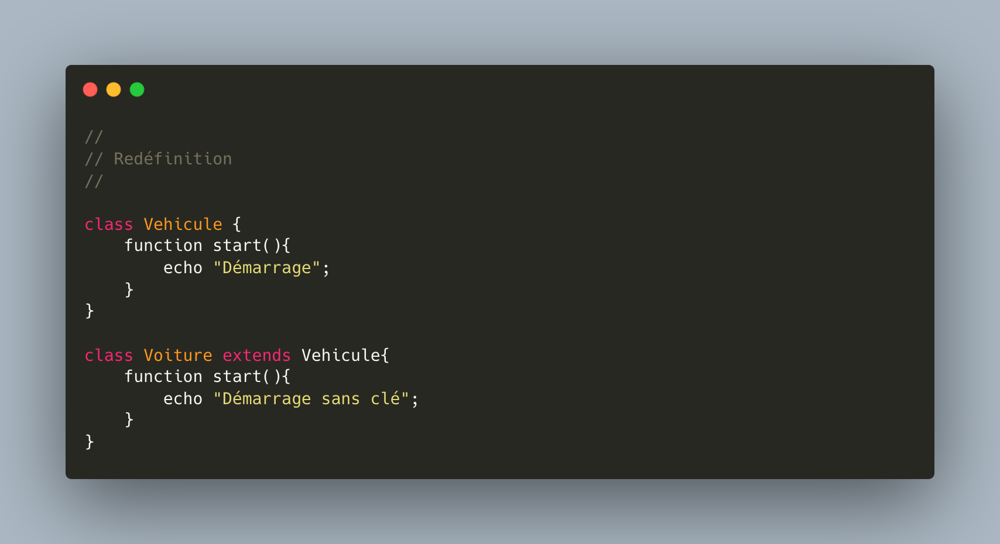

# POO

## La Programmation Orientée Objet

Par [Valentin Brosseau](https://github.com/c4software) / [@c4software](http://twitter.com/c4software)

---

Pourquoi la Programmation Orientée Objet ?

En groupe de 2 ou 3

- Que vous souvenez-vous ?
- Où faites-vous déjà de la POO ? Quels sont les avantages ?

---

## La POO c'est 4 concepts

---

**Concept de modélisation** à travers la notion de classe et d’instanciation de ces classes.

---

**Concept d’action** à travers la notion d’envoi de messages et de méthodes à l’intérieur des objets.

---

**Concept de construction** en créant un objet en reposant sur la définition d’une classe.

---

**Concept d'encapsulation** l'accès aux propriétés se fait via un getter et un setter (inaccessible de l'exterieur de l'objet).

---

### Mais surtout

Ça permet de représenter **informatiquement** quelque chose du monde réel.

---

### Deux notions

- Les classes
- Les objets

---

### Les classes

Représente une définition d'une problématique réelle.

- « Qu'est-ce que je souhaite représenter ? »
- « Comment déterminer ce que je souhaite représenter »
  - Spécifications client.
  - Mes connaissances du problème / de ce que je souhaite représenter

---

Serviront de moule pour créer des objets.

---

Une classe étant **une définition**, elle nous servira plus tard à créer **des objets**.

---

### Une classe est composée de :

- D'attributs (variable d'instance ou propriété).
- De méthodes (actions / opération au niveau de la classe).

---

### Nous avons donc deux types membres dans la classe

- Des **propriétés** (le données de l'objet) **avec une visibilité**
- Des **méthodes** (les actions possibles : accélérer, freiner, etc.) **avec une visibilité**

---

### La visibilité ?

- Privée : accessible que dans l'objet.
- Public : accessible hors de l'objet.
- Protected : **accessible** aux enfants (héritage) mais **pas en dehors**.

---


---

### Les méthodes

- Comme une fonction, mais **encapsulé** dans la classe.
- Possède une visibilité.
- Possède des paramètres.
- Surcharge: plusieurs **méthodes** peuvent avoir le même nom et des paramètres différents (type et/ou ordre).

---

### Les type de méthodes

- Le constructeur.
- Les méthodes d'actions.
- Les méthodes accesseurs / mutateurs.

---

### Un exemple


---

```php
class Personne
{
    // Attribut
    private $nom;
    private $prenom;
    private $dateNaissance;
    private $salaire;
    public $nbEnfant;


    // Constructeur
    function __construct($nom, $prenom, $dateNaissance, $nbEnfant = 0)
    {
        $this->nom = $nom;
        $this->prenom = $prenom;
        $this->dateNaissance = $dateNaissance;
        $this->nbEnfant = $nbEnfant;
    }

    // Mutateurs
    public function setSalaire($valeur)
    {
        $this->salaire = $valeur;
    }

    // Accesseur
    public function getSalaire($valeur)
    {
        return $this->salaire;
    }


    // Méthode
    public function identite(){
        return $this->nom . " " . $this->prenom;
    }

    // Méthode
    public function age()
    {
        $date = new DateTime($this->dateNaissance);
        $now = new DateTime();
        $interval = $now->diff($date);
        return $interval->y;
    }

    // Méthode
    public function argentPoche()
    {
        return $this->salaire / $this->nbEnfant;
    }
}
```

---

### Surcharges



---

```php

<?php
class SimpleClass
{
    // déclaration d'une propriété
    public $var = 'une valeur par défaut';
    public $var2 = 'une valeur par défaut';

    // Constructeur
    function __construct($var, $var2)
    {
        $this->var = $var;
        $this->var2 = $var2;
    }

    // déclaration des méthodes
    public function displayVar() {
        echo $this->var;
    }

    public function setVar($var){
        $this->var = $var;
    }

    public function setVar($var, $var2){
        $this->var = $var;
        $this->var2 = $var2;
    }
}
?>

```

---

<fieldset>
  <legend>Ce qu'il faut retenir</legend>
    <li>Les classes sont instanciables (création d'objets, <code>new Personne(…)</code>).</li>
    <li>Les propriétés sont les « variables » de l'objet.</li>
    <li>Les méthodes sont les « actions » de l'objet.</li>
    <li>Les méthodes <b>et</b> les propriétés <b>ont des visiblités</b>.</li>
    <li>Les méthodes peuvent être surchargées.</li>
</fieldset>

---

### Les objets

Chaque objet représente un objet du monde réel

exemple :

- une personne **précise**
- une voiture **spécifique**
- Un élément de menu.

---

⚠️ Utilise les classes précédemment définies ⚠️

```php
$personne1 = new Personne("Valentin", "Brosseau", "28/02/1987", 0);
$personne2 = new Personne("John", "Doe", "01/01/1970", 12);
```

👀 Créer un objet == Instancier 👀

---

### À faire

Nous souhaitons modéliser la problématique d'un vendeur de voitures.

---

Supposons que chaque Voiture possède :

- les « attributs » suivant :
  - Une vitesse.
  - Un nombre de km.
  - Une année de fabrication.
- Les actions suivantes :
  - Calcul du nombre de km moyen par an depuis la fabrication.
  - Accélérer.

---

_Une solution possible_



---

## Les multiplicités

« La relation » entre deux classes.

---

Une personne possède une ou des voiture(s).

---



---

```php
class Voiture {

    private Integer $vitesse;
    private Integer $nombreKm;
    private Date $annéeFabrication;
    private Personne $lePropriétaire;

    // Reste de la classe

    function affecterPropriétaire($propriétaire){
        $this->lePropriétaire = $propriétaire
    }

}
```

---

Aide mémoire écriture

[Aide mémoire POO](/cheatsheets/poo/)

---


```php
$personne1 = new Personne("Valentin", "Brosseau", "28/02/1987", 0);
$personne2 = new Personne("John", "Doe", "01/01/1970", 12);
```

---

## Les collections d'objets

---

Regrouper plusieurs objets « dans une liste »

---

Exemple, comment gérer le cas de :

« Une entreprise contient des personnes (employés) »

---



---

_Définition_ : Une collection est un ensemble d'objets qui sont
regroupés ensemble sous un même nom.

---


---

PHP

```php
$lesPersonnes = [];
```

---

### Ajouter en liste

```php
$unePersonne = new Personne("Doe", "John", "01/01/1970", 10);

array_push($lesPersonnes, new Personne("Brosseau", "Valentin", "28/02/1987", 0));
array_push($lesPersonnes, $unePersonne);
```

---

### Vider la liste

```php
$lesPersonnes = [];
```

---

### Mais également

```php
sizeof($lesPersonnes);
```

---

### En résumé

Un parallèle intéressant.

---



PHP

---


Java

---

### Parcourir une collection

---

En PHP :

```php
foreach($lesPersonne as $laPersonne){
    // $laPersonne contient « un pointeur » vers une des personne de la liste
    // À chaque tour de boucle nous avons la personne suivante.
}
```

---

En Java :

```java
// Version moderne
lesPersonnes.forEach(laPersonne -> {
    // laPersonne contient « un pointeur » vers une des personne de la liste
    // À chaque tour de boucle nous avons la personne suivante.
});

// Version « à l'ancienne »
for (Personne laPersonne : lesPersonnes) {
    // laPersonne contient « un pointeur » vers une des personne de la liste
    // À chaque tour de boucle nous avons la personne suivante.
}
```

---

Aide mémoire écriture et comparaison

[Aide mémoire POO](/cheatsheets/poo/)

---

### La modélisation


---

<!-- .slide: data-background="./res/heritage.jpg" data-auto-animate style="color: white" -->

L'héritage

Ça vous évoque quoi ?

---

L’héritage permet :

- lors de la déclaration d’une classe, d'y inclure les caractéristiques d’une autre classe.
- Partager de la logique.
- Partager des propriétés ou des méthodes.
- Factoriser du code.

---

## On observe…

### Que constatez-vous ?

---

```php [1-16|18-30|32-36]
class Mammifere {
    protected $vertebre = true;
    protected $espece = "";

    public __construct($espece) {
        $this->espece = $espece;
    }

    public print() {
        echo "Je suis un mammifère";
    }

    public function manger(){
        return "";
    }
}

class Humain extends Mammifere {
    private $prenom = "";

    function __construct($prenom)
    {
        parent::__construct("Humain");
        $this->prenom = $prenom;
    }

    public function manger(){
        return "Je suis omnivore";
    }
}

$unHumain = new Humain("Valentin");
$unHumain->print(); // Je suis un mammifère.
$unHumain->manger(); // Je suis omnivore.
```

---

<fieldset>
  <legend>La visibilité !</legend>
    <li>Privée : accessible que dans l'objet.</li>
    <li>Public : accessible hors de l'objet.</li>
    <li>Protected : <b>accessible</b> aux enfants (héritage) mais <b>pas en dehors</b>.</li>
</fieldset>

---


---

<!-- .slide: data-background="./res/cat.jpg" -->

- Est-ce que le chien et le chat peuvent avoir un nom ?
- Pourquoi l'héritage est intéressant ici ?
- Écrire la définition de classe correspondant au diagrame UML.

---

<fieldset>
  <legend>L'UML</legend>
  <ul>
    <li>Permet d'avoir un langage d'échange</li>
    <li>Standardise</li>
  </ul>
</fieldset>

---

## Un instant…

Comment détecter l'héritage ?

- Si vous pouvez dire **_« est un »_**.
- Si votre classe possède le mot-clé **_extends_**.

---

- **_« Un chien est un mammifère »_**
- `class Chien extends Mammifere`

---

- **_« Un chat est un mammifère »_**
- `class Chat extends Mammifere`

---

- **_« Un humain est un mammifère »_**
- `class Humain extends Mammifere`

---



---

- Que constatez-vous ?
- Pourquoi avons-nous décidé de découper la logique comme ceci ?
- Pourquoi l'héritage est intéressant ici ?
- Écrire la définition de classe correspondant au diagrame UML.

---

## Appeler une méthode parente

```php
class Etudiant extends Personne {
    // … Reste de la classe…
    public function formater(){
     if($this->estMajeur()){
        return "L'étudiant est majeur";
     } else {
        return "L'étudiant n'est pas majeur";
     }
    }
}
```

Que constatez-vous ?

---

Deux solutions :

```php
$this->estMajeur(); // Appel la méthode la plus proche.
parent::estMajeur(); // Appel la méthode de la classe parente.
```

---

## La plus proche ?

- La méthode la plus proche dans l'arbre d'héritage.
- Si la méthode n'existe pas dans la classe fille, alors on remonte dans l'arbre d'héritage.

Car les enfants peuvent **redéfinir** les méthodes de la classe parente. (**Redéfinition** / **Override**)

---

```java
class Personne {
    protected int age = 0;

    public function estMajeur(){
        return $this.age >= 18;
    }
}

class Americain extends Personne {
    /**
     * @override
     * @return bool
     * @description Retourne vrai si la personne est majeur.
     */
    public function estMajeur(){
        return $this->age >= 21;
    }
}
```

---

En cas de redéfinition, on parle de spécialisation. C'est-à-dire que l'enfant sera plus précis que le parent.

Un autre exemple du monde réel ?

---

## L'héritage c'est donc

### Un arbre


---



---

## Un arbre ou il faut initialiser le parent

```php
class Mammifere {
    protected $espece = "";

    public __construct($espece) {
        $this->espece = $espece;
    }

    /**
     * Affiche l'espèce
     */
    public function print() {
        echo "Je suis un $this->espece";
    }
}

class Humain extends Mammifere {
    private $prenom = "";

    function __construct($prenom)
    {
        parent::__construct("Humain");
        $this->prenom = $prenom;
    }

    /**
     * Affiche l'espèce & le prénom
     */
    public function print(){
        parent::print();
        echo "Je m'appelle $this->prenom";
    }
}

class Chien extends Mammifere {
    private $nom = "";

    function __construct($nom)
    {
        parent::__construct("Chien");
        $this->nom = $nom;
    }
}
```

---

## Exercice

- Créer un Humain nommé « Valentin ».
- Créer un Humain nommé « Carine ».
- Créer un Chien nommé « Médor ».
- Mettre les trois objets dans une liste.
- Parcourir la liste et afficher le nom de chaque objet.
- Écrire ce que vas afficher le parcours de la liste.

---

## C'est à vous

### Seul ou en groupe, trouvez des exemples d'héritages

---

## Mais nous pratiquons un exemple déjà

### La structure MVC / Laravel

---

## Analyse !

### À vous de me dire là où se trouve l'héritage, et pourquoi c'est intéressant…

---

<fieldset>
  <legend>Synthèse</legend>
    <li>La classe mère contient la logique <b>partagée</b>.</li>
    <li>La classe fille contient la logique <b>spécifique</b>.</li>
    <li>Un mot-clé Extends <code>class Humain extends Mammifere</code>.</li>
    <li><b>Vous devez</b> construire le parent dans le constructeur de l'enfant.</li>
    <li><b>Permets de généraliser un objet afin de partager des propriétés communes.</b>.</li>
    <li><b>mais</b> il est également possible de spécialiser / redéfinir un objet.</li>
    <li>Redéfinition, comme la surcharge, mais entre la classe fille et la classe mère.</li>
    <li>Il est possible d'appeler les méthodes du parent via `$this->…` ou `parent::…`</li>
</fieldset>

---

Mise en pratique.

---

## Surcharge & Redéfinition

- Qui peut me rappeler la différence ?

---


- Quel est l'intérêt ?
- À vos crayons ! Est-ce optimisable ?

---



- Quel est l'intérêt ?

---

## Les classes Statiques

- Méthode & Propriété accessible **sans besoin d'un new**
- Permets d'encapsuler une logique.

---

```php
class Greeting {
  public static function welcome() {
    echo "Hello World!";
  }
}

Greeting::welcome();
```

- Que constatez vous ?
- Avez-vous des exemples d'usage en tête ?

---

## Classes Abstraites & Interfaces

### Touchons du doigt le véritable intérêt de la POO

---

## Les classes abstraites

Classe dont l'implémentation n'est pas complète et qui **n'est pas instanciable**.

---

## STOP !

Non instanciable ? Qu-est-ce que ça veux dire ?

---

## Donc pas de `new MaClassAbstraite()`

---

<iframe src="https://giphy.com/embed/MZQkUm97KTI1gI8sUj" width="480" height="480" frameBorder="0" class="giphy-embed" allowFullScreen></iframe>

---

<fieldset>
  <legend>Définition</legend>
    <li>Sers de base à d'autres classes dérivées (héritées).</li>
    <li>Ne peut pas être instanciée (pas de new).</li>
    <li>Permets de factoriser du code.</li>
    <li>Dois être héritée depuis une classe fille.</li>
    <li>Apporte une sécurité grâce à l'encapsulation.</li>
</fieldset>

---

Encapsulation ? Pouvez-vous me redonner la définition.

---

Avez-vous déjà vu des classes asbtraites ?

---

[Mise en pratique](/cours/exercices/poo/les-classes-abstraites.html)

---

```php
abstract class EtudiantAbstrait
{
    // Force les classes filles à définir cette méthode
    abstract protected function getSpecificite();
    abstract protected function setSpecificite($valeur);

    // méthode commune
    public function parler() {
        print "Je suis " . $this->getSpecificite() . "\n";
    }
}

class EtudiantSIO extends AbstractClass
{
    $option = "";

    function __construct($option){
        $this->option = $option;
    }

    protected function getSpecificite() {
       return $this->option;
    }

    protected function setSpecificite($valeur) {
       $this->option = $valeur
    }
}
```

---

## Les interfaces

Une interface ressemble à une classe abstraite dans laquelle aucune méthode ne serait implémentée.

<fieldset>
  <legend>Définition</legend>
    <li>Ne contiens que des méthodes publiques.</li>
    <li>Ne contiens aucun code.</li>
    <li>N'est pas instanciable.</li>
    <li>Son « un contrat » que les classes filles devront <b>implémenter</b>.</li>
</fieldset>
---

[Entrons dans le détail](/cours/revealjs/index.html?source=les_interfaces)

---

[Mise en pratique](/cours/exercices/poo/les-interfaces-1.html)

---

## Classe abstraite ou Interface ?

---

- Quelle(s) différence(s) avez-vous constatez ?

---

Classes abstraites et interfaces ont chacune une fonction bien distincte :

- Les classes abstraites servent à factoriser du code.
- Tandis que les interfaces servent à définir des contrats de fonctionnement.

---

## Des questions ?
