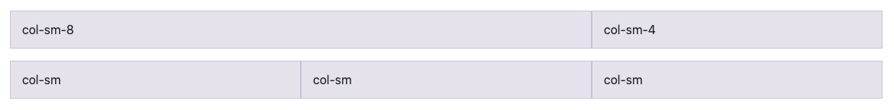
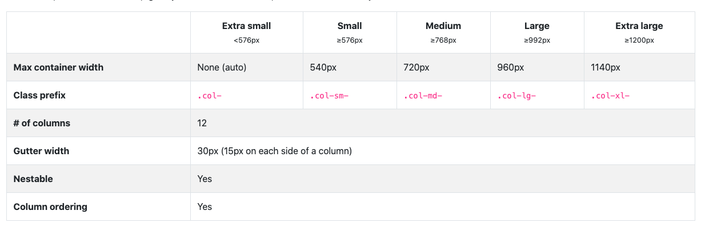

# Site web Responsive

Par [Valentin Brosseau](https://github.com/c4software) / [@c4software](http://twitter.com/c4software)

---

## Le Web c'est aussi du mobile

### De + en + de mobile même

---


Source : [statcounter.com](https://gs.statcounter.com/platform-market-share/desktop-mobile-tablet/france/#monthly-202008-202010-bar)

---

## Vous devez donc travailler sur le sujet

---

## Mobile First ?

### Ou

## Desktop First ?

---

Mon choix… Mobile first.

- Massivement utilisé
- Contrainte plus forte
- Adaptation plus simple

---

## Comment ça fonctionne ?

---

## Repose sur deux choses

---

## Une meta

```html
<meta name="viewport" content="width=device-width, initial-scale=1.0" />
```

(À ajouter dans votre head)

---

## Des media Queries

```css
/** Valeur par defaut **/
body {
  background: red;
}

/** Valeur pour un viewport <= 800px **/
@media (max-width: 800px) {
  body {
    background: blue;
    color: white;
  }
}
```

(Dans votre fichier CSS)

---

## Demo

[Démo Media Queries « simple »](/demo/css/responsive/index.html)

---

## Mais, mais… c'est complexe en fait ?

<iframe src="https://giphy.com/embed/Q5LkvvJD5yb0U8TqOf" width="480" height="270" frameBorder="0" class="giphy-embed" allowFullScreen></iframe>

### Pas vraiment, mais c'est du temps à passer…

---

[Support avec plus détail](/tp/html_css/support.html)

---

## On code un peu ?

[Mise en pratique](/tp/html_css/tp4.html)

---

## Certains en réfléchi au sujet

---

## Un fonctionnement en 12 Colonnes

---


1. Colonne
2. Espacement (gutters)
3. Marge (margins)

---

[Quelques bonnes pratiques](https://material.io/design/layout/responsive-layout-grid.html#columns-gutters-and-margins)

---

## Intégré par les frameworks CSS

- [Bootstrap](https://getbootstrap.com/)
- [Tailwind](https://tailwindcss.com/)
- [Foundation](https://get.foundation/)
- …

---

## Repose sur des class « déjà faite »

### Exemple avec Bootstrap

---

```html
<div class="container">
  <div class="row">
    <div class="col-sm-8">col-sm-8</div>
    <div class="col-sm-4">col-sm-4</div>
  </div>
  <div class="row">
    <div class="col-sm">col-sm</div>
    <div class="col-sm">col-sm</div>
    <div class="col-sm">col-sm</div>
  </div>
</div>
```

---



---



---

```html
<div class="container">
  <div class="row">
    <div class="col-sm-12 col-md-6">
      100% sur mobile, 50% sur desktop / tablette
    </div>
    <div class="col-sm-12 col-md-6">
      100% sur mobile, 50% sur desktop / tablette
    </div>
  </div>
  <div class="row">
    <div class="col-sm">col-sm</div>
    <div class="col-sm">col-sm</div>
    <div class="col-sm">col-sm</div>
  </div>
</div>
```

---

## Les frameworks vont plus loin

[Démo](https://getbootstrap.com/docs/4.5/layout/grid/)

---

## Beaucoup plus loin

Un système « de composants » pour éviter d'écrire de la CSS « basique »

- Alert
- Bouton
- Table
- …

[Démo](https://getbootstrap.com/docs/4.5/components/alerts/)
