# Découverte des bases d'Android

::: details Sommaires
[[toc]]
:::

::: danger XML ou Compose ?

Nous sommes en 2023, le monde d'Android évolue… Pendant des années l'écriture des « layouts » (interface) n'était possible que via du XML. Il est maintenant possible d'écrire les layouts de manières bien plus modernes avec [JetPack Compose](https://developer.android.com/jetpack/compose). Le TP que vous suivez est toujours valide, mais repose sur l'utilisation de XML.

:::

## Créer un projet

La première étape est la création d'un projet. Pour ça nous allons utiliser « Android Studio » qui est l'IDE à utiliser pour créer une application Android.

Lors de la création, Android Studio va nous poser plusieurs questions, nous allons donc choisir :

- Template : Empty View Activity
- Language : Kotlin
- SDK Min. : SDK 26.

Je vous laisse suivre les étapes de création d'un nouveau projet.

::: warning Mais quelques petites remarques :

- Le choix du package est très important. Comme nous avons vu ensemble en cours, le « Package » doit être unique. En effet deux applications ne peuvent pas avoir le même.
- Choisir un min SDK qui correspond aux cibles des mobiles souhaités. (Si vous êtes en France ou dans un autre pays, il conviendra de faire le bon choix).
- Kotlin est maintenant le langage à choisir, Java et Kotlin cohabite sans problème vous n'aurez donc aucun problème de compatibilité.

:::

## Création de l'émulateur

Comme vu ensemble pendant le cours, l'émulateur va nous permettre de tester « simplement » notre application avec des performances _suffisante dans les cas simple_. La création de celui-ci est intégrée à Android Studio. Dans Android Studio la partie émulateur s'appelle Device Manager et est disponible dans le menu `tools`


Pour le choix du type de devices vous êtes libres… Mais le mieux est de choisir un « template de mobile » assez représentatif de ce que l'on trouve chez les clients. Un bon choix est par exemple un « Pixel 6a » avec Android Oreo.

::: tip

Le Logo Playstore présent sur la ligne d'un simulateur indique que celui-ci est équipé des Play Services. Bien que dans notre cas ça ne change pas grand-chose, je vous invite vivement à choisir un émulateur avec les Play Services, car celui-ci sera très proche d'un vrai téléphone trouvable dans le commerce.

:::

Maintenant que votre émulateur est créé, nous allons pouvoir lancer l'application « Run -> Run App ».

## Les textes

Android est une plateforme « ouverte » et nativement prévue pour fonctionner dans le monde entier (Android pour tous). Il est donc logique que le i18n (internationalisation) soit intégré et ~même recommandé~ obligatoire pour tout bon développeur.

L'ensemble des textes de votre application _doit être_ dans le fichier `values/strings.xml`. Je vous laisse y jeter un petit coup d'œil :eyes:

## Découverte des dossiers

En complément de ce dont je vous ai parlé en cours, je vous laisse quelques minutes découvrir l'ensemble des dossiers. Je vous laisse regarder plus en détail le dossier `res`, mais également les fichiers `gradle`.

Quelques points d'attentions :

- Le dossier `res`.
- Les images déjà présentes dans votre projet, notamment le XML pour l'icône.
- La structure en général et l'organisation en `package` qui reprend votre choix lors de la configuration.

## Le fichier AndroidManifest

Pour rappel le fichier manifest va nous permettre d'exposer « de la configuration » relative à votre application sur le téléphone, cette configuration est très large :

- Le nom de votre application.
- Les `activity` accessibles.
- L'icône de votre application.
- Les services de votre application.
- Les paramétrages spécifiques de vos activités (Orientation, thème, comportement…)

### À faire :

- Éditer le fichier `AndroidManifest.xml`.
- Changer le nom de votre application (attention à bien utiliser la mécanique `i18n`).
- Regarder l'ensemble des paramètres spécifier dans le XML
- Tester à nouveau votre application

::: tip
Petit raccourci pratique d'Android Studio. Si vous appuyez deux fois sur la touche <kbd>Shift</kbd><kbd>Shift</kbd> Android Studio vous proposera de chercher des actions / fichiers / menus dans l'ensemble de votre projet.
:::

## Personnalisation de votre application

Changer l'icône de l'application en utilisant les outils fournis par Google dans Android Studio « Image asset » :

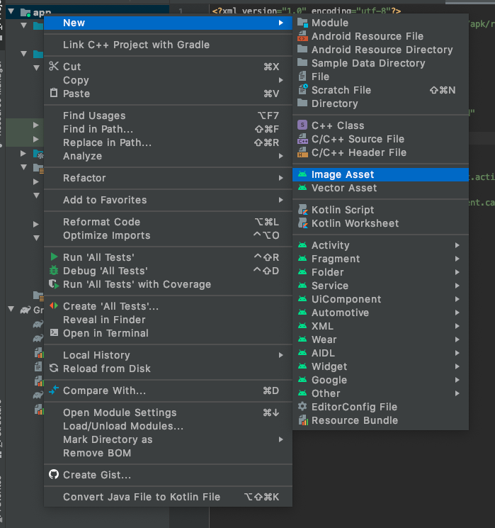

Une fois fait, regarder les modifications dans votre projet.

_Notamment :_

- Le fichier `AndroidManifest.xml` est-ce que celui-ci a été modifié ?
- Si oui, quel(s) élément(s) sont différents ?
- Si non, pouvez-vous me dire pourquoi ?

## Les layouts

Si vous avez ouvert le fichier `activity_main.xml` vous avez certainement constaté que celui-ci était très simple. Nous allons donc le modifier un petit peu.

::: tip
Android Studio vous propose un éditeur graphique de l'interface, c'est pratique, mais pour apprendre ce n'est pas idéal. Je vous propose de changer de mode d'édition afin de passer en mode XML via la vue `Split`. Qui nous affichera à la fois le graphique ainsi que le XML.

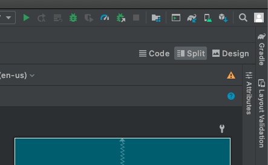

:::

### À faire :

- Éditer le layout `activity_main.xml`.
- Ajouter une balise ImageView.
- Ajouter également une balise Button.

### Les ressources alternatives

Android intègre la gestion des ressources « alternative », c'est-à-dire la possibilité de charger automatiquement des ressources en fonction de conditions liées au téléphone du client type :

- Taille de l'écran.
- Langue.
- Rotation de l'écran (Paysage / Portrait).
- DPI
- Thème sombre
- Version d'Android
- etc.

Cette création de ressource est réalisable directement depuis Android Studio :


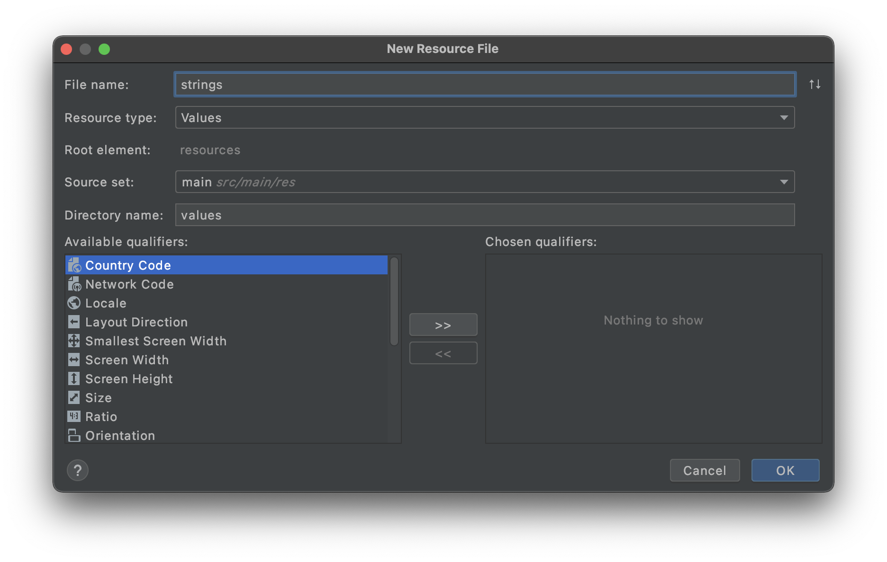

::: tip Vous pouvez tout redéfinir
L'ensemble des ressources (`res`) est redéfinissable sans écrire de code. Par exemple si vous souhaitez redéfinir des `strings` dans différentes conditions il suffit de :

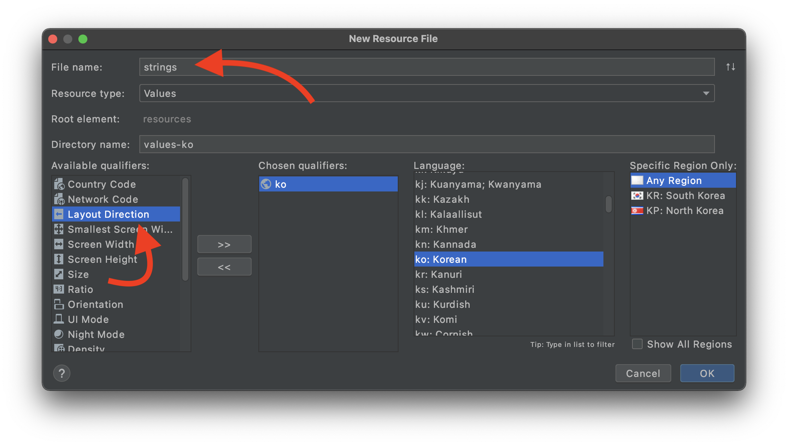

:::

### À faire :

- Éditer le layout `activity_main.xml`.
- Ajouter une balise TextView.
- Dans le `android:text` utiliser une strings `android:text="@strings/monString"`.
- Celle-ci doit être différente en fonction si l'utilisateur a son téléphone en paysage (`land`) ou en portrait.
- Ajuster également la taille du logo pour que celui-ci soit plus petit si le téléphone est en portrait (`land`).

### Les dimensions et contraintes

Vous avez donc ajouté deux nouveaux éléments dans votre layout, mais ils n'ont n'y taille ni « positions ». En effet, comme vu ensemble en cours, nous utilisons un layout de type « ConstraintLayout » c'est-à-dire que vos éléments doivent être contraints les uns par rapport aux autres.

Vous allez donc devoir ajouter les attributs suivants sur vos deux nouveaux éléments :

```xml
<VotreElement
    android:id="@+id/monElement"
    android:layout_width="wrap_content"
    android:layout_height="wrap_content"
    app:layout_constraintBottom_toBottomOf="parent"
    app:layout_constraintEnd_toEndOf="parent"
    app:layout_constraintStart_toStartOf="parent"
    app:layout_constraintTop_toTopOf="parent"
/>
```

_Un peu d'explication :_

- `android:id` permet de rendre l'élément accessible depuis le code, ou tout simplement depuis un autre élément afin de définir une contrainte.
- `android:layout_width` et `android:layout_height` définisse la taille de votre élément. `wrap_content` indique que la taille doit être celle du contenu. Je vous laisse découvrir les autres propriétés avec <kbd>alt</kbd> + <kbd>entrée</kbd> sur `wrap_content`.
- `app:layout_constraint…` définissent les contraintes entre l'élément et les autres éléments de layout. Dans notre cas « parent » signifie que les contraintes seront avec le parent, c'est-à-dire la fenêtre dans le cas présent.

::: tip
Si vous souhaitez contraindre un élément avec un autre, la syntaxe sera la même, mais vous allez devoir indiquer une contrainte du type `"@id/imageView"`.
:::

### À faire :

Je vous laisse réaliser l'ensemble des contraintes afin que votre layout ressemble à :

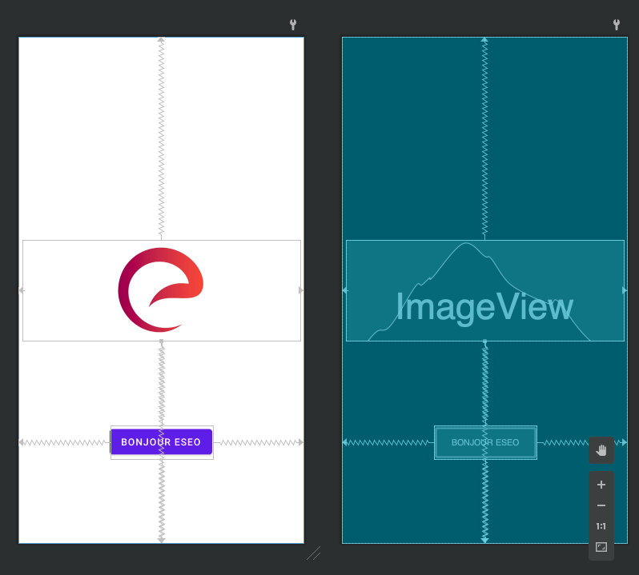

:warning: Vous noterez l'icône de l'ESEO, je vous laisse l'ajouter dans le dossier `drawable` de votre projet. Le fichier doit être au format `png` ou `jpeg`. Une fois celle-ci ajoutée modifier l'ImageView pour l'utiliser dans l'`ImageView` avec par exemple `app:srcCompat="@drawable/eseo"`.

:hand: Relancer l'application et tester que celle-ci fonctionne.

## L'activity

Nous avons une activity qui pour l'instant ne fait pas grand-chose. Si vous regardez le code, celui-ci est presque vide. Je vous propose de la modifier, en premier lieu nous allons ajouter un message au lancement de celle-ci.

Un message simple sur Android s'appelle un Toast :

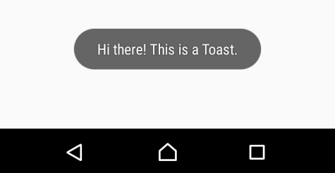

Ajouter celui-ci dans la méthode `onCreate` de votre `MainActivity.kt`.

Vous pouvez utiliser la complétion de votre IDE, `toast` puis <kbd>tab</kbd>.

::: tip
Les toasts sont rapides et simples à mettre en place. Cependant, ils ne sont pas très beaux. C'est pour ça que nous les utiliserons principalement que pour « les informations de tests ou sans grandes importances ».
:::

### À faire :

- Ajouter le Toast.
- Le context, comme vu ensemble pendant le cours correspond à votre `activity` donc il faut indiquer `this`.
- Pour le texte, pensez bien à mettre celui-ci dans le fichier `strings.xml` puis à le récupérer via `getString(R.string.votreId)`.

:hand: Tester votre modification.

### La Snackbar

Un autre moyen d'interagir avec l'utilisateur, c'est via un Snackbar. Une snackbar est très similaire à un Toast, cependant elle pourra servir pour afficher des messages importants et surtout des messages avec lesquels nous allons pouvoir interagir.

Je vous laisse modifier votre code pour remplacer le Toast par :

```kotlin
Snackbar.make(findViewById(android.R.id.content), "Je suis une Snackbar", Snackbar.LENGTH_LONG).show()
```

**Ou**

```kotlin
Snackbar.make(findViewById(android.R.id.content), "Je suis une Snackbar", Snackbar.LENGTH_LONG).setAction("Action") {
   // Votre action
}.show()
```

::: tip Vous souhaitez changer la durée d'affichage ?

Plusieurs options s'offre à vous :

- `Snackbar.LENGTH_SHORT`
- `Snackbar.LENGTH_LONG`
- `Snackbar.LENGTH_INDEFINITE`

:::

## Rendre un élément clickable

Pour rendre un élément cliquable sur Android, nous avons plusieurs façons de faire. La première c'est dans le code via son id et la méthode `findViewById`.

Ajouter dans votre méthode `onCreate` le code suivant :

```kotlin
    findViewById<Button>(R.id.myButton).setOnClickListener {
        // Votre action
    }
```

Et voilà… Votre bouton est cliquable.

### À faire

- Rendre votre bouton clickable.
- Afficher un Toast sur le OnClick.

:warning: Attention à bien référencer le bon `R.id.myButton` par rapport à votre layout.

## Rendre un élément clickable 2

Le `ViewBinding` est maintenant la nouvelle façon moderne de gérer « les références à la vue depuis le code Kotlin ». Ça fonctionne un peu comme le `findViewById` sauf que le Binding est automatique et surtout celui-ci gère automatiquement le typage !

Première étape, il faut activer dans votre build.gradle le « ViewBinding », dans le block Android déjà présent ajouter :

```gladle
buildFeatures {
    viewBinding true
}
```

Exemple dans mon cas :


:hand: N'oubliez pas de resync l'IDE

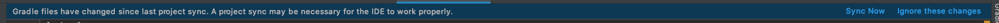

Maintenant nous avons maintenant un Binding automatique entre « La vue et le Code Kotlin », cependant pour que celui-ci soit accessible de l'ensemble de notre classe, nous allons devoir modifier légèrement notre `class`.

Exemple de modification dans la `MainActivity` :

```kotlin
class MainActivity : AppCompatActivity() {

    private lateinit var binding: ActivityMainBinding // <-- Référence à notre ViewBinding

    override fun onCreate(savedInstanceState: Bundle?) {
        super.onCreate(savedInstanceState)

        // --> Indique que l'on utilise le ViewBinding
        binding = ActivityMainBinding.inflate(layoutInflater)
        setContentView(binding.root)

        // L'ensemble de nos références sont disponibles directement dans « binding »
        binding.button.setOnClickListener {
            // Click sur le Button nommé « Button » dans notre Layout.
        }
    }
}
```

[En savoir plus dans la documentation](https://developer.android.com/topic/libraries/view-binding)

### À faire

Modifier le code précédent pour utiliser la nouvelle façon vue précédemment.

### Les Kotlin Android Extension

::: warning Cette méthode est maintenant dépréciée
Bien que pratique, cette méthode n'est maintenant plus « la bonne façon de faire.

La seconde façon (moins longue) d'accéder à un élément est via « les Kotlin-Android-Extensions ».

::: details Je prends le risque je regarde

Les extensions sont à ajouter dans votre `build.gradle` (app). Ajouter

```gradle
plugins {
    id 'com.android.application' // Déjà présente.
    id 'kotlin-android' // Vous devez déjà l'avoir.
    id 'kotlin-android-extensions' // <- Cette ligne.
}
```

:hand: N'oubliez pas de resync l'IDE


Maintenant vous pouvez simplement faire `myButton.setOnClickListener…` pour rendre l'élément cliquable.

:::

### Créer une autre activity

Nous allons ajouter une nouvelle activity, celle-ci sera un « Splash Screen », elle sera donc affichée au lancement de l'application.

#### Étape 1 : Créer l'activity

Pour créer une activity, Android Studio nous propose dans les menus une action qui automatise l'ensemble du processus à savoir :

- Création du package
- Création de la class
- Création du layout
- Modification du AndroidManifest.xml

Créer la nouvelle activity :

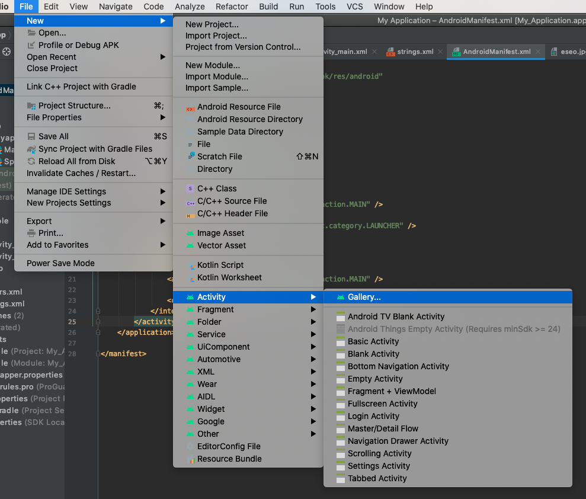

Puis :

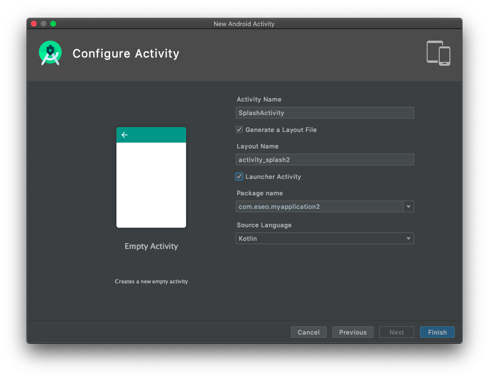

#### Étape 2 : Voir / Modifier le fichier AndroidManifest.xml

L'activity est maintenant créée. Sauf que… nous avons deux activity qui se lancent au démarrage. Modifier le AndroidManifest pour retirer :

```xml
<intent-filter>
    <action android:name="android.intent.action.MAIN" />
    <category android:name="android.intent.category.LAUNCHER" />
</intent-filter>
```

De la `MainActivity`.

Modifier également le thème de la SplashActivity afin de lui spécifier un thème sans « ActionBar ». Pour ça il vous suffit d'ajouter dans les attributs celui-ci :

`android:theme="@style/Theme.AppCompat.DayNight.NoActionBar"`

Exemple :

`<activity android:name=".SplashActivity" android:theme="@style/Theme.AppCompat.DayNight.NoActionBar">`

:hand: Lancer l'application. Vous devez être bloqué sur une « vue blanche ».

#### Étape 3 : Modifier le layout

Je vous laisse modifier le layout pour que celui-ci ressemble à :

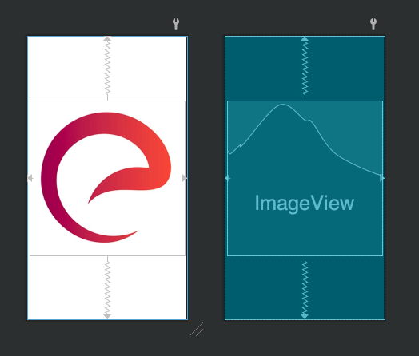

#### Étape 4 : Lancer une activity

Maintenant que notre « Splash » s'affiche, nous allons pouvoir lancer l'autre activity après _un délai_. Dans cette partie, nous allons voir comment lancer une activité, et plus précisément comment nous pouvons « simplifier » / « uniformiser » le lancement via une méthode static.

::: tip
:nerd_face: Si vous avez déjà fait du développement Android, rien de nouveau, je vous propose simplement juste **une autre façon** de vous organiser.
:::

#### Étape 4.1 : Méthode « static »

Lancer une activity sur Android est aussi simple que d'appeler la méthode `startActivity` au moment voulu. Pour « simplifier l'écriture » et éviter le code spaghetti, nous allons ajouter dans le code de la MainActivity une méthode qui sera en charge de « retourner les informations (appelée une `Intent`) » nécessaires au lancement de celle-ci.

En Kotlin les méthodes static **doivent être mise** dans `companion object`. Nous allons donc ajouter « un compagnon » dans notre class. Un compagnon Object va nous permettre de créer une méthode « static » qui sera accessible directement sans instancier là class.

À faire :

Ajouter le code suivant dans la _MainActivity_ :

```kotlin
companion object {
    fun getStartIntent(context: Context): Intent {
        return Intent(context, MainActivity::class.java)
    }
}
```

#### Étape 4.2 : Appeler la méthode

Dans le code de la _SplashActivity_ nous allons lancer après quelques secondes le code permettant de lancer la _MainActivity_. Pour ça ajouter le code suivant dans le `onCreate` de votre `SplashActivity`.

```kotlin
    Handler(Looper.getMainLooper()).postDelayed({
        startActivity(MainActivity.getStartIntent(this))
        finish()
    }, 1000)
```

::: tip Analyse du code
Le code à proprement dit qui lance l'activity est le suivant :

```kotlin
    startActivity(MainActivity.getStartIntent(this))
```

Et oui c'est aussi simple que ça!
:::

- À quoi correspond le `this` ?
- À quoi sert le `finish()` ?
- Que se passe-t-il si vous ne le mettez pas ?
- Pouvez-vous changer le temps d'attente ?

## Démarrer une activité avec des paramètres

En reprenant le principe précédent, il est tout a fait possible de « passer des paramètres » à votre activity :

### Dans l'activity à démarrer

#### Le code pour démarrer l'activity :

```kotlin
companion object {
    private const val IDENTIFIANT_ID = "IDENTIFIANT_ID"

    fun getStartIntent(context: Context, identifiant: String?): Intent {
        return Intent(context, RemoteActivity::class.java).apply {
            putExtra(IDENTIFIANT_ID, identifiant)
        }
    }
}
```

#### Le code pour récupérer le paramètre

```kotlin
// Retourne l'identifiant passé en paramètre à l'activité
private fun getIdentifiant(): String? {
    return intent.extras?.getString(IDENTIFIANT_ID, null)
}
```

### Dans l'activity qui va lancer l'autre activity

Et pour démarrer l'activity :

```kotlin
startActivity(VotreActivityADemarrer.getStartIntent(this, "CECI-EST-UN-IDENTIFIANT"));
```

## Thème et Drawable

Le grand chalenge d'une application mobile c'est « le côté visuel ». Bien évidemment je sais que vous n'êtes pas des experts UI/UX, Google le sait également. C'est pour ça qu'ils ont intégré dans Android Studio un catalogue d'icône nous permettant nous développeurs de travailler avec des éléments propres et de qualité.

Pour rappel, les images dans Android s'appellent des `Drawables` et sont dans le dossier `Res`. Android Studio intègre un catalogue nommé « Vector Asset », celui-ci est disponible dans les menus :

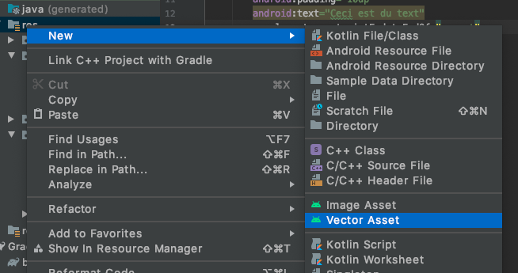

Pour choisir une icône :

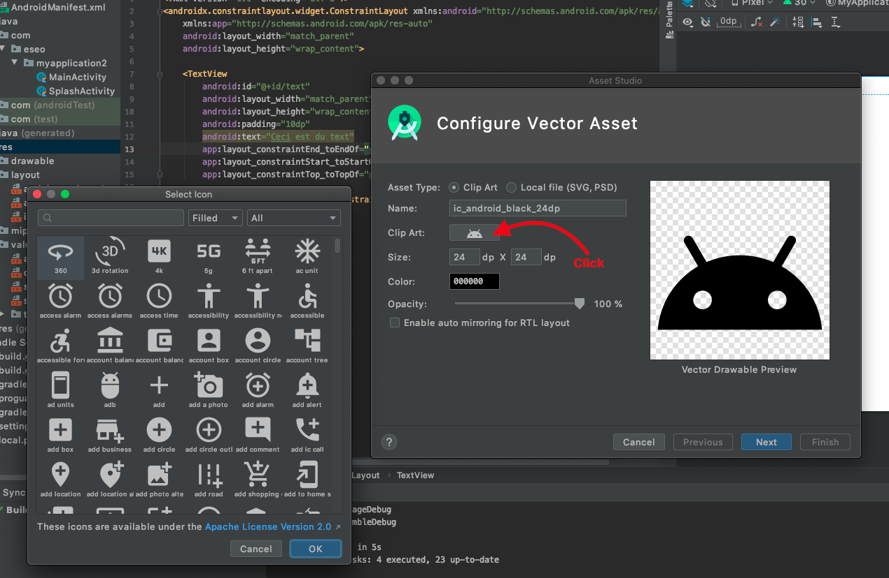

### À faire

- Ajouter un nouveau drawable dans votre projet.
- Que constatez-vous comme changement dans les Drawable ?
- Utiliser l'image choisie dans votre layout « Splash ». L'image choisie doit-être en bas à droite.

## Thème de couleurs

Comme vous avez pu le constater, les couleurs de votre application sont « principalement » violettes. Les couleurs en question sont définies dans le thème de votre application.

Je vous propose de les modifier. Première étape, ajouter vos couleurs dans le fichier `colors.xml`. Une fois fait modifier le fichier `themes.xml` et plus particulièrement le `colorPrimary` pour utiliser la couleur que vous avez ajoutée.

### À faire

- Ajouter une couleur (`colors.xml`). Par exemple, ajouter une « mainPrimaryColor ».
- L'utiliser dans le thème (`themes.xml`) en modifiant par le `colorPrimary` pour utiliser votre nouvelle couleur.

## Les Intent externes / tierces

Dans le système Android, nous avons à notre disposition en plus des Intents que vous déclarez la possibilité d'appeler ceux du système. La liste est très grande :

- Lancer les paramètres.
- Ouvrir un lien.
- Ouvrir une Carte Google Maps.
- …

### Ouvrir les paramètres Bluetooth

```kotlin
val targetIntent = Intent().apply {
    action = android.provider.Settings.ACTION_BLUETOOTH_SETTINGS
}

startActivity(targetIntent);
```

### Ouvrir un lien web

```kotlin
startActivity(Intent(Intent.ACTION_VIEW, Uri.parse("https://cours.brosseau.ovh")));
```

### Ouvrir Google Maps

```kotlin
startActivity(Intent(Intent.ACTION_VIEW, Uri.parse("geo:47.472822,-0.5621756")));
```

### À faire

Maintenant que vous savez comment ouvrir une intent Externe :

- Ajouter sur la `MainActivity` une icône en haut à droite type « Settings ».
- Celle-ci doit être cliquable et doit permettre d'ouvrir les paramètres (`ACTION_SETTINGS`).
- Ajouter sous le bouton « En bas de l'activité » un texte cliquable `TextView` permettant d'ouvrir le site de l'ESEO.
- Ajoute à côté du `TextView` un second `TextView` qui ouvre l'adresse / la position GPS de l'ESEO dans Google Maps.

Exemple :

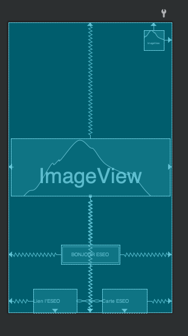

## Les Permissions

Nous avons vu ensemble que la gestion des permissions était un élément important de la plateforme. Nous allons donc voir la théorie, puis la mettre en pratique.


Voilà le plus simple pour expliquer la mécanique des permissions c'est « un schéma ». Je vous propose de mettre en pratique avec la permission « LOCALISATION ». Je vais volontairement vous donner le code à implémenter (celui-ci est disponible de toute manière dans la documentation d'Android).

Pour réaliser cette fonctionnalité, nous allons ajouter une nouvelle activité (en utilisant les options de votre IDE).
Pour le layout je vous propose de réaliser un layout qui ressemble à :

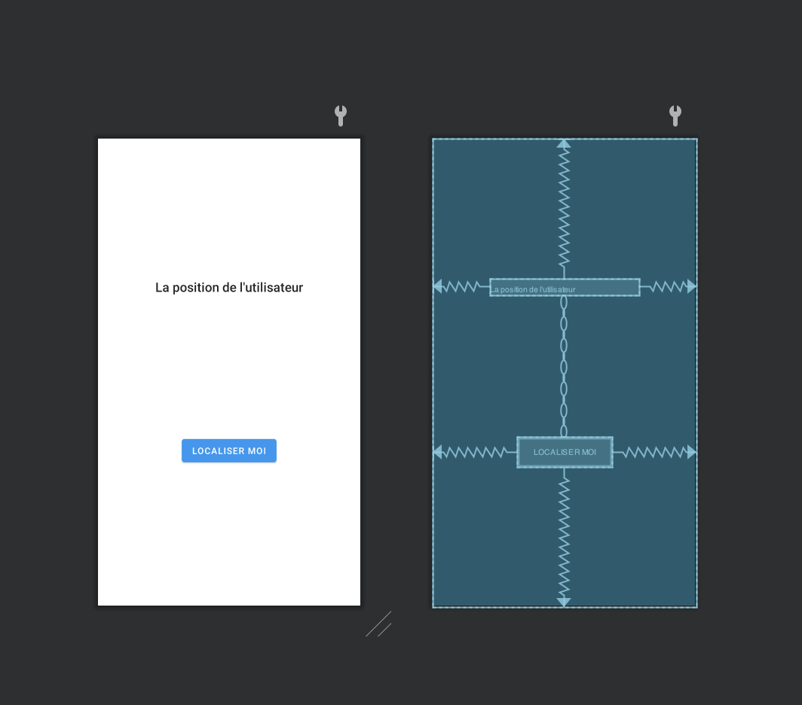

👋 C'est bien évidemment qu'une proposition… Vous pouvez faire autrement !

Pour le code, c'est un poil plus compliqué, en reprenant le flow du graphique précédent, nous allons avoir besoin :

## Déclaration des permissions

Dans le fichier Manifest ajoutez :

```xml
    <uses-permission android:name="android.permission.ACCESS_COARSE_LOCATION" />
    <uses-permission android:name="android.permission.ACCESS_FINE_LOCATION" />
```

### Permission acceptée ?

```kotlin
private fun hasPermission(): Boolean {
    return ActivityCompat.checkSelfPermission(this, Manifest.permission.ACCESS_FINE_LOCATION) == PackageManager.PERMISSION_GRANTED
}
```

### Demander la permission

```kotlin
private fun requestPermission() {
    if (!hasPermission()) {
        ActivityCompat.requestPermissions(this, arrayOf(Manifest.permission.ACCESS_FINE_LOCATION), PERMISSION_REQUEST_LOCATION)
    } else {
        getLocation()
    }
}
```

### Méthode surchargée après l'acceptation

```kotlin
override fun onRequestPermissionsResult(requestCode: Int, permissions: Array<out String>, grantResults: IntArray) {
    super.onRequestPermissionsResult(requestCode, permissions, grantResults)

    when (requestCode) {
        PERMISSION_REQUEST_LOCATION -> {
            // If request is cancelled, the result arrays are empty.
            if ((grantResults.isNotEmpty() && grantResults[0] == PackageManager.PERMISSION_GRANTED)) {
                // Permission obtenue, Nous continuons la suite de la logique.
                getLocation()
            } else {
                // TODO
                // Permission non accepté, expliqué ici via une activité ou une dialog pourquoi nous avons besoin de la permission
            }
            return
        }
    }
}
```

::: danger Gestion de la permission refusée de manière permanente
L'utilisateur a le choix de refuser de manière permanente la localisation. Dans ce cas vous devez gérer l'erreur avec `shouldShowRequestPermissionRationale()` qui retournera `true` / `false` en fonction.

Je vous laisse écrire le code afin d'envoyer l'utilisateur vers les paramètres de son téléphone si cela doit être le cas.
:::

### Obtenir la localisation

C'est le code « métier ». Les méthodes précédentes sont par contre génériques, et toujours présentes, quelle que soit la problématique.

_Obtenir la location : Via « la dernière connue »:_

```kotlin
private fun getLocation() {
    if (hasPermission()) {
        val locationManager = applicationContext.getSystemService(LOCATION_SERVICE) as LocationManager?
        locationManager?.run {
            locationManager.getLastKnownLocation(LocationManager.PASSIVE_PROVIDER)?.run {
                geoCode(this)
            }
        }
    }
}
```

_Obtenir la localisation 2 pour avoir la position réelle (pas la dernière obtenue par le système):_

```kotlin
private fun getLocation() {
    if (hasPermission()) {
        val locationManager = applicationContext.getSystemService(LOCATION_SERVICE) as LocationManager?
        locationManager?.run {
            locationManager.requestLocationUpdates(LocationManager.NETWORK_PROVIDER, 1000, 10000F, LocationListener { geoCode(it) });
        }
    }
}
```

_Obtenir la localisation 3 : Via les Play Services_

```kotlin
private fun getLocation() {
    if (hasPermission()) {
        fusedLocationClient = LocationServices.getFusedLocationProviderClient(this)
        fusedLocationClient.getCurrentLocation(LocationRequest.PRIORITY_BALANCED_POWER_ACCURACY, CancellationTokenSource().token)
                .addOnSuccessListener { geoCode(it) }
                .addOnFailureListener {
                    // Remplacer par un vrai bon message
                    Toast.makeText(this, "Localisation impossible", Toast.LENGTH_SHORT).show()
                }
    }
}
```

::: danger Vous devez choisir une façon de faire
Nous avons donc trois façons de faire, si votre téléphone a les Play Services la dernière solution sera la bonne.
:::

### BONUS ! Obtenir l'adresse par rapport au lat, long

Latitude, Longitude c'est triste… Android intègre de base un Geocoder permettant d'obtenir une adresse textuelle en fonction d'une `lat,long`.

```kotlin
private fun geoCode(location: Location){
    val geocoder = Geocoder(this, Locale.getDefault())
    val results = geocoder.getFromLocation(location.latitude, location.longitude, 1)

    if (results.isNotEmpty()) {
        locationText.text = results[0].getAddressLine(0)
    }
}
```

### À faire

Je vous laisse implémenter le code… N'hésiter pas à reprendre le « graph » il vous sera utile pour déterminer qu'elle méthode appeler en premier lors de l'appui sur le bouton « Localiser Moi ». Un petit indice… on commence toujours par vérifier si l'application a le droit d'accéder « à la fonctionnalité ».

::: tip La toolbar
Pour activer l'action retour dans la Toolbar d'une activité. **Vous devez** ajouter le code suivant dans le `OnCreate` :

```kotlin
supportActionBar?.apply {
    setTitle(R.string.whatever)
    setDisplayHomeAsUpEnabled(true)
    setDisplayShowHomeEnabled(true)
}
```

Puis vous devez override la méthode `onSupportNavigateUp` qui est appelée lors de l'appui sur le « l'icône retour »:

```kotlin
override fun onSupportNavigateUp(): Boolean {
    finish()
    return true
}
```

:::

::: details Voir une solution complète

Vous séchez ? \__Je vous invite à me demander avant de regarder la solution…_ cependant, si vous souhaitez par contre vérifier votre solution.

[Sachez que vous avez une version du code ici](https://gist.github.com/c4software/a3fa7f584a464a6308648b7fcce28add)

:::

## Les Recyclerview

:hand: Parlons-en 👋

Nous allons faire cette étape ensemble.

Mais dans les grandes lignes :

- Ajouter une nouvelle activité.
- Ajout d'un bouton sur la home permettant de la lancer.
- Dans la nouvelle activity, un RecyclerView qui contiendra « des éléments de type Strings ». (`<androidx.recyclerview.widget.RecyclerView android:layout_width="wrap_content"android:layout_height="wrap_content" …`)
- Chaque élément de la liste doit ressembler à (je vous laisse créer le fichier nommé `item_list.xml` dans les layouts).

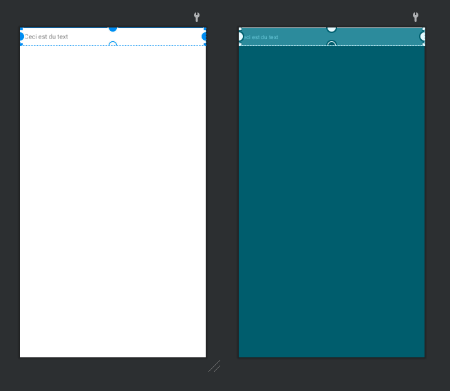

<iframe width="560" height="315" src="https://www.youtube.com/embed/28GgLW7vCRM?si=z9kwjf4zHq60pFLl" title="YouTube video player" frameborder="0" allow="accelerometer; autoplay; clipboard-write; encrypted-media; gyroscope; picture-in-picture; web-share" allowfullscreen></iframe>

::: tip Les RecyclerView c'est important

Comme je le disais en cours, les RecyclerView c'est un concept important. Il faut prendre du temps pour bien comprendre le fonctionnement et les « limites ». En vous inspirant de [l'exemple ici](https://gist.github.com/c4software/95e51417890c68078c14555b2f1d9a03)

Je vous laisse implémenter votre propre RecyclerView.

:hand: **Attention**, dans notre cas le RecyclerView sera du type String et non pas **Device**

:::

## Les « Plugins » / Librairies

Comme vu en cours, je vous laisse ajouter les librairies :

- MaterialDialog.
- Recyclical dans votre projet.

### Les Dialogs

#### Avec MaterialDialog

Ajouter une dialog dans votre projet. Avec la librairie [MaterialDialog](https://github.com/afollestad/material-dialogs/blob/main/documentation/CORE.md). Celle-ci doit s'afficher lors du clic sur le bouton de la home.

### Avec le Material Design de Google

Ajouter une dialog dans votre projet. Avec la librairie [Material Design de Google](https://material.io/develop/android/docs/getting-started). Celle-ci doit s'afficher lors du clic sur le bouton de la home.

### Recyclical

Réimplémenter le code précédemment écrit (ou créer une autre activité) avec [Recyclical](https://github.com/afollestad/recyclical).

## Activité « Paramètres »

Je vous laisse créer une nouvelle activité. Celle-ci **doit être** constituée :

- Une Toolbar avec un bouton Retour et un titre « Paramètres ».
- un RecyclerView qui va contenir :
  - Paramètres Bluetooth -> ouvre les paramètres du téléphone.
  - Informations -> ouvre une activité (ou un dialogue avec un message texte).
  - Un élément ouvrant « les paramètres de l'application »
  - Un lien vers le site de l'ESEO.
  - Un lien vers le Google Maps de l'ESEO.

::: danger Votre RecyclerView
Votre RecyclerView va contenir des objets du type SettingsItem (class a créé). Chaque élément va ressembler à :

_Exemple d'un élément de liste :_


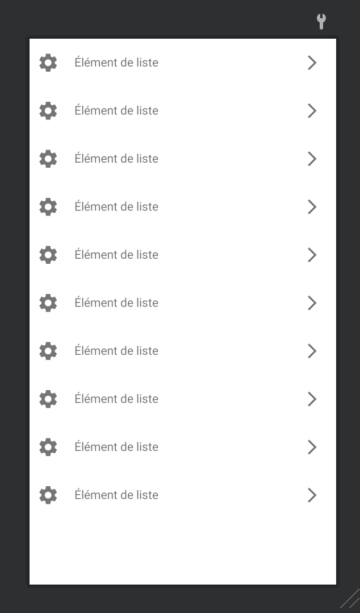

_Les objet de type `SettingsItem.kt`_:

```kotlin
// Définition de la Class qui sera dans notre RecyclerView
data class SettingsItem(val name: String, val icon: Int, val onClick: (() -> Unit))
```

```kotlin
// Exemple de déclaration dans la datasource (à déclarer dans votre Activity)
arrayOf(
    SettingsItem("Paramètre Bluetooth", R.drawable.bluetooth) {
        // Action au cliques
    },
    SettingsItem("Informations", R.drawable.info) {
        // Action aux cliques
    },
    SettingsItem("Paramètres", R.drawable.settings) {
        // Action aux cliques
    },
    SettingsItem("Site de l'ESEO", R.drawable.logo_eseo) {
        // Action aux cliques
    }
)

// Je vous laisse implémenter votre ViewHolder, pour référencer dans votre vue (via des findViewById comme vus ensemble)
// -> name
// -> icon
// -> l'action aux cliques
```

:::

::: tip La toolbar
Pour activer l'action retour dans la Toolbar d'une activity. **Vous devez** ajouter le code suivant dans le `OnCreate` :

```kotlin
supportActionBar?.apply {
    setTitle(R.string.whatever)
    setDisplayHomeAsUpEnabled(true)
    setDisplayShowHomeEnabled(true)
}
```

Puis vous devez override la méthode `onSupportNavigateUp` qui est appelée lors de l'appui sur le « l'icône retour »:

```kotlin
override fun onSupportNavigateUp(): Boolean {
    finish()
    return true
}
```

:::

### La classe LocalPreferences (AKA Sauvegarder des paramètres)

Cette classe va nous permettre de sauvegarder de manière « persistant » des paramètres.

```kotlin

import android.content.Context
import android.content.SharedPreferences

class LocalPreferences private constructor(context: Context) {
    private val sharedPreferences: SharedPreferences = context.getSharedPreferences("MyPref", Context.MODE_PRIVATE)

    fun saveStringValue(yourValue: String?) {
        sharedPreferences.edit().putString("saveStringValue", yourValue).apply()
    }

    fun getSaveStringValue(): String? {
        return sharedPreferences.getString("saveStringValue", null)
    }

    companion object {
        private var INSTANCE: LocalPreferences? = null

        fun getInstance(context: Context): LocalPreferences {
            return INSTANCE?.let {
                INSTANCE
            } ?: run {
                INSTANCE = LocalPreferences(context)
                return INSTANCE!!
            }
        }
    }

}
```

Et pour l'utiliser dans vos activity :

```kotlin

// … Reste de votre code

// Exemple sauvegarde d'information à chaque click.
button.setOnClickListener {
    LocalPreferences.getInstance(this).saveStringValue("Votre valeur")
}

// Exemple de récupération
if(LocalPreferences.getInstance(this).getSaveStringValue() != null){
    Toast.makeText(this, LocalPreferences.getInstance(this).getSaveStringValue(), Toast.LENGTH_SHORT).show()
}

// … Suite de votre code

```

#### À faire

Cette classe est générique, il vous suffit d'implémenter les bonnes méthodes.

J'aimerais que nous puissions sauvegarder l'ensemble des positions de l'utilisateur :

- Créer la class `LocalPreferences`. (attention dans le bon package)
- Ajouter les deux méthodes permettant la sauvegarde des données dans la class `LocalPreferences`. (nous allons avoir besoin de `putStringSet` et de `getStringSet` deux méthodes fournies par `SharedPreferences`, permettant de sauvegarder des listes de données).

::: details Voir une solution (comme à chaque fois cherchez par vous-même en vous inspirant de mon exemple)

```kotlin
    fun addToHistory(newEntry: String){
        val history = this.getHistory()
        history?.add(newEntry)
        sharedPreferences.edit().putStringSet("histories", history).apply()
    }

    fun getHistory(): MutableSet<String>? {
        return sharedPreferences.getStringSet("histories", emptySet())
    }
```

:::

- Modifier votre activity « Localisation » pour sauvegarder chaque position « détecté ». (vous pouvez valider la bonne insertion de votre donnée via un point d'arrêt dans votre code)
- Créer une nouvelle `activity` qui va afficher l'ensemble des données présent dans votre historique (via un `RecyclerView`).
- Rendre cette nouvelle activity accessible depuis « la home de votre application ». (uniquement s’il y a des données).
