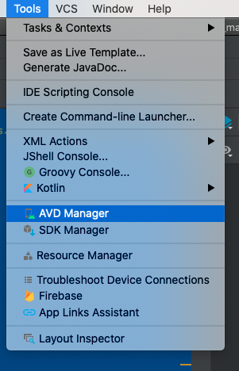

# Découverte des bases d'Android

## Créer un projet

La première étape est la création d'un projet. Pour ça nous allons utiliser « Android Studio » qui est l'IDE à utiliser pour créer une application Android.

Lors de la création, Android Studio va nous poser plusieurs questions, nous allons donc choisir :

- Template : Empty Activity
- Language : Kotlin
- SDK Min. : SDK 26.

Je vous laisse suivre les étapes de création d'un nouveau projet.

::: warning, Mais quelques petites remarques :

- Le choix du package est très important. Comme nous avons vu ensemble en cours, le « Package » doit être unique. En effet deux applications ne peuvent pas avoir le même.
- Choisir un min SDK qui correspond aux cibles des mobiles souhaités. (Si vous êtes en France ou dans un autre pays, il conviendra de faire le bon choix).
- Kotlin est maintenant le langage à choisir en 2020, Java et Kotlin cohabite sans problème vous n'aurez donc aucun problème de compatibilité.

:::

## Création de l'émulateur

Comme vu ensemble pendant le cours, l'émulateur va nous permettre de tester « simplement » notre application avec des performances _suffisante dans les cas simple_. La création de celui-ci est intégrée à Android Studio. Dans Android Studio la partie émulateur s'appelle AVD et est disponible dans le menu `tools`



Pour le choix du type de devices vous êtes libres… Mais le mieux est de choisir un « template de mobile » assez représentatif de ce que l'on trouve chez les clients. Un bon choix est par exemple un « Pixel 2 » avec Android Oreo.

::: tip

Le Logo Playstore présent sur la ligne d'un simulateur indique que celui-ci est équipé des Play Services. Bien que dans notre cas ça ne change pas grand-chose, je vous invite vivement à choisir un émulateur avec les Play Services, car celui-ci sera très proche d'un vrai téléphone trouvable dans le commerce.

:::

Maintenant que votre émulateur est créé, nous allons pouvoir lancer l'application « Run -> Run App ».

## Les textes

Android est une plateforme « ouverte » et nativement prévue pour fonctionner dans le monde entier (Android pour tous). Il est donc logique que le i18n (internationalisation) soit intégré et ~même recommandé~ obligatoire pour tout bon développeur.

L'ensemble des textes de votre application _doit être_ dans le fichier `values/strings.xml`. Allez y jeter un petit coup d'œil :eyes:

## Découverte des dossiers

En complément de ce dont je vous ai parlé en cours, je vous laisse quelques minutes découvrir l'ensemble des dossiers. Je vous laisse regarder plus en détail le dossier `res`, mais également les fichiers `gradle`.

Quelques points d'attentions :

- Le dossier `res`.
- Les images déjà présentes dans votre projet, notamment le XML pour l'icône.
- La structure en général et l'organisation en `package` qui reprend votre choix lors de la configuration.

## Le fichier AndroidManifest

Pour rappel le fichier manifest va nous permettre d'exposer « de la configuration » relative à votre application sur le téléphone, cette configuration est très large :

- Le nom de votre application.
- Les `activity` accessibles.
- L'icône de votre application.
- Les services de votre application.
- Les paramétrages spécifiques de vos activités (Orientation, thème, comportement…)

### À faire :

- Éditer le fichier `AndroidManifest.xml`.
- Changer le nom de votre application (attention à bien utiliser la mécanique `i18n`).
- Regarder l'ensemble des paramètres spécifier dans le XML
- Tester à nouveau votre application

::: tip
Petit raccourci pratique d'Android Studio. Si vous appuyez deux fois sur la touche <kbd>Shift</kbd><kbd>Shift</kbd> Android Studio vous proposera de chercher des actions / fichiers / menus dans l'ensemble de votre projet.
:::

## Personnalisation de votre application

Changer l'icône de l'application en utilisant les outils fournis par Google dans Android Studio « Image asset » :


Une fois font regarder les modifications dans votre projet. Notamment :

- Le fichier `AndroidManifest.xml` est-ce que celui-ci a été modifié ?
- Si oui, quel(s) élément(s) sont différents ?
- Si non, pouvez-vous me dire pourquoi ?

## Les layouts

Si vous avez ouvert le fichier `activity_main.xml` vous avez certainement constaté que celui-ci était très simple. Nous allons donc le modifier un petit peu.

::: tip
Android Studio vous propose un éditeur graphique de l'interface, c'est pratique, mais pour apprendre ce n'est pas idéal. Je vous propose de changer de mode d'édition afin de passer en mode XML via la vue `Split`. Qui nous affichera à la fois le graphique ainsi que le XML.


:::

### À faire :

- Éditer le layout `activity_main.xml`.
- Ajouter une balise ImageView.
- Ajouter également une balise Button.

### Les dimensions et contraintes

Vous avez donc ajouté deux nouveaux éléments dans votre layout, mais ils n'ont n'y taille ni « positions ». En effet comme vu ensemble en cours, nous utilisons un layout de type « ConstraintLayout » c'est-à-dire que vos éléments doivent être contraints les uns par rapport aux autres.

Vous allez donc devoir ajouter les attributs suivants sur vos deux nouveaux éléments :

```xml
<VotreElement
    android:id="@+id/monElement"
    android:layout_width="wrap_content"
    android:layout_height="wrap_content"
    app:layout_constraintBottom_toBottomOf="parent"
    app:layout_constraintEnd_toEndOf="parent"
    app:layout_constraintStart_toStartOf="parent"
    app:layout_constraintTop_toTopOf="parent"
/>
```

_Un peu d'explication :_

- `android:id` permet de rendre l'élément accessible depuis le code, ou tout simplement depuis un autre élément afin de définir une contrainte.
- `android:layout_width` et `android:layout_height` définisse la taille de votre élément. `wrap_content` indique que la taille doit être celle du contenu. Je vous laisse découvrir les autres propriétés avec `alt + entrée` sur `wrap_content`.
- `app:layout_constraint…` définissent les contraintes entre l'élément et les autres éléments de layout. Dans notre cas « parent » signifie que les contraintes seront avec le parent, c'est-à-dire la fenêtre dans le cas présent.

::: tip
Si vous souhaitez contraindre un élément avec un autre, la syntaxe sera la même, mais vous allez devoir indiquer une contrainte du type `"@id/imageView"`.
:::

### À faire :

Je vous laisse réaliser l'ensemble des contraintes afin que votre layout ressemble à :


:warning: Vous noterez l'icône de l'ESEO, je vous laisse l'ajouter dans le dossier `drawable` de votre projet. Le fichier doit être au format `png` ou `jpeg`. Une fois celle-ci ajoutée modifier l'ImageView pour l'utiliser dans l'`ImageView` avec par exemple `app:srcCompat="@drawable/eseo"`.

:hand: Relancer l'application et tester que celle-ci fonctionne.

## L'activity

Nous avons une activity qui pour l'instant ne fait pas grand-chose. Celle-ci est relativement vide. Je vous propose de la modifier, en premier lieu nous allons ajouter un message au lancement de celle-ci.

Un message simple sur Android s'appelle un Toast. Ajouter celui-ci dans la méthode `onCreate` de votre `MainActivity`.

Vous pouvez utiliser la complétion de votre IDE, `toast` puis <kbd>tab</kbd>.

### À faire :

- Ajouter le Toast.
- Le context, comme vu ensemble pendant le cours correspond à votre `activity` donc il faut indiquer `this`.
- Pour le texte, pensez bien à mettre celui-ci dans le fichier `strings.xml` puis à le récupérer via `getString(R.string.votreId)`.

:hand: Tester votre modification.

### Rendre un élément clickable

Pour rendre un élément cliquable sur Android, nous avons plusieurs façons de faire. La première c'est dans le code via son id et la méthode `findViewById`.

Ajouter dans votre méthode `onCreate` le code suivant :

```kotlin
    findViewById<Button>(R.id.myButton).setOnClickListener {
        // Votre action
    }
```

Et voilà… Votre bouton est cliquable.

#### À faire

- Rendre votre bouton clickable.
- Afficher un Toast sur le OnClick.

:warning: Attention à bien référencer le bon `R.id.myButton` par rapport à votre layout.

### Rendre un élément clickable 2

La seconde façon (moins longue) d'accéder à un élément est via « les Kotlin-Android-Extensions ». Les extensions sont à ajouter dans votre `build.gradle` (app). Ajouter

```gradle
plugins {
    id 'com.android.application' // Déjà présente.
    id 'kotlin-android' // Vous devez déjà l'avoir.
    id 'kotlin-android-extensions' // <- Cette ligne.
}
```

:hand: N'oubliez pas de resync l'IDE


Maintenant vous pouvez simplement faire `myButton.setOnClickListener…` pour rendre l'élément cliquable.

#### À faire

Modifier le code précédent pour utiliser la nouvelle façon vue précédemment.

### Créer une autre activity

Nous allons ajouter une nouvelle activity, celle-ci sera un « Splash Screen », elle sera donc affichée au lancement de l'application.

#### Étape 1 : Créer l'activity

Pour créer une activity Android Studio nous propose dans les menus une action qui automatise l'ensemble du processus à savoir :

- Création du package
- Création de la class
- Création du layout
- Modification du AndroidManifest.xml

- Créer la nouvelle activity


- Puis :


#### Étape 2 : Voir / Modifier le fichier AndroidManifest.xml

L'activity est maintenant créée. Sauf que… nous avons deux activity qui se lancent au démarrage. Modifier le AndroidManifest pour retirer :

```xml
<intent-filter>
    <action android:name="android.intent.action.MAIN" />
    <category android:name="android.intent.category.LAUNCHER" />
</intent-filter>
```

De la `MainActivity`.

Modifier également le thème de la SplashActivity afin de lui spécifier un thème sans « ActionBar ». Pour ça il vous suffit d'ajouter dans les attributs celui-ci :

`android:theme="@style/Theme.AppCompat.NoActionBar"`

:hand: Lancer l'application. Vous devez être bloqué sur une « vue blanche ».

#### Étape 3 : Modifier le layout

Je vous laisse modifier le layout pour que celui-ci ressemble à :


#### Étape 4 : Lancer une activity

Maintenant que notre Splash s'affiche nous allons lancé pouvoir lancer l'autre activity après un délai.

#### Étape 4.1 : Méthode « static »

Lancer une activity sur Android est aussi simple que d'appeler la méthode `startActivity` au moment voulu. Pour « simplifier l'écriture » et éviter le code spaghetti, nous allons ajouter dans le code de la MainActivity une méthode qui sera en charge de « retourner les informations » nécessaires au lancement de celle-ci.

Nous allons donc ajouter « un compagnon » dans notre class. Un compagnon Object va nous permettre de créer une méthode « static » qui sera accessible directement sans instancier là class.

À faire :

Ajouter le code suivant dans la _MainActivity_ :

```kotlin
companion object {
    fun getStartIntent(context: Context): Intent {
        return Intent(context, MainActivity::class.java)
    }
}
```

#### Étape 4.2 : Appelez-la méthode

Dans le code de la _SplashActivity_ nous allons lancer après quelques secondes le code permettant de lancer la _MainActivity_. Pour ça ajouter le code suivant dans le `onCreate` de votre `SplashActivity`.

```kotlin
    Handler(Looper.getMainLooper()).postDelayed({
        startActivity(MainActivity.getStartIntent(this))
        finish()
    }, 1000)
```

::: tip
Le lancement de l'activity s'effectue via le code suivant `startActivity(MainActivity.getStartIntent(this))`. Et oui c'est aussi simple que ça.
:::

- À quoi sert le `finish()` ?
- Que se passe-t-il si vous ne le mettez pas ?
- Pouvez-vous changer le temps d'attente ?

## Les Recyclerview

:halt: Parlons-en 👋

Nous allons faire cette étape ensemble.

Mais dans les grandes lignes :

- Ajouter une nouvelle activité.
- Ajout d'un bouton sur la home permettant de la lancer.
- Dans la nouvelle activity, un RecyclerView « avec des éléments de type Strings ».
- Chaque élément de la liste doit ressembler à (je vous laisse créer le fichier nommé `item_list.xml` dans les layouts).


## Les « Plugins » / Librairies

Comme vu en cours, je vous laisse ajouter les librairies :

- MaterialDialog.
- Recyclical dans votre projet.

### Dialog

Ajouter une dialog dans votre projet. Avec la librairie MaterialDialog. Celle-ci doit s'afficher lors du clic sur le bouton de la home.

### Recyclical

Réimplémenter le code précédemment écrit (ou créer une autre activité) avec Recyclical.
