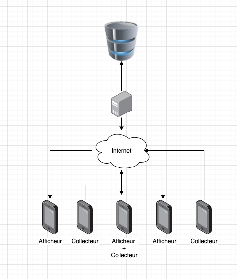

# Application Client / Serveur

L'objectif de cette application va être la mise en pratique de la communication Client et Serveur d'une application, mais également les à côté de celle-ci (Serveur, Base de données, etc.). Cette application couvrira l'ensemble des compétences vu ensemble :

- La conception (**et l'organisation** d'une application, package, MVVM, Fragment si nécessaire)
- La communication via le réseau
- La modélisation d'un projet « mobile ».
  - Base de données
  - « Authentification d'un client » (au minimum reconnaissance de celui-ci)
- La qualité de code (indentation, organisation).
- La mise en place de commentaires (pour faciliter la compréhension).
- L'aspect « propre » des différents écrans de votre application.

::: details Sommaire
[[toc]]
:::

## Introduction

Une application Android est rarement toute seule, c'est cet aspect que je vous propose de travailler dans ce projet. Nous allons créer ensemble (enfin vous) une application qui sera constituée de deux types de clients :

- Les clients qui affichent des informations.
- Les clients qui collectent de l'information.

En parallèle des clients, vous allez devoir construire un « serveur », ce serveur aura pour but :

- Identifier les clients (via un ID, ou un UUID, ou un TOKEN).
  - La création du client sera faite via une vue de l'application. Celui-ci devra fournir « Son ID / UUID / TOKEN » et également un nom.
  - Les clients seront identifiés lors des appels réseau par l'UI / UUID ou Token on fonction du choix.
- Stocker les informations collectées par « les clients » (avec historiques). **L'information doit être horodatée**.

|  |
| :-----------------------------------------------------------------: |
|                     Principe de fonctionnement                      |

### L'application

L'application de collecte et d'affichage est unique. Celle-ci est découpée en deux parties :

- La collecte.
- L'affichage des données d'un client précis (via saisie / flashage de son UUID).

::: tip La collecte ≠ Affichage
La partie collecte est optionnelle, **les clients n'ont donc pas l'obligation d'être connus du serveur**.
:::

### Les clients qui collectent de l'information

Les clients qui collectent de l'information sont des clients comme les autres. Cette collecte repose sur le principe d'authentification par le serveur (via UUID, ID ou Token au choix). Cette collecte nécessitera donc une reconnaissance « un échange » préalable entre le client et le serveur.

::: tip Un échange persistant
L'échange entre le client est à faire qu'une seule fois. Vous devez sauvegarder dans l'application que celle-ci est maintenant « appairée » avec le serveur, suivant l'UUID / TOKEN / ID choisit ; cet appairage **doit-être** sauvegardé dans les paramètres de l'application et doit-être restauré à chaque démarrage de celle-ci.
:::

::: danger Pas de collecte en arrière-plan
Votre application doit collecter de l'information uniquement si le smartphone est actif **et affiche actuellement l'application**. Vous pouvez, si vous le désirez, empêcher [la veille du smartphone sur la vue de collecte](https://developer.android.com/training/scheduling/wakelock)
:::

#### Informations collectées

La collecte devra être faite à interval régulier (~60secondes), celle-ci a pour but de collecter un maximum d'informations depuis les capteurs du smartphone :

- La luminosité ambiante.
- Le niveau de batterie.
- La pression.
- La température.
- La position GPS / Réseau du téléphone (Lat, Long).

Vous pouvez utiliser [la documentation officielle pour vous aider dans cette tâche](https://developer.android.com/guide/topics/sensors/sensors_environment).

::: tip Pas de limite
Vous avez d'autres idées pour la collecte ? Pas de problème, je vous laisse ajouter ce que vous souhaitez.

**Vous avez les playservices ?** si oui, vous pouvez même savoir si la personne marche / cours / roule en voiture.

:::

Cette vue de collecte, n'affichera rien de particulier à l'utilisateur autre qu'un écran avec « une animation de collecte » et un bouton lui permettant d'arrêter celle-ci. Cette collecte sera envoyée au travers d'une API au serveur.

#### Affichage client

L'affichage des informations sera réalisé dans un autre écran de l'application. Celui-ci devra afficher :

- Les données d'un client choisi (via saisie ou flash QRCode du code)
- L'affichage des données du client devra indiquer l'horodatage de la dernière collecte.
- Un bouton d'actualisation.
- Possibilités d'affichage (implémentation au choix) :
  - Via une Recyclerview simple (mais avec des noms des capteurs dans la langue du client).
  - Via un Layout dédié avec des icônes en fonction du type de capteurs (une carte OpenStreetMap peut-être utilisée pour la position GPS).
- **Bonus** la vue peut-être découpée en deux tabs afin d'avoir une vue listant l'ensemble des collecteurs de données connues par le serveur. Chaque ligne contiendra une action permettant d'afficher un « client précis » (donc sans connaitre son code préalablement).
- **Bonus** affichage des données historiques d'un client.

### Le serveur

Le serveur est à implémenter dans le langage de votre choix. Celui-ci doit être capable de :

- Stocker l'information dans une base de données.
- Créer un client.
- Récupérer les dernières données d'un client via son UUID / ID / TOKEN.
- **Bonus** liste de l'ensemble des clients présents en base de données.
- **Bonus** obtention des données historiques d'un client via son UUID / ID / TOKEN.

::: tip Langage au choix
Je vous laisse le choix du langage pour le développement du serveur.
:::
